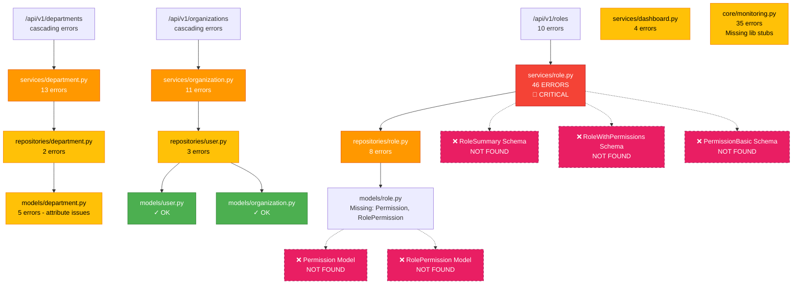

# Type Error Dependency Graph

## Visual Impact Flow



## Critical Path Analysis

### 🔴 Highest Priority Path
```
/api/v1/roles → services/role.py (46 errors) → Missing Permission/RolePermission models
```
**Impact**: Complete RBAC system non-functional

### 🟠 High Priority Paths
```
/api/v1/departments → services/department.py (13 errors) → models/department.py (attribute issues)
/api/v1/organizations → services/organization.py (11 errors) → Type incompatibilities
```
**Impact**: Organization structure management degraded

### 🟡 Medium Priority
```
core/monitoring.py (35 errors) - Isolated, doesn't affect business logic
services/dashboard.py (4 errors) - Limited impact on analytics
```

## Cascading Error Pattern

```
Missing Permission Model
    ↓
services/role.py cannot import Permission
    ↓
46 type errors in role service
    ↓
/api/v1/roles endpoints fail type checking
    ↓
Any PR touching roles fails CI/CD
```

## Fix Order Recommendation

```
1. Create Permission & RolePermission models
   └─> Fixes ~20 import errors

2. Create missing schemas (RoleSummary, etc.)
   └─> Fixes ~15 undefined name errors

3. Add missing model attributes
   └─> Fixes ~25 attribute errors

4. Fix service layer type annotations
   └─> Fixes ~30 type mismatch errors

5. Install monitoring type stubs (optional)
   └─> Fixes 35 low-priority errors
```

## Blocked Features Matrix

| Feature | Service | Status | Errors | Priority |
|---------|---------|--------|--------|----------|
| Role Permissions | role.py | 🔴 BLOCKED | 46 | CRITICAL |
| User Role Assignment | role.py | 🔴 BLOCKED | 46 | CRITICAL |
| Department Hierarchy | department.py | 🟠 DEGRADED | 13 | HIGH |
| Organization Management | organization.py | 🟠 DEGRADED | 11 | HIGH |
| System Monitoring | monitoring.py | 🟡 FUNCTIONAL | 35 | LOW |
| Dashboard Analytics | dashboard.py | 🟡 FUNCTIONAL | 4 | LOW |

## Development Impact

### Currently Unimplementable
- Permission-based access control
- Role inheritance system
- Dynamic permission assignment
- Role-based UI rendering

### Partially Implementable
- Basic role CRUD (without permissions)
- Department management (without full hierarchy)
- Organization updates

### Not Affected
- User authentication
- Basic user management
- Database operations
- API infrastructure