# Type Error Dependency Graph

## Visual Impact Flow

```mermaid
graph TD
    %% API Layer
    A1["/api/v1/roles<br/>10 errors"] --> S1
    A2["/api/v1/departments<br/>cascading errors"] --> S2
    A3["/api/v1/organizations<br/>cascading errors"] --> S3
    
    %% Service Layer - Critical Path
    S1["services/role.py<br/>46 ERRORS<br/>🔴 CRITICAL"]
    S2["services/department.py<br/>13 errors"]
    S3["services/organization.py<br/>11 errors"]
    S4["services/dashboard.py<br/>4 errors"]
    
    %% Repository Layer
    S1 --> R1["repositories/role.py<br/>8 errors"]
    S2 --> R2["repositories/department.py<br/>2 errors"]
    S3 --> R3["repositories/user.py<br/>3 errors"]
    
    %% Model Layer
    R1 --> M1["models/role.py<br/>Missing: Permission, RolePermission"]
    R2 --> M2["models/department.py<br/>5 errors - attribute issues"]
    R3 --> M3["models/user.py<br/>✓ OK"]
    R3 --> M4["models/organization.py<br/>✓ OK"]
    
    %% Missing Components
    M1 -.-> X1["❌ Permission Model<br/>NOT FOUND"]
    M1 -.-> X2["❌ RolePermission Model<br/>NOT FOUND"]
    S1 -.-> X3["❌ RoleSummary Schema<br/>NOT FOUND"]
    S1 -.-> X4["❌ RoleWithPermissions Schema<br/>NOT FOUND"]
    S1 -.-> X5["❌ PermissionBasic Schema<br/>NOT FOUND"]
    
    %% Monitoring - Isolated
    MON["core/monitoring.py<br/>35 errors<br/>Missing lib stubs"]
    
    %% Styling
    classDef critical fill:#f44336,stroke:#b71c1c,color:#fff
    classDef high fill:#ff9800,stroke:#e65100,color:#fff
    classDef medium fill:#ffc107,stroke:#f57c00,color:#000
    classDef low fill:#4caf50,stroke:#2e7d32,color:#fff
    classDef missing fill:#e91e63,stroke:#880e4f,color:#fff,stroke-dasharray: 5 5
    
    class S1 critical
    class S2,S3,R1 high
    class S4,R2,R3,M2 medium
    class M3,M4 low
    class X1,X2,X3,X4,X5 missing
    class MON medium
```



## Critical Path Analysis

### 🔴 Highest Priority Path
```
/api/v1/roles → services/role.py (46 errors) → Missing Permission/RolePermission models
```
**Impact**: Complete RBAC system non-functional

### 🟠 High Priority Paths
```
/api/v1/departments → services/department.py (13 errors) → models/department.py (attribute issues)
/api/v1/organizations → services/organization.py (11 errors) → Type incompatibilities
```
**Impact**: Organization structure management degraded

### 🟡 Medium Priority
```
core/monitoring.py (35 errors) - Isolated, doesn't affect business logic
services/dashboard.py (4 errors) - Limited impact on analytics
```

## Cascading Error Pattern

```
Missing Permission Model
    ↓
services/role.py cannot import Permission
    ↓
46 type errors in role service
    ↓
/api/v1/roles endpoints fail type checking
    ↓
Any PR touching roles fails CI/CD
```

## Fix Order Recommendation

```
1. Create Permission & RolePermission models
   └─> Fixes ~20 import errors

2. Create missing schemas (RoleSummary, etc.)
   └─> Fixes ~15 undefined name errors

3. Add missing model attributes
   └─> Fixes ~25 attribute errors

4. Fix service layer type annotations
   └─> Fixes ~30 type mismatch errors

5. Install monitoring type stubs (optional)
   └─> Fixes 35 low-priority errors
```

## Blocked Features Matrix

| Feature | Service | Status | Errors | Priority |
|---------|---------|--------|--------|----------|
| Role Permissions | role.py | 🔴 BLOCKED | 46 | CRITICAL |
| User Role Assignment | role.py | 🔴 BLOCKED | 46 | CRITICAL |
| Department Hierarchy | department.py | 🟠 DEGRADED | 13 | HIGH |
| Organization Management | organization.py | 🟠 DEGRADED | 11 | HIGH |
| System Monitoring | monitoring.py | 🟡 FUNCTIONAL | 35 | LOW |
| Dashboard Analytics | dashboard.py | 🟡 FUNCTIONAL | 4 | LOW |

## Development Impact

### Currently Unimplementable
- Permission-based access control
- Role inheritance system
- Dynamic permission assignment
- Role-based UI rendering

### Partially Implementable
- Basic role CRUD (without permissions)
- Department management (without full hierarchy)
- Organization updates

### Not Affected
- User authentication
- Basic user management
- Database operations
- API infrastructure