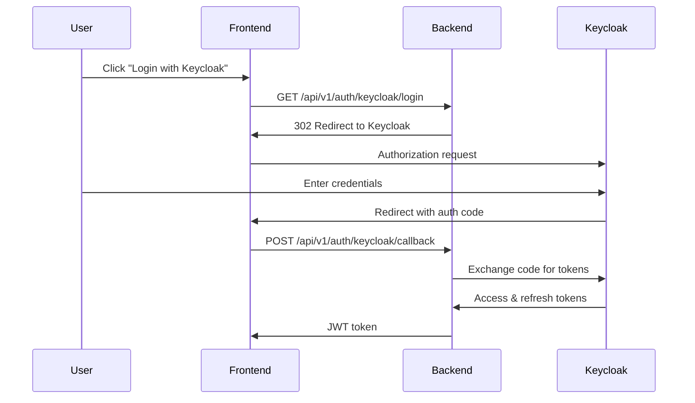

# Keycloak Authentication API Documentation

## Overview

The Keycloak integration provides OAuth2/OpenID Connect authentication for the ITDO ERP system. This allows users to authenticate using Keycloak as the identity provider, supporting features like Single Sign-On (SSO), role-based access control, and centralized user management.

## Authentication Flow



## Endpoints

### 1. Initiate Keycloak Login

```http
GET /api/v1/auth/keycloak/login
```

Initiates the OAuth2 authorization flow by redirecting to Keycloak.

**Query Parameters:**
- `redirect_uri` (optional): Custom redirect URI after successful authentication

**Response:**
- `302 Found`: Redirect to Keycloak authorization URL
- `503 Service Unavailable`: Keycloak service is unavailable

**Example:**
```bash
curl -i http://localhost:8000/api/v1/auth/keycloak/login
```

### 2. OAuth2 Callback

```http
POST /api/v1/auth/keycloak/callback
```

Handles the OAuth2 callback from Keycloak and exchanges the authorization code for tokens.

**Request Body:**
```json
{
  "code": "authorization_code_from_keycloak",
  "state": "csrf_protection_state"
}
```

**Response:**
```json
{
  "access_token": "eyJhbGciOiJIUzI1NiIs...",
  "token_type": "bearer",
  "expires_in": 86400,
  "refresh_token": "refresh_token_from_keycloak"
}
```

**Error Responses:**
- `400 Bad Request`: Invalid state parameter
- `401 Unauthorized`: Authentication failed

### 3. Get User Info

```http
GET /api/v1/auth/keycloak/userinfo
```

Retrieves the current user's information from Keycloak.

**Headers:**
- `Authorization: Bearer {token}`

**Response:**
```json
{
  "sub": "user-id",
  "email": "user@example.com",
  "name": "John Doe",
  "roles": ["user", "manager"],
  "groups": ["sales", "management"]
}
```

### 4. Refresh Token

```http
POST /api/v1/auth/keycloak/refresh
```

Refreshes the access token using a refresh token.

**Request Body:**
```json
{
  "refresh_token": "your_refresh_token"
}
```

**Response:**
```json
{
  "access_token": "new_access_token",
  "token_type": "bearer",
  "expires_in": 86400,
  "refresh_token": "new_refresh_token"
}
```

### 5. Logout

```http
POST /api/v1/auth/keycloak/logout
```

Logs out the user from Keycloak.

**Headers:**
- `Authorization: Bearer {token}`

**Request Body:**
```json
{
  "refresh_token": "your_refresh_token"
}
```

**Response:**
```json
{
  "message": "Logged out successfully"
}
```

## Role-Based Access Control (RBAC)

The system supports role-based access control through Keycloak roles. Protected endpoints can require specific roles:

### Admin Endpoints

```http
GET /api/v1/admin/users
```

Lists all users (requires `admin` role).

**Headers:**
- `Authorization: Bearer {token}`

**Response:**
```json
[
  {
    "id": 1,
    "email": "user@example.com",
    "full_name": "John Doe",
    "is_active": true,
    "created_at": "2025-07-05T10:00:00Z"
  }
]
```

### Manager Endpoints

```http
GET /api/v1/manager/reports
```

Gets manager reports (requires `manager` or `admin` role).

**Headers:**
- `Authorization: Bearer {token}`

**Response:**
```json
{
  "message": "Manager reports",
  "data": "This is accessible to managers and admins only"
}
```

## Security Features

### PKCE (Proof Key for Code Exchange)

The implementation supports PKCE to prevent authorization code interception attacks:

1. Client generates a cryptographically random `code_verifier`
2. Client calculates `code_challenge` = SHA256(`code_verifier`)
3. Authorization request includes `code_challenge` and `code_challenge_method=S256`
4. Token exchange includes the original `code_verifier`

### State Parameter

A random state parameter is generated for each authorization request to prevent CSRF attacks:

1. State is generated using `secrets.token_urlsafe(32)`
2. State is stored temporarily in backend
3. Callback validates that the returned state matches

### Token Security

- Access tokens expire after 24 hours (configurable)
- Refresh tokens expire after 7 days (configurable)
- Tokens should be stored securely (httpOnly cookies recommended)
- All API calls require valid Bearer token

## Configuration

Required environment variables:

```env
# Keycloak OAuth2/OIDC
KEYCLOAK_SERVER_URL=http://localhost:8080
KEYCLOAK_REALM=itdo-erp
KEYCLOAK_CLIENT_ID=itdo-erp-backend
KEYCLOAK_CLIENT_SECRET=your-client-secret-here
KEYCLOAK_CALLBACK_URL=http://localhost:8000/api/v1/auth/keycloak/callback
```

## Error Codes

| Code | Description |
|------|-------------|
| `KEYCLOAK_UNAVAILABLE` | Keycloak service is not reachable |
| `INVALID_STATE` | CSRF state parameter validation failed |
| `AUTH_FAILED` | Authentication with Keycloak failed |
| `INSUFFICIENT_PERMISSIONS` | User lacks required role |

## Integration Example

### Frontend Login Flow

```javascript
// 1. Initiate login
const loginWithKeycloak = () => {
  window.location.href = '/api/v1/auth/keycloak/login';
};

// 2. Handle callback (after redirect back)
const handleCallback = async () => {
  const urlParams = new URLSearchParams(window.location.search);
  const code = urlParams.get('code');
  const state = urlParams.get('state');
  
  const response = await fetch('/api/v1/auth/keycloak/callback', {
    method: 'POST',
    headers: { 'Content-Type': 'application/json' },
    body: JSON.stringify({ code, state })
  });
  
  const data = await response.json();
  // Store tokens securely
  localStorage.setItem('access_token', data.access_token);
};

// 3. Make authenticated requests
const getUserInfo = async () => {
  const token = localStorage.getItem('access_token');
  const response = await fetch('/api/v1/auth/keycloak/userinfo', {
    headers: { 'Authorization': `Bearer ${token}` }
  });
  return response.json();
};
```

## Testing

For local development and testing:

1. Start Keycloak using Docker:
```bash
docker run -p 8080:8080 -e KEYCLOAK_ADMIN=admin -e KEYCLOAK_ADMIN_PASSWORD=admin quay.io/keycloak/keycloak:23.0 start-dev
```

2. Create realm and client:
- Realm: `itdo-erp`
- Client ID: `itdo-erp-backend`
- Client Protocol: `openid-connect`
- Access Type: `confidential`
- Valid Redirect URIs: `http://localhost:8000/*`

3. Create test users and assign roles:
- Admin user with `admin` role
- Manager user with `manager` role
- Regular user with `user` role