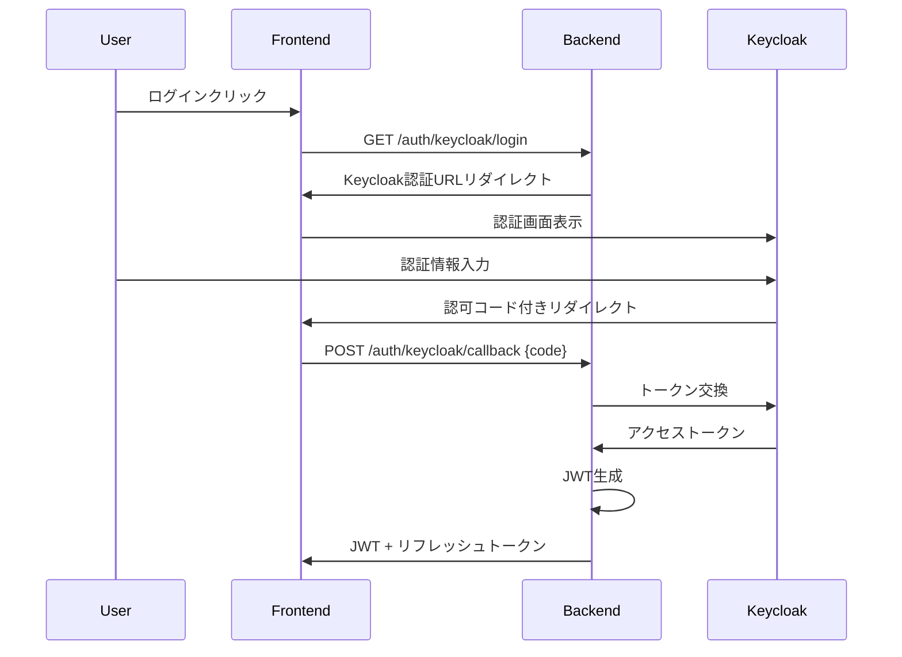

# Keycloak連携仕様書

**文書番号**: ITDO-ERP-SPEC-KEYCLOAK-001  
**バージョン**: 1.0  
**作成日**: 2025年7月5日  
**作成者**: Claude Code AI  

---

## 1. 概要

### 1.1 目的
ITDO ERPシステムにKeycloakを統合し、OAuth2/OpenID Connectベースの認証・認可基盤を実装する。

### 1.2 スコープ
- Keycloak OAuth2/OpenID Connect認証
- 既存JWT認証との統合
- ロールベースアクセス制御（RBAC）
- トークン交換機能

### 1.3 関連要件
- AUTH-002: OAuth2/SAML連携
- AUTH-003: ロールベースアクセス制御

---

## 2. アーキテクチャ

### 2.1 認証フロー



### 2.2 システム構成

```
backend/app/
├── core/
│   ├── keycloak.py        # Keycloakクライアント設定
│   └── oauth.py           # OAuth2フロー実装
├── api/v1/
│   └── auth_keycloak.py   # Keycloak認証エンドポイント
├── schemas/
│   └── keycloak.py        # Keycloakスキーマ定義
└── services/
    └── keycloak.py        # Keycloakサービス層
```

---

## 3. Keycloak設定

### 3.1 レルム設定
```json
{
  "realm": "itdo-erp",
  "enabled": true,
  "sslRequired": "external",
  "registrationAllowed": false,
  "rememberMe": true,
  "loginTheme": "itdo",
  "internationalizationEnabled": true,
  "supportedLocales": ["ja", "en"],
  "defaultLocale": "ja"
}
```

### 3.2 クライアント設定
```json
{
  "clientId": "itdo-erp-backend",
  "enabled": true,
  "clientAuthenticatorType": "client-secret",
  "redirectUris": [
    "http://localhost:8000/api/v1/auth/keycloak/callback",
    "https://api.itdo-erp.jp/api/v1/auth/keycloak/callback"
  ],
  "webOrigins": ["+"],
  "protocol": "openid-connect",
  "attributes": {
    "access.token.lifespan": "86400",
    "refresh.token.lifespan": "604800"
  }
}
```

### 3.3 ロール定義
| ロール名 | 説明 | 権限 |
|----------|------|------|
| admin | システム管理者 | 全機能アクセス可能 |
| manager | マネージャー | 承認・レポート閲覧 |
| user | 一般ユーザー | 基本機能のみ |
| viewer | 閲覧専用 | 読み取りのみ |

---

## 4. API仕様

### 4.1 認証開始エンドポイント
```yaml
GET /api/v1/auth/keycloak/login
Parameters:
  redirect_uri: string (optional)
Response:
  302 Redirect to Keycloak authorization URL
```

### 4.2 コールバックエンドポイント
```yaml
POST /api/v1/auth/keycloak/callback
Request Body:
  {
    "code": "string",
    "state": "string"
  }
Response:
  {
    "access_token": "string",
    "token_type": "bearer",
    "expires_in": 86400,
    "refresh_token": "string"
  }
```

### 4.3 トークン情報エンドポイント
```yaml
GET /api/v1/auth/keycloak/userinfo
Headers:
  Authorization: Bearer {token}
Response:
  {
    "sub": "string",
    "email": "string",
    "name": "string",
    "roles": ["admin", "user"],
    "groups": ["sales", "management"]
  }
```

---

## 5. 実装詳細

### 5.1 環境変数
```env
# Keycloak設定
KEYCLOAK_SERVER_URL=http://localhost:8080
KEYCLOAK_REALM=itdo-erp
KEYCLOAK_CLIENT_ID=itdo-erp-backend
KEYCLOAK_CLIENT_SECRET=your-client-secret
KEYCLOAK_CALLBACK_URL=http://localhost:8000/api/v1/auth/keycloak/callback
```

### 5.2 依存ライブラリ
```toml
# OAuth2/OIDC
python-keycloak = "^3.0.0"
authlib = "^1.3.0"
httpx = "^0.25.0"
```

### 5.3 Keycloakクライアント初期化
```python
from keycloak import KeycloakOpenID

class KeycloakClient:
    def __init__(self, settings: Settings):
        self.keycloak_openid = KeycloakOpenID(
            server_url=settings.KEYCLOAK_SERVER_URL,
            client_id=settings.KEYCLOAK_CLIENT_ID,
            realm_name=settings.KEYCLOAK_REALM,
            client_secret_key=settings.KEYCLOAK_CLIENT_SECRET
        )
```

### 5.4 トークン検証
```python
def verify_keycloak_token(token: str) -> Dict[str, Any]:
    """Keycloakトークンを検証し、ユーザー情報を取得"""
    try:
        # トークン検証
        token_info = keycloak_client.introspect(token)
        if not token_info.get("active"):
            raise InvalidTokenError("Token is not active")
        
        # ユーザー情報取得
        userinfo = keycloak_client.userinfo(token)
        return userinfo
    except Exception as e:
        raise AuthenticationError(f"Token verification failed: {str(e)}")
```

---

## 6. セキュリティ考慮事項

### 6.1 PKCE (Proof Key for Code Exchange)
認可コードフローにPKCEを実装し、認可コード横取り攻撃を防止。

### 6.2 State Parameter
CSRF攻撃防止のため、stateパラメータを使用。

### 6.3 トークン保存
- アクセストークン: メモリのみ（localStorage不可）
- リフレッシュトークン: httpOnly cookieに保存

### 6.4 CORS設定
Keycloakドメインを明示的に許可リストに追加。

---

## 7. 移行計画

### 7.1 既存認証との共存
- 既存JWT認証は維持
- Keycloak認証は並行して実装
- 設定により切り替え可能

### 7.2 段階的移行
1. Keycloak認証実装（新規ユーザー）
2. 既存ユーザーのKeycloak移行ツール
3. 旧認証の段階的廃止

---

## 8. テスト要件

### 8.1 単体テスト
- Keycloakクライアント初期化
- トークン検証ロジック
- ユーザー情報取得

### 8.2 結合テスト
- 認証フロー全体
- トークンリフレッシュ
- ロール権限チェック

### 8.3 セキュリティテスト
- CSRF対策確認
- トークン漏洩対策
- セッション固定攻撃対策

---

## 9. パフォーマンス要件

### 9.1 応答時間
- 認証開始: < 100ms
- コールバック処理: < 300ms
- トークン検証: < 50ms

### 9.2 キャッシュ戦略
- 公開鍵キャッシュ: 1時間
- ユーザー情報キャッシュ: 5分
- トークン検証結果: 1分

---

## 10. 監視・ログ

### 10.1 監視メトリクス
- 認証成功/失敗率
- Keycloak応答時間
- トークン有効期限切れ数

### 10.2 ログ項目
```json
{
  "timestamp": "2025-07-05T10:30:00Z",
  "event": "keycloak_auth_success",
  "user_id": "550e8400-e29b-41d4-a716-446655440000",
  "client_ip": "192.168.1.100",
  "keycloak_session": "abc123",
  "roles": ["admin", "user"]
}
```