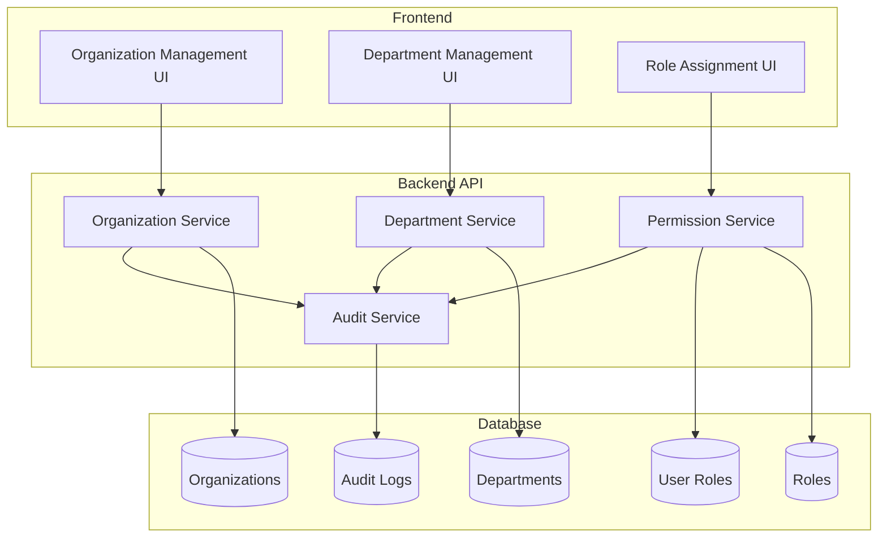
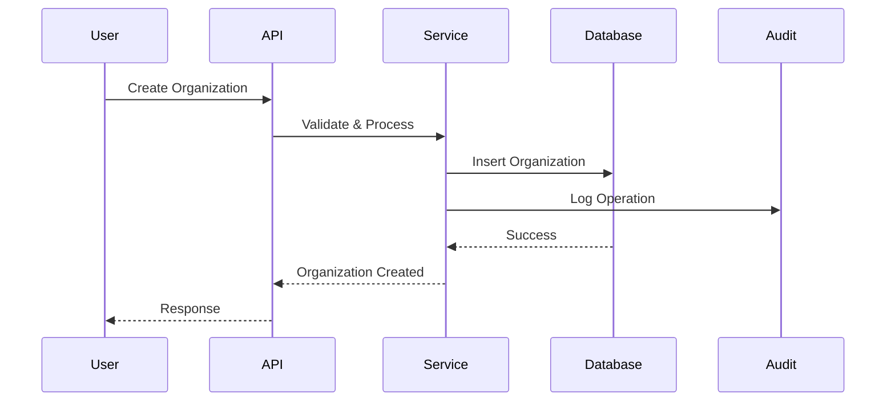

# 組織管理機能詳細設計書

**文書番号**: ITDO-ERP-DD-ORG-001  
**バージョン**: 1.0  
**作成日**: 2025年7月5日  
**作成者**: Claude Code AI  

---

## 1. 概要

### 1.1 目的
ITDO ERPシステムにマルチテナント対応の組織管理機能を実装し、企業・部門の階層構造管理とロールベースアクセス制御を実現する。

### 1.2 対象機能
- ORG-001: 企業情報管理
- ORG-002: 部門階層管理（2階層）
- PERM-001: 基本ロール定義
- PERM-002: ユーザーロール付与

### 1.3 主要概念
- **マルチテナント**: 複数の組織が同一システムを利用し、データは完全に分離される
- **階層構造**: 組織 → 部門（最大2階層）の階層管理
- **ロールベースアクセス制御**: 組織・部門レベルでの権限管理

---

## 2. アーキテクチャ

### 2.1 システム構成



### 2.2 データフロー



---

## 3. データモデル

### 3.1 Organizationテーブル

```sql
CREATE TABLE organizations (
    id SERIAL PRIMARY KEY,
    code VARCHAR(50) UNIQUE NOT NULL,
    name VARCHAR(200) NOT NULL,
    name_kana VARCHAR(200),
    postal_code VARCHAR(10),
    address VARCHAR(500),
    phone VARCHAR(20),
    email VARCHAR(254),
    website VARCHAR(200),
    fiscal_year_start INTEGER CHECK (fiscal_year_start BETWEEN 1 AND 12),
    is_active BOOLEAN DEFAULT true,
    created_at TIMESTAMP WITH TIME ZONE DEFAULT CURRENT_TIMESTAMP,
    updated_at TIMESTAMP WITH TIME ZONE DEFAULT CURRENT_TIMESTAMP,
    created_by INTEGER REFERENCES users(id),
    updated_by INTEGER REFERENCES users(id)
);

CREATE INDEX idx_organizations_code ON organizations(code);
CREATE INDEX idx_organizations_is_active ON organizations(is_active);
```

### 3.2 Departmentテーブル

```sql
CREATE TABLE departments (
    id SERIAL PRIMARY KEY,
    organization_id INTEGER NOT NULL REFERENCES organizations(id) ON DELETE CASCADE,
    parent_id INTEGER REFERENCES departments(id) ON DELETE CASCADE,
    code VARCHAR(50) NOT NULL,
    name VARCHAR(200) NOT NULL,
    name_kana VARCHAR(200),
    level INTEGER NOT NULL CHECK (level IN (1, 2)),
    path VARCHAR(500) NOT NULL, -- e.g., "1/5/12"
    sort_order INTEGER DEFAULT 0,
    is_active BOOLEAN DEFAULT true,
    created_at TIMESTAMP WITH TIME ZONE DEFAULT CURRENT_TIMESTAMP,
    updated_at TIMESTAMP WITH TIME ZONE DEFAULT CURRENT_TIMESTAMP,
    created_by INTEGER REFERENCES users(id),
    updated_by INTEGER REFERENCES users(id),
    UNIQUE(organization_id, code)
);

CREATE INDEX idx_departments_organization ON departments(organization_id);
CREATE INDEX idx_departments_parent ON departments(parent_id);
CREATE INDEX idx_departments_path ON departments(path);
CREATE INDEX idx_departments_is_active ON departments(is_active);
```

### 3.3 Roleテーブル

```sql
CREATE TABLE roles (
    id SERIAL PRIMARY KEY,
    code VARCHAR(50) UNIQUE NOT NULL,
    name VARCHAR(100) NOT NULL,
    description TEXT,
    permissions JSONB NOT NULL DEFAULT '[]',
    is_system BOOLEAN DEFAULT false,
    is_active BOOLEAN DEFAULT true,
    created_at TIMESTAMP WITH TIME ZONE DEFAULT CURRENT_TIMESTAMP,
    updated_at TIMESTAMP WITH TIME ZONE DEFAULT CURRENT_TIMESTAMP
);

-- システムロールの初期データ
INSERT INTO roles (code, name, description, permissions, is_system) VALUES
('SYSTEM_ADMIN', 'システム管理者', '全権限を持つシステム管理者', '["*"]', true),
('ORG_ADMIN', '組織管理者', '組織内の全権限を持つ管理者', '["org:*"]', true),
('DEPT_MANAGER', '部門管理者', '部門内の管理権限を持つ', '["dept:*"]', true),
('USER', '一般ユーザー', '基本的な参照・操作権限', '["read:*", "write:own"]', true);
```

### 3.4 UserRoleテーブル

```sql
CREATE TABLE user_roles (
    id SERIAL PRIMARY KEY,
    user_id INTEGER NOT NULL REFERENCES users(id) ON DELETE CASCADE,
    role_id INTEGER NOT NULL REFERENCES roles(id) ON DELETE CASCADE,
    organization_id INTEGER REFERENCES organizations(id) ON DELETE CASCADE,
    department_id INTEGER REFERENCES departments(id) ON DELETE CASCADE,
    assigned_at TIMESTAMP WITH TIME ZONE DEFAULT CURRENT_TIMESTAMP,
    assigned_by INTEGER REFERENCES users(id),
    expires_at TIMESTAMP WITH TIME ZONE,
    UNIQUE(user_id, role_id, organization_id, department_id)
);

CREATE INDEX idx_user_roles_user ON user_roles(user_id);
CREATE INDEX idx_user_roles_organization ON user_roles(organization_id);
CREATE INDEX idx_user_roles_department ON user_roles(department_id);
```

### 3.5 AuditLogテーブル

```sql
CREATE TABLE audit_logs (
    id BIGSERIAL PRIMARY KEY,
    organization_id INTEGER REFERENCES organizations(id),
    user_id INTEGER REFERENCES users(id),
    action VARCHAR(50) NOT NULL,
    resource_type VARCHAR(50) NOT NULL,
    resource_id INTEGER,
    changes JSONB,
    ip_address INET,
    user_agent TEXT,
    created_at TIMESTAMP WITH TIME ZONE DEFAULT CURRENT_TIMESTAMP
);

CREATE INDEX idx_audit_logs_organization ON audit_logs(organization_id);
CREATE INDEX idx_audit_logs_user ON audit_logs(user_id);
CREATE INDEX idx_audit_logs_created_at ON audit_logs(created_at);
CREATE INDEX idx_audit_logs_resource ON audit_logs(resource_type, resource_id);
```

---

## 4. API設計

### 4.1 組織管理API

#### 組織作成
```yaml
POST /api/v1/organizations
Request:
  {
    "code": "ITDO",
    "name": "株式会社ITDO",
    "name_kana": "カブシキガイシャアイティーディーオー",
    "postal_code": "100-0001",
    "address": "東京都千代田区...",
    "phone": "03-1234-5678",
    "email": "info@itdo.jp",
    "website": "https://itdo.jp",
    "fiscal_year_start": 4
  }
Response:
  {
    "id": 1,
    "code": "ITDO",
    "name": "株式会社ITDO",
    ...
  }
```

#### 組織一覧取得
```yaml
GET /api/v1/organizations
Query Parameters:
  - page: 1
  - limit: 20
  - is_active: true
  - search: "検索文字列"
Response:
  {
    "items": [...],
    "total": 100,
    "page": 1,
    "limit": 20
  }
```

### 4.2 部門管理API

#### 部門作成
```yaml
POST /api/v1/departments
Request:
  {
    "organization_id": 1,
    "parent_id": null,
    "code": "SALES",
    "name": "営業部",
    "name_kana": "エイギョウブ",
    "sort_order": 1
  }
```

#### 部門階層取得
```yaml
GET /api/v1/departments/tree
Query Parameters:
  - organization_id: 1
Response:
  {
    "departments": [
      {
        "id": 1,
        "code": "SALES",
        "name": "営業部",
        "children": [
          {
            "id": 2,
            "code": "SALES_TOKYO",
            "name": "東京営業所",
            "children": []
          }
        ]
      }
    ]
  }
```

### 4.3 ロール管理API

#### ユーザーロール付与
```yaml
POST /api/v1/users/{user_id}/roles
Request:
  {
    "role_id": 2,
    "organization_id": 1,
    "department_id": null,
    "expires_at": null
  }
```

#### ユーザーロール取得
```yaml
GET /api/v1/users/{user_id}/roles
Response:
  {
    "roles": [
      {
        "id": 1,
        "role": {
          "id": 2,
          "code": "ORG_ADMIN",
          "name": "組織管理者"
        },
        "organization": {
          "id": 1,
          "name": "株式会社ITDO"
        },
        "department": null,
        "assigned_at": "2025-07-05T10:00:00Z"
      }
    ]
  }
```

---

## 5. セキュリティ設計

### 5.1 データアクセス制御

```python
class OrganizationService:
    def get_organizations(self, user: User) -> List[Organization]:
        """ユーザーがアクセス可能な組織のみ返す"""
        if user.is_system_admin():
            return Organization.query.all()
        
        # ユーザーが所属する組織のみ
        org_ids = [ur.organization_id for ur in user.roles]
        return Organization.query.filter(
            Organization.id.in_(org_ids)
        ).all()
```

### 5.2 Row Level Security (RLS)

```python
def apply_organization_filter(query, user: User):
    """クエリに組織フィルタを適用"""
    if not user.is_system_admin():
        org_ids = user.get_organization_ids()
        query = query.filter(Model.organization_id.in_(org_ids))
    return query
```

### 5.3 権限チェック

```python
def require_permission(permission: str):
    """権限デコレーター"""
    def decorator(func):
        @wraps(func)
        async def wrapper(*args, **kwargs):
            user = get_current_user()
            if not user.has_permission(permission):
                raise PermissionDenied()
            return await func(*args, **kwargs)
        return wrapper
    return decorator

# 使用例
@require_permission("org:write")
async def create_organization(data: OrganizationCreate):
    ...
```

---

## 6. 実装詳細

### 6.1 階層管理の実装

```python
class DepartmentService:
    def create_department(self, data: DepartmentCreate, parent: Department = None):
        """部門を作成（階層チェック付き）"""
        level = 1 if parent is None else parent.level + 1
        
        if level > 2:
            raise ValueError("部門階層は2階層までです")
        
        path = str(parent.id) if parent else ""
        
        department = Department(
            **data.dict(),
            parent_id=parent.id if parent else None,
            level=level,
            path=path
        )
        
        db.session.add(department)
        db.session.commit()
        
        # パスを更新
        department.path = f"{path}/{department.id}" if path else str(department.id)
        db.session.commit()
        
        return department
```

### 6.2 監査ログの実装

```python
class AuditLogger:
    @staticmethod
    def log(action: str, resource_type: str, resource_id: int, 
            changes: dict = None, user: User = None):
        """操作を監査ログに記録"""
        log = AuditLog(
            organization_id=user.current_organization_id if user else None,
            user_id=user.id if user else None,
            action=action,
            resource_type=resource_type,
            resource_id=resource_id,
            changes=changes,
            ip_address=get_client_ip(),
            user_agent=get_user_agent()
        )
        db.session.add(log)
        db.session.commit()

# 使用例
@audit_logged("create", "organization")
def create_organization(data):
    ...
```

---

## 7. テスト計画

### 7.1 単体テスト
- 組織CRUD操作テスト
- 部門階層管理テスト
- ロール付与・削除テスト
- 権限チェックテスト
- 監査ログ記録テスト

### 7.2 結合テスト
- マルチテナントデータ分離テスト
- 階層構造の整合性テスト
- ロールベースアクセス制御テスト
- 同時実行・競合状態テスト

### 7.3 パフォーマンステスト
- 大量組織でのクエリ性能
- 階層データの取得性能
- 権限チェックのオーバーヘッド

---

## 8. 移行計画

### 8.1 既存データの移行
```sql
-- 既存ユーザーにデフォルト組織を設定
INSERT INTO organizations (code, name) VALUES ('DEFAULT', 'デフォルト組織');

-- 既存ユーザーに組織を関連付け
INSERT INTO user_roles (user_id, role_id, organization_id)
SELECT id, (SELECT id FROM roles WHERE code = 'USER'), 1
FROM users;
```

### 8.2 段階的ロールアウト
1. システム管理者による組織作成
2. 組織管理者の任命
3. 部門構造の設定
4. 一般ユーザーの移行

---

## 9. 監視・運用

### 9.1 監視項目
- 組織別アクティブユーザー数
- API応答時間（組織フィルタ影響）
- 監査ログ容量
- 権限エラー発生率

### 9.2 運用タスク
- 組織の有効化/無効化
- ロール権限の調整
- 監査ログのアーカイブ
- パフォーマンスチューニング

---

## 10. 将来拡張

### 10.1 計画済み機能
- [ ] 組織間データ共有機能
- [ ] 動的権限設定
- [ ] 組織統合・分割機能
- [ ] 外部IdP連携
- [ ] 組織別カスタマイズ

### 10.2 スケーラビリティ
- 組織数: 10,000+対応
- ユーザー数: 100,000+対応
- 同時アクセス: 1,000+対応