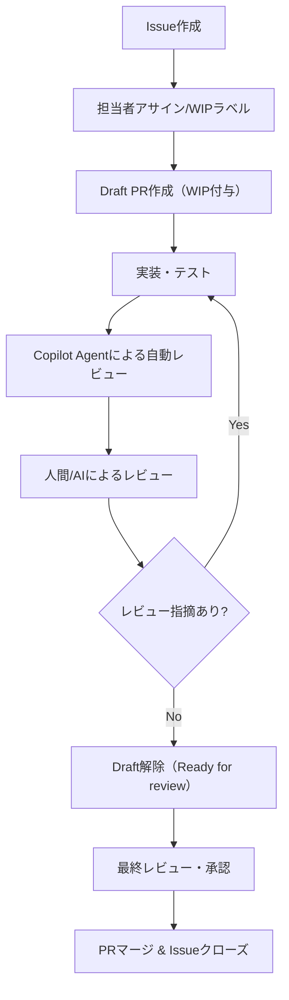
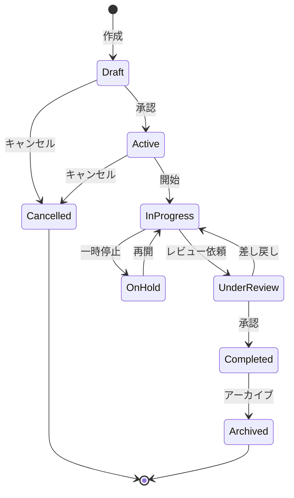

# 統合開発ドキュメント - Claude Code & GitHub協調開発

## 目次

1. [システム開発設計書](#1-システム開発設計書)
2. [GitHub協調開発ワークフロー](#2-github協調開発ワークフロー)
3. [プロジェクトコンテキスト](#3-プロジェクトコンテキスト)
4. [コード生成テンプレート](#4-コード生成テンプレート)
5. [状態遷移定義](#5-状態遷移定義)
6. [既存システム分析](#6-既存システム分析)
7. [データモデル定義](#7-データモデル定義)
8. [API仕様定義](#8-api仕様定義)
9. [エラーカタログ](#9-エラーカタログ)
10. [非機能要件](#10-非機能要件)
11. [開発環境セットアップ](#11-開発環境セットアップ)
12. [自動化スクリプト](#12-自動化スクリプト)

---

# 1. システム開発設計書

## 1.1 プロジェクト概要

### 技術スタック
- **バックエンド**: Python 3.11 + FastAPI
- **フロントエンド**: React 18 + TypeScript 5
- **データベース**: PostgreSQL 15
- **認証**: OAuth2 / OpenID Connect (Keycloak)
- **コンテナ**: Podman
- **Python管理**: uv
- **Node.js管理**: Volta
- **E2Eテスト**: Playwright
- **バージョン管理**: GitHub

### 開発環境
- Windows上のWSL2 (Ubuntu)
- Claude Code

## 1.2 ディレクトリ構造

```
project/
├── backend/                    # FastAPIバックエンド
│   ├── app/
│   │   ├── api/               # APIエンドポイント
│   │   │   └── v1/
│   │   ├── core/              # 設定、セキュリティ、依存関係
│   │   ├── models/            # SQLAlchemyモデル
│   │   ├── schemas/           # Pydanticスキーマ
│   │   ├── services/          # ビジネスロジック
│   │   └── main.py
│   ├── tests/                 # テストコード
│   │   ├── unit/
│   │   ├── integration/
│   │   └── conftest.py
│   ├── alembic/               # DBマイグレーション
│   ├── docs/                  # API仕様書
│   │   ├── api-spec.md
│   │   └── test-spec.md
│   ├── .venv/                 # Python仮想環境
│   ├── Dockerfile
│   ├── pyproject.toml
│   ├── requirements.txt       # 本番用
│   └── requirements-dev.txt   # 開発用
├── frontend/                   # Reactフロントエンド
│   ├── src/
│   │   ├── components/        # UIコンポーネント
│   │   ├── features/          # 機能別モジュール
│   │   ├── hooks/             # カスタムフック
│   │   ├── services/          # API通信
│   │   ├── types/             # TypeScript型定義
│   │   └── App.tsx
│   ├── tests/                 # テストコード
│   ├── docs/                  # フロントエンド仕様書
│   │   ├── component-spec.md
│   │   └── test-spec.md
│   ├── public/
│   ├── Dockerfile
│   ├── package.json
│   └── tsconfig.json
├── e2e/                       # E2Eテスト
│   ├── tests/
│   ├── fixtures/
│   └── playwright.config.ts
├── infra/                     # インフラ設定
│   ├── compose.yaml
│   └── init-scripts/
├── scripts/                   # 自動化スクリプト
│   ├── init-project.sh
│   ├── setup-dev.sh
│   ├── test.sh
│   ├── start-feature.sh
│   └── claude-sync.sh
├── docs/                      # プロジェクトドキュメント
│   ├── architecture.md
│   ├── development-guide.md
│   └── test-strategy.md
├── .github/                   # GitHub設定
│   ├── workflows/
│   ├── ISSUE_TEMPLATE/
│   └── pull_request_template.md
├── .claude/                   # AI開発用設定
│   ├── PROJECT_CONTEXT.md
│   ├── DATA_MODELS.yaml
│   ├── ERROR_CATALOG.md
│   └── META_PROMPT.md
├── Makefile
├── .pre-commit-config.yaml
└── README.md
```

---

# 2. GitHub協調開発ワークフロー

## 2.1 基本原則

- **全ての作業はIssueから始める**
- **Issueごとに必ず対応するPRを作成する**
- **PRは必ずDraftで作成し、WIP（作業中）はラベルやタイトルで明示する**
- **レビューはAI（Copilot Agent）→人間/AIの順で実施**
- **作業の重複を避けるため、WIP状態や担当者を明確にする**

## 2.2 開発フロー



## 2.3 Claude Code開発プロンプト

```
私はこれから Issue #[番号] の [機能名] の実装を行います。以下の手順で進めてください：

0. **Issue確認フェーズ**
   - Issue #[番号] の内容を確認し、要件を理解してください
   - 不明点があれば質問してください
   - 関連するIssueやPRがないか確認してください

1. **Draft PR作成フェーズ**
   - feature/#[Issue番号]-[簡潔な説明] ブランチを作成
   - Draft PRを作成: `[WIP] feat: [機能名] (Closes #[Issue番号])`
   - PRに実装計画をコメントとして記載

2. **仕様書作成フェーズ**
   - 実装する機能の詳細仕様書を作成してください
   - 仕様書には以下を含めてください：
     * 機能概要
     * インターフェース定義（API仕様/コンポーネント仕様）
     * データモデル
     * エラーハンドリング仕様
     * セキュリティ考慮事項
   - 仕様書はPRにコメントとして追加

3. **テスト仕様作成フェーズ**
   - 仕様書に基づいて、テスト仕様書を作成してください
   - 以下のテストケースを含めてください：
     * 単体テストケース（正常系・異常系）
     * 統合テストケース
     * E2Eテストシナリオ
   - 各テストケースには期待値を明記してください

4. **テストコード実装フェーズ**
   - テスト仕様に基づいて、テストコードを先に実装してください
   - Pythonの場合: pytest を使用
   - TypeScriptの場合: vitest を使用
   - E2Eの場合: Playwright を使用
   - テストコードをコミット・プッシュ

5. **実装フェーズ**
   - テストが失敗することを確認してから、実装を開始してください
   - 実装は小さなステップで進め、各ステップでテストを実行してください
   - すべてのテストが通ることを確認してください
   - 定期的にコミット・プッシュしてPRを更新

6. **ドキュメント更新フェーズ**
   - 実装完了後、関連ドキュメントを更新してください
   - APIドキュメント、コンポーネントドキュメントなど

7. **レビュー準備フェーズ**
   - セルフレビューを実施
   - PR descriptionを最終化
   - Draft状態を解除してReady for reviewに変更

重要な制約事項：
- 必ずIssueを起点とし、Draft PRを早期に作成すること
- テストコードを書かずに実装を進めることは禁止です
- テストが通らないコードをコミットすることは禁止です
- 型定義は必須です（Python: typing, TypeScript: 明示的な型）
  - Pythonは mypy --strict でエラーなし
  - TypeScriptは tsc --noEmit でエラーなし
  - any型の使用は原則禁止
- エラーハンドリングは必須です
- WIP状態を明確にし、作業の重複を防ぐこと
```

## 2.4 GitHub テンプレート

### Issueテンプレート

```markdown
# .github/ISSUE_TEMPLATE/feature_request.md
---
name: 機能要望
about: 新機能の提案
title: ''
labels: 'feature'
assignees: ''
---

## 概要
<!-- 機能の簡潔な説明 -->

## 背景・目的
<!-- なぜこの機能が必要か -->

## 要件
<!-- 実装すべき要件のリスト -->
- [ ] 要件1
- [ ] 要件2

## 技術仕様案
<!-- 実装方針の提案（任意） -->

## 完了条件
<!-- この機能が完了したと判断できる条件 -->
- [ ] 条件1
- [ ] 条件2

## 参考資料
<!-- 関連資料へのリンクなど -->
```

### PRテンプレート

```markdown
# .github/pull_request_template.md

## 概要
<!-- このPRで何を実装・修正するか簡潔に説明 -->

## 関連Issue
Closes #<!-- Issue番号 -->

## 変更内容
<!-- 実装内容の詳細 -->
- [ ] 機能A
- [ ] 機能B

## テスト
<!-- 追加・更新したテストの説明 -->
- [ ] 単体テスト追加
- [ ] 統合テスト追加
- [ ] E2Eテスト追加

## スクリーンショット
<!-- UI変更がある場合は画面キャプチャを添付 -->

## チェックリスト
- [ ] テストが全て通る
- [ ] ドキュメントを更新した
- [ ] 型チェックが通る
- [ ] リントエラーがない
- [ ] セキュリティの考慮をした

## AIレビュー結果
<!-- Copilot Agentからの指摘事項と対応状況 -->
- [ ] 自動レビュー指摘事項に対応済み

## 備考
<!-- レビュアーへの補足事項など -->
```

---

# 3. プロジェクトコンテキスト

```markdown
# .claude/PROJECT_CONTEXT.md

## ビジネスドメイン
- 主要エンティティ: User, Organization, Project, Task
- 主要ユースケース: [具体的な業務フロー]
- ビジネスルール: [制約事項、計算ロジック]

## 技術的制約
- レスポンスタイム: API 200ms以内
- 同時接続数: 1000ユーザー
- データ保持期間: 7年

## 命名規則
- API: /api/v1/{resource}/{id}
- DB: snake_case
- Python: snake_case
- TypeScript: camelCase

## AI用メタプロンプト

あなたはこのプロジェクトの開発を支援するAIアシスタントです。
以下の原則に従って開発を進めてください：

1. **安全第一**: テストなしでコードを書かない
2. **文書化**: 実装前に仕様を文書化
3. **一貫性**: 既存のパターンに従う
4. **効率性**: テンプレートを活用
5. **品質**: コードレビューの観点を持つ

利用可能なリソース：
- PROJECT_CONTEXT.md: ビジネスドメイン知識
- CODE_TEMPLATES/: コード生成テンプレート
- DATA_MODELS.yaml: データモデル定義
- ERROR_CATALOG.md: エラー処理パターン
- SECURITY_CHECKLIST.md: セキュリティ要件

開発時は必ず以下の順序で進めること：
1. 関連ドキュメントの参照
2. テスト仕様の作成
3. テストコードの実装
4. プロダクションコードの実装
5. ドキュメントの更新
```

---

# 4. コード生成テンプレート

## 4.1 Backend Templates

### APIエンドポイントテンプレート

```python
# File: backend/app/api/v1/{resource}.py
from typing import List, Optional
from fastapi import APIRouter, Depends, HTTPException, Query
from sqlalchemy.orm import Session

from app.core.deps import get_db, get_current_user
from app.models.{resource} import {Resource}
from app.schemas.{resource} import (
    {Resource}Create,
    {Resource}Update,
    {Resource}Response,
    {Resource}ListResponse
)
from app.services.{resource} import {Resource}Service

router = APIRouter(prefix="/{resources}", tags=["{resources}"])

@router.get("", response_model={Resource}ListResponse)
async def list_{resources}(
    skip: int = Query(0, ge=0),
    limit: int = Query(100, ge=1, le=100),
    db: Session = Depends(get_db),
    current_user: User = Depends(get_current_user)
) -> {Resource}ListResponse:
    """
    {Resources}の一覧を取得
    """
    service = {Resource}Service(db)
    items, total = await service.list(skip=skip, limit=limit, user=current_user)
    return {Resource}ListResponse(items=items, total=total, skip=skip, limit=limit)

@router.get("/{{{resource}_id}}", response_model={Resource}Response)
async def get_{resource}(
    {resource}_id: int,
    db: Session = Depends(get_db),
    current_user: User = Depends(get_current_user)
) -> {Resource}Response:
    """
    {Resource}の詳細を取得
    """
    service = {Resource}Service(db)
    item = await service.get_by_id({resource}_id, user=current_user)
    if not item:
        raise HTTPException(status_code=404, detail="{Resource} not found")
    return item

@router.post("", response_model={Resource}Response, status_code=201)
async def create_{resource}(
    data: {Resource}Create,
    db: Session = Depends(get_db),
    current_user: User = Depends(get_current_user)
) -> {Resource}Response:
    """
    新規{Resource}を作成
    """
    service = {Resource}Service(db)
    return await service.create(data, user=current_user)

@router.put("/{{{resource}_id}}", response_model={Resource}Response)
async def update_{resource}(
    {resource}_id: int,
    data: {Resource}Update,
    db: Session = Depends(get_db),
    current_user: User = Depends(get_current_user)
) -> {Resource}Response:
    """
    {Resource}を更新
    """
    service = {Resource}Service(db)
    item = await service.update({resource}_id, data, user=current_user)
    if not item:
        raise HTTPException(status_code=404, detail="{Resource} not found")
    return item

@router.delete("/{{{resource}_id}}", status_code=204)
async def delete_{resource}(
    {resource}_id: int,
    db: Session = Depends(get_db),
    current_user: User = Depends(get_current_user)
) -> None:
    """
    {Resource}を削除
    """
    service = {Resource}Service(db)
    if not await service.delete({resource}_id, user=current_user):
        raise HTTPException(status_code=404, detail="{Resource} not found")
```

### サービスクラステンプレート

```python
# File: backend/app/services/{resource}.py
from typing import List, Optional, Tuple
from sqlalchemy.orm import Session
from sqlalchemy import select, func

from app.models.{resource} import {Resource}
from app.models.user import User
from app.schemas.{resource} import {Resource}Create, {Resource}Update

class {Resource}Service:
    def __init__(self, db: Session):
        self.db = db

    async def list(
        self, 
        skip: int = 0, 
        limit: int = 100,
        user: Optional[User] = None
    ) -> Tuple[List[{Resource}], int]:
        """
        {Resource}一覧を取得
        """
        query = select({Resource})
        
        # フィルタリング条件を追加
        if user:
            query = query.filter({Resource}.user_id == user.id)
        
        # 総件数を取得
        total = await self.db.scalar(
            select(func.count()).select_from(query.subquery())
        )
        
        # ページネーション適用
        query = query.offset(skip).limit(limit)
        result = await self.db.execute(query)
        items = result.scalars().all()
        
        return items, total

    async def get_by_id(
        self, 
        {resource}_id: int,
        user: Optional[User] = None
    ) -> Optional[{Resource}]:
        """
        IDで{Resource}を取得
        """
        query = select({Resource}).filter({Resource}.id == {resource}_id)
        
        if user:
            query = query.filter({Resource}.user_id == user.id)
            
        result = await self.db.execute(query)
        return result.scalar_one_or_none()

    async def create(
        self,
        data: {Resource}Create,
        user: Optional[User] = None
    ) -> {Resource}:
        """
        新規{Resource}を作成
        """
        db_obj = {Resource}(
            **data.dict(),
            user_id=user.id if user else None
        )
        self.db.add(db_obj)
        await self.db.commit()
        await self.db.refresh(db_obj)
        return db_obj

    async def update(
        self,
        {resource}_id: int,
        data: {Resource}Update,
        user: Optional[User] = None
    ) -> Optional[{Resource}]:
        """
        {Resource}を更新
        """
        db_obj = await self.get_by_id({resource}_id, user=user)
        if not db_obj:
            return None
            
        update_data = data.dict(exclude_unset=True)
        for field, value in update_data.items():
            setattr(db_obj, field, value)
            
        await self.db.commit()
        await self.db.refresh(db_obj)
        return db_obj

    async def delete(
        self,
        {resource}_id: int,
        user: Optional[User] = None
    ) -> bool:
        """
        {Resource}を削除
        """
        db_obj = await self.get_by_id({resource}_id, user=user)
        if not db_obj:
            return False
            
        await self.db.delete(db_obj)
        await self.db.commit()
        return True
```

### テストテンプレート

```python
# File: backend/tests/unit/test_{resource}_service.py
import pytest
from sqlalchemy.orm import Session

from app.services.{resource} import {Resource}Service
from app.schemas.{resource} import {Resource}Create, {Resource}Update
from tests.factories import {Resource}Factory, UserFactory

class Test{Resource}Service:
    @pytest.fixture
    def service(self, db: Session) -> {Resource}Service:
        return {Resource}Service(db)

    async def test_create_{resource}(self, service: {Resource}Service, db: Session):
        # Arrange
        user = UserFactory()
        data = {Resource}Create(
            name="Test {Resource}",
            description="Test Description"
        )
        
        # Act
        result = await service.create(data, user=user)
        
        # Assert
        assert result.id is not None
        assert result.name == data.name
        assert result.description == data.description
        assert result.user_id == user.id

    async def test_get_{resource}_by_id(self, service: {Resource}Service, db: Session):
        # Arrange
        {resource} = {Resource}Factory()
        db.add({resource})
        await db.commit()
        
        # Act
        result = await service.get_by_id({resource}.id)
        
        # Assert
        assert result is not None
        assert result.id == {resource}.id

    async def test_update_{resource}(self, service: {Resource}Service, db: Session):
        # Arrange
        {resource} = {Resource}Factory()
        db.add({resource})
        await db.commit()
        
        update_data = {Resource}Update(name="Updated Name")
        
        # Act
        result = await service.update({resource}.id, update_data)
        
        # Assert
        assert result is not None
        assert result.name == "Updated Name"

    async def test_delete_{resource}(self, service: {Resource}Service, db: Session):
        # Arrange
        {resource} = {Resource}Factory()
        db.add({resource})
        await db.commit()
        
        # Act
        success = await service.delete({resource}.id)
        
        # Assert
        assert success is True
        assert await service.get_by_id({resource}.id) is None
```

## 4.2 Frontend Templates

### Reactコンポーネントテンプレート

```typescript
// File: frontend/src/features/{resource}/components/{Resource}List.tsx
import React, { useState } from 'react';
import { useQuery, useMutation, useQueryClient } from '@tanstack/react-query';
import { {resource}Api } from '../api/{resource}Api';
import { {Resource} } from '../types/{resource}';
import { LoadingSpinner } from '@/components/LoadingSpinner';
import { ErrorMessage } from '@/components/ErrorMessage';
import { Pagination } from '@/components/Pagination';

interface {Resource}ListProps {
  onSelect?: ({resource}: {Resource}) => void;
}

export const {Resource}List: React.FC<{Resource}ListProps> = ({ onSelect }) => {
  const [page, setPage] = useState(1);
  const [limit] = useState(10);
  const queryClient = useQueryClient();

  const { data, isLoading, error } = useQuery({
    queryKey: ['{resources}', page, limit],
    queryFn: () => {resource}Api.list({ skip: (page - 1) * limit, limit }),
  });

  const deleteMutation = useMutation({
    mutationFn: {resource}Api.delete,
    onSuccess: () => {
      queryClient.invalidateQueries({ queryKey: ['{resources}'] });
    },
  });

  const handleDelete = async (id: number) => {
    if (confirm('削除してもよろしいですか？')) {
      await deleteMutation.mutateAsync(id);
    }
  };

  if (isLoading) return <LoadingSpinner />;
  if (error) return <ErrorMessage message="データの取得に失敗しました" />;
  if (!data) return null;

  return (
    <div className="space-y-4">
      <div className="grid gap-4">
        {data.items.map(({resource}) => (
          <div
            key={{resource}.id}
            className="p-4 border rounded-lg hover:shadow-md transition-shadow"
          >
            <div className="flex justify-between items-start">
              <div 
                className="flex-1 cursor-pointer"
                onClick={() => onSelect?.({resource})}
              >
                <h3 className="text-lg font-semibold">{{resource}.name}</h3>
                <p className="text-gray-600">{{resource}.description}</p>
              </div>
              <button
                onClick={() => handleDelete({resource}.id)}
                className="text-red-600 hover:text-red-800"
              >
                削除
              </button>
            </div>
          </div>
        ))}
      </div>

      <Pagination
        currentPage={page}
        totalPages={Math.ceil(data.total / limit)}
        onPageChange={setPage}
      />
    </div>
  );
};
```

### API通信テンプレート

```typescript
// File: frontend/src/features/{resource}/api/{resource}Api.ts
import { apiClient } from '@/lib/apiClient';
import { 
  {Resource}, 
  {Resource}Create, 
  {Resource}Update,
  {Resource}ListResponse 
} from '../types/{resource}';

export const {resource}Api = {
  list: async (params: { skip?: number; limit?: number }): Promise<{Resource}ListResponse> => {
    const { data } = await apiClient.get('/{resources}', { params });
    return data;
  },

  get: async (id: number): Promise<{Resource}> => {
    const { data } = await apiClient.get(`/{resources}/${id}`);
    return data;
  },

  create: async (data: {Resource}Create): Promise<{Resource}> => {
    const { data: response } = await apiClient.post('/{resources}', data);
    return response;
  },

  update: async (id: number, data: {Resource}Update): Promise<{Resource}> => {
    const { data: response } = await apiClient.put(`/{resources}/${id}`, data);
    return response;
  },

  delete: async (id: number): Promise<void> => {
    await apiClient.delete(`/{resources}/${id}`);
  },
};
```

### カスタムフックテンプレート

```typescript
// File: frontend/src/features/{resource}/hooks/use{Resource}.ts
import { useQuery, useMutation, useQueryClient } from '@tanstack/react-query';
import { {resource}Api } from '../api/{resource}Api';
import { {Resource}Create, {Resource}Update } from '../types/{resource}';

export const use{Resource}List = (params?: { skip?: number; limit?: number }) => {
  return useQuery({
    queryKey: ['{resources}', params],
    queryFn: () => {resource}Api.list(params || {}),
  });
};

export const use{Resource} = (id: number) => {
  return useQuery({
    queryKey: ['{resources}', id],
    queryFn: () => {resource}Api.get(id),
    enabled: !!id,
  });
};

export const useCreate{Resource} = () => {
  const queryClient = useQueryClient();
  
  return useMutation({
    mutationFn: (data: {Resource}Create) => {resource}Api.create(data),
    onSuccess: () => {
      queryClient.invalidateQueries({ queryKey: ['{resources}'] });
    },
  });
};

export const useUpdate{Resource} = () => {
  const queryClient = useQueryClient();
  
  return useMutation({
    mutationFn: ({ id, data }: { id: number; data: {Resource}Update }) => 
      {resource}Api.update(id, data),
    onSuccess: (_, { id }) => {
      queryClient.invalidateQueries({ queryKey: ['{resources}'] });
      queryClient.invalidateQueries({ queryKey: ['{resources}', id] });
    },
  });
};

export const useDelete{Resource} = () => {
  const queryClient = useQueryClient();
  
  return useMutation({
    mutationFn: (id: number) => {resource}Api.delete(id),
    onSuccess: () => {
      queryClient.invalidateQueries({ queryKey: ['{resources}'] });
    },
  });
};
```

---

# 5. 状態遷移定義

## 5.1 プロジェクト状態遷移



## 5.2 状態遷移ルール定義

```yaml
# .claude/STATE_MACHINES.yaml
entity: Project
states:
  - name: Draft
    description: 下書き状態
    allowed_transitions:
      - to: Active
        condition: has_required_fields && user.can_approve
        action: send_notification_to_members
      - to: Cancelled
        condition: user.is_owner
        
  - name: Active
    description: アクティブ状態
    allowed_transitions:
      - to: InProgress
        condition: has_assigned_member
      - to: Cancelled
        condition: user.is_owner && no_active_tasks
        
  - name: InProgress
    description: 進行中
    allowed_transitions:
      - to: UnderReview
        condition: all_tasks_completed
      - to: OnHold
        condition: user.can_manage
        
  - name: UnderReview
    description: レビュー中
    allowed_transitions:
      - to: InProgress
        condition: review_rejected
        action: notify_assignee
      - to: Completed
        condition: review_approved
        action: close_all_tasks
```

## 5.3 実装パターン

### Backend (Python)

```python
from enum import Enum
from typing import Dict, List, Optional, Callable
from datetime import datetime

class ProjectStatus(Enum):
    DRAFT = "draft"
    ACTIVE = "active"
    IN_PROGRESS = "in_progress"
    UNDER_REVIEW = "under_review"
    ON_HOLD = "on_hold"
    COMPLETED = "completed"
    CANCELLED = "cancelled"
    ARCHIVED = "archived"

class StateTransition:
    def __init__(
        self, 
        from_state: ProjectStatus, 
        to_state: ProjectStatus,
        condition: Optional[Callable] = None,
        action: Optional[Callable] = None
    ):
        self.from_state = from_state
        self.to_state = to_state
        self.condition = condition
        self.action = action

class ProjectStateMachine:
    transitions: Dict[ProjectStatus, List[StateTransition]] = {
        ProjectStatus.DRAFT: [
            StateTransition(
                ProjectStatus.DRAFT,
                ProjectStatus.ACTIVE,
                condition=lambda ctx: ctx.has_required_fields() and ctx.user.can_approve(),
                action=lambda ctx: ctx.send_notification_to_members()
            ),
            StateTransition(
                ProjectStatus.DRAFT,
                ProjectStatus.CANCELLED,
                condition=lambda ctx: ctx.user.is_owner
            )
        ],
        # ... 他の遷移定義
    }
    
    @classmethod
    def can_transition(cls, project, to_state: ProjectStatus, context) -> bool:
        current_state = project.status
        possible_transitions = cls.transitions.get(current_state, [])
        
        for transition in possible_transitions:
            if transition.to_state == to_state:
                if transition.condition:
                    return transition.condition(context)
                return True
        return False
    
    @classmethod
    def transition(cls, project, to_state: ProjectStatus, context):
        if not cls.can_transition(project, to_state, context):
            raise ValueError(f"Cannot transition from {project.status} to {to_state}")
        
        # 遷移アクションの実行
        current_state = project.status
        for transition in cls.transitions[current_state]:
            if transition.to_state == to_state and transition.action:
                transition.action(context)
        
        # 状態更新
        project.status = to_state
        project.status_changed_at = datetime.utcnow()
```

---

# 6. 既存システム分析

## 6.1 旧システム分析

```yaml
# .claude/LEGACY_SYSTEM.yaml
system_info:
  name: "旧○○管理システム"
  version: "2.3.1"
  release_date: "2019-04-01"
  technology_stack:
    language: "Java 8"
    framework: "Spring Boot 1.5"
    database: "Oracle 12c"
    frontend: "jQuery + JSP"
  architecture: "モノリシック"
  deployment: "オンプレミス"
```

### 機能一覧と評価

| 機能名 | 説明 | 利用頻度 | ユーザー評価 | 移行要否 | 備考 |
|--------|------|----------|--------------|----------|------|
| ユーザー管理 | 基本的なCRUD | 高 | ★★★☆☆ | 要 | UI改善必要 |
| プロジェクト管理 | 進捗管理機能 | 高 | ★★☆☆☆ | 要（改修） | ワークフロー見直し |
| レポート出力 | Excel/PDF出力 | 中 | ★★★★☆ | 要 | 形式は維持 |
| バッチ処理 | 日次集計 | 高 | ★★★☆☆ | 要（改修） | 性能改善必要 |
| 通知機能 | メール通知のみ | 低 | ★☆☆☆☆ | 要（刷新） | Slack等追加 |

## 6.2 PoC分析

```yaml
# .claude/POC_LEARNINGS.yaml
poc_info:
  purpose: "新アーキテクチャの技術検証"
  duration: "2024-01-01 〜 2024-03-31"
  scope:
    - "認証機能のOIDC化"
    - "RESTful API設計"
    - "SPA化の検証"
    - "コンテナ化"
  technology_validation:
    - name: "FastAPI"
      result: "採用"
      reason: "高速、型安全、自動ドキュメント生成"
    - name: "React + TypeScript"
      result: "採用"
      reason: "型安全性、エコシステム"
    - name: "Keycloak"
      result: "採用"
      reason: "OIDC標準準拠、拡張性"

technical_decisions:
  adopted:
    - pattern: "Repository Pattern"
      code_example: |
        class UserRepository:
            async def get_by_id(self, user_id: int) -> Optional[User]:
                return await self.db.get(User, user_id)
      benefits:
        - "テスト容易性"
        - "DB実装の切り替え可能"
        
    - pattern: "Dependency Injection"
      implementation: "FastAPI Depends"
      benefits:
        - "疎結合"
        - "モック化容易"

  rejected:
    - pattern: "GraphQL"
      reason: "学習コスト高、REST APIで十分"
      alternative: "RESTful API with OpenAPI"
```

## 6.3 ギャップ分析

| カテゴリ | 旧システム | PoC | 新システム要件 | 対応方針 |
|----------|-----------|-----|----------------|----------|
| 認証 | 独自実装 | OIDC | OIDC + MFA | PoCベース拡張 |
| API | なし | REST | REST + GraphQL | 段階的追加 |
| UI | JSP | React SPA | React SPA | PoC継続 |
| 通知 | メールのみ | WebSocket | メール + Slack + Push | 新規開発 |
| レポート | Excel/PDF | 未実装 | Excel/PDF/BI連携 | 旧機能移植 |
| 監査ログ | ファイル出力 | 未実装 | DB + ログ基盤 | 新規開発 |

---

# 7. データモデル定義

```yaml
# .claude/DATA_MODELS.yaml
entities:
  User:
    fields:
      - name: id
        type: int
        primary_key: true
      - name: email
        type: str
        unique: true
        required: true
      - name: username
        type: str
        unique: true
        required: true
      - name: is_active
        type: bool
        default: true
      - name: created_at
        type: datetime
        auto_now_add: true
      - name: updated_at
        type: datetime
        auto_now: true
    relationships:
      - type: one_to_many
        target: Project
        field: projects
    indexes:
      - fields: [email]
      - fields: [username]
    
  Project:
    fields:
      - name: id
        type: int
        primary_key: true
      - name: name
        type: str
        required: true
        max_length: 200
      - name: description
        type: text
        nullable: true
      - name: status
        type: enum
        values: [draft, active, in_progress, under_review, on_hold, completed, cancelled, archived]
        default: draft
      - name: start_date
        type: date
        required: true
      - name: end_date
        type: date
        nullable: true
      - name: budget
        type: decimal
        precision: 15
        scale: 2
        nullable: true
    relationships:
      - type: many_to_one
        target: User
        field: owner
        on_delete: RESTRICT
      - type: many_to_many
        target: User
        field: members
        through: ProjectMember
    indexes:
      - fields: [status]
      - fields: [owner_id]
      - fields: [start_date, end_date]
      
  Task:
    fields:
      - name: id
        type: int
        primary_key: true
      - name: title
        type: str
        required: true
        max_length: 200
      - name: description
        type: text
        nullable: true
      - name: status
        type: enum
        values: [todo, in_progress, review, done]
        default: todo
      - name: priority
        type: enum
        values: [low, medium, high, urgent]
        default: medium
      - name: due_date
        type: datetime
        nullable: true
      - name: estimated_hours
        type: decimal
        precision: 5
        scale: 2
        nullable: true
      - name: actual_hours
        type: decimal
        precision: 5
        scale: 2
        nullable: true
    relationships:
      - type: many_to_one
        target: Project
        field: project
        on_delete: CASCADE
      - type: many_to_one
        target: User
        field: assignee
        nullable: true
        on_delete: SET_NULL
    indexes:
      - fields: [project_id, status]
      - fields: [assignee_id, status]
      - fields: [due_date]
```

---

# 8. API仕様定義

```yaml
# .claude/openapi.yaml
openapi: 3.0.0
info:
  title: MyApp API
  version: 1.0.0
  description: システムのREST API仕様

servers:
  - url: http://localhost:8000/api/v1
    description: 開発環境
  - url: https://api.example.com/v1
    description: 本番環境

security:
  - bearerAuth: []

paths:
  /users:
    get:
      summary: ユーザー一覧取得
      operationId: listUsers
      tags:
        - users
      parameters:
        - name: skip
          in: query
          schema:
            type: integer
            default: 0
            minimum: 0
        - name: limit
          in: query
          schema:
            type: integer
            default: 100
            minimum: 1
            maximum: 100
        - name: is_active
          in: query
          schema:
            type: boolean
      responses:
        '200':
          description: 成功
          content:
            application/json:
              schema:
                $ref: '#/components/schemas/UserListResponse'
        '401':
          $ref: '#/components/responses/Unauthorized'
        '500':
          $ref: '#/components/responses/InternalServerError'

    post:
      summary: ユーザー作成
      operationId: createUser
      tags:
        - users
      requestBody:
        required: true
        content:
          application/json:
            schema:
              $ref: '#/components/schemas/UserCreate'
      responses:
        '201':
          description: 作成成功
          content:
            application/json:
              schema:
                $ref: '#/components/schemas/UserResponse'
        '400':
          $ref: '#/components/responses/BadRequest'
        '409':
          $ref: '#/components/responses/Conflict'

  /users/{user_id}:
    get:
      summary: ユーザー詳細取得
      operationId: getUser
      tags:
        - users
      parameters:
        - name: user_id
          in: path
          required: true
          schema:
            type: integer
      responses:
        '200':
          description: 成功
          content:
            application/json:
              schema:
                $ref: '#/components/schemas/UserResponse'
        '404':
          $ref: '#/components/responses/NotFound'

components:
  securitySchemes:
    bearerAuth:
      type: http
      scheme: bearer
      bearerFormat: JWT

  schemas:
    UserCreate:
      type: object
      required:
        - email
        - username
        - password
      properties:
        email:
          type: string
          format: email
        username:
          type: string
          minLength: 3
          maxLength: 30
        password:
          type: string
          minLength: 8

    UserResponse:
      type: object
      properties:
        id:
          type: integer
        email:
          type: string
        username:
          type: string
        is_active:
          type: boolean
        created_at:
          type: string
          format: date-time
        updated_at:
          type: string
          format: date-time

    UserListResponse:
      type: object
      properties:
        items:
          type: array
          items:
            $ref: '#/components/schemas/UserResponse'
        total:
          type: integer
        skip:
          type: integer
        limit:
          type: integer

    Error:
      type: object
      properties:
        error:
          type: string
        message:
          type: string
        details:
          type: object

  responses:
    BadRequest:
      description: リクエスト不正
      content:
        application/json:
          schema:
            $ref: '#/components/schemas/Error'
    Unauthorized:
      description: 認証エラー
      content:
        application/json:
          schema:
            $ref: '#/components/schemas/Error'
    NotFound:
      description: リソースが見つからない
      content:
        application/json:
          schema:
            $ref: '#/components/schemas/Error'
    Conflict:
      description: リソースの競合
      content:
        application/json:
          schema:
            $ref: '#/components/schemas/Error'
    InternalServerError:
      description: サーバーエラー
      content:
        application/json:
          schema:
            $ref: '#/components/schemas/Error'
```

---

# 9. エラーカタログ

```markdown
# .claude/ERROR_CATALOG.md

## エラーコード体系

- E1xxx: 認証・認可関連
- E2xxx: ビジネスロジック関連
- E3xxx: データ検証関連
- E4xxx: 外部サービス関連
- E5xxx: システムエラー

## 認証エラー (E1xxx)

### E1001: 認証トークンが無効
- **原因**: トークン期限切れ、改ざん
- **HTTPステータス**: 401
- **対処**: 再ログイン
- **レスポンス例**:
  ```json
  {
    "error": "E1001",
    "message": "Invalid authentication token",
    "details": {
      "reason": "token_expired"
    }
  }
  ```

### E1002: 権限不足
- **原因**: リソースへのアクセス権限なし
- **HTTPステータス**: 403
- **対処**: 管理者に権限付与を依頼
- **レスポンス例**:
  ```json
  {
    "error": "E1002",
    "message": "Insufficient permissions",
    "details": {
      "required_role": "admin",
      "user_role": "member"
    }
  }
  ```

## ビジネスロジックエラー (E2xxx)

### E2001: 状態遷移エラー
- **原因**: 許可されない状態遷移
- **HTTPステータス**: 409
- **対処**: 現在の状態を確認
- **レスポンス例**:
  ```json
  {
    "error": "E2001",
    "message": "Invalid state transition",
    "details": {
      "current_state": "draft",
      "requested_state": "completed",
      "allowed_states": ["active", "cancelled"]
    }
  }
  ```

### E2002: ビジネスルール違反
- **原因**: ビジネスルールに違反する操作
- **HTTPステータス**: 422
- **対処**: 操作内容を確認
- **レスポンス例**:
  ```json
  {
    "error": "E2002",
    "message": "Business rule violation",
    "details": {
      "rule": "project_budget_exceeded",
      "max_budget": 1000000,
      "requested_budget": 1500000
    }
  }
  ```

## データ検証エラー (E3xxx)

### E3001: 必須項目未入力
- **原因**: 必須フィールドが空
- **HTTPステータス**: 400
- **対処**: 必須項目を入力
- **レスポンス例**:
  ```json
  {
    "error": "E3001",
    "message": "Required field missing",
    "details": {
      "fields": ["email", "username"]
    }
  }
  ```

### E3002: 重複データ
- **原因**: ユニーク制約違反
- **HTTPステータス**: 409
- **対処**: 別の値を使用
- **レスポンス例**:
  ```json
  {
    "error": "E3002",
    "message": "Duplicate entry",
    "details": {
      "field": "email",
      "value": "user@example.com"
    }
  }
  ```

## 外部サービスエラー (E4xxx)

### E4001: 外部API接続エラー
- **原因**: 外部サービスへの接続失敗
- **HTTPステータス**: 503
- **対処**: しばらく待って再試行
- **レスポンス例**:
  ```json
  {
    "error": "E4001",
    "message": "External service unavailable",
    "details": {
      "service": "keycloak",
      "retry_after": 30
    }
  }
  ```

## システムエラー (E5xxx)

### E5001: データベース接続エラー
- **原因**: DB接続失敗
- **HTTPステータス**: 500
- **対処**: システム管理者に連絡
- **レスポンス例**:
  ```json
  {
    "error": "E5001",
    "message": "Database connection error",
    "details": {
      "timestamp": "2024-01-01T00:00:00Z"
    }
  }
  ```
```

---

# 10. 非機能要件

## 10.1 パフォーマンス要件

### レスポンスタイム
| エンドポイント | 95%ile | 99%ile | 最大 |
|--------------|--------|--------|------|
| GET /users   | 100ms  | 200ms  | 1s   |
| POST /auth   | 200ms  | 500ms  | 2s   |
| GET /projects| 150ms  | 300ms  | 1.5s |
| 静的ファイル  | 50ms   | 100ms  | 500ms|

### スループット
- 同時接続数: 1,000
- RPS: 500 req/s (ピーク時)
- 同時実行タスク数: 100

## 10.2 可用性要件
- SLA: 99.5% (月間ダウンタイム: 約3.6時間)
- 計画メンテナンス: 月1回、深夜2時間以内
- RTO: 4時間
- RPO: 1時間

## 10.3 スケーラビリティ要件
- 水平スケール: API サーバー (最大10台)
- 垂直スケール: DB (最大 16vCPU, 64GB RAM)
- 自動スケール: CPU使用率 70% でトリガー
- データ増加率: 年間50%想定

## 10.4 セキュリティ要件

### 通信・暗号化
- 暗号化: TLS 1.3
- HSTS有効化
- 証明書: Let's Encrypt (自動更新)

### 認証・認可
- 認証: OAuth 2.0 + PKCE
- MFA: TOTP対応
- セッション: JWT (有効期限1時間)
- リフレッシュトークン: 7日間

### データ保護
- 保存時暗号化: AES-256
- パスワード: Argon2id
- PII暗号化: 必須
- バックアップ暗号化: 必須

### 監査・コンプライアンス
- 監査ログ: 7年保持
- アクセスログ: 90日保持
- GDPR準拠
- 個人情報マスキング

## 10.5 監視要件

### メトリクス収集
- APM: Prometheus + Grafana
- 収集間隔: 15秒
- 保持期間: 30日(詳細)、1年(集約)

### ログ管理
- ログ収集: ELK Stack
- ログレベル: 
  - Production: INFO
  - Staging: DEBUG
- 構造化ログ必須

### トレーシング
- 分散トレース: Jaeger
- サンプリング率: 1%
- トレース保持: 7日

### アラート
- 通知先: Slack, PagerDuty
- エスカレーション: 3段階
- 応答時間: 
  - Critical: 5分以内
  - Warning: 30分以内

## 10.6 依存関係マップ

```yaml
# .claude/DEPENDENCY_MAP.yaml
backend:
  runtime:
    python: "3.11"
    critical:
      - fastapi: "^0.109.0"  # セキュリティ更新に注意
      - sqlalchemy: "^2.0.25"  # 2.0系でAPI変更あり
      - pydantic: "^2.5.3"    # v1からの移行注意
      - alembic: "^1.13.1"
      - psycopg2-binary: "^2.9.9"
      - redis: "^5.0.1"
      - authlib: "^1.3.0"
      - httpx: "^0.26.0"
    
  infrastructure:
    - postgresql: "15.x"     # 14.xからのアップグレード可
    - redis: "7.x"          # Pub/Sub使用
    - keycloak: "22.x"      # 四半期ごとの更新
    
frontend:
  runtime:
    node: "20.11.0"         # LTS版推奨
    critical:
      - react: "^18.2.0"    # 並行レンダリング対応
      - typescript: "^5.3.3" # strictモード必須
      - vite: "^5.0.12"     # webpack からの移行
      - react-router-dom: "^6.21.3"
      - "@tanstack/react-query": "^5.17.19"  # v4からBreaking Change
      - axios: "^1.6.5"
      
security_updates:
  check_frequency: weekly
  auto_update_patch: true
  auto_update_minor: false
  notification: slack_webhook
```

---

# 11. 開発環境セットアップ

## 11.1 初回セットアップ

```bash
# 1. リポジトリクローン
git clone https://github.com/yourorg/yourproject.git
cd yourproject

# 2. 開発環境初期化
./scripts/init-project.sh

# 3. 依存関係インストール
make install

# 4. データベース初期化
make migrate

# 5. 開発サーバー起動
make dev

# 6. GitHub CLI設定（PR作成用）
gh auth login
```

## 11.2 日常的な開発フロー

```bash
# 1. Issueを確認・アサイン
# GitHubでIssueを確認し、自分にアサイン

# 2. 最新の変更を取得
git pull origin develop

# 3. Issue用のブランチ作成・Draft PR作成
./scripts/start-feature.sh 123 user-authentication

# 4. 開発サーバー起動
make dev

# 5. 実装・テスト（定期的にコミット・プッシュ）
git add .
git commit -m "feat: add user model"
git push

# 6. テスト実行
make test

# 7. Copilot Agentレビュー待ち
# 自動レビューコメントを確認・対応

# 8. Draft解除
# GitHubでReady for reviewに変更

# 9. マージ
# 承認後、PRをマージ（Issueは自動クローズ）
```

## 11.3 Makefile

```makefile
.PHONY: dev test build deploy install

# 環境変数
export UV_SYSTEM_PYTHON=false
export VOLTA_HOME=$(HOME)/.volta
export PATH := $(VOLTA_HOME)/bin:$(PATH)

# 依存関係インストール
install:
	cd backend && uv venv && uv pip sync requirements.txt
	cd frontend && npm ci

# 開発環境起動
dev:
	podman-compose -f infra/compose.yaml up -d
	cd backend && source .venv/bin/activate && uvicorn app.main:app --reload --host 0.0.0.0 --port 8000 &
	cd frontend && npm run dev &

# テスト実行
test:
	cd backend && source .venv/bin/activate && pytest
	cd frontend && npm test
	cd e2e && npx playwright test

# ビルド
build:
	podman build -t myapp-backend ./backend
	podman build -t myapp-frontend ./frontend

# DB マイグレーション
migrate:
	cd backend && alembic upgrade head

# 依存関係更新
update-deps:
	cd backend && uv pip compile pyproject.toml -o requirements.txt
	cd frontend && npm update && npm audit fix

# Python依存関係の高速インストール
sync-backend:
	cd backend && uv pip sync requirements.txt

# 環境クリーンアップ
clean:
	cd backend && rm -rf .venv
	cd frontend && rm -rf node_modules
	podman-compose -f infra/compose.yaml down -v
```

## 11.4 Docker設定

### Backend Dockerfile

```dockerfile
# backend/Dockerfile
FROM python:3.11-slim as builder

# uvインストール
COPY --from=ghcr.io/astral-sh/uv:latest /uv /usr/local/bin/uv

WORKDIR /app
COPY pyproject.toml requirements.txt ./
RUN uv venv && \
    . .venv/bin/activate && \
    uv pip sync requirements.txt

FROM python:3.11-slim
WORKDIR /app
COPY --from=builder /app/.venv /app/.venv
COPY . .
ENV PATH="/app/.venv/bin:$PATH"
CMD ["uvicorn", "app.main:app", "--host", "0.0.0.0", "--port", "8000"]
```

### Frontend Dockerfile

```dockerfile
# frontend/Dockerfile
FROM node:20-alpine as builder

# voltaインストール
RUN apk add --no-cache curl bash && \
    curl https://get.volta.sh | bash
ENV VOLTA_HOME=/root/.volta
ENV PATH=$VOLTA_HOME/bin:$PATH

WORKDIR /app
COPY package.json package-lock.json ./
COPY .volta ./volta
RUN npm ci

COPY . .
RUN npm run build

FROM nginx:alpine
COPY --from=builder /app/dist /usr/share/nginx/html
COPY nginx.conf /etc/nginx/nginx.conf
```

## 11.5 型チェック設定

### TypeScript設定 (tsconfig.json)

```json
{
  "compilerOptions": {
    "target": "ES2020",
    "useDefineForClassFields": true,
    "lib": ["ES2020", "DOM", "DOM.Iterable"],
    "module": "ESNext",
    "skipLibCheck": true,
    
    /* Bundler mode */
    "moduleResolution": "bundler",
    "allowImportingTsExtensions": true,
    "resolveJsonModule": true,
    "isolatedModules": true,
    "noEmit": true,
    "jsx": "react-jsx",
    
    /* Strict Type-Checking Options */
    "strict": true,
    "noImplicitAny": true,
    "strictNullChecks": true,
    "strictFunctionTypes": true,
    "strictBindCallApply": true,
    "strictPropertyInitialization": true,
    "noImplicitThis": true,
    "useUnknownInCatchVariables": true,
    "alwaysStrict": true,
    
    /* Additional Checks */
    "noUnusedLocals": true,
    "noUnusedParameters": true,
    "exactOptionalPropertyTypes": true,
    "noImplicitReturns": true,
    "noFallthroughCasesInSwitch": true,
    "noUncheckedIndexedAccess": true,
    "noImplicitOverride": true,
    "noPropertyAccessFromIndexSignature": true,
    
    /* Paths */
    "baseUrl": ".",
    "paths": {
      "@/*": ["src/*"]
    }
  },
  "include": ["src"],
  "references": [{ "path": "./tsconfig.node.json" }]
}
```

### Python設定 (pyproject.toml)

```toml
# backend/pyproject.toml
[project]
name = "myapp-backend"
version = "0.1.0"
description = "FastAPI backend"
requires-python = ">=3.11"
dependencies = [
    "fastapi>=0.109.0",
    "uvicorn[standard]>=0.27.0",
    "sqlalchemy>=2.0.25",
    "alembic>=1.13.1",
    "psycopg2-binary>=2.9.9",
    "redis>=5.0.1",
    "authlib>=1.3.0",
    "httpx>=0.26.0",
    "pydantic>=2.5.3",
    "pydantic-settings>=2.1.0",
]

[project.optional-dependencies]
dev = [
    "pytest>=7.4.4",
    "pytest-asyncio>=0.23.3",
    "pytest-cov>=4.1.0",
    "ruff>=0.1.14",
    "mypy>=1.8.0",
    "types-redis>=4.6.0.20240106",
    "types-passlib>=1.7.7.20240106",
    "httpx>=0.26.0",
]

[tool.ruff]
line-length = 100
target-version = "py311"

[tool.mypy]
python_version = "3.11"
strict = true
exclude = ["alembic/", "tests/"]
plugins = ["pydantic.mypy"]

# 厳格な型チェックオプション
warn_return_any = true
warn_unused_configs = true
disallow_untyped_defs = true
disallow_incomplete_defs = true
check_untyped_defs = true
disallow_untyped_decorators = true
no_implicit_optional = true
warn_redundant_casts = true
warn_unused_ignores = true
warn_no_return = true
warn_unreachable = true
strict_equality = true

# サードパーティライブラリの型定義
[[tool.mypy.overrides]]
module = "authlib.*"
ignore_missing_imports = true
```

### mypy.ini (代替設定)

```ini
# backend/mypy.ini
[mypy]
python_version = 3.11
strict = True
exclude = tests/|alembic/

# 厳格な型チェックオプション
warn_return_any = True
warn_unused_configs = True
disallow_untyped_defs = True
disallow_incomplete_defs = True
check_untyped_defs = True
disallow_untyped_decorators = True
no_implicit_optional = True
warn_redundant_casts = True
warn_unused_ignores = True
warn_no_return = True
warn_unreachable = True
strict_equality = True

# Import discovery
namespace_packages = True
explicit_package_bases = True

[mypy-authlib.*]
ignore_missing_imports = True

[mypy-redis.*]
ignore_missing_imports = True
```

### Podman Compose

```yaml
# infra/compose.yaml
version: '3.8'
services:
  postgres:
    image: postgres:15
    environment:
      POSTGRES_PASSWORD: devpass
      POSTGRES_DB: myapp
    volumes:
      - pgdata:/var/lib/postgresql/data
      - ./init-scripts:/docker-entrypoint-initdb.d
    ports:
      - "5432:5432"

  redis:
    image: redis:7-alpine
    ports:
      - "6379:6379"

  keycloak:
    image: quay.io/keycloak/keycloak:22.0
    environment:
      KEYCLOAK_ADMIN: admin
      KEYCLOAK_ADMIN_PASSWORD: admin
    command: start-dev
    ports:
      - "8080:8080"

volumes:
  pgdata:
```

---

# 12. 自動化スクリプト

## 12.1 プロジェクト初期化

```bash
#!/bin/bash
# scripts/init-project.sh

# Volta設定
curl https://get.volta.sh | bash
export VOLTA_HOME="$HOME/.volta"
export PATH="$VOLTA_HOME/bin:$PATH"

# Node.js/npmバージョン固定
volta install node@20
volta install npm@10

# uv設定
curl -LsSf https://astral.sh/uv/install.sh | sh
export PATH="$HOME/.cargo/bin:$PATH"

# Python環境構築
cd backend
uv venv
source .venv/bin/activate
uv pip install -r pyproject.toml

# Frontend環境構築
cd ../frontend
volta pin node@20
volta pin npm@10
npm install

# プロジェクトルートに設定ファイル作成
cd ..
cat > .python-version << 'EOF'
3.11
EOF

cat > package.json << 'EOF'
{
  "volta": {
    "node": "20.11.0",
    "npm": "10.4.0"
  }
}
EOF

# Git hooks設定
cat > .git/hooks/pre-commit << 'EOF'
#!/bin/bash
cd backend && source .venv/bin/activate && ruff check . && mypy .
cd ../frontend && npm run lint && npm run type-check
EOF
chmod +x .git/hooks/pre-commit

echo "✅ Development environment initialized!"
```

## 12.2 機能開発開始スクリプト

```bash
#!/bin/bash
# scripts/start-feature.sh

# Usage: ./scripts/start-feature.sh <issue-number> <feature-name>

ISSUE_NUMBER=$1
FEATURE_NAME=$2

if [ -z "$ISSUE_NUMBER" ] || [ -z "$FEATURE_NAME" ]; then
    echo "Usage: $0 <issue-number> <feature-name>"
    exit 1
fi

# ブランチ作成
BRANCH_NAME="feature/#${ISSUE_NUMBER}-${FEATURE_NAME}"
git checkout -b $BRANCH_NAME

# 初期コミット
touch .gitkeep
git add .gitkeep
git commit -m "feat: start work on #${ISSUE_NUMBER}"
git push -u origin $BRANCH_NAME

# Draft PR作成
gh pr create \
  --draft \
  --title "[WIP] feat: ${FEATURE_NAME} (Closes #${ISSUE_NUMBER})" \
  --body "## 概要\nIssue #${ISSUE_NUMBER} の実装\n\n## 作業計画\n- [ ] 仕様書作成\n- [ ] テスト作成\n- [ ] 実装\n- [ ] ドキュメント更新" \
  --assignee @me

echo "✅ Branch created: $BRANCH_NAME"
echo "✅ Draft PR created"
echo "📝 Next: Start implementation following the development guide"
```

## 12.3 テスト実行スクリプト

```bash
#!/bin/bash
# scripts/test.sh

set -e

echo "🧪 Running Backend Tests..."
cd backend
source .venv/bin/activate

# 型チェック
echo "  📋 Type checking with mypy..."
mypy --strict --show-error-codes .

# リンターチェック
echo "  🔍 Linting with ruff..."
ruff check .

# テスト実行
echo "  🧪 Running pytest..."
pytest --cov=app --cov-report=term-missing --cov-report=html

echo "✅ Backend checks passed!"

echo ""
echo "🧪 Running Frontend Tests..."
cd ../frontend

# 型チェック
echo "  📋 Type checking with tsc..."
npm run type-check

# 未使用エクスポートチェック
echo "  🔍 Checking unused exports..."
npx ts-unused-exports tsconfig.json --excludePathsFromReport=src/index.tsx || true

# リンターチェック
echo "  🔍 Linting with ESLint..."
npm run lint

# フォーマットチェック
echo "  📐 Checking code format..."
npm run format:check

# テスト実行
echo "  🧪 Running vitest..."
npm run test:ci

echo "✅ Frontend checks passed!"

echo ""
echo "🧪 Running E2E Tests..."
cd ../e2e
npx playwright test

echo "✅ All tests passed!"
```

## 12.4 GitHub Actions

### CI/CD Pipeline

```yaml
# .github/workflows/ci.yml
name: CI/CD Pipeline
on:
  push:
    branches: [main, develop]
  pull_request:
    branches: [main]

jobs:
  # TypeScript型チェック専用ジョブ
  typescript-typecheck:
    name: TypeScript Type Check
    runs-on: ubuntu-latest
    steps:
      - uses: actions/checkout@v4
      - uses: volta-cli/action@v4
      - name: Install dependencies
        run: |
          cd frontend
          npm ci
      - name: Run type check
        run: |
          cd frontend
          npx tsc --noEmit
      - name: Check for unused exports
        run: |
          cd frontend
          npx ts-unused-exports tsconfig.json --excludePathsFromReport=src/index.tsx

  # Python型チェック専用ジョブ
  python-typecheck:
    name: Python Type Check (mypy)
    runs-on: ubuntu-latest
    steps:
      - uses: actions/checkout@v4
      - name: Install uv
        run: curl -LsSf https://astral.sh/uv/install.sh | sh
      - name: Set up Python environment
        run: |
          cd backend
          uv venv
          source .venv/bin/activate
          uv pip sync requirements-dev.txt
      - name: Run mypy strict check
        run: |
          cd backend
          source .venv/bin/activate
          mypy --strict .

  backend-test:
    needs: [python-typecheck]
    runs-on: ubuntu-latest
    steps:
      - uses: actions/checkout@v4
      - name: Install uv
        run: curl -LsSf https://astral.sh/uv/install.sh | sh
      - name: Set up Python
        run: |
          cd backend
          uv venv
          source .venv/bin/activate
          uv pip sync requirements-dev.txt
      - name: Run tests and checks
        run: |
          cd backend
          source .venv/bin/activate
          pytest --cov=app --cov-report=xml
          ruff check .
          mypy --strict .  # 型チェックも含める
      - name: Upload coverage
        uses: codecov/codecov-action@v3

  frontend-test:
    needs: [typescript-typecheck]
    runs-on: ubuntu-latest
    steps:
      - uses: actions/checkout@v4
      - uses: volta-cli/action@v4
      - run: |
          cd frontend
          npm ci
          npm run lint
          npm run type-check  # tsc --noEmit を実行
          npm run test:ci
          npm run build

  e2e-test:
    needs: [backend-test, frontend-test]
    runs-on: ubuntu-latest
    container:
      image: mcr.microsoft.com/playwright:v1.40.0-focal
    steps:
      - uses: actions/checkout@v4
      - name: Run E2E tests
        run: |
          docker-compose -f infra/compose.yaml up -d
          cd e2e && npm ci && npx playwright test

  build-containers:
    if: github.ref == 'refs/heads/main'
    needs: [e2e-test]
    runs-on: ubuntu-latest
    steps:
      - uses: actions/checkout@v4
      - name: Build and push
        run: |
          echo ${{ secrets.GITHUB_TOKEN }} | docker login ghcr.io -u ${{ github.actor }} --password-stdin
          docker build -t ghcr.io/${{ github.repository }}/backend:${{ github.sha }} ./backend
          docker build -t ghcr.io/${{ github.repository }}/frontend:${{ github.sha }} ./frontend
          docker push ghcr.io/${{ github.repository }}/backend:${{ github.sha }}
          docker push ghcr.io/${{ github.repository }}/frontend:${{ github.sha }}
```

### 型チェック専用ワークフロー (オプション)

```yaml
# .github/workflows/typecheck.yml
name: Type Check

on:
  push:
    paths:
      - '**/*.py'
      - '**/*.ts'
      - '**/*.tsx'
      - 'tsconfig*.json'
      - 'pyproject.toml'
      - 'mypy.ini'
      - 'requirements*.txt'
      - 'package*.json'
  pull_request:

jobs:
  python-types:
    name: Python Type Check
    runs-on: ubuntu-latest
    steps:
      - uses: actions/checkout@v4
      - name: Install uv
        run: curl -LsSf https://astral.sh/uv/install.sh | sh
      - name: Type check with mypy
        run: |
          cd backend
          uv venv
          source .venv/bin/activate
          uv pip sync requirements-dev.txt
          mypy --strict --show-error-codes --pretty .

  typescript-types:
    name: TypeScript Type Check
    runs-on: ubuntu-latest
    steps:
      - uses: actions/checkout@v4
      - uses: volta-cli/action@v4
      - name: Install and type check
        run: |
          cd frontend
          npm ci
          npx tsc --noEmit --pretty
          # 追加の型チェックツール
          npx tsc-strict  # より厳格なチェック（オプション）
```

### Copilot Agent Review

```yaml
# .github/workflows/copilot-review.yml
name: Copilot Agent Review

on:
  pull_request:
    types: [opened, synchronize]

jobs:
  ai-review:
    runs-on: ubuntu-latest
    steps:
      - uses: actions/checkout@v4
      
      - name: Copilot Code Review
        uses: github/copilot-pr-review@v1
        with:
          github-token: ${{ secrets.GITHUB_TOKEN }}
          review-checklist: |
            - コード品質
            - セキュリティ脆弱性
            - パフォーマンス最適化
            - ベストプラクティス準拠
            - テストカバレッジ
            
      - name: Post Review Summary
        uses: actions/github-script@v7
        with:
          script: |
            const { data: reviews } = await github.rest.pulls.listReviews({
              owner: context.repo.owner,
              repo: context.repo.repo,
              pull_number: context.issue.number
            });
            
            const aiReview = reviews.find(r => r.user.login === 'github-actions[bot]');
            if (aiReview) {
              await github.rest.issues.createComment({
                owner: context.repo.owner,
                repo: context.repo.repo,
                issue_number: context.issue.number,
                body: `## 🤖 AI Review Summary\n\n${aiReview.body}`
              });
            }
```

## 12.5 Pre-commit設定

```yaml
# .pre-commit-config.yaml
repos:
  - repo: https://github.com/pre-commit/pre-commit-hooks
    rev: v4.5.0
    hooks:
      - id: trailing-whitespace
      - id: end-of-file-fixer
      - id: check-yaml
      - id: check-added-large-files
        args: ['--maxkb=1000']
      - id: check-json
      - id: check-toml
      - id: check-merge-conflict

  # Python
  - repo: https://github.com/astral-sh/ruff-pre-commit
    rev: v0.1.9
    hooks:
      - id: ruff
        args: [--fix]
      - id: ruff-format

  - repo: https://github.com/pre-commit/mirrors-mypy
    rev: v1.8.0
    hooks:
      - id: mypy
        args: [--strict, --show-error-codes]
        additional_dependencies: 
          - types-redis
          - types-passlib
          - types-python-jose
          - types-python-dateutil
          - sqlalchemy-stubs
        pass_filenames: false
        args: [backend]

  # TypeScript/JavaScript
  - repo: https://github.com/pre-commit/mirrors-prettier
    rev: v3.1.0
    hooks:
      - id: prettier
        types_or: [javascript, typescript, tsx, json, yaml, markdown]
        exclude: '^(backend/|e2e/playwright-report/)'

  - repo: https://github.com/pre-commit/mirrors-eslint
    rev: v8.56.0
    hooks:
      - id: eslint
        types: [javascript, typescript]
        additional_dependencies:
          - eslint@8.56.0
          - typescript@5.3.3
          - '@typescript-eslint/parser@6.19.0'
          - '@typescript-eslint/eslint-plugin@6.19.0'
        args: [--max-warnings=0]

  # TypeScript 型チェック
  - repo: local
    hooks:
      - id: typescript-check
        name: TypeScript Type Check
        entry: bash -c 'cd frontend && npm run type-check'
        language: system
        files: '\.(ts|tsx)

---

# 付録A: トラブルシューティング

## よくある問題と解決方法

### Python環境の問題
```bash
# uvが見つからない
curl -LsSf https://astral.sh/uv/install.sh | sh
source ~/.bashrc

# 依存関係の競合
cd backend
rm -rf .venv
uv venv
uv pip sync requirements.txt
```

### Node.js環境の問題
```bash
# voltaが見つからない
curl https://get.volta.sh | bash
source ~/.bashrc

# node_modulesの問題
cd frontend
rm -rf node_modules package-lock.json
npm install
```

### Podmanの問題
```bash
# コンテナが起動しない
podman system prune -a
podman-compose -f infra/compose.yaml build --no-cache
podman-compose -f infra/compose.yaml up -d
```

### 型チェック関連の問題

#### Python (mypy)
```bash
# mypy エラー: モジュールが見つからない
# 解決策1: 型スタブをインストール
cd backend
source .venv/bin/activate
pip install types-{package-name}

# 解決策2: ignore設定を追加
# mypy.ini に以下を追加
[mypy-{module}.*]
ignore_missing_imports = True

# キャッシュの問題
mypy --no-incremental .
rm -rf .mypy_cache
```

#### TypeScript
```bash
# 型定義ファイルが見つからない
npm install --save-dev @types/{package-name}

# tsconfig.json の paths が機能しない
# 解決策: baseUrl を確認
{
  "compilerOptions": {
    "baseUrl": ".",
    "paths": {
      "@/*": ["src/*"]
    }
  }
}

# 型エラーが大量に出る
# 段階的に strict オプションを有効化
{
  "compilerOptions": {
    "strict": false,  # 一時的にfalse
    "noImplicitAny": true,  # 段階的に有効化
    "strictNullChecks": true
  }
}
```

### GitHub Actions型チェックエラー
```yaml
# タイムアウトする場合
- name: Run mypy with timeout
  run: |
    timeout 300 mypy --strict .
  continue-on-error: false

# メモリ不足
- name: Type check with limited scope
  run: |
    mypy --strict app/
    mypy --strict tests/
```

### Copilot Agentレビューが動かない
- GitHub Actionsの権限設定を確認
- Settings > Actions > General > Workflow permissions
- "Read and write permissions" を選択

### 型定義の競合
```typescript
// グローバル型定義の競合
// 解決策: namespace で分離
declare namespace MyApp {
  interface User {
    id: number;
    name: string;
  }
}

// または module augmentation を使用
declare module 'my-module' {
  export interface ExistingInterface {
    newProperty: string;
  }
}
```

---

# 付録B: ベストプラクティス

## コーディング規約

### Python (Backend)
- **型ヒント必須**
  - すべての関数に引数と戻り値の型を明記
  - 変数の型も可能な限り明示
  - `Optional`, `Union`, `List`, `Dict` など適切に使用
- docstring必須（Google Style）
- 最大行長: 100文字
- import順序: 標準ライブラリ → サードパーティ → ローカル

#### Python型ヒントの例
```python
from typing import List, Optional, Dict, Any
from datetime import datetime

def process_user_data(
    user_id: int,
    data: Dict[str, Any],
    timestamp: Optional[datetime] = None
) -> Optional[Dict[str, Any]]:
    """
    ユーザーデータを処理する
    
    Args:
        user_id: ユーザーID
        data: 処理対象のデータ
        timestamp: タイムスタンプ（省略時は現在時刻）
        
    Returns:
        処理結果。エラー時はNone
    """
    if timestamp is None:
        timestamp = datetime.now()
    # 処理実装
    return processed_data
```

### TypeScript (Frontend)
- **strict mode必須**
  - `tsconfig.json` で `"strict": true`
  - `noImplicitAny`, `strictNullChecks` 等すべて有効
- 型推論に頼りすぎない（明示的な型定義推奨）
- `any` 型の使用禁止（どうしても必要な場合は `unknown` を使用）
- 関数コンポーネント使用
- カスタムフックでロジック分離
- 絶対パスインポート使用

#### TypeScript型定義の例
```typescript
// 明示的な型定義
interface UserData {
  id: number;
  name: string;
  email: string;
  roles: readonly string[];  // 読み取り専用配列
  metadata?: Record<string, unknown>;  // オプショナルなメタデータ
}

// 厳格な関数型定義
type ProcessUserData = (
  userId: number,
  data: UserData,
  options?: { timestamp?: Date }
) => Promise<UserData | null>;

// ジェネリクスの活用
function processArray<T extends { id: number }>(
  items: readonly T[],
  predicate: (item: T) => boolean
): T[] {
  return items.filter(predicate);
}

// Union型とType Guardの使用
type ApiResponse<T> = 
  | { success: true; data: T }
  | { success: false; error: string };

function isSuccessResponse<T>(
  response: ApiResponse<T>
): response is { success: true; data: T } {
  return response.success === true;
}
```

## 型安全性のベストプラクティス

### 1. 境界での検証
- API レスポンスは必ず型ガードで検証
- ユーザー入力は Zod や Yup でスキーマ検証
- 外部ライブラリの戻り値も型チェック

### 2. Null安全性
- Optional Chaining (`?.`) と Nullish Coalescing (`??`) を活用
- 早期リターンで null/undefined を処理
- デフォルト値を明示的に設定

### 3. 型の再利用
- 共通の型定義は types/ ディレクトリに集約
- ユーティリティ型（Partial, Pick, Omit等）を活用
- バックエンドとフロントエンドで型定義を共有（OpenAPI等）

### 4. エラーハンドリング
- カスタムエラークラスで型安全なエラー処理
- Result型パターンの採用検討
- Never型で網羅性チェック

## Git コミット
- 1コミット1目的
- コミットメッセージは英語
- 動詞から始める（Add, Fix, Update等）
- 50文字以内（タイトル）
- 型定義の変更は別コミット

## テスト
- テストカバレッジ90%以上
- 型のテストも記述（型レベルテスト）
- E2Eテストは主要フローのみ
- モックは最小限に
- テストデータはFactoryパターン

### 型レベルテストの例
```typescript
// TypeScript
import { expectType } from 'tsd';

// 型が正しく推論されているかテスト
const result = processUserData(1, userData);
expectType<Promise<UserData | null>>(result);
```

```python
# Python
from typing import TYPE_CHECKING

if TYPE_CHECKING:
    # 型チェック時のみ実行されるコード
    reveal_type(process_user_data)  # mypy で型を確認
```

## CI/CD での型チェック
- PR時に必ず型チェックを実行
- 型エラーがあればマージ不可
- 定期的に型カバレッジを計測
- 段階的な型付けの強化

---

# 付録C: 継続的改善

このドキュメントは生きたドキュメントです。以下の場合は更新してください：

1. 新しいツールやライブラリの導入
2. 開発プロセスの改善
3. よくある問題の解決方法発見
4. ベストプラクティスの発見
5. 型安全性の向上施策

## 型安全性の段階的強化

### Phase 1: 基礎的な型付け (最初の1ヶ月)
- すべての関数に基本的な型ヒント追加
- `any` 型の使用箇所を `unknown` に置換
- 明らかな型エラーの修正

### Phase 2: 厳格化 (2-3ヶ月目)
- mypy `--strict` モード有効化
- TypeScript `strict: true` 設定
- 型カバレッジ測定開始（目標: 80%）

### Phase 3: 高度な型安全性 (3ヶ月目以降)
- 型レベルテストの導入
- Branded Types や Opaque Types の活用
- 型カバレッジ90%以上達成
- ランタイム型検証の自動化

## 定期レビュー項目

- **週次**: 型エラー数の推移確認
- **月次**: 型カバレッジレポート
- **四半期**: 型定義の最適化、共通化

更新時は必ずPRを作成し、チームレビューを受けてください。

---

最終更新日: 2024-01-XX
バージョン: 1.2.0
        pass_filenames: false
```

---

# 付録A: トラブルシューティング

## よくある問題と解決方法

### Python環境の問題
```bash
# uvが見つからない
curl -LsSf https://astral.sh/uv/install.sh | sh
source ~/.bashrc

# 依存関係の競合
cd backend
rm -rf .venv
uv venv
uv pip sync requirements.txt
```

### Node.js環境の問題
```bash
# voltaが見つからない
curl https://get.volta.sh | bash
source ~/.bashrc

# node_modulesの問題
cd frontend
rm -rf node_modules package-lock.json
npm install
```

### Podmanの問題
```bash
# コンテナが起動しない
podman system prune -a
podman-compose -f infra/compose.yaml build --no-cache
podman-compose -f infra/compose.yaml up -d
```

### Copilot Agentレビューが動かない
- GitHub Actionsの権限設定を確認
- Settings > Actions > General > Workflow permissions
- "Read and write permissions" を選択

---

# 付録B: ベストプラクティス

## コーディング規約

### Python (Backend)
- **型ヒント必須**
  - すべての関数に引数と戻り値の型を明記
  - 変数の型も可能な限り明示
  - `Optional`, `Union`, `List`, `Dict` など適切に使用
- docstring必須（Google Style）
- 最大行長: 100文字
- import順序: 標準ライブラリ → サードパーティ → ローカル

#### Python型ヒントの例
```python
from typing import List, Optional, Dict, Any
from datetime import datetime

def process_user_data(
    user_id: int,
    data: Dict[str, Any],
    timestamp: Optional[datetime] = None
) -> Optional[Dict[str, Any]]:
    """
    ユーザーデータを処理する
    
    Args:
        user_id: ユーザーID
        data: 処理対象のデータ
        timestamp: タイムスタンプ（省略時は現在時刻）
        
    Returns:
        処理結果。エラー時はNone
    """
    if timestamp is None:
        timestamp = datetime.now()
    # 処理実装
    return processed_data
```

### TypeScript (Frontend)
- **strict mode必須**
  - `tsconfig.json` で `"strict": true`
  - `noImplicitAny`, `strictNullChecks` 等すべて有効
- 型推論に頼りすぎない（明示的な型定義推奨）
- `any` 型の使用禁止（どうしても必要な場合は `unknown` を使用）
- 関数コンポーネント使用
- カスタムフックでロジック分離
- 絶対パスインポート使用

#### TypeScript型定義の例
```typescript
// 明示的な型定義
interface UserData {
  id: number;
  name: string;
  email: string;
  roles: readonly string[];  // 読み取り専用配列
  metadata?: Record<string, unknown>;  // オプショナルなメタデータ
}

// 厳格な関数型定義
type ProcessUserData = (
  userId: number,
  data: UserData,
  options?: { timestamp?: Date }
) => Promise<UserData | null>;

// ジェネリクスの活用
function processArray<T extends { id: number }>(
  items: readonly T[],
  predicate: (item: T) => boolean
): T[] {
  return items.filter(predicate);
}

// Union型とType Guardの使用
type ApiResponse<T> = 
  | { success: true; data: T }
  | { success: false; error: string };

function isSuccessResponse<T>(
  response: ApiResponse<T>
): response is { success: true; data: T } {
  return response.success === true;
}
```

## 型安全性のベストプラクティス

### 1. 境界での検証
- API レスポンスは必ず型ガードで検証
- ユーザー入力は Zod や Yup でスキーマ検証
- 外部ライブラリの戻り値も型チェック

### 2. Null安全性
- Optional Chaining (`?.`) と Nullish Coalescing (`??`) を活用
- 早期リターンで null/undefined を処理
- デフォルト値を明示的に設定

### 3. 型の再利用
- 共通の型定義は types/ ディレクトリに集約
- ユーティリティ型（Partial, Pick, Omit等）を活用
- バックエンドとフロントエンドで型定義を共有（OpenAPI等）

### 4. エラーハンドリング
- カスタムエラークラスで型安全なエラー処理
- Result型パターンの採用検討
- Never型で網羅性チェック

## Git コミット
- 1コミット1目的
- コミットメッセージは英語
- 動詞から始める（Add, Fix, Update等）
- 50文字以内（タイトル）
- 型定義の変更は別コミット

## テスト
- テストカバレッジ90%以上
- 型のテストも記述（型レベルテスト）
- E2Eテストは主要フローのみ
- モックは最小限に
- テストデータはFactoryパターン

### 型レベルテストの例
```typescript
// TypeScript
import { expectType } from 'tsd';

// 型が正しく推論されているかテスト
const result = processUserData(1, userData);
expectType<Promise<UserData | null>>(result);
```

```python
# Python
from typing import TYPE_CHECKING

if TYPE_CHECKING:
    # 型チェック時のみ実行されるコード
    reveal_type(process_user_data)  # mypy で型を確認
```

## CI/CD での型チェック
- PR時に必ず型チェックを実行
- 型エラーがあればマージ不可
- 定期的に型カバレッジを計測
- 段階的な型付けの強化

---

# 付録C: 継続的改善

このドキュメントは生きたドキュメントです。以下の場合は更新してください：

1. 新しいツールやライブラリの導入
2. 開発プロセスの改善
3. よくある問題の解決方法発見
4. ベストプラクティスの発見

更新時は必ずPRを作成し、チームレビューを受けてください。

---

最終更新日: 2024-01-XX
バージョン: 1.0.0