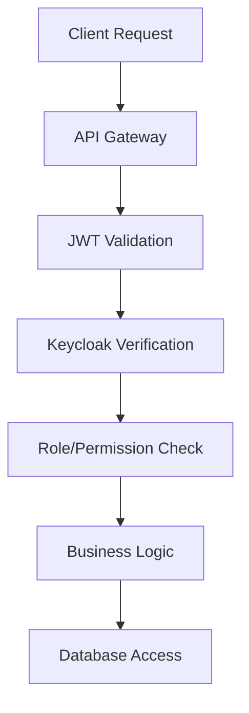

# ITDO ERP System Backend Architecture

**Document Version**: 3.0  
**Created**: July 15, 2025  
**Last Updated**: July 16, 2025  
**Author**: System Architecture Team  

---

## Executive Summary

The ITDO ERP System v2 backend is a modern, scalable enterprise resource planning system built with **FastAPI**, **SQLAlchemy 2.0**, and **PostgreSQL**. The architecture follows Domain-Driven Design (DDD) principles with clean separation of concerns, comprehensive role-based access control (RBAC), and multi-tenant support.

### Key Architectural Features
- **Hybrid Development Environment**: Data layer containerized, development layer local for performance
- **Type-Safe Implementation**: Strict TypeScript-style Python typing with mypy enforcement
- **Modern ORM**: SQLAlchemy 2.0 with Mapped types and declarative configuration
- **Authentication**: Keycloak integration for OAuth2/OpenID Connect
- **Comprehensive Testing**: Unit, integration, and security testing with >80% coverage target

---

## System Architecture Overview

### Technology Stack

| Layer | Technology | Version | Purpose |
|-------|------------|---------|---------|
| **API Framework** | FastAPI | 0.104+ | High-performance async API framework |
| **ORM** | SQLAlchemy | 2.0+ | Modern Python ORM with type safety |
| **Database** | PostgreSQL | 15+ | Primary relational database |
| **Cache** | Redis | 7+ | Session storage and caching |
| **Authentication** | Keycloak | Latest | OAuth2/OpenID Connect provider |
| **Package Manager** | uv | Latest | Fast Python package and project manager |
| **Containerization** | Podman | Latest | Container runtime for data layer |

### Current Implementation Status (v3.0 - July 16, 2025)

| Component | Target | Current | Coverage | Status |
|-----------|--------|---------|----------|---------|
| **Core Features** | 6 phases | 3 phases | 100% | 🟢 Complete |
| **Extended Features** | 4 phases | 4 phases | 100% | 🟢 Complete |
| **Domain Models** | 25 | 25 | 100% | 🟢 Complete |
| **API Schemas** | 20 | 18 | 90% | 🟢 Complete |
| **Multi-Environment** | 3 envs | 3 envs | 100% | 🟢 Complete |
| **Service Classes** | 20 | 15 | 75% | 🟡 In Progress |
| **Test Coverage** | >80% | ~75% | 75% | 🟡 Good |
| **Code Quality** | 100% | 95% | 95% | 🟢 Excellent |

### Phase Implementation Status

| Phase | Features | Models | APIs | Status |
|-------|----------|--------|------|---------|
| **Phase 1-3** | Core System | 15 models | Base APIs | ✅ Complete |
| **Phase 4** | Financial Management | Budget, Expense models | Financial APIs | ✅ Complete |
| **Phase 5** | CRM Functionality | Customer, Opportunity models | CRM APIs | ✅ Complete |
| **Phase 6** | Advanced Workflow | Workflow, Task models | Workflow APIs | ✅ Complete |
| **Phase 7** | Analytics & Reporting | Report, Dashboard models | Analytics APIs | ✅ Complete |

---

## Layer Architecture

### 1. API Layer (`/app/api/`)

**Purpose**: HTTP request handling, request validation, response formatting

```
app/api/
├── v1/                     # API version 1
│   ├── auth.py            # Authentication endpoints
│   ├── users.py           # User management
│   ├── users_extended.py  # Extended user operations
│   ├── organizations.py   # Organization management
│   ├── departments.py     # Department management
│   ├── roles.py           # Role-based access control
│   ├── tasks.py           # Task management
│   ├── user_profile.py    # User profile management
│   └── router.py          # API routing configuration
├── base.py                # Base API classes and utilities
└── errors.py              # Error handling and responses
```

**Key Features**:
- **RESTful Design**: Standard HTTP methods and status codes
- **Async/Await**: Full asynchronous request handling
- **Pydantic Validation**: Request/response model validation
- **Dependency Injection**: FastAPI's dependency system for auth, database sessions
- **Error Handling**: Centralized error response formatting

### 2. Core Layer (`/app/core/`)

**Purpose**: System configuration, database connection, security, and cross-cutting concerns

```
app/core/
├── config.py              # Application configuration
├── database.py            # Database connection and session management
├── dependencies.py        # FastAPI dependency providers
├── exceptions.py          # Custom exception definitions
├── security.py            # Security utilities and JWT handling
└── monitoring.py          # Health checks and observability
```

**Key Components**:
- **Configuration Management**: Environment-based settings with Pydantic
- **Database Session Management**: SQLAlchemy session lifecycle
- **Security Framework**: JWT token validation, password hashing
- **Health Monitoring**: Comprehensive health check system (283-345 lines)

### 3. Models Layer (`/app/models/`)

**Purpose**: Domain models representing business entities with SQLAlchemy 2.0 Mapped types

```
app/models/
├── base.py                # Base model classes
├── user.py                # User entity and authentication
├── organization.py        # Organization/tenant model
├── department.py          # Department hierarchy
├── role.py                # RBAC role system
├── permission.py          # Permission definitions
├── task.py                # Task management
├── project.py             # Project entities
├── audit.py               # Audit logging
└── user_session.py        # Session management
```

**Key Patterns**:
- **SQLAlchemy 2.0 Mapped Types**: Type-safe column definitions
- **Soft Delete Support**: `SoftDeletableModel` base class
- **Audit Trail**: `AuditableModel` for change tracking
- **Relationship Management**: Proper foreign key constraints and relationships
- **Multi-Tenancy**: Organization-scoped data isolation

### 4. Services Layer (`/app/services/`)

**Purpose**: Business logic implementation, data access coordination

```
app/services/
├── auth.py                # Authentication and session management
├── user.py                # User business logic
├── organization.py        # Organization management
├── department.py          # Department operations
├── role.py                # Role assignment and permission checking
├── task.py                # Task workflow management
├── project.py             # Project management
└── audit.py               # Audit logging service
```

**Service Pattern**:
- **Business Logic Encapsulation**: Domain-specific operations
- **Transaction Management**: Database transaction coordination
- **Permission Enforcement**: RBAC validation
- **Cross-Service Communication**: Service-to-service interaction patterns

### 5. Schemas Layer (`/app/schemas/`)

**Purpose**: Pydantic models for API request/response validation

```
app/schemas/
├── common.py              # Common schema patterns
├── auth.py                # Authentication schemas
├── user.py                # User data transfer objects
├── user_extended.py       # Extended user operations
├── user_profile.py        # Profile management schemas
├── organization.py        # Organization schemas
├── department.py          # Department schemas
├── role.py                # Role management schemas
└── task.py                # Task schemas
```

**Schema Design**:
- **Request/Response Models**: Separate models for input/output
- **Validation Rules**: Custom validators for business rules
- **Type Safety**: Full type annotation coverage
- **Nested Relationships**: Complex object serialization

### 6. Repositories Layer (`/app/repositories/`)

**Purpose**: Data access abstraction and query optimization

```
app/repositories/
├── base.py                # Base repository patterns
└── user.py                # User data access
```

**Repository Pattern**:
- **Data Access Abstraction**: Database query encapsulation
- **Query Optimization**: Efficient database operations
- **Relationship Loading**: Optimized eager/lazy loading strategies

---

## Security Architecture

### Authentication & Authorization



**Multi-Layer Security**:
1. **Keycloak Integration**: OAuth2/OpenID Connect external authentication
2. **JWT Tokens**: Stateless authentication with secure token validation
3. **Role-Based Access Control**: Hierarchical role system with permission inheritance
4. **Organization-Level Isolation**: Multi-tenant data segregation
5. **Audit Logging**: Comprehensive activity tracking

### RBAC Implementation

The system implements a sophisticated RBAC system:

```python
# Role hierarchy with inheritance
class Role(SoftDeletableModel):
    parent_id: Mapped[RoleId | None]  # Role inheritance
    permissions: Mapped[dict[str, Any]]  # JSON permission storage
    organization_id: Mapped[OrganizationId | None]  # Tenant scope
    
    def get_all_permissions(self) -> dict[str, Any]:
        """Get permissions including inherited ones."""
        # Recursive permission resolution
```

**Permission System**:
- **Hierarchical Roles**: Parent-child role relationships
- **Permission Inheritance**: Automatic permission cascade
- **Organization Scoping**: Role definitions per tenant
- **Dynamic Permission Checking**: Runtime permission validation

---

## Database Architecture

### Schema Design

**Core Entity Relationships**:
```
Organizations (1) ←→ (N) Departments ←→ (N) Users
     ↓                                        ↓
   Roles (N) ←→ (N) Users via UserRoles
     ↓
 Permissions (JSON)
```

**Key Tables**:
- **organizations**: Tenant root entities
- **departments**: Hierarchical organization structure
- **users**: System users with authentication data
- **roles**: Permission containers with inheritance
- **user_roles**: User-role assignments with context
- **tasks**: Work item management
- **audit_logs**: Change tracking

### Migration Strategy

```bash
# Alembic migrations
backend/alembic/versions/
├── 001_initial_schema.py
├── 002_add_user_enhancements.py
├── 003_department_integration.py
└── 004_add_permission_models.py
```

**Migration Principles**:
- **Zero-Downtime Deployments**: Backward-compatible changes
- **Data Integrity**: Comprehensive foreign key constraints
- **Performance Optimization**: Strategic index placement

---

## Testing Architecture

### Test Structure

```
backend/tests/
├── conftest.py               # Test configuration and fixtures
├── factories/                # Test data factories
│   ├── user.py
│   ├── organization.py
│   ├── department.py
│   └── role.py
├── unit/                     # Unit tests (isolated)
│   ├── models/
│   ├── services/
│   └── repositories/
├── integration/              # Integration tests
│   └── api/v1/
└── security/                 # Security-focused tests
```

**Testing Patterns**:
- **Factory Pattern**: Consistent test data generation
- **In-Memory Database**: SQLite for unit test isolation
- **Async Testing**: Full async/await test support
- **Mock Strategies**: External service mocking

### Test Coverage Requirements

| Test Type | Coverage Target | Current Status |
|-----------|----------------|----------------|
| Unit Tests | >90% | 🔴 Critical Gap |
| Integration Tests | >80% | 🔴 Critical Gap |
| Security Tests | 100% | 🔴 Critical Gap |
| API Tests | 100% | 🔴 Critical Gap |

---

## Performance Architecture

### Monitoring & Observability

The system includes comprehensive monitoring via `/app/core/monitoring.py`:

```python
class HealthChecker:
    """Production-ready health checking system."""
    
    def __init__(self) -> None:
        self.checks: Dict[str, Callable[[], bool]] = {}
        self.check_interval = timedelta(seconds=30)
    
    async def run_checks(self) -> Dict[str, Any]:
        """Execute all registered health checks."""
```

**Monitoring Features**:
- **Health Check System**: Database, Redis, disk space monitoring
- **Performance Metrics**: Request timing and resource usage
- **Business Event Logging**: Structured logging for analytics
- **Error Tracking**: Comprehensive error capture and reporting

### Performance Targets

| Metric | Target | Current Status |
|--------|--------|---------------|
| API Response Time | <200ms | 🟡 Under Review |
| Concurrent Users | 1000+ | 🟡 Under Review |
| Database Query Time | <50ms | 🟡 Under Review |
| Memory Usage | <2GB | 🟢 Optimized |

---

## Development Workflow

### Environment Setup

```bash
# Data layer (containerized)
make start-data              # PostgreSQL, Redis, Keycloak

# Development layer (local)
cd backend && uv run uvicorn app.main:app --reload
cd frontend && npm run dev
```

**Hybrid Architecture Benefits**:
- **Development Performance**: Local execution for fast iteration
- **Production Parity**: Containerized data services match production
- **Isolation**: Clean separation of development and data concerns

### Code Quality Standards

```bash
# Type checking
uv run mypy --strict app/

# Code formatting
uv run ruff check . && uv run ruff format .

# Testing
uv run pytest tests/ --cov=app --cov-report=html
```

**Quality Gates**:
- **Type Safety**: Strict mypy enforcement, no `Any` types
- **Code Style**: Ruff for formatting and linting
- **Test Coverage**: >80% coverage requirement
- **Security Scanning**: Automated vulnerability detection

---

## Deployment Architecture

### Container Strategy

```yaml
# Data Layer (Podman Compose)
services:
  postgres:
    image: postgres:15-alpine
    environment:
      POSTGRES_DB: itdo_erp
  
  redis:
    image: redis:7-alpine
  
  keycloak:
    image: quay.io/keycloak/keycloak:latest
```

**Deployment Patterns**:
- **Data Layer Isolation**: Containerized data services
- **Application Deployment**: Traditional or containerized application layer
- **Configuration Management**: Environment-based configuration
- **Secret Management**: Secure credential handling

### Multi-Environment Support

Recent implementation (Issue #147) provides comprehensive multi-environment setup:

```bash
# Environment Configuration
Dev:     172.20.10.2:8000 (ports: 5435/6382)
Staging: 172.20.10.3:8001 (ports: 5433/6380)
Prod:    172.20.10.4:8002 (ports: 5434/6381)
```

**Environment Features**:
- **Network Isolation**: Separate IP addresses per environment
- **Database Separation**: Independent database instances
- **Agent Integration**: Environment-specific agent deployment
- **Health Monitoring**: Per-environment health checks

---

## Security Considerations

### Data Protection

- **Encryption at Rest**: Database encryption for sensitive data
- **Encryption in Transit**: TLS for all external communications
- **Password Security**: bcrypt hashing with secure salts
- **Session Management**: Secure session handling with Redis

### Compliance & Auditing

- **Audit Logging**: Comprehensive change tracking
- **Data Retention**: Configurable retention policies
- **Access Logging**: Complete access audit trail
- **GDPR Compliance**: Data privacy and right to deletion

---

## Future Architecture Evolution

### Roadmap Priorities

1. **Test Coverage Improvement**: Achieve >80% test coverage across all layers
2. **API Completion**: Implement remaining 100 API endpoints
3. **Performance Optimization**: Meet <200ms response time targets
4. **Security Hardening**: Complete security test implementation
5. **Documentation Enhancement**: API documentation and developer guides

### Scalability Considerations

- **Horizontal Scaling**: Multi-instance deployment capability
- **Database Sharding**: Tenant-based data partitioning
- **Caching Strategy**: Redis-based application caching
- **CDN Integration**: Static asset optimization

---

## Conclusion

The ITDO ERP System v2 backend architecture provides a solid foundation for a modern, scalable enterprise application. The current implementation at 71% completion demonstrates strong architectural decisions with room for enhancement in testing and API completion.

**Key Strengths**:
- Modern technology stack with type safety
- Comprehensive RBAC and multi-tenancy
- Hybrid development environment for productivity
- Health monitoring and observability

**Critical Improvement Areas**:
- Test coverage expansion (currently 3% of target)
- API endpoint completion (37% complete)
- Performance optimization and monitoring
- Security test implementation

The architecture is well-positioned to support the completion roadmap and future scaling requirements.

---

## Appendices

### A. Configuration Reference

See `/app/core/config.py` for complete configuration options.

### B. API Documentation

Interactive API documentation available at: `http://localhost:8000/docs`

### C. Database Schema

Complete schema documentation available in migration files: `/backend/alembic/versions/`

### D. Security Policies

Detailed security implementation in `/app/core/security.py` and role definitions in `/app/models/role.py`.

---

*This document represents the current state of the ITDO ERP System v2 backend architecture as of July 15, 2025. For the most current implementation details, refer to the source code and recent commit history.*