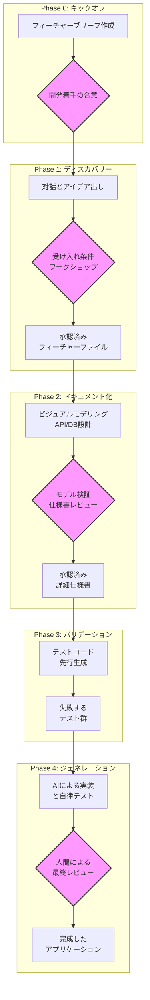

# **【実践ガイド】仕様駆動AI開発（SDAD）ワークフロー v2.5 完全版**

## **1\. このガイドブックが目指すもの (主旨と意義)**

現代のソフトウェア開発は、かつてないスピードと品質を両立させることを求められています。生成AIの登場は、この課題を解決する強力な武器となりますが、その力を無計画に使うことは、意図しない方向に進む「AIの暴走」を招きかねません。

\*\*仕様駆動AI開発（SDAD）\*\*は、この課題を解決するための新しい開発フレームワークです。

この手法の核心は、\*\*「人間が『なぜ』と『何を』を定義し、AIが『どうやって』を実装する」\*\*という明確な役割分担にあります。私たちは、開発の初期段階で「何を作るべきか」についての対話を重視し、その合意内容を「実行可能な仕様書」として形式化します。この仕様書が、AIが越えるべき「テストの壁」となり、開発プロセス全体のブレない北極星として機能します。

このガイドブックは、あなたのチームがAIを単なるコーディングツールとしてではなく、**ビジネス価値を最大化するための信頼できるパートナー**として活用するための、具体的な航海図です。SDADを実践することで、手戻りを減らし、品質を向上させ、開発チーム全員が自信を持って高速に価値を届けられるようになります。

## **2\. 【拡充】プロジェクトの開始（フェーズ0：キックオフ）**

本格的な開発（フェーズ1）に入る前に、プロジェクトの土台となる「なぜ作るのか」を明確にします。

### **ガイドライン**

* POは、新しい機能や改善のアイデアが生まれたら、まず「フィーチャーブリーフ」を作成します。  
* このブリーフを基に、DevとQAのリーダーと共有し、開発に着手する価値があるか、前提条件は揃っているかを確認します。

### **テンプレート：フィーチャーブリーフ**

<details>
<summary><strong>フィーチャーブリーフのひな形</strong></summary>

# フィーチャーブリーフ: [機能の名称]

## 1. 目的と背景 (Why)
- **解決したい課題**: [どのようなユーザーの、どのような課題を解決するのか]
- **ビジネス価値**: [課題解決により、どのようなビジネス上のメリット（売上向上、コスト削減など）が期待できるか]
- **成功の測定指標 (KPI)**: [この機能の成功をどのように測定するか（例: プロフィール更新率20%向上）]

## 2. 機能概要 (What)
- [実現したい機能の概要を簡潔に記述]

## 3. スコープ
- **スコープ内 (In Scope)**: [今回開発する範囲を明確に記述]
- **スコープ外 (Out of Scope)**: [今回は開発しない範囲を明確に記述]

## 4. 主要な関係者 (Stakeholders)
- **プロダクトオーナー**: [氏名]
- **開発リード**: [氏名]
- **QAリード**: [氏名]

</details>

## **3\. SDADの全体像とフェーズ**

開発は以下の4つのフェーズを順番に進めます。各フェーズは明確な目的と成果物を持ち、前のフェーズの成果物が次のフェーズの入力となります。



## **4\. 人間とAIエージェントの協業モデル**

SDADの成功は、人間とAIの明確な役割分担にかかっています。このモデルは「誰が、何に責任を持つのか」を定義します。

### **基本原則**

**人間は「司令塔」として意思決定と最終判断に責任を持ち、AIは「超優秀な実行部隊」として与えられた明確な指示を忠実に実行します。**

| 領域／活動 | 人間の役割 (意思決定者) | AIエージェントの役割 (実行者) |
| :---- | :---- | :---- |
| **戦略・目的 (Why)** | **【主導】** ビジネス上の目的、機能の価値、開発の優先順位を**決定**する。「なぜこれを作るのか」という問いに答える。 | **【支援】** 市場データや過去の議論を分析し、意思決定のための情報や選択肢を**提示**する。 |
| **仕様定義 (What)** | **【主導】** 対話を通じて「何を作るか」を議論し、最終的な振る舞い（受け入れ条件）を**承認**する。曖昧さを排除し、合意形成をリードする。 | **【実行】** 人間の対話を基に、フィーチャーファイルの草案やエッジケースのリストを**生成**する。仕様のたたき台を提供する。 |
| **設計 (Design)** | **【承認】** AIが生成したアーキテクチャ設計、API仕様、データモデルをレビューし、技術的な妥当性と将来性を**判断**し、**承認**する。 | **【実行】** 承認された仕様に基づき、技術仕様書、ビジュアルモデル（状態遷移図など）、API定義のドラフトを**生成**する。 |
| **実装 (Implementation)** | **【監督】** AIエージェントの進捗を監視する。実装そのものには**原則として関与しない**。 | **【主導】** 承認された仕様書と失敗するテスト群に基づき、アプリケーションコードを**自律的に生成・修正**する。 |
| **テスト (Testing)** | **【定義・承認】** 「何をもって成功とするか」というテストの**基準（受け入れ条件）を定義・承認**する。異常系や境界値のテスト観点を**指示**する。 | **【主導】** 指示されたテスト観点に基づき、テストコードを**網羅的に生成**する。生成したコードに対し、テストを**自動で実行**し、失敗すれば自己修正する。 |
| **レビュー (Review)** | **【主導】** AIによる一次レビューの結果を踏まえ、ビジネスロジックの妥当性、コードの保守性、セキュリティに関する**最終的な品質を判断**し、**承認**する。 | **【実行】** 生成したコードに対し、静的解析、既知の脆弱性チェック、コーディング規約の遵守といった**一次レビューを自動で実行**し、レポートする。 |
| **変更管理 (Change Mgmt)** | **【主導】** 変更要求の必要性を**判断**し、受け入れるかどうかを**決定**する。変更プロセスを開始する権限を持つ。 | **【実行】** 変更要求の内容を基に、影響を受ける仕様書、テスト、コードの範囲を**分析**し、レポートする。 |
| **継続的改善 (Kaizen)** | **【主導】** プロセス全体の振り返りを**主催**し、得られた知見からガイドブックやルールの改善点を**決定**する。 | **【支援】** 各フェーズの実行時間や手戻りの発生回数などのデータを**集計・可視化**し、改善のための分析材料を提供する。 |

## **5\. AIとの連携プロトコル**

人間とAI間のコミュニケーションエラーを防ぎ、作業の正確性を担保するためのルールを定めます。

### **5.1. タスク依頼の形式：「タスクパケット」**

人間からAIへの作業依頼は、必ず以下の要素を含む「タスクパケット」として渡します。これにより、AIが使用する情報源とゴールが明確になります。

<details>
<summary><strong>タスクパケットのテンプレート</strong></summary>

# タスクパケット

## Task ID
- `[プロジェクト名]-[機能名]-[タスク内容]-[日付]`
- 例: `PROJ-X-Profile-GenerateTests-20250728`

## 入力成果物 (Input Artifacts)
- **目的**: AIが参照すべき「唯一の正」となる情報を指定する。
- **例**:
  - `仕様書: /docs/profile_spec_v1.1.md`
  - `フィーチャーファイル: /features/profile.feature (承認済み)`

## 指示 (Instructions)
- **目的**: AIに実行させたいタスクを具体的に記述する。
- **例**: `添付の仕様書とフィーチャーファイルに基づき、JestとPlaywrightを使用したテストコードを生成してください。`

## 【拡充】非機能要件 (Non-Functional Requirements)
- **目的**: 機能的な振る舞い以外の品質要件を明確に指示する。
- **例**:
  - `パフォーマンス: APIレスポンスは99パーセンタイルで200ms以内`
  - `セキュリティ: OWASP Top 10の脆弱性が存在しないこと`
  - `アクセシビリティ: WCAG 2.1 AAレベルに準拠すること`

## 完了の定義 (Definition of Done - DoD)
- **目的**: タスクの完了条件を明確に定義する。
- **例**:
  - `[ ] 全てのシナリオに対応するテストファイルが生成されている。`
  - `[ ] 生成されたテストは、実行すると全て失敗する。`
  - `[ ] コードにはJSDoc形式のコメントが付与されている。`

</details>

### **5.2. 完了報告とエスカレーション**

AIはタスク完了時、または自力で解決できない問題に直面した際に、以下の形式で人間に報告します。

<details>
<summary><strong>完了報告のテンプレート</strong></summary>
# 完了報告

## Task ID
- `PROJ-X-Profile-GenerateTests-20250728`

## ステータス
- **完了**

## 出力成果物 (Output Artifacts)
- `tests/profile.spec.js`
- `tests/e2e/profile.spec.js`

## 実行ログ
- `[実行したコマンドや処理の概要]`

## DoD自己評価
- [x] 全てのシナリオに対応するテストファイルが生成されている。
- [x] 生成されたテストは、実行すると全て失敗する。
- [x] コードにはJSDoc形式のコメントが付与されている。

</details>

<details>
<summary><strong>エスカレーション報告のテンプレート</strong></summary>

# エスカレーション報告

## Task ID
- `PROJ-X-Profile-ImplementLogic-20250729`

## ステータス
- **ブロック**

## 問題の概要
- `テストケース 'user_lockout' が、3回連続で同じエラーにより失敗しました。自己修正を試みましたが解決できません。`

## エラーログ
- `[関連するエラーメッセージやスタックトレース]`

## 提案
- `仕様書における「アカウントロック時のAPIレスポンス」の定義が曖昧である可能性があります。仕様の明確化を要求します。`

</details>

## **6\. 各フェーズの詳細ガイドラインとテンプレート**

*(このセクションのテンプレート詳細は、前のバージョンと同様のため省略します。)*

## **7\. 【拡充】レビューと承認の品質ゲート**

各フェーズの「承認」を形骸化させないため、具体的なチェックリストに基づいた品質ゲートを設けます。

<details>
<summary><strong>品質ゲート1: 仕様書レビュー チェックリスト</strong></summary>

対象: Phase 2で作成された「詳細仕様書」  
レビュワー: PO, Dev, QA

* **[PO] 価値の確認**
  * [ ] 仕様はフィーチャーブリーフの目的と合致しているか？
  * [ ] ビジネスルールに誤解や不足はないか？
* **[QA] 網羅性の確認**
  * [ ] 全てのフィーチャーファイルのシナリオが仕様書に反映されているか？
  * [ ] ビジュアルモデルでエッジケースや異常系が考慮されているか？
* **[Dev] 実現性の確認**
  * [ ] 提案されたアーキテクチャに大きな技術的リスクはないか？
  * [ ] API設計やデータモデルはスケーラビリティを考慮しているか？
* **[全員] 明確性の確認**
  * [ ] 曖昧な表現や、複数の解釈ができる記述はないか？
  * [ ] この仕様書だけで、AIが迷わず実装できるレベルか？

</details>

\<details\>  
\<summary\>\<strong\>品質ゲート2: コードレビュー チェックリスト\</strong\>\</summary\>  
対象: Phase 4でAIが生成し、テストをパスしたコード  
レビュワー: Dev, QA

* **\[Dev\] 保守性と設計の確認**  
  * \[ \] コードはリーダブルで、命名規則に従っているか？  
  * \[ \] 過度に複雑なロジックや、いわゆる「スパゲッティコード」になっていないか？  
  * \[ \] アーキテクチャや設計原則（例: SOLID原則）から逸脱していないか？  
  * \[ \] 設定値や秘密情報がハードコーディングされていないか？  
* **\[QA\] テスト品質の確認**  
  * \[ \] テストは仕様を正しく反映しており、信頼できるか？  
  * \[ \] テストカバレッジは十分か？（AIにカバレッジレポートを生成させる）  
* **\[全員\] 非機能要件の確認**  
  * \[ \] パフォーマンス要件を満たしているか？（AIに簡単な負荷テストを実行させる）  
  * \[ \] セキュリティスキャン（AIによる一次レビュー）の結果に問題はないか？

\</details\>

## **8\. 変更管理プロセス (Handling Changes)**

*(このセクションの詳細は、前のバージョンと同様のため省略します。)*

## **9\. AIとの対話のベストプラクティス**

*(このセクションの詳細は、前のバージョンと同様のため省略します。)*

## **10\. 継続的改善 (Kaizen) とフィードバックループ**

*(このセクションの詳細は、前のバージョンと同様のため省略します。)*

## **11\. 【拡充】成果物のディレクトリ構造（例）**

プロジェクト内の成果物を体系的に管理するためのディレクトリ構造の例です。

```
[project-root]/
├── .github/              # CI/CDワークフロー, PRテンプレート
├── docs/
│   └── [feature-name]/
│       ├── feature_brief_v1.0.md      # フェーズ0の成果物
│       ├── spec_v1.0.md               # フェーズ2の成果物
│       └── model_v1.0.mermaid         # フェーズ2の成果物
├── features/
│   └── [feature-name].feature         # フェーズ1の成果物
├── src/
│   ├── api/
│   └── components/                    # フェーズ4の成果物
└── tests/
    ├── unit/
    └── e2e/                           # フェーズ3の成果物
```

## **12\. 推奨ツールスタック例**

*(このセクションの詳細は、前のバージョンと同様のため省略します。)*

## **13\. FAQ（よくある質問）**

*(このセクションの詳細は、前のバージョンと同様のため省略します。)*