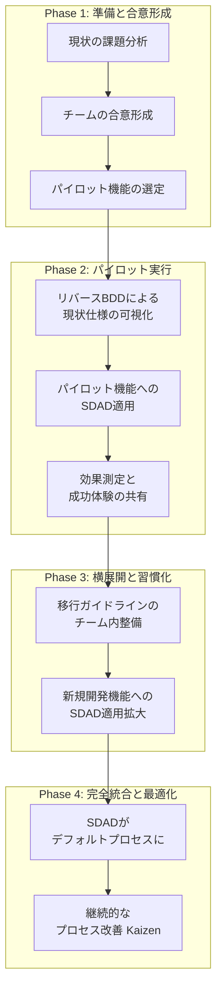

# **【実践ガイド】既存プロジェクトのSDAD移行戦略**

## **1\. はじめに：このガイドの目的**

このドキュメントは、現在進行中のソフトウェア開発プロジェクトに、\*\*仕様駆動AI開発（SDAD）\*\*ワークフローを段階的かつ現実的に導入するための戦略ガイドです。

既存のプロジェクトへの新手法の導入は、大きな挑戦を伴います。このガイドは、「すべてを一度に変える」というリスクの高いアプローチではなく、\*\*「小さく始めて、価値を証明し、徐々に広げる」\*\*ことで、開発の勢いを維持しつつ、チームの混乱を最小限に抑えながら移行を成功させることを目的とします。

## **2\. 移行の基本原則**

* **完璧を目指さない (Don't Boil the Ocean)**: 最初からプロジェクト全体をSDAD化しようとしないでください。まずは1つの小さな機能から始めます。  
* **価値を素早く示す (Show Value Quickly)**: パイロットプロジェクトで「手戻りが減った」「仕様の認識齟齬がなくなった」といった具体的な成功体験を作り、チームのモチベーションを高めます。  
* **漸進的に進める (Incremental Adoption)**: 「これから触る部分からSDAD化する」を基本方針とし、レガシーコードの大きなリファクタリングは、それが必要になったタイミングで行います。  
* **対話を重視する (Foster Communication)**: なぜこの変革を行うのか、それによってチームがどう楽になるのかを丁寧に説明し、不安や抵抗感を和らげます。

## **3\. 移行フェーズ戦略**

移行プロセスを、具体的で管理可能な4つのフェーズに分割します。

### **Phase 1: 準備と合意形成 (1〜2週間)**

**目的**: 移行の土台を整え、チームの方向性を合わせる。

1. **現状の課題分析**:  
   * 「仕様変更による手戻りが多い」「リグレッションバグが頻発する」「ドキュメントが古くて誰も信じていない」など、現在の開発プロセスにおける具体的な課題（ペインポイント）を洗い出します。  
2. **チームの合意形成**:  
   * 洗い出した課題を提示し、SDADがその解決策になり得ることをチームに説明します。あくまで「新しい武器」であり、チームを楽にするための試みであることを強調します。  
3. **パイロット機能の選定**:  
   * 最初のターゲットとして、以下のいずれかに該当する小規模な機能を選びます。  
     * **これから開発する新機能**（最も理想的）  
     * **バグが多く、仕様が不安定な既存機能**（改善効果を示しやすい）  
     * **仕様が複雑で、認識齟齬が起きやすい既存機能**

### **Phase 2: パイロット実行 (2〜4週間)**

**目的**: 小さな範囲でSDADを実践し、その価値を具体的に証明する。

1. **「リバースBDD」による現状仕様の可視化**:  
   * **アクション**: パイロット対象が既存機能の場合、まずその**ソースコードをAIに読み込ませ、「このコードの振る舞いをGherkin形式で記述して」と依頼します。**  
   * **効果**: これまで暗黙知だった現行仕様がフィーチャーファイルとして可視化され、チームの共通認識のベースラインができます。この過程で、意図しない挙動（隠れバグ）が発見されることもあります。  
2. **パイロット機能へのSDAD適用**:  
   * 新規・改修する仕様をフィーチャーファイルとして記述し、「受け入れ条件ワークショップ」で合意します。  
   * その後、SDADガイドブックに従い、「ドキュメント化 → バリデーション → ジェネレーション」のサイクルを回します。  
3. **効果測定と成功体験の共有**:  
   * パイロット完了後、チームで振り返りを行います。  
   * **定性的効果**（「仕様確認のミーティングが半減した」「バグへの不安が減った」）と**定量的効果**（バグ修正工数の削減率、手戻り件数の変化など）の両面から成果を共有し、チーム内に「このやり方は良いかもしれない」という雰囲気を作ります。

### **Phase 3: 横展開と習慣化 (1〜3ヶ月)**

**目的**: パイロットの成功を受け、SDADをチームの標準的な開発プロセスの一部として定着させる。

1. **移行ガイドラインのチーム内整備**:  
   * パイロットの経験を元に、「私たちのチームでは、フィーチャーファイルはこの粒度で書こう」「API仕様書にはこの項目を必須としよう」といった、チーム独自のルールを整備します。  
2. **新規開発機能へのSDAD適用拡大**:  
   * \*\*「これから開発する全ての新機能はSDADプロセスに従う」\*\*というルールを導入します。  
   * 既存機能の改修については、改修範囲が大きい場合にSDADを適用するなど、徐々に範囲を広げます。

### **Phase 4: 完全統合と最適化 (継続的)**

**目的**: SDADがチームのデフォルトの開発プロセスとなり、継続的に改善される状態を作る。

1. **SDADがデフォルトプロセスに**:  
   * チームメンバー全員が自然にSDADの各フェーズを意識し、実践できるようになります。  
2. **継続的なプロセス改善 (Kaizen)**:  
   * プロジェクトの振り返り（レトロスペクティブ）で、「AIへのプロンプトをもっと工夫できないか」「レビューのチェックリストを更新しよう」といった改善案を出し合い、チームのガイドブックを常に最新の状態に保ちます。

## **4\. 【NEW】移行を成功させるための体制と準備**

スムーズな移行のためには、事前の体制構築と準備が不可欠です。

### **移行推進チーム（Transition Team）**

* **SDADチャンピオン**: この変革を主導する熱意のある人物（1〜2名）。プロセスの学習、チームへの啓蒙、パイロットプロジェクトの推進役を担います。  
* **技術サポート**: AIツールやCI/CDのセットアップを担当するエンジニア。

### **トレーニング計画**

* **Gherkin記法**: チーム全員が「What, not How」の原則に基づいたシナリオを書けるように、簡単な勉強会を実施します。  
* **AIプロンプトエンジニアリング**: 「AIとの対話のベストプラクティス」を共有し、効果的な指示の出し方を学びます。  
* **新ツールのハンズオン**: Mermaidや新しいテストフレームワークなど、導入するツールの基本的な使い方を全員で確認します。

### **コミュニケーション計画**

* 週次の定例会などで、移行の進捗、成功事例、困っていることを共有する場を設けます。  
* Slackなどに専用チャンネルを作り、気軽に質問や意見交換ができるようにします。

## **5\. 【NEW】移行におけるリスク管理**

予期せぬ問題に備え、事前にリスクを洗い出し、対策を検討します。

### **よくある落とし穴（アンチパターン）**

* **AIへの過信**: AIの生成物をレビューなしで信じてしまい、品質が低下する。  
* **形式主義**: プロセスを遵守すること自体が目的化し、本来の「対話による品質向上」が疎かになる。  
* **ツールの摩擦**: 新しいツールの導入や設定に手間取り、開発の勢いが削がれる。

### **リスクチェックリスト**

移行を開始する前に、チームで以下の点を確認します。

* \[ \] パイロットプロジェクトのスコープは十分に小さいか？  
* \[ \] 失敗した場合の影響は許容範囲内か？  
* \[ \] チームメンバーは移行の目的とメリットを理解しているか？  
* \[ \] 必要なツールやアカウントの準備は整っているか？

## **6\. 【NEW】ツールと環境の準備**

SDADを実践するための具体的な環境を整備します。

* **AIツールのセットアップ**: チームで利用するAI（Gemini, Claudeなど）のアカウントを準備し、セキュリティポリシーを確認します。効果的なプロンプトのテンプレート集を共有リポジトリなどで管理します。  
* **リポジトリ構造**: 既存のコードベースに、SDADの成果物（/docs, /featuresなど）を格納するためのディレクトリを追加します。  
* **CI/CDパイプラインの調整**: Gherkinベースのテスト（受け入れテスト）を自動実行できるよう、CI/CDの設定を更新します。テスト失敗時には、関連する担当者に通知が飛ぶように設定します。

## **7\. 既存資産の活用戦略：既存の仕様書とコードをSDADに変換する**

SDADへの移行は、ゼロから始める必要はありません。既存のドキュメントやコードは、AIの助けを借りてSDADのプロセスに乗せるための貴重な「資産」となります。

### **前提となる既存資産**

この戦略では、多くのプロジェクトに存在する以下のような資産を想定しています。

* **仕様書**: Word, Excel, PowerPoint, Markdownなどで記述された機能仕様書、設計書、画面キャプチャなど。  
* **ソースコード**: コメントを含む、現在稼働しているアプリケーションのコード。  
* **テストコード**: JUnit, RSpec, Jestなどで書かれた既存の単体テストや結合テストコード。

### **変換プロセス**

#### **1\. 仕様書から「フィーチャーファイル」へ**

* **目的**: 形式が統一されていない自然言語の仕様書を、構造化されたGherkin形式に変換し、チームの共通言語とAIへの正確なインプットを作成する。  
* **方法**:  
  1. 既存の仕様書（Word, Excelなど）の内容をテキストとしてコピーします。  
  2. AI（特に文章の解釈が得意なClaude）に渡し、ユーザーの視点での振る舞いをシナリオとして抽出させます。  
* **プロンプト例 (Claudeへ)**:  
  あなたは経験豊富なビジネスアナリストです。添付した既存の仕様書の内容を解釈し、ユーザーの振る舞いに焦点を当てたBDDのGherkinシナリオを作成してください。

  仕様書から、以下の情報を読み取ってください。  
  \- 機能の目的  
  \- 前提条件 (Given)  
  \- ユーザーの操作 (When)  
  \- 期待される結果 (Then)

  仕様が曖昧な点や、複数の解釈ができる点があれば、その旨を指摘してください。

  \---  
  \[ここに既存の仕様書からコピーしたテキストを貼り付け\]  
  \---

#### **2\. ソースコードから「仕様」と「テスト」へ (リバースBDDの深化)**

* **目的**: コードの中にしか存在しない暗黙のロジックや、コメントに書かれた仕様を掘り起こし、可視化されたドキュメントとリグレッションテストの土台を作成する。  
* **方法**:  
  1. 対象となる機能のソースコード（例: ProfileController.java）をAI（特にコード解析能力が高いGemini）にインプットします。  
  2. コードの振る舞いを説明するGherkinシナリオと、その機能を検証するためのユニットテストコードを同時に生成させます。  
* **プロンプト例 (Geminiへ)**:  
  あなたは熟練のソフトウェアエンジニアです。添付したソースコードを解析し、以下の2つの成果物を生成してください。

  1\.  \*\*Gherkinフィーチャーファイル\*\*: このコードが実現しているビジネス上の振る舞いを、エンドユーザー視点のシナリオとして記述してください。  
  2\.  \*\*ユニットテストコード\*\*: このコードの各publicメソッドのロジックを検証するための、JUnit5に基づいたユニットテストコードを生成してください。カバレッジを意識し、正常系と異常系の両方を考慮してください。

  \---  
  \[ここに対象のソースコードを貼り付け\]  
  \---

#### **3\. テストコードから「振る舞いのシナリオ」へ**

* **目的**: 開発者目線で書かれた既存のテストコードを、ビジネスサイドも理解できる「振る舞いの記述（Gherkinシナリオ）」に翻訳する。これにより、テストが何を保証しているのかが明確になります。  
* **方法**:  
  1. 既存のテストコード（例: test\_profile\_update.py）をAIにインプTプットします。  
  2. テストコード内の各テストケース（test\_update\_with\_valid\_emailなど）が、どのようなユーザーシナリオを検証しているのかを解釈させ、Gherkin形式で記述させます。  
* **プロンプト例 (Claudeへ)**:  
  あなたは優秀なQAエンジニアです。添付したPythonのテストコードを読み解き、各テストケースがどのようなユーザーの振る舞いを検証しているのかを分析してください。  
  そして、その内容をビジネス担当者にも理解できるよう、Gherkin形式のシナリオとして記述してください。

  テストメソッド名やアサーションの内容から、Given-When-Thenを推測してください。

  \---  
  \[ここに既存のテストコードを貼り付け\]  
  \---

## **8\. よくある質問 (FAQ)**

Q1. レガシーコードはどう扱えば良いですか？  
A1. 無理に全てをSDAD化する必要はありません。「ストラングラーパターン（絞め殺しパターン）」のように、新しい機能はSDADで開発し、既存のレガシーコードは改修の必要が出た際に、その部分だけをSDADプロセスに則ってリファクタリングし、徐々に置き換えていくのが現実的です。  
Q2. チーム内に抵抗感がある場合はどうすれば良いですか？  
A2. まずは意欲のある数人のメンバーでパイロットを始めるのが効果的です。そこで具体的な成功事例（動くソフトウェアと、楽になったという事実）を示すことで、他のメンバーの理解を得やすくなります。トップダウンでの強制ではなく、現場からの自発的な採用を促すことが重要です。  
Q3. 開発スピードが一時的に落ちませんか？  
A3. 新しいプロセスに慣れるまでの短期間、スピードが落ちる可能性はあります。しかし、仕様の手戻りやバグ修正に費やしていた時間が大幅に削減されるため、中長期的には開発サイクル全体のスピードは向上します。その点をチームに説明し、初期の学習期間は投資であるという共通認識を持つことが大切です。