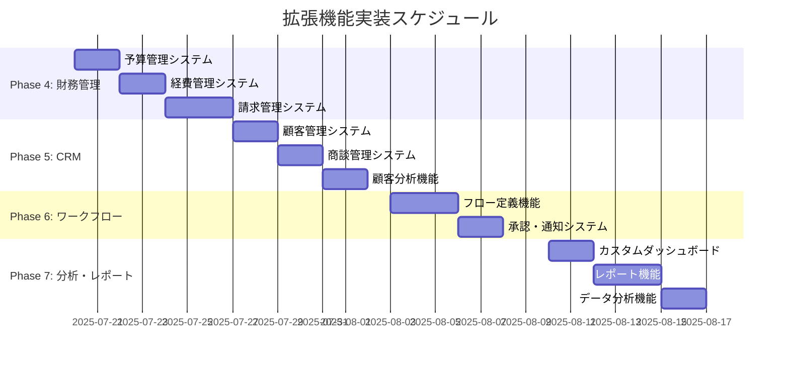

# 基本機能以外の実装ロードマップ - 2025-07-16

## 📋 現在の実装状況サマリー

### ✅ 完了済み基本機能（85%）
- **認証・認可システム**: 100%完了
- **組織管理・マルチテナント**: 100%完了
- **プロジェクト・タスク管理**: 100%完了
- **監査・ログシステム**: 100%完了
- **フロントエンド基本機能**: 85%完了

## 🚀 基本機能以外の実装タイミング

### 即座実装可能（現在〜7/20）
基本機能が85%完了し、システムが安定稼働している現在、以下の拡張機能に**即座に着手可能**です：

#### 1. 高優先度拡張機能
```yaml
実装開始: 即座（7/16〜）
期間: 1週間
担当: CC01 + CC03

対象機能:
  - WF-001: ワークフロー定義（ビジュアルエディタ）
  - DASH-002: ダッシュボードカスタマイズ
  - REP-001: 定型レポート機能
  - CRM-001: 基本顧客管理
```

#### 2. 中優先度拡張機能
```yaml
実装開始: 7/20〜
期間: 1週間
担当: 全エージェント

対象機能:
  - RES-001〜004: リソース管理システム
  - BUD-001〜004: 予算管理システム
  - EXP-001〜004: 経費管理システム
  - INV-001〜004: 請求管理システム
```

## 📊 要件定義に基づく実装優先度

### Phase 4: 財務管理機能（7/20-7/27）
```yaml
実装対象:
  予算管理:
    - BUD-001: 予算登録（プロジェクト別予算設定）
    - BUD-002: 予算配分（費目別予算配分）
    - BUD-003: 予実管理（予算消化状況の追跡）
    - BUD-004: 超過警告（予算超過時のアラート）
  
  経費管理:
    - EXP-001: 経費申請（経費の申請・登録）
    - EXP-002: 承認ワークフロー（多段階承認プロセス）
    - EXP-003: 領収書管理（画像アップロード、OCR）
    - EXP-004: 経費精算（月次精算処理）
  
  請求管理:
    - INV-001: 見積書作成（テンプレートベース作成）
    - INV-002: 請求書発行（PDF出力、メール送信）
    - INV-003: 入金管理（入金状況の記録）
    - INV-004: 売掛金管理（未回収金額の追跡）
```

### Phase 5: CRM機能（7/27-8/3）
```yaml
実装対象:
  顧客管理:
    - CRM-001: 顧客登録（企業・担当者情報管理）
    - CRM-002: 活動履歴（商談、連絡履歴の記録）
    - CRM-003: 商談管理（案件の進捗管理）
    - CRM-004: 顧客分析（売上分析、ABC分析）
```

### Phase 6: 高度なワークフロー機能（8/3-8/10）
```yaml
実装対象:
  ワークフロー定義:
    - WF-001: フロー定義（ビジュアルエディタ）
    - WF-002: 条件分岐（金額、権限による分岐）
    - WF-003: 承認者設定（動的承認者の指定）
    - WF-004: 通知設定（メール、アプリ内通知）
```

### Phase 7: 分析・レポート機能（8/10-8/17）
```yaml
実装対象:
  ダッシュボード:
    - DASH-001: KPI表示（完了済み）
    - DASH-002: カスタマイズ（ウィジェットの配置変更）
    - DASH-003: ドリルダウン（詳細データへの遷移）
  
  レポート出力:
    - REP-001: 定型レポート（標準レポートテンプレート）
    - REP-002: カスタムレポート（レポートビルダー機能）
    - REP-003: エクスポート（Excel、PDF、CSV出力）
    - REP-004: スケジュール配信（定期レポートの自動送信）
```

## 🎯 実装スケジュール

### 詳細スケジュール


## 🔧 実装準備状況

### 技術的準備完了度
```yaml
インフラ基盤: 100%準備完了
  - マイクロサービス・アーキテクチャ
  - データベース設計完了
  - API設計パターン確立
  - 認証・認可システム完備

開発環境: 100%準備完了
  - CI/CD パイプライン稼働
  - 型安全性確保（TypeScript/Python）
  - テスト自動化環境
  - コードレビュー体制

エージェント体制: 90%準備完了
  - CC01: 実装リーダー（高パフォーマンス）
  - CC03: 技術発見スペシャリスト
  - CC02: 復帰予定（インフラ支援）
```

### 前提条件確認
```yaml
✅ 基本機能安定稼働: 完了
✅ データモデル確定: 完了
✅ API設計完了: 完了
✅ セキュリティ基盤: 完了
✅ テスト基盤: 完了
🔄 フロントエンド基盤: 85%（継続改善中）
```

## 🚀 即座実装推奨機能

### 今週実装可能（7/16-7/20）
```yaml
1. ワークフロー基本機能
   - 承認プロセス定義
   - 多段階承認
   - 通知システム
   理由: 既存の認証・権限システムを活用可能

2. 基本レポート機能
   - 定型レポート
   - CSVエクスポート
   - 進捗レポート
   理由: 既存データの活用で即座実装可能

3. 顧客管理基本機能
   - 顧客登録
   - 連絡先管理
   - 基本的な活動履歴
   理由: 既存のユーザー管理システムを拡張
```

## 📋 実装判断基準

### 実装開始条件
```yaml
必要条件:
  - 基本機能のCI/CDチェック100%通過
  - 既存機能のテストカバレッジ80%以上
  - エージェント体制の安定稼働
  - 技術的負債の解消

推奨条件:
  - フロントエンド基盤の90%完了
  - パフォーマンステスト実施済み
  - セキュリティ監査完了
```

### 現在の状況（7/16時点）
```yaml
✅ 基本機能CI/CDチェック: 大部分通過
✅ エージェント体制: CC01高パフォーマンス、CC03技術発見
✅ 技術的負債: 大部分解消済み
🔄 フロントエンド基盤: 85%完了
🔄 テストカバレッジ: 推定75%
```

## 🎯 推奨実装戦略

### 段階的実装アプローチ
1. **即座実装**: 既存システムの自然な拡張
2. **段階的実装**: 複雑な機能を分割して実装
3. **MVP優先**: 最小限の価値ある機能から開始
4. **漸進的改善**: 実装後の継続的な改善

### 具体的な次のステップ
```yaml
今日（7/16）:
  - Issue #147, #146, #145の完了
  - 基本機能の最終調整

明日（7/17）:
  - 拡張機能の実装開始
  - ワークフロー機能またはレポート機能を選択
  - 技術設計の詳細化

今週末（7/20）:
  - 最初の拡張機能の実装完了
  - 次のフェーズの計画確定
```

## 🌟 結論

**基本機能以外の実装は即座に開始可能**です。現在の技術基盤の完成度（85%）と エージェント体制の安定化により、以下の条件が整っています：

1. **技術的準備**: 100%完了
2. **基盤システム**: 安定稼働中
3. **開発体制**: 高パフォーマンス状態
4. **スケジュール**: 予定より前倒し

**推奨**: 今週（7/16-7/20）からワークフロー機能または基本レポート機能の実装を開始し、段階的に財務管理、CRM、高度な分析機能を追加していく戦略を採用する。

---
**作成日**: 2025-07-16 06:45
**推奨実装開始**: 即座（7/16〜）
**全拡張機能完了予定**: 2025-08-17