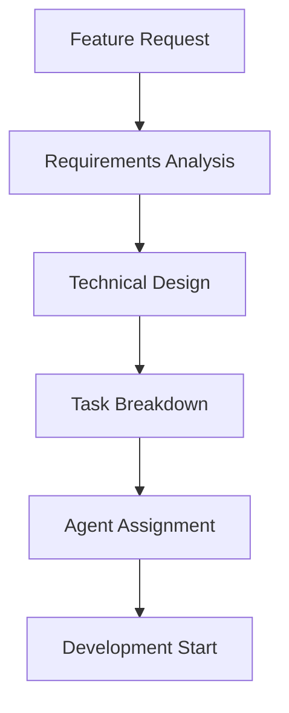
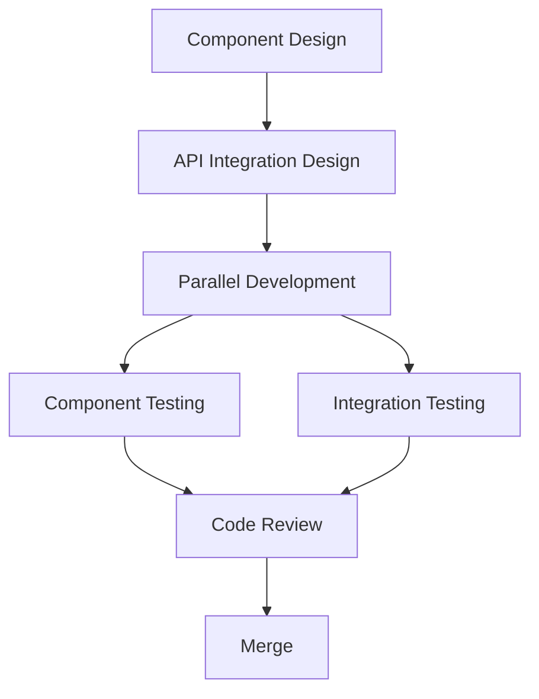
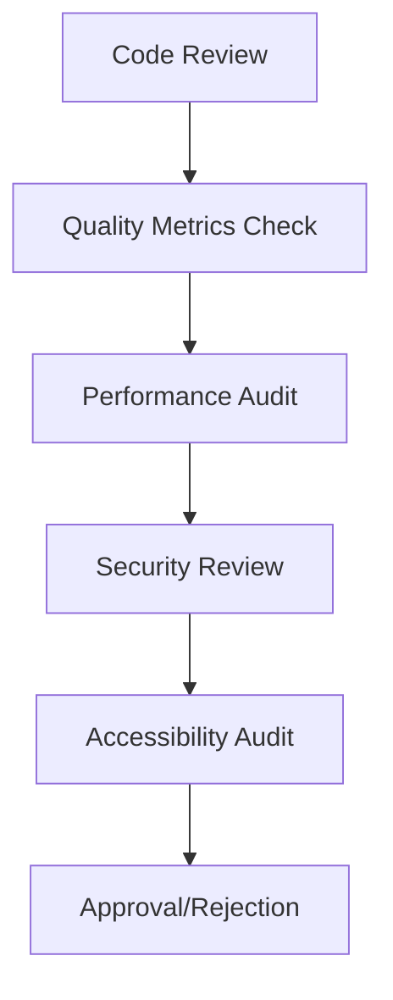

# Multi-Agent Collaboration Playbook

## Overview

This playbook provides specific workflows, processes, and protocols for effective collaboration between CC01 (UI Architecture Artist), CC02 (UI Integration Master), and CC03 (UI Strategy Director) in the ITDO ERP System UI development.

## Daily Workflows

### Morning Sync Protocol (9:00 AM - 15 minutes)

#### Pre-meeting Preparation
Each agent updates their status in the shared tracking system:

```yaml
Agent Status Template:
  agent_id: CC01/CC02/CC03
  previous_day_completion: [percentage]
  current_blockers: [list of issues]
  today_priorities: [top 3 tasks]
  help_needed: [specific requests]
  code_review_requests: [PR numbers]
```

#### Meeting Agenda
1. **Status Round-robin** (5 minutes)
   - Each agent presents their status
   - Completion percentage from previous day
   - Any blockers or issues

2. **Coordination Planning** (5 minutes)
   - Identify dependencies between agents
   - Coordinate shared components
   - Resolve conflicts or overlaps

3. **Decision Points** (5 minutes)
   - Technical decisions needed
   - Resource allocation
   - Priority adjustments

### Evening Review Protocol (6:00 PM - 30 minutes)

#### Pre-meeting Preparation
- All agents prepare code demos
- Pull requests ready for review
- Quality metrics collected

#### Meeting Agenda
1. **Code Review Session** (15 minutes)
   - Live code review of day's work
   - Immediate feedback and suggestions
   - Approval or revision requests

2. **Integration Testing** (10 minutes)
   - Demo integrated features
   - Test cross-component interactions
   - Identify integration issues

3. **Next Day Planning** (5 minutes)
   - Confirm next day priorities
   - Adjust timelines if needed
   - Address any blocking issues

## Collaboration Workflows

### Feature Development Workflow

#### 1. Feature Kickoff (CC03 Lead)


**Process**:
1. CC03 analyzes feature requirements
2. Creates technical specification
3. Breaks down into agent-specific tasks
4. Assigns tasks based on expertise
5. Initiates development sprint

#### 2. Component Development (CC01 + CC02)


**CC01 Responsibilities**:
- Component UI design and implementation
- Storybook documentation
- Visual and accessibility testing
- Design system consistency

**CC02 Responsibilities**:
- API integration logic
- State management implementation
- Performance optimization
- Error handling

#### 3. Quality Assurance (CC03 Lead)


### Code Review Workflow

#### Three-Stage Review Process

**Stage 1: Component Review (CC01)**
```typescript
// Review checklist for CC01
interface ComponentReviewChecklist {
  designConsistency: boolean;
  responsiveDesign: boolean;
  accessibilityCompliance: boolean;
  animationQuality: boolean;
  visualRegression: boolean;
  storybookDocumentation: boolean;
}

// Review template
const componentReview = {
  designSystem: "✅ Follows design tokens",
  responsive: "✅ Mobile-first approach",
  accessibility: "⚠️ Missing aria-labels",
  animation: "✅ Smooth transitions",
  documentation: "✅ Comprehensive stories"
};
```

**Stage 2: Integration Review (CC02)**
```typescript
// Review checklist for CC02
interface IntegrationReviewChecklist {
  apiIntegration: boolean;
  stateManagement: boolean;
  performanceOptimization: boolean;
  errorHandling: boolean;
  testCoverage: boolean;
  realTimeFeatures: boolean;
}

// Review template
const integrationReview = {
  apiCalls: "✅ Proper error handling",
  stateManagement: "✅ Optimized queries",
  performance: "⚠️ Bundle size increased",
  errorHandling: "✅ Comprehensive coverage",
  testing: "✅ >90% coverage"
};
```

**Stage 3: Strategic Review (CC03)**
```typescript
// Review checklist for CC03
interface StrategicReviewChecklist {
  architecturalAlignment: boolean;
  securityConsiderations: boolean;
  maintainability: boolean;
  scalability: boolean;
  businessRequirements: boolean;
  technicalStandards: boolean;
}

// Review template
const strategicReview = {
  architecture: "✅ Aligns with system design",
  security: "✅ No vulnerabilities found",
  maintainability: "✅ Clear code structure",
  scalability: "✅ Handles growth",
  requirements: "✅ Meets all specs"
};
```

### Conflict Resolution Protocol

#### Technical Disagreements
1. **Issue Identification**
   - Agent raises concern in PR or Slack
   - Issue tagged with "technical-disagreement"
   - All agents notified

2. **Discussion Phase**
   - Agents present their perspectives
   - Technical pros/cons documented
   - Alternative solutions explored

3. **Resolution Process**
   - CC03 makes final decision
   - Decision rationale documented
   - Implementation plan updated

#### Resource Conflicts
1. **Bottleneck Identification**
   - Agent reports resource constraint
   - Impact assessment performed
   - Alternative approaches evaluated

2. **Reallocation Strategy**
   - Tasks redistributed based on capacity
   - Deadlines adjusted if necessary
   - Dependencies restructured

## Communication Protocols

### GitHub Issue Management

#### Issue Creation Template
```markdown
## Issue Template
**Type**: [Feature/Bug/Enhancement]
**Priority**: [High/Medium/Low]
**Agent Assignment**: [CC01/CC02/CC03]
**Dependencies**: [List of related issues]

### Description
[Detailed description of the requirement]

### Acceptance Criteria
- [ ] Criterion 1
- [ ] Criterion 2
- [ ] Criterion 3

### Technical Requirements
- [ ] Component implementation
- [ ] API integration
- [ ] Testing requirements
- [ ] Documentation updates

### Agent-Specific Tasks
**CC01 (UI Architecture)**:
- [ ] Component design
- [ ] Storybook documentation
- [ ] Visual testing

**CC02 (Integration)**:
- [ ] API integration
- [ ] State management
- [ ] Performance optimization

**CC03 (Strategy)**:
- [ ] Requirements review
- [ ] Quality assurance
- [ ] Final approval
```

### Pull Request Management

#### PR Creation Template
```markdown
## Pull Request Template
**Type**: [Feature/Bugfix/Enhancement]
**Agent**: [CC01/CC02/CC03]
**Related Issue**: #[issue_number]

### Changes Made
- [ ] Component implementation
- [ ] API integration
- [ ] Tests added/updated
- [ ] Documentation updated

### Review Checklist
**CC01 Review**:
- [ ] Design consistency
- [ ] Responsive design
- [ ] Accessibility
- [ ] Animation quality

**CC02 Review**:
- [ ] API integration
- [ ] State management
- [ ] Performance
- [ ] Error handling

**CC03 Review**:
- [ ] Architecture alignment
- [ ] Security considerations
- [ ] Business requirements
- [ ] Technical standards

### Testing
- [ ] Unit tests pass
- [ ] Integration tests pass
- [ ] E2E tests pass
- [ ] Performance benchmarks met

### Deployment
- [ ] Staging deployment successful
- [ ] Production deployment plan
- [ ] Rollback strategy documented
```

### Slack Communication Guidelines

#### Channel Structure
```yaml
Channels:
  #ui-development: General development discussions
  #ui-code-review: Code review notifications
  #ui-blockers: Immediate help needed
  #ui-announcements: Important updates
  #ui-showcase: Demo and progress sharing
```

#### Message Templates
```markdown
## Blocker Alert Template
🚨 **BLOCKER ALERT** 🚨
**Agent**: CC01/CC02/CC03
**Component**: [Component name]
**Issue**: [Brief description]
**Impact**: [High/Medium/Low]
**Help Needed**: [Specific request]
**Timeline**: [Urgency level]

## Progress Update Template
📊 **PROGRESS UPDATE** 📊
**Agent**: CC01/CC02/CC03
**Feature**: [Feature name]
**Completion**: [percentage]%
**Today's Achievements**: [List]
**Tomorrow's Goals**: [List]
**Blockers**: [None/List]

## Code Review Request Template
👀 **CODE REVIEW REQUEST** 👀
**PR**: #[PR number]
**Agent**: CC01/CC02/CC03
**Component**: [Component name]
**Review Type**: [Component/Integration/Strategic]
**Urgency**: [High/Medium/Low]
**Specific Focus**: [Areas needing attention]
```

## Quality Assurance Protocols

### Automated Quality Gates

#### Pre-commit Hooks
```bash
# Quality checks before commit
scripts/pre-commit.sh
  - TypeScript type checking
  - ESLint validation
  - Prettier formatting
  - Test execution
  - Bundle size check
```

#### Pull Request Automation
```yaml
# GitHub Actions workflow
name: UI Quality Check
on: [pull_request]

jobs:
  quality-check:
    runs-on: ubuntu-latest
    steps:
      - checkout
      - setup-node
      - install-dependencies
      - run-tests
      - check-coverage
      - performance-audit
      - accessibility-audit
      - security-scan
```

### Manual Review Process

#### Design Review (CC01)
```typescript
// Design review checklist
interface DesignReviewChecklist {
  brandConsistency: boolean;
  userExperience: boolean;
  visualHierarchy: boolean;
  colorAccessibility: boolean;
  typography: boolean;
  iconography: boolean;
  spacing: boolean;
  animations: boolean;
}
```

#### Integration Review (CC02)
```typescript
// Integration review checklist
interface IntegrationReviewChecklist {
  apiErrorHandling: boolean;
  stateManagement: boolean;
  performanceOptimization: boolean;
  caching: boolean;
  realTimeFeatures: boolean;
  formValidation: boolean;
  dataTransformation: boolean;
}
```

#### Strategic Review (CC03)
```typescript
// Strategic review checklist
interface StrategicReviewChecklist {
  businessRequirements: boolean;
  technicalArchitecture: boolean;
  securityCompliance: boolean;
  scalability: boolean;
  maintainability: boolean;
  documentation: boolean;
  testCoverage: boolean;
}
```

## Performance Monitoring

### Real-time Monitoring
```typescript
// Performance tracking setup
interface PerformanceMetrics {
  bundleSize: number;
  loadTime: number;
  renderTime: number;
  memoryUsage: number;
  cacheHitRate: number;
  apiResponseTime: number;
}

// Alert thresholds
const performanceThresholds = {
  bundleSize: 200 * 1024, // 200KB
  loadTime: 3000, // 3 seconds
  renderTime: 16, // 16ms
  memoryUsage: 50 * 1024 * 1024, // 50MB
  cacheHitRate: 0.8, // 80%
  apiResponseTime: 500 // 500ms
};
```

### Weekly Performance Review
```yaml
Weekly Performance Review:
  Participants: CC01, CC02, CC03
  Duration: 60 minutes
  Agenda:
    - Performance metrics review
    - Bottleneck identification
    - Optimization opportunities
    - Action items assignment
    - Next week planning
```

## Documentation Standards

### Component Documentation
```typescript
// Component documentation template
/**
 * Button Component
 * 
 * @author CC01
 * @version 1.0.0
 * @description Reusable button component with multiple variants
 * 
 * @example
 * <Button variant="primary" size="medium" onClick={handleClick}>
 *   Click me
 * </Button>
 */
interface ButtonProps {
  variant: 'primary' | 'secondary' | 'danger';
  size: 'small' | 'medium' | 'large';
  disabled?: boolean;
  loading?: boolean;
  onClick: () => void;
  children: React.ReactNode;
}
```

### API Documentation
```typescript
// API documentation template
/**
 * User API Service
 * 
 * @author CC02
 * @version 1.0.0
 * @description Service for user management operations
 */
interface UserApiService {
  getUsers(filters?: UserFilters): Promise<User[]>;
  createUser(userData: CreateUserRequest): Promise<User>;
  updateUser(id: string, userData: UpdateUserRequest): Promise<User>;
  deleteUser(id: string): Promise<void>;
}
```

## Success Metrics and Tracking

### Daily Metrics
```typescript
interface DailyMetrics {
  tasksCompleted: number;
  codeReviewsCompleted: number;
  bugsFixed: number;
  newComponentsCreated: number;
  testCoverage: number;
  performanceScore: number;
}
```

### Weekly Metrics
```typescript
interface WeeklyMetrics {
  featuresCompleted: number;
  codeQualityScore: number;
  teamCollaborationScore: number;
  userStoryPoints: number;
  technicalDebt: number;
  customerSatisfaction: number;
}
```

### Monthly Metrics
```typescript
interface MonthlyMetrics {
  projectMilestones: number;
  codebaseHealth: number;
  teamProductivity: number;
  businessValueDelivered: number;
  techStackEvolution: number;
  knowledgeSharing: number;
}
```

## Conclusion

This Multi-Agent Collaboration Playbook provides the operational framework for effective teamwork in UI development. By following these protocols, the team ensures consistent communication, high-quality deliverables, and efficient collaborative processes.

The playbook emphasizes clear responsibilities, structured workflows, and measurable outcomes while maintaining flexibility for adaptation based on project needs and team dynamics.

---

**Document Version**: 1.0  
**Created**: July 16, 2025  
**Author**: CC03 (UI Strategy Director)  
**Dependencies**: UI_DEVELOPMENT_STRATEGY.md