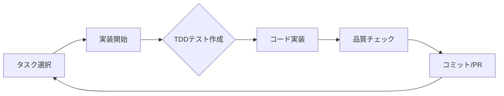

# 🚀 継続的作業キュー - 待ち時間ゼロ保証

**作成日時**: 2025年7月17日 23:20 JST  
**作成者**: Claude Code (CC01) - システム統吅担当  
**目的**: 各エージェントが常に作業を持てるようにする

## 🎯 CC01用作業キュー

### 現在のタスク（即座に実行）
```yaml
Priority_1_Immediate:
  task: "Buttonコンポーネント完成"
  files:
    - frontend/src/components/ui/Button.tsx
    - frontend/src/components/ui/Button.test.tsx
    - frontend/src/components/ui/Button.stories.tsx
  requirements:
    - TypeScript完全型付け
    - テストカバレッジ100%
    - Storybookドキュメント
  estimated_time: "1-2時間"
```

### バックログタスク（常時利用可能）
```yaml
Backlog_Tasks:
  - task: "Inputコンポーネント"
    priority: 2
    estimated_time: "2時間"
  
  - task: "Cardコンポーネント"
    priority: 3
    estimated_time: "2時間"
  
  - task: "Modalコンポーネント"
    priority: 4
    estimated_time: "3時間"
  
  - task: "Tableコンポーネント"
    priority: 5
    estimated_time: "4時間"
  
  - task: "Formコンポーネント"
    priority: 6
    estimated_time: "5時間"
  
  - task: "Dashboardレイアウト"
    priority: 7
    estimated_time: "6時間"
```

### 並行作業可能タスク
```yaml
Parallel_Safe_Tasks:
  - "ESLint設定最適化"
  - "Prettier設定更新"
  - "READMEドキュメント更新"
  - "テスト環境整備"
  - "Storybook設定最適化"
```

## 🎯 CC02用作業キュー

### 現在のタスク（即座に実行）
```yaml
Priority_1_Immediate:
  task: "Issue #46 PRマージ準備"
  actions:
    - CI/CDエラー修正
    - テストカバレッジ確認
    - ドキュメント最終確認
    - PR説明更新
  estimated_time: "1時間"
```

### バックログタスク（常時利用可能）
```yaml
Backlog_Tasks:
  - task: "WebSocket基盤実装"
    files: ["backend/app/websocket/", "backend/app/api/v1/ws.py"]
    priority: 2
    estimated_time: "4時間"
  
  - task: "GraphQLスキーマ定義"
    files: ["backend/app/graphql/", "backend/app/schemas/graphql/"]
    priority: 3
    estimated_time: "3時間"
  
  - task: "キャッシュレイヤー実装"
    files: ["backend/app/core/cache.py", "backend/app/services/cache_service.py"]
    priority: 4
    estimated_time: "2時間"
  
  - task: "APIレートリミット"
    files: ["backend/app/middleware/rate_limit.py"]
    priority: 5
    estimated_time: "2時間"
  
  - task: "バッチ処理システム"
    files: ["backend/app/workers/", "backend/app/tasks/"]
    priority: 6
    estimated_time: "5時間"
```

### 小規模改善タスク
```yaml
Quick_Improvements:
  - "SQLAlchemyクエリ最適化"
  - "APIレスポンス時間改善"
  - "ログフォーマット標準化"
  - "エラーハンドリング改善"
  - "Pydanticスキーマ最適化"
```

## 🎯 CC03用作業キュー

### 現在のタスク（即座に実行）
```yaml
Priority_1_Immediate:
  task: "未コミットファイルの整理"
  files:
    - backend/CC02_STATUS_VERIFICATION_20250117_1510.md
    - backend/EMERGENCY_RESOLUTION_STATUS_20250117_1505.md
    - backend/VICTORY_CELEBRATION_RESPONSE_20250117_1507.md
  actions:
    - 適切なディレクトリへ移動
    - コミットとプッシュ
  estimated_time: "30分"
```

### バックログタスク（常時利用可能）
```yaml
Backlog_Tasks:
  - task: "GitHub Actions最適化"
    priority: 2
    subtasks:
      - "ビルド時間短縮"
      - "キャッシュ最適化"
      - "並列化改善"
    estimated_time: "3時間"
  
  - task: "E2Eテストフレームワーク"
    priority: 3
    files: ["e2e/", ".github/workflows/e2e.yml"]
    estimated_time: "4時間"
  
  - task: "Kubernetesマニフェスト"
    priority: 4
    files: ["k8s/", "charts/"]
    estimated_time: "5時間"
  
  - task: "監視ダッシュボード"
    priority: 5
    tools: ["Grafana", "Prometheus"]
    estimated_time: "6時間"
```

### メンテナンスタスク
```yaml
Maintenance_Tasks:
  - "依存関係更新チェック"
  - "セキュリティスキャン実行"
  - "Dockerイメージ最適化"
  - "テストカバレッジレポート"
  - "CI/CDパイプライン監視"
```

## 📊 タスク実行ルール

### 優先度ルール
```yaml
task_priority_rules:
  1: "現在進行中のタスクを完了"
  2: "PRマージ可能なものを優先"
  3: "ブロッカー解消タスク"
  4: "バックログから順番に"
  5: "並行作業で効率化"
```

### タスク切り替えタイミング
```yaml
task_switching:
  completed: "即座に次タスクへ"
  blocked: "30分以内に別タスクへ"
  waiting: "別の並行タスクを実行"
  error: "エラー解決またはスキップ"
```

## 🔄 継続的タスクフロー

### タスクサイクル


### タスク完了後のアクション
```yaml
post_task_actions:
  1: "完了報告を作成"
  2: "次タスクをキューから取得"
  3: "関連エージェントへ通知"
  4: "進捗ステータス更新"
  5: "即座に次タスク開始"
```

## 🎆 タスクリザーブ（緊急時用）

### すぐにできるタスク
```yaml
Emergency_Quick_Tasks:
  all_agents:
    - "README更新"
    - "コメント追加"
    - "フォーマット修正"
    - "TODOコメント解消"
    - "テスト名改善"
    - "エラーメッセージ改善"
    - "ログメッセージ追加"
    - "ドキュメントスペルチェック"
```

## 📋 タスク管理ベストプラクティス

### DO
- ✅ 常に次のタスクを準備
- ✅ 並行作業で効率化
- ✅ 小さなタスクに分割
- ✅ 進捗をこまめに報告
- ✅ ブロッカーを早期に共有

### DON'T
- ❌ タスク完了後に待機
- ❌ 大きすぎるタスクを抱える
- ❌ 依存関係でブロック
- ❌ 同じタスクで停滞
- ❌ コミュニケーション不足

## 🌟 結論

この作業キューシステムにより、各エージェントは：
1. 常に次のタスクを持つ
2. 待ち時間ゼロで作業継続
3. 優先度に基づいた効率的な作業
4. ブロッカー時の代替タスク
5. 継続的な進捗と成果

---

**📌 重要**: このキューは動的に更新され、常に最新のタスクが利用可能です。