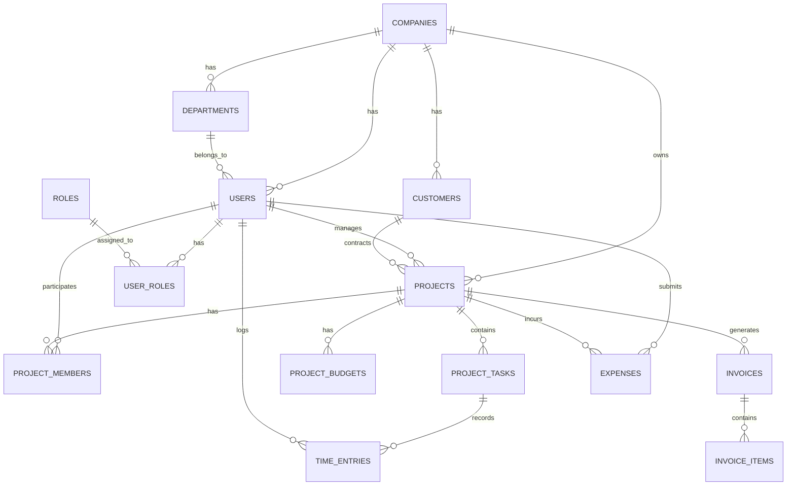

# ITDO ERP データベース設計書

**文書番号**: ITDO-ERP-DB-001  
**バージョン**: 1.0  
**作成日**: 2025年7月5日  
**作成者**: システム設計チーム  
**承認者**: ootakazuhiko

---

## 1. はじめに

### 1.1 目的
本書は、ITDO ERPシステムのデータベース設計を詳細に定義し、データモデル、テーブル構造、インデックス設計、およびデータベース運用方針を明確にすることを目的とする。

### 1.2 設計方針
- **正規化**: 第3正規形を基本とし、パフォーマンスを考慮した非正規化
- **拡張性**: 将来の機能追加を考慮したスキーマ設計
- **マルチテナント**: Row Level Securityによるデータ分離
- **監査性**: 全テーブルに監査用カラムを配置
- **国際化**: UTF-8エンコーディング、タイムゾーン対応

---

## 2. データベース基本設計

### 2.1 データベース構成

| 項目 | 内容 |
|------|------|
| DBMS | PostgreSQL 14以上 |
| 文字コード | UTF-8 |
| 照合順序 | ja_JP.UTF-8 |
| タイムゾーン | Asia/Tokyo |
| 接続プール | 最大100接続 |

### 2.2 命名規則

| 対象 | 命名規則 | 例 |
|------|----------|-----|
| テーブル名 | スネークケース（複数形） | users, project_tasks |
| カラム名 | スネークケース | user_id, created_at |
| 主キー | id | id (UUID型) |
| 外部キー | テーブル名_id | user_id, project_id |
| インデックス | idx_テーブル名_カラム名 | idx_users_email |
| 制約 | 制約種別_テーブル名_カラム名 | uk_users_email |

### 2.3 共通カラム

全テーブルに以下の共通カラムを含める：

```sql
-- 監査用共通カラム
id UUID PRIMARY KEY DEFAULT gen_random_uuid(),
created_at TIMESTAMP WITH TIME ZONE DEFAULT CURRENT_TIMESTAMP,
updated_at TIMESTAMP WITH TIME ZONE DEFAULT CURRENT_TIMESTAMP,
created_by UUID REFERENCES users(id),
updated_by UUID REFERENCES users(id),
deleted_at TIMESTAMP WITH TIME ZONE,  -- 論理削除用
version INTEGER DEFAULT 1              -- 楽観的ロック用
```

---

## 3. ER図

### 3.1 全体ER図（主要エンティティ）



---

## 4. テーブル定義

### 4.1 マスタ系テーブル

#### 4.1.1 companies（企業）
```sql
CREATE TABLE companies (
    id UUID PRIMARY KEY DEFAULT gen_random_uuid(),
    code VARCHAR(50) UNIQUE NOT NULL,
    name VARCHAR(200) NOT NULL,
    name_kana VARCHAR(200),
    postal_code VARCHAR(10),
    address VARCHAR(500),
    phone VARCHAR(20),
    fax VARCHAR(20),
    email VARCHAR(254),
    website VARCHAR(500),
    fiscal_year_start INTEGER CHECK (fiscal_year_start BETWEEN 1 AND 12),
    timezone VARCHAR(50) DEFAULT 'Asia/Tokyo',
    currency_code CHAR(3) DEFAULT 'JPY',
    is_active BOOLEAN DEFAULT true,
    settings JSONB DEFAULT '{}',
    created_at TIMESTAMP WITH TIME ZONE DEFAULT CURRENT_TIMESTAMP,
    updated_at TIMESTAMP WITH TIME ZONE DEFAULT CURRENT_TIMESTAMP,
    deleted_at TIMESTAMP WITH TIME ZONE
);

-- インデックス
CREATE INDEX idx_companies_code ON companies(code) WHERE deleted_at IS NULL;
CREATE INDEX idx_companies_name ON companies(name) WHERE deleted_at IS NULL;
```

#### 4.1.2 users（ユーザー）
```sql
CREATE TABLE users (
    id UUID PRIMARY KEY DEFAULT gen_random_uuid(),
    company_id UUID NOT NULL REFERENCES companies(id),
    department_id UUID REFERENCES departments(id),
    employee_code VARCHAR(50) NOT NULL,
    email VARCHAR(254) NOT NULL,
    username VARCHAR(100) NOT NULL,
    hashed_password VARCHAR(255) NOT NULL,
    full_name VARCHAR(200) NOT NULL,
    full_name_kana VARCHAR(200),
    phone VARCHAR(20),
    mobile VARCHAR(20),
    position VARCHAR(100),
    hire_date DATE,
    birth_date DATE,
    is_active BOOLEAN DEFAULT true,
    is_admin BOOLEAN DEFAULT false,
    last_login_at TIMESTAMP WITH TIME ZONE,
    password_changed_at TIMESTAMP WITH TIME ZONE,
    failed_login_count INTEGER DEFAULT 0,
    locked_until TIMESTAMP WITH TIME ZONE,
    two_factor_secret VARCHAR(255),
    preferences JSONB DEFAULT '{}',
    created_at TIMESTAMP WITH TIME ZONE DEFAULT CURRENT_TIMESTAMP,
    updated_at TIMESTAMP WITH TIME ZONE DEFAULT CURRENT_TIMESTAMP,
    created_by UUID REFERENCES users(id),
    updated_by UUID REFERENCES users(id),
    deleted_at TIMESTAMP WITH TIME ZONE,
    version INTEGER DEFAULT 1,
    CONSTRAINT uk_users_company_email UNIQUE(company_id, email),
    CONSTRAINT uk_users_company_employee_code UNIQUE(company_id, employee_code)
);

-- インデックス
CREATE INDEX idx_users_company_id ON users(company_id) WHERE deleted_at IS NULL;
CREATE INDEX idx_users_email ON users(email) WHERE deleted_at IS NULL;
CREATE INDEX idx_users_department_id ON users(department_id) WHERE deleted_at IS NULL;
```

#### 4.1.3 departments（部門）
```sql
CREATE TABLE departments (
    id UUID PRIMARY KEY DEFAULT gen_random_uuid(),
    company_id UUID NOT NULL REFERENCES companies(id),
    parent_id UUID REFERENCES departments(id),
    code VARCHAR(50) NOT NULL,
    name VARCHAR(200) NOT NULL,
    name_kana VARCHAR(200),
    manager_id UUID REFERENCES users(id),
    sort_order INTEGER DEFAULT 0,
    is_active BOOLEAN DEFAULT true,
    created_at TIMESTAMP WITH TIME ZONE DEFAULT CURRENT_TIMESTAMP,
    updated_at TIMESTAMP WITH TIME ZONE DEFAULT CURRENT_TIMESTAMP,
    created_by UUID REFERENCES users(id),
    updated_by UUID REFERENCES users(id),
    deleted_at TIMESTAMP WITH TIME ZONE,
    CONSTRAINT uk_departments_company_code UNIQUE(company_id, code)
);

-- インデックス
CREATE INDEX idx_departments_company_id ON departments(company_id) WHERE deleted_at IS NULL;
CREATE INDEX idx_departments_parent_id ON departments(parent_id) WHERE deleted_at IS NULL;
```

### 4.2 プロジェクト管理系テーブル

#### 4.2.1 projects（プロジェクト）
```sql
CREATE TABLE projects (
    id UUID PRIMARY KEY DEFAULT gen_random_uuid(),
    company_id UUID NOT NULL REFERENCES companies(id),
    project_code VARCHAR(50) NOT NULL,
    name VARCHAR(200) NOT NULL,
    description TEXT,
    customer_id UUID REFERENCES customers(id),
    project_type VARCHAR(50) NOT NULL,
    status VARCHAR(50) NOT NULL DEFAULT 'planning',
    manager_id UUID NOT NULL REFERENCES users(id),
    planned_start_date DATE,
    planned_end_date DATE,
    actual_start_date DATE,
    actual_end_date DATE,
    budget_amount DECIMAL(15,2),
    currency_code CHAR(3) DEFAULT 'JPY',
    priority INTEGER DEFAULT 3 CHECK (priority BETWEEN 1 AND 5),
    progress_percentage DECIMAL(5,2) DEFAULT 0 CHECK (progress_percentage BETWEEN 0 AND 100),
    is_template BOOLEAN DEFAULT false,
    parent_project_id UUID REFERENCES projects(id),
    settings JSONB DEFAULT '{}',
    created_at TIMESTAMP WITH TIME ZONE DEFAULT CURRENT_TIMESTAMP,
    updated_at TIMESTAMP WITH TIME ZONE DEFAULT CURRENT_TIMESTAMP,
    created_by UUID REFERENCES users(id),
    updated_by UUID REFERENCES users(id),
    deleted_at TIMESTAMP WITH TIME ZONE,
    version INTEGER DEFAULT 1,
    CONSTRAINT uk_projects_company_code UNIQUE(company_id, project_code),
    CONSTRAINT chk_project_dates CHECK (planned_end_date >= planned_start_date)
);

-- インデックス
CREATE INDEX idx_projects_company_id ON projects(company_id) WHERE deleted_at IS NULL;
CREATE INDEX idx_projects_customer_id ON projects(customer_id) WHERE deleted_at IS NULL;
CREATE INDEX idx_projects_manager_id ON projects(manager_id) WHERE deleted_at IS NULL;
CREATE INDEX idx_projects_status ON projects(status) WHERE deleted_at IS NULL;
CREATE INDEX idx_projects_dates ON projects(planned_start_date, planned_end_date) WHERE deleted_at IS NULL;
```

#### 4.2.2 project_tasks（タスク）
```sql
CREATE TABLE project_tasks (
    id UUID PRIMARY KEY DEFAULT gen_random_uuid(),
    company_id UUID NOT NULL REFERENCES companies(id),
    project_id UUID NOT NULL REFERENCES projects(id),
    parent_task_id UUID REFERENCES project_tasks(id),
    task_code VARCHAR(50) NOT NULL,
    name VARCHAR(200) NOT NULL,
    description TEXT,
    assignee_id UUID REFERENCES users(id),
    task_type VARCHAR(50) NOT NULL,
    status VARCHAR(50) NOT NULL DEFAULT 'todo',
    priority INTEGER DEFAULT 3 CHECK (priority BETWEEN 1 AND 5),
    planned_start_date DATE,
    planned_end_date DATE,
    actual_start_date DATE,
    actual_end_date DATE,
    estimated_hours DECIMAL(8,2),
    actual_hours DECIMAL(8,2),
    progress_percentage DECIMAL(5,2) DEFAULT 0 CHECK (progress_percentage BETWEEN 0 AND 100),
    sort_order INTEGER DEFAULT 0,
    dependencies JSONB DEFAULT '[]',
    created_at TIMESTAMP WITH TIME ZONE DEFAULT CURRENT_TIMESTAMP,
    updated_at TIMESTAMP WITH TIME ZONE DEFAULT CURRENT_TIMESTAMP,
    created_by UUID REFERENCES users(id),
    updated_by UUID REFERENCES users(id),
    deleted_at TIMESTAMP WITH TIME ZONE,
    version INTEGER DEFAULT 1,
    CONSTRAINT uk_tasks_project_code UNIQUE(project_id, task_code)
);

-- インデックス
CREATE INDEX idx_project_tasks_project_id ON project_tasks(project_id) WHERE deleted_at IS NULL;
CREATE INDEX idx_project_tasks_assignee_id ON project_tasks(assignee_id) WHERE deleted_at IS NULL;
CREATE INDEX idx_project_tasks_parent_id ON project_tasks(parent_task_id) WHERE deleted_at IS NULL;
CREATE INDEX idx_project_tasks_status ON project_tasks(status) WHERE deleted_at IS NULL;
```

### 4.3 財務管理系テーブル

#### 4.3.1 budgets（予算）
```sql
CREATE TABLE budgets (
    id UUID PRIMARY KEY DEFAULT gen_random_uuid(),
    company_id UUID NOT NULL REFERENCES companies(id),
    budget_type VARCHAR(50) NOT NULL, -- 'project', 'department', 'company'
    reference_id UUID NOT NULL, -- project_id, department_id, or company_id
    fiscal_year INTEGER NOT NULL,
    period_type VARCHAR(20) NOT NULL DEFAULT 'annual', -- 'annual', 'quarterly', 'monthly'
    period_number INTEGER,
    budget_amount DECIMAL(15,2) NOT NULL,
    currency_code CHAR(3) DEFAULT 'JPY',
    status VARCHAR(50) NOT NULL DEFAULT 'draft',
    approved_by UUID REFERENCES users(id),
    approved_at TIMESTAMP WITH TIME ZONE,
    notes TEXT,
    created_at TIMESTAMP WITH TIME ZONE DEFAULT CURRENT_TIMESTAMP,
    updated_at TIMESTAMP WITH TIME ZONE DEFAULT CURRENT_TIMESTAMP,
    created_by UUID REFERENCES users(id),
    updated_by UUID REFERENCES users(id),
    deleted_at TIMESTAMP WITH TIME ZONE,
    CONSTRAINT uk_budgets_type_ref_year_period UNIQUE(budget_type, reference_id, fiscal_year, period_type, period_number)
);

-- インデックス
CREATE INDEX idx_budgets_company_id ON budgets(company_id) WHERE deleted_at IS NULL;
CREATE INDEX idx_budgets_reference ON budgets(budget_type, reference_id) WHERE deleted_at IS NULL;
CREATE INDEX idx_budgets_fiscal_year ON budgets(fiscal_year) WHERE deleted_at IS NULL;
```

#### 4.3.2 expenses（経費）
```sql
CREATE TABLE expenses (
    id UUID PRIMARY KEY DEFAULT gen_random_uuid(),
    company_id UUID NOT NULL REFERENCES companies(id),
    expense_number VARCHAR(50) NOT NULL,
    user_id UUID NOT NULL REFERENCES users(id),
    project_id UUID REFERENCES projects(id),
    expense_date DATE NOT NULL,
    expense_category_id UUID NOT NULL REFERENCES expense_categories(id),
    amount DECIMAL(15,2) NOT NULL,
    tax_amount DECIMAL(15,2) DEFAULT 0,
    currency_code CHAR(3) DEFAULT 'JPY',
    description TEXT,
    receipt_url VARCHAR(500),
    status VARCHAR(50) NOT NULL DEFAULT 'draft',
    submitted_at TIMESTAMP WITH TIME ZONE,
    approved_by UUID REFERENCES users(id),
    approved_at TIMESTAMP WITH TIME ZONE,
    rejected_by UUID REFERENCES users(id),
    rejected_at TIMESTAMP WITH TIME ZONE,
    rejection_reason TEXT,
    reimbursed_at TIMESTAMP WITH TIME ZONE,
    created_at TIMESTAMP WITH TIME ZONE DEFAULT CURRENT_TIMESTAMP,
    updated_at TIMESTAMP WITH TIME ZONE DEFAULT CURRENT_TIMESTAMP,
    created_by UUID REFERENCES users(id),
    updated_by UUID REFERENCES users(id),
    deleted_at TIMESTAMP WITH TIME ZONE,
    version INTEGER DEFAULT 1,
    CONSTRAINT uk_expenses_company_number UNIQUE(company_id, expense_number)
);

-- インデックス
CREATE INDEX idx_expenses_company_id ON expenses(company_id) WHERE deleted_at IS NULL;
CREATE INDEX idx_expenses_user_id ON expenses(user_id) WHERE deleted_at IS NULL;
CREATE INDEX idx_expenses_project_id ON expenses(project_id) WHERE deleted_at IS NULL;
CREATE INDEX idx_expenses_date ON expenses(expense_date) WHERE deleted_at IS NULL;
CREATE INDEX idx_expenses_status ON expenses(status) WHERE deleted_at IS NULL;
```

### 4.4 CRM系テーブル

#### 4.4.1 customers（顧客）
```sql
CREATE TABLE customers (
    id UUID PRIMARY KEY DEFAULT gen_random_uuid(),
    company_id UUID NOT NULL REFERENCES companies(id),
    customer_code VARCHAR(50) NOT NULL,
    name VARCHAR(200) NOT NULL,
    name_kana VARCHAR(200),
    customer_type VARCHAR(50) NOT NULL DEFAULT 'corporate',
    industry VARCHAR(100),
    postal_code VARCHAR(10),
    address VARCHAR(500),
    phone VARCHAR(20),
    fax VARCHAR(20),
    email VARCHAR(254),
    website VARCHAR(500),
    credit_limit DECIMAL(15,2),
    payment_terms INTEGER DEFAULT 30,
    tax_number VARCHAR(50),
    bank_account JSONB,
    is_active BOOLEAN DEFAULT true,
    notes TEXT,
    created_at TIMESTAMP WITH TIME ZONE DEFAULT CURRENT_TIMESTAMP,
    updated_at TIMESTAMP WITH TIME ZONE DEFAULT CURRENT_TIMESTAMP,
    created_by UUID REFERENCES users(id),
    updated_by UUID REFERENCES users(id),
    deleted_at TIMESTAMP WITH TIME ZONE,
    CONSTRAINT uk_customers_company_code UNIQUE(company_id, customer_code)
);

-- インデックス
CREATE INDEX idx_customers_company_id ON customers(company_id) WHERE deleted_at IS NULL;
CREATE INDEX idx_customers_name ON customers(name) WHERE deleted_at IS NULL;
CREATE INDEX idx_customers_type ON customers(customer_type) WHERE deleted_at IS NULL;
```

### 4.5 ワークフロー系テーブル

#### 4.5.1 workflow_definitions（ワークフロー定義）
```sql
CREATE TABLE workflow_definitions (
    id UUID PRIMARY KEY DEFAULT gen_random_uuid(),
    company_id UUID NOT NULL REFERENCES companies(id),
    code VARCHAR(50) NOT NULL,
    name VARCHAR(200) NOT NULL,
    description TEXT,
    target_entity VARCHAR(50) NOT NULL, -- 'expense', 'leave_request', etc.
    workflow_json JSONB NOT NULL,
    is_active BOOLEAN DEFAULT true,
    version INTEGER DEFAULT 1,
    created_at TIMESTAMP WITH TIME ZONE DEFAULT CURRENT_TIMESTAMP,
    updated_at TIMESTAMP WITH TIME ZONE DEFAULT CURRENT_TIMESTAMP,
    created_by UUID REFERENCES users(id),
    updated_by UUID REFERENCES users(id),
    deleted_at TIMESTAMP WITH TIME ZONE,
    CONSTRAINT uk_workflow_definitions_company_code UNIQUE(company_id, code)
);
```

#### 4.5.2 workflow_instances（ワークフローインスタンス）
```sql
CREATE TABLE workflow_instances (
    id UUID PRIMARY KEY DEFAULT gen_random_uuid(),
    company_id UUID NOT NULL REFERENCES companies(id),
    workflow_definition_id UUID NOT NULL REFERENCES workflow_definitions(id),
    entity_type VARCHAR(50) NOT NULL,
    entity_id UUID NOT NULL,
    current_step VARCHAR(100) NOT NULL,
    status VARCHAR(50) NOT NULL DEFAULT 'running',
    started_at TIMESTAMP WITH TIME ZONE DEFAULT CURRENT_TIMESTAMP,
    completed_at TIMESTAMP WITH TIME ZONE,
    data JSONB DEFAULT '{}',
    created_at TIMESTAMP WITH TIME ZONE DEFAULT CURRENT_TIMESTAMP,
    updated_at TIMESTAMP WITH TIME ZONE DEFAULT CURRENT_TIMESTAMP,
    created_by UUID REFERENCES users(id)
);

-- インデックス
CREATE INDEX idx_workflow_instances_entity ON workflow_instances(entity_type, entity_id);
CREATE INDEX idx_workflow_instances_status ON workflow_instances(status);
```

---

## 5. パーティショニング設計

### 5.1 時系列データのパーティショニング

```sql
-- time_entriesテーブルのパーティショニング
CREATE TABLE time_entries (
    id UUID DEFAULT gen_random_uuid(),
    company_id UUID NOT NULL,
    user_id UUID NOT NULL,
    project_id UUID,
    task_id UUID,
    entry_date DATE NOT NULL,
    start_time TIME,
    end_time TIME,
    hours DECIMAL(4,2) NOT NULL,
    description TEXT,
    is_billable BOOLEAN DEFAULT true,
    created_at TIMESTAMP WITH TIME ZONE DEFAULT CURRENT_TIMESTAMP,
    PRIMARY KEY (id, entry_date)
) PARTITION BY RANGE (entry_date);

-- 月次パーティションの作成
CREATE TABLE time_entries_2025_01 PARTITION OF time_entries
FOR VALUES FROM ('2025-01-01') TO ('2025-02-01');

CREATE TABLE time_entries_2025_02 PARTITION OF time_entries
FOR VALUES FROM ('2025-02-01') TO ('2025-03-01');
```

---

## 6. インデックス設計

### 6.1 インデックス設計方針

| 種類 | 用途 | 例 |
|------|------|-----|
| 主キーインデックス | 一意性保証、高速検索 | 自動作成 |
| 外部キーインデックス | 結合性能向上 | idx_users_company_id |
| 検索用インデックス | WHERE句で頻繁に使用 | idx_projects_status |
| 複合インデックス | 複数条件の検索 | idx_time_entries_user_date |
| 部分インデックス | 論理削除対応 | WHERE deleted_at IS NULL |

### 6.2 主要インデックス一覧

```sql
-- 複合インデックスの例
CREATE INDEX idx_time_entries_user_date 
ON time_entries(user_id, entry_date) 
WHERE deleted_at IS NULL;

CREATE INDEX idx_expenses_user_status_date 
ON expenses(user_id, status, expense_date) 
WHERE deleted_at IS NULL;

-- 全文検索インデックス
CREATE INDEX idx_projects_search 
ON projects USING gin(
    to_tsvector('japanese', name || ' ' || COALESCE(description, ''))
);
```

---

## 7. ビューの設計

### 7.1 統計ビュー

```sql
-- プロジェクト統計ビュー
CREATE VIEW v_project_statistics AS
SELECT 
    p.id,
    p.company_id,
    p.project_code,
    p.name,
    p.status,
    p.manager_id,
    COUNT(DISTINCT pm.user_id) as member_count,
    COUNT(DISTINCT pt.id) as task_count,
    SUM(CASE WHEN pt.status = 'completed' THEN 1 ELSE 0 END) as completed_task_count,
    COALESCE(SUM(te.hours), 0) as total_hours,
    COALESCE(SUM(e.amount), 0) as total_expenses
FROM projects p
LEFT JOIN project_members pm ON p.id = pm.project_id AND pm.deleted_at IS NULL
LEFT JOIN project_tasks pt ON p.id = pt.project_id AND pt.deleted_at IS NULL
LEFT JOIN time_entries te ON p.id = te.project_id
LEFT JOIN expenses e ON p.id = e.project_id AND e.status = 'approved'
WHERE p.deleted_at IS NULL
GROUP BY p.id;
```

---

## 8. ストアドプロシージャ・関数

### 8.1 共通関数

```sql
-- 会計年度の計算
CREATE OR REPLACE FUNCTION get_fiscal_year(
    p_date DATE,
    p_fiscal_start_month INTEGER
) RETURNS INTEGER AS $$
BEGIN
    IF EXTRACT(MONTH FROM p_date) >= p_fiscal_start_month THEN
        RETURN EXTRACT(YEAR FROM p_date);
    ELSE
        RETURN EXTRACT(YEAR FROM p_date) - 1;
    END IF;
END;
$$ LANGUAGE plpgsql IMMUTABLE;

-- 営業日計算
CREATE OR REPLACE FUNCTION add_business_days(
    p_start_date DATE,
    p_days INTEGER
) RETURNS DATE AS $$
DECLARE
    v_date DATE := p_start_date;
    v_count INTEGER := 0;
BEGIN
    WHILE v_count < p_days LOOP
        v_date := v_date + 1;
        IF EXTRACT(DOW FROM v_date) NOT IN (0, 6) THEN
            v_count := v_count + 1;
        END IF;
    END LOOP;
    RETURN v_date;
END;
$$ LANGUAGE plpgsql;
```

---

## 9. セキュリティ設計

### 9.1 Row Level Security (RLS)

```sql
-- companiesテーブルのRLS
ALTER TABLE companies ENABLE ROW LEVEL SECURITY;

CREATE POLICY company_isolation ON companies
    FOR ALL
    TO application_user
    USING (id = current_setting('app.current_company_id')::UUID);

-- usersテーブルのRLS
ALTER TABLE users ENABLE ROW LEVEL SECURITY;

CREATE POLICY user_company_isolation ON users
    FOR ALL
    TO application_user
    USING (company_id = current_setting('app.current_company_id')::UUID);
```

### 9.2 暗号化

```sql
-- 機密データの暗号化
CREATE EXTENSION IF NOT EXISTS pgcrypto;

-- 暗号化カラムの例
ALTER TABLE users ADD COLUMN encrypted_tax_number TEXT;

-- 暗号化関数
CREATE OR REPLACE FUNCTION encrypt_sensitive_data(p_data TEXT) 
RETURNS TEXT AS $$
BEGIN
    RETURN pgp_sym_encrypt(p_data, current_setting('app.encryption_key'));
END;
$$ LANGUAGE plpgsql;
```

---

## 10. データベース運用設計

### 10.1 バックアップ戦略

| バックアップ種別 | 頻度 | 保持期間 | 方式 |
|------------------|------|----------|------|
| フルバックアップ | 日次 | 30日 | pg_dump |
| 差分バックアップ | 6時間毎 | 7日 | WALアーカイブ |
| トランザクションログ | 継続的 | 7日 | ストリーミングレプリケーション |

### 10.2 メンテナンス

```sql
-- 自動VACUUM設定
ALTER TABLE time_entries SET (
    autovacuum_vacuum_scale_factor = 0.1,
    autovacuum_analyze_scale_factor = 0.05
);

-- 統計情報の更新
CREATE OR REPLACE FUNCTION update_statistics() RETURNS void AS $$
BEGIN
    ANALYZE;
END;
$$ LANGUAGE plpgsql;
```

### 10.3 監視項目

| 監視項目 | 閾値 | アクション |
|----------|------|------------|
| 接続数 | 80% | アラート通知 |
| ディスク使用率 | 80% | 容量追加 |
| クエリ実行時間 | 5秒以上 | スロークエリログ |
| デッドロック | 発生時 | 自動リトライ |

---

## 11. 移行計画

### 11.1 初期データ投入

```sql
-- マスタデータの投入順序
1. companies
2. departments  
3. users
4. roles
5. user_roles
6. expense_categories
7. customers
```

### 11.2 データ移行スクリプト

```sql
-- 既存システムからのデータ移行例
INSERT INTO users (
    company_id,
    employee_code,
    email,
    username,
    full_name,
    created_at
)
SELECT 
    '${COMPANY_ID}'::UUID,
    emp_code,
    email,
    login_name,
    full_name,
    created_date
FROM legacy_system.employees
WHERE active_flag = 1;
```

---

## 12. 改訂履歴

| バージョン | 改訂日 | 改訂内容 | 改訂者 |
|------------|--------|----------|--------|
| 1.0 | 2025/07/05 | 初版作成 | システム設計チーム |

---

**承認**

データベースアーキテクト: _________________ 日付: _______  
テックリード: _________________ 日付: _______  
インフラリード: _________________ 日付: _______