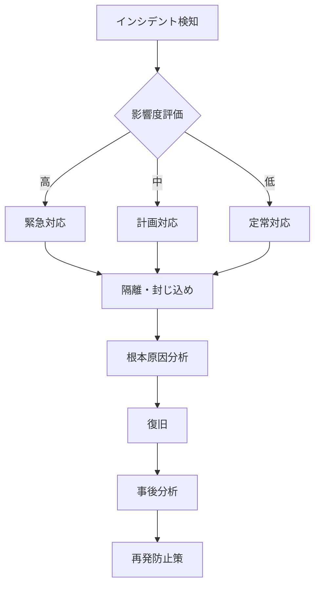

# ITDO ERP セキュリティ設計書

**文書番号**: ITDO-ERP-SEC-001  
**バージョン**: 1.0  
**作成日**: 2025年7月5日  
**作成者**: システム設計チーム  
**承認者**: ootakazuhiko  
**機密区分**: 社外秘

---

## 1. はじめに

### 1.1 目的
本書は、ITDO ERPシステムのセキュリティ設計を包括的に定義し、情報資産の保護、脅威への対策、およびコンプライアンス要件への準拠を確実にすることを目的とする。

### 1.2 セキュリティ設計方針
- **多層防御**: 複数のセキュリティレイヤーによる防御
- **最小権限の原則**: 必要最小限の権限付与
- **ゼロトラスト**: 内部ネットワークも信頼しない
- **継続的監視**: リアルタイムでの脅威検知
- **プライバシー・バイ・デザイン**: 設計段階からのプライバシー考慮

### 1.3 準拠基準
- ISO/IEC 27001（情報セキュリティマネジメントシステム）
- JIS Q 15001（個人情報保護マネジメントシステム）
- OWASP Top 10
- PCI DSS（クレジットカード情報を扱う場合）

---

## 2. セキュリティアーキテクチャ

### 2.1 セキュリティレイヤー

```
┌─────────────────────────────────────────────────────────────────┐
│                        セキュリティレイヤー                       │
├─────────────────────────────────────────────────────────────────┤
│  ┌─────────────────────────────────────────────────────────┐   │
│  │  1. ネットワークセキュリティ                              │   │
│  │     - ファイアウォール、WAF、DDoS対策                     │   │
│  └─────────────────────────────────────────────────────────┘   │
│  ┌─────────────────────────────────────────────────────────┐   │
│  │  2. アプリケーションセキュリティ                          │   │
│  │     - 認証・認可、入力検証、セッション管理                │   │
│  └─────────────────────────────────────────────────────────┘   │
│  ┌─────────────────────────────────────────────────────────┐   │
│  │  3. データセキュリティ                                    │   │
│  │     - 暗号化、アクセス制御、バックアップ                  │   │
│  └─────────────────────────────────────────────────────────┘   │
│  ┌─────────────────────────────────────────────────────────┐   │
│  │  4. 運用セキュリティ                                      │   │
│  │     - 監視、ログ管理、インシデント対応                    │   │
│  └─────────────────────────────────────────────────────────┘   │
└─────────────────────────────────────────────────────────────────┘
```

### 2.2 ネットワーク構成

```
Internet
    │
    ├──── CDN (CloudFront) ──── DDoS Protection
    │
    ├──── WAF (Web Application Firewall)
    │
    ├──── Load Balancer (ALB) ──── SSL/TLS終端
    │
    ├──── Public Subnet
    │     ├── API Gateway
    │     └── Bastion Host
    │
    ├──── Private Subnet 1
    │     ├── Application Servers
    │     └── Cache Servers
    │
    └──── Private Subnet 2
          ├── Database Servers
          └── Backup Storage
```

---

## 3. 認証・認可設計

### 3.1 認証方式

#### 3.1.1 基本認証
| 項目 | 仕様 |
|------|------|
| 認証システム | Keycloak |
| 認証プロトコル | OAuth2 / OpenID Connect |
| トークン形式 | JWT (JSON Web Token) |
| トークン署名 | RS256 (RSA + SHA-256) |
| アクセストークン有効期限 | 1時間 |
| リフレッシュトークン有効期限 | 30日 |
| パスワードハッシュ | bcrypt (Keycloak標準) |

#### 3.1.2 多要素認証（MFA）
```yaml
MFA設定:
  方式:
    - TOTP (Time-based One-Time Password)
    - SMS (オプション)
    - Email (バックアップ)
  
  実装:
    - Google Authenticator対応
    - Microsoft Authenticator対応
    - バックアップコード（10個）
  
  必須化:
    - 管理者: 必須
    - 一般ユーザー: 推奨
```

### 3.2 認可設計

#### 3.2.1 RBAC (Role-Based Access Control)
```yaml
ロール階層:
  SystemAdmin:
    - 全システム管理権限
    - マルチテナント管理
    
  CompanyAdmin:
    - 自社内全権限
    - ユーザー管理
    - 設定変更
    
  DepartmentManager:
    - 部門内管理権限
    - メンバー管理
    - レポート閲覧
    
  ProjectManager:
    - プロジェクト管理権限
    - タスク割当
    - 進捗管理
    
  User:
    - 基本操作権限
    - 自己データ編集
```

#### 3.2.2 権限マトリックス

| リソース | SystemAdmin | CompanyAdmin | DeptManager | ProjectManager | User |
|----------|-------------|--------------|-------------|----------------|------|
| ユーザー管理 | CRUD | CRUD (自社) | R (部門) | - | R (自己) |
| プロジェクト | CRUD | CRUD | CRUD (部門) | CRUD (担当) | R |
| 経費承認 | CRUD | CRUD | CRU (部門) | - | C (自己) |
| レポート | CRUD | CRUD | R (部門) | R (担当PJ) | - |
| システム設定 | CRUD | RU (自社) | - | - | - |

*CRUD: Create, Read, Update, Delete

### 3.3 セッション管理

```yaml
セッション設定:
  保存場所: Redis
  有効期限: 24時間
  アイドルタイムアウト: 30分
  同時セッション数: 3
  
セキュリティ対策:
  - セッションIDの定期的な再生成
  - IPアドレスチェック
  - User-Agentチェック
  - Secure/HttpOnly/SameSite属性
```

---

## 4. データセキュリティ

### 4.1 データ分類

| 分類 | 説明 | 保護レベル | 例 |
|------|------|------------|-----|
| 極秘 | 漏洩時に重大な影響 | 最高 | パスワード、個人情報 |
| 社外秘 | 社外への開示禁止 | 高 | 財務情報、顧客情報 |
| 社内限定 | 社内のみ共有 | 中 | プロジェクト情報 |
| 公開可能 | 公開しても問題なし | 低 | 製品カタログ |

### 4.2 暗号化設計

#### 4.2.1 通信の暗号化
```yaml
TLS設定:
  バージョン: TLS 1.3
  暗号スイート:
    - TLS_AES_256_GCM_SHA384
    - TLS_CHACHA20_POLY1305_SHA256
    - TLS_AES_128_GCM_SHA256
  
証明書:
  種類: EV SSL証明書
  有効期限: 1年
  自動更新: Let's Encrypt (Certbot)
```

#### 4.2.2 データ暗号化
```yaml
保存時暗号化:
  データベース:
    方式: Transparent Data Encryption (TDE)
    アルゴリズム: AES-256
    鍵管理: AWS KMS
    
  ファイルストレージ:
    方式: Client-side encryption
    アルゴリズム: AES-256-GCM
    
  バックアップ:
    方式: GPG暗号化
    アルゴリズム: AES-256
```

### 4.3 個人情報保護

#### 4.3.1 個人情報の取り扱い
```yaml
個人情報:
  定義:
    - 氏名、住所、電話番号
    - メールアドレス
    - 生年月日
    - 銀行口座情報
    
  保護対策:
    - 暗号化必須
    - アクセスログ記録
    - 最小限のアクセス権限
    - 定期的な棚卸し
    
  保存期限:
    - 退職後5年間
    - 削除時は完全削除
```

#### 4.3.2 プライバシー設定
```yaml
ユーザープライバシー:
  設定項目:
    - プロフィール公開範囲
    - 活動履歴の表示
    - 通知設定
    
  データポータビリティ:
    - データエクスポート機能
    - JSON/CSV形式
    
  忘れられる権利:
    - アカウント削除機能
    - データ完全削除
```

---

## 5. アプリケーションセキュリティ

### 5.1 脆弱性対策

#### 5.1.1 OWASP Top 10対策

| 脆弱性 | 対策 |
|--------|------|
| インジェクション | パラメータバインディング、入力検証 |
| 認証の不備 | MFA、セッション管理、パスワードポリシー |
| 機微データの露出 | 暗号化、最小権限、マスキング |
| XXE | XMLパーサーの無効化、DTD無効化 |
| アクセス制御の不備 | RBAC、権限チェック |
| セキュリティ設定ミス | セキュアデフォルト、自動化 |
| XSS | 出力エスケープ、CSP |
| 安全でないデシリアライゼーション | 型チェック、署名検証 |
| 既知の脆弱性 | 定期的なアップデート、脆弱性スキャン |
| ログとモニタリングの不足 | 包括的なログ、SIEM |

#### 5.1.2 入力検証
```python
# 入力検証の実装例
from pydantic import BaseModel, validator, EmailStr
from typing import Optional
import re

class UserCreateRequest(BaseModel):
    email: EmailStr
    password: str
    full_name: str
    employee_code: str
    
    @validator('password')
    def validate_password(cls, v):
        if len(v) < 8:
            raise ValueError('パスワードは8文字以上必要です')
        if not re.search(r'[A-Z]', v):
            raise ValueError('大文字を含む必要があります')
        if not re.search(r'[a-z]', v):
            raise ValueError('小文字を含む必要があります')
        if not re.search(r'[0-9]', v):
            raise ValueError('数字を含む必要があります')
        if not re.search(r'[!@#$%^&*(),.?":{}|<>]', v):
            raise ValueError('特殊文字を含む必要があります')
        return v
    
    @validator('employee_code')
    def validate_employee_code(cls, v):
        if not re.match(r'^[A-Z0-9]{4,10}$', v):
            raise ValueError('従業員コードは4-10文字の英数字です')
        return v
```

### 5.2 セキュアコーディング

#### 5.2.1 セキュアコーディング規約
```yaml
一般原則:
  - 信頼境界の明確化
  - 入力は全て信頼しない
  - 出力は全てエスケープ
  - 最小権限の原則
  - セキュアなデフォルト設定
  
具体的な実装:
  - SQLインジェクション: ORMまたはパラメータバインディング使用
  - XSS: テンプレートエンジンの自動エスケープ
  - CSRF: CSRFトークンの検証
  - ディレクトリトラバーサル: パスの正規化とホワイトリスト
```

### 5.3 セキュリティヘッダー

```yaml
HTTPセキュリティヘッダー:
  Strict-Transport-Security: max-age=31536000; includeSubDomains; preload
  X-Content-Type-Options: nosniff
  X-Frame-Options: DENY
  X-XSS-Protection: 1; mode=block
  Content-Security-Policy: |
    default-src 'self';
    script-src 'self' 'unsafe-inline' https://cdn.jsdelivr.net;
    style-src 'self' 'unsafe-inline';
    img-src 'self' data: https:;
    font-src 'self' data:;
    connect-src 'self' https://api.itdo-erp.com;
    frame-ancestors 'none';
  Referrer-Policy: strict-origin-when-cross-origin
  Permissions-Policy: geolocation=(), microphone=(), camera=()
```

---

## 6. インフラセキュリティ

### 6.1 ネットワークセキュリティ

#### 6.1.1 ファイアウォール設定
```yaml
インバウンドルール:
  - HTTP (80): ALBのみ → リダイレクト
  - HTTPS (443): ALBのみ
  - SSH (22): Bastion Hostのみ、IP制限
  
アウトバウンドルール:
  - HTTPS (443): 必要なAPIのみ
  - DNS (53): 内部DNSサーバー
  - NTP (123): 時刻同期
  
セグメンテーション:
  - Public Subnet: ALB、NAT Gateway
  - Private Subnet 1: Application
  - Private Subnet 2: Database
```

#### 6.1.2 WAF設定
```yaml
WAFルール:
  Core Rule Set:
    - OWASP Top 10
    - Known Bad Inputs
    - サイズ制限
    
  カスタムルール:
    - Rate Limiting: 100 req/min per IP
    - Geo Blocking: 日本国外からのアクセス制限（オプション）
    - IP Whitelist: 管理画面へのアクセス
    
  アクション:
    - Block: 悪意のあるリクエスト
    - Count: 疑わしいリクエスト
    - Allow: 正常なリクエスト
```

### 6.2 コンテナセキュリティ

#### 6.2.1 Dockerセキュリティ
```dockerfile
# セキュアなDockerfile例
FROM python:3.12-slim AS base

# 非rootユーザーの作成
RUN groupadd -r app && useradd -r -g app app

# セキュリティアップデート
RUN apt-get update && apt-get upgrade -y && \
    apt-get clean && rm -rf /var/lib/apt/lists/*

# アプリケーションファイルのコピー
COPY --chown=app:app . /app
WORKDIR /app

# 非rootユーザーで実行
USER app

# ヘルスチェック
HEALTHCHECK --interval=30s --timeout=3s --start-period=40s --retries=3 \
  CMD curl -f http://localhost:8000/health || exit 1
```

#### 6.2.2 Kubernetesセキュリティ
```yaml
apiVersion: v1
kind: Pod
metadata:
  name: secure-app
spec:
  securityContext:
    runAsNonRoot: true
    runAsUser: 1000
    fsGroup: 2000
    
  containers:
  - name: app
    image: itdo-erp/app:latest
    securityContext:
      allowPrivilegeEscalation: false
      readOnlyRootFilesystem: true
      capabilities:
        drop:
          - ALL
    resources:
      limits:
        memory: "512Mi"
        cpu: "500m"
      requests:
        memory: "256Mi"
        cpu: "250m"
```

---

## 7. 監視とログ管理

### 7.1 セキュリティ監視

#### 7.1.1 監視項目
| 監視対象 | 監視内容 | アラート条件 |
|----------|----------|--------------|
| 認証失敗 | ログイン失敗回数 | 5回/5分 |
| 権限エラー | 不正なアクセス試行 | 10回/時 |
| SQLエラー | インジェクション試行 | 1回 |
| ファイルアクセス | 不正なパス参照 | 1回 |
| API利用 | レート制限超過 | 閾値超過 |
| システムリソース | CPU/メモリ使用率 | 80%超過 |

#### 7.1.2 SIEM設定
```yaml
SIEM統合:
  製品: Splunk / ELK Stack
  
  ログソース:
    - アプリケーションログ
    - アクセスログ
    - WAFログ
    - システムログ
    - 監査ログ
    
  相関ルール:
    - 複数IPからの同一アカウントへのログイン
    - 短時間での大量データアクセス
    - 通常と異なる時間帯のアクセス
    - 特権昇格の試み
```

### 7.2 監査ログ

#### 7.2.1 監査ログ設計
```yaml
記録項目:
  - タイムスタンプ (UTC)
  - ユーザーID
  - セッションID
  - IPアドレス
  - User-Agent
  - 操作種別 (CRUD)
  - 対象リソース
  - 変更前後の値（機密情報はマスク）
  - 結果（成功/失敗）
  
保存期間:
  - アクセスログ: 1年
  - 操作ログ: 3年
  - セキュリティログ: 5年
  
保護:
  - 改ざん防止（ハッシュチェーン）
  - 暗号化保存
  - アクセス制限
```

---

## 8. インシデント対応

### 8.1 インシデント対応体制

```yaml
対応体制:
  CSIRT:
    - インシデント対応責任者
    - セキュリティアナリスト
    - システム管理者
    - 法務担当
    
  連絡先:
    - 24時間対応窓口
    - エスカレーションパス
    - 外部専門家
```

### 8.2 インシデント対応手順

#### 8.2.1 対応フロー


#### 8.2.2 対応手順書
| フェーズ | 実施内容 | 責任者 |
|----------|----------|--------|
| 検知 | アラート確認、初期調査 | SOC |
| 評価 | 影響範囲特定、重要度判定 | CSIRT |
| 封じ込め | 被害拡大防止、証拠保全 | システム管理者 |
| 根絶 | 原因除去、脆弱性修正 | 開発チーム |
| 復旧 | システム正常化、監視強化 | 運用チーム |
| 事後対応 | 報告書作成、改善実施 | CSIRT |

---

## 9. コンプライアンス

### 9.1 法令遵守

| 法令・規制 | 要件 | 対応 |
|------------|------|------|
| 個人情報保護法 | 個人情報の適切な取り扱い | 暗号化、アクセス制御、同意取得 |
| 不正アクセス禁止法 | 不正アクセスの防止 | 認証強化、ログ記録 |
| 電子帳簿保存法 | 電子データの適切な保存 | タイムスタンプ、改ざん防止 |
| GDPR | EU市民のデータ保護 | データポータビリティ、忘れられる権利 |

### 9.2 セキュリティ監査

```yaml
内部監査:
  頻度: 年2回
  範囲:
    - アクセス権限の棚卸し
    - セキュリティ設定の確認
    - ログレビュー
    - 脆弱性診断
    
外部監査:
  頻度: 年1回
  種類:
    - ペネトレーションテスト
    - セキュリティ監査
    - コンプライアンス監査
```

---

## 10. セキュリティ教育

### 10.1 教育プログラム

| 対象者 | 内容 | 頻度 |
|--------|------|------|
| 全従業員 | セキュリティ基礎、フィッシング対策 | 年2回 |
| 開発者 | セキュアコーディング、脆弱性対策 | 四半期 |
| 管理者 | インシデント対応、リスク管理 | 年2回 |
| 新入社員 | セキュリティポリシー、基本操作 | 入社時 |

### 10.2 セキュリティ意識向上

```yaml
施策:
  - フィッシングメール訓練（月1回）
  - セキュリティニュースレター（月刊）
  - セキュリティクイズ（四半期）
  - インシデント事例共有（随時）
  
評価:
  - 理解度テスト
  - 訓練メール開封率
  - インシデント報告数
```

---

## 11. 事業継続計画（BCP）

### 11.1 リスクシナリオ

| シナリオ | 影響 | RTO | RPO |
|----------|------|-----|-----|
| サイバー攻撃 | システム停止 | 4時間 | 1時間 |
| データ漏洩 | 信用失墜 | 24時間 | - |
| 自然災害 | データセンター被災 | 8時間 | 1時間 |
| 内部不正 | データ改ざん | 4時間 | 1時間 |

### 11.2 復旧手順

```yaml
バックアップ:
  方式:
    - フルバックアップ: 週次
    - 差分バックアップ: 日次
    - トランザクションログ: リアルタイム
    
  保管:
    - オンサイト: 高速復旧用
    - オフサイト: 災害対策用
    - クラウド: 長期保管用
    
復旧テスト:
  頻度: 四半期
  内容:
    - バックアップからの復旧
    - フェイルオーバー
    - データ整合性確認
```

---

## 12. 改訂履歴

| バージョン | 改訂日 | 改訂内容 | 改訂者 |
|------------|--------|----------|--------|
| 1.0 | 2025/07/05 | 初版作成 | システム設計チーム |

---

**承認**

セキュリティ責任者: _________________ 日付: _______  
システム責任者: _________________ 日付: _______  
コンプライアンス責任者: _________________ 日付: _______