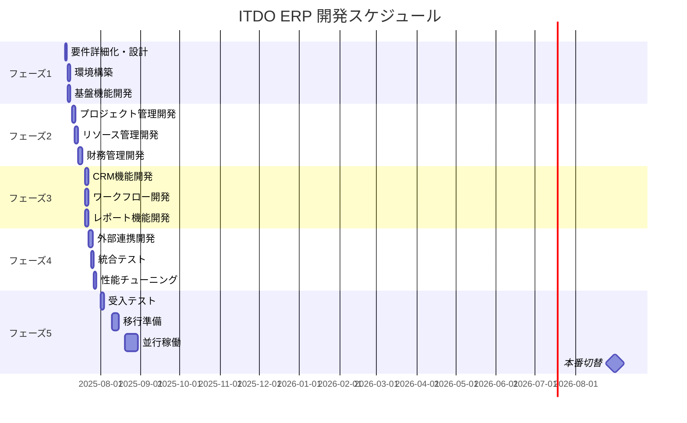
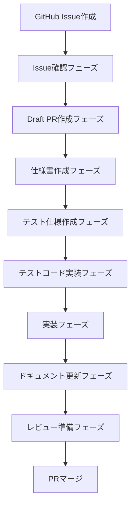
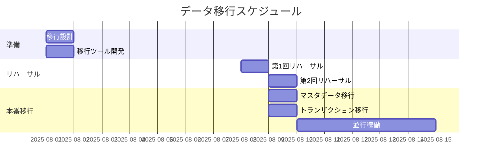

# ITDO ERP 開発計画書

**文書番号**: ITDO-ERP-DP-001  
**バージョン**: 1.0  
**作成日**: 2025年7月5日  
**作成者**: システム設計チーム  
**承認者**: ootakazuhiko  

---

## 1. はじめに

### 1.1 目的
本書は、ITDO ERPシステムの開発計画を定義し、プロジェクトスコープ、スケジュール、体制、開発プロセス、品質管理、およびリスク管理の方針を明確にすることを目的とする。

### 1.2 プロジェクト概要
- **プロジェクト名**: ITDO ERP システム開発プロジェクト
- **開発期間**: 2025年7月5日 〜 2025年9月30日（3ヶ月）
- **予算**: 300万円
- **開発手法**: アジャイル（スクラム）+ ウォーターフォール（ハイブリッド）

### 1.3 成功基準
- 要件定義書に記載された全機能の実装完了
- 性能要件の達成（応答時間、同時接続数等）
- セキュリティ要件の準拠
- 予定期間内での本番リリース

---

## 2. プロジェクトスコープ

### 2.1 スコープ内
| カテゴリ | 内容 |
|----------|------|
| 基盤機能 | 認証・認可、マルチテナント、監査ログ |
| 業務機能 | プロジェクト管理、リソース管理、財務管理、CRM |
| 共通機能 | ワークフロー、レポート、ダッシュボード |
| 外部連携 | 会計システム、人事システム連携 |
| 非機能要件 | 性能、セキュリティ、可用性 |

### 2.2 スコープ外
- レガシーシステムの保守
- 既存データの手動移行作業
- ハードウェアの調達・設置
- エンドユーザー教育（別プロジェクト）

---

## 3. 開発スケジュール

### 3.1 マスタースケジュール



### 3.2 フェーズ別詳細

#### 3.2.1 フェーズ1: 基盤構築（2025年7月〜7月）
| タスク | 期間 | 成果物 |
|--------|------|--------|
| 要件詳細化 |  | 詳細要件定義書 |
| 基本設計 |  | 基本設計書 |
| 開発環境構築 |  | 環境構築手順書 |
| CI/CD構築 |  | パイプライン設定 |
| 認証基盤開発 |  | 認証モジュール |
| 共通基盤開発 |  | 共通ライブラリ |

#### 3.2.2 フェーズ2: コア機能開発（2025年7月〜7月）
| モジュール | 開発期間 | 優先度 |
|------------|----------|--------|
| プロジェクト管理 |  | 高 |
| タスク管理 |  | 高 |
| リソース管理 |  | 高 |
| 予算管理 |  | 中 |
| 経費管理 |  | 中 |
| 請求管理 |  | 中 |

#### 3.2.3 フェーズ3: 拡張機能開発（2025年7月〜7月）
| モジュール | 開発期間 | 優先度 |
|------------|----------|--------|
| CRM基本機能 |  | 中 |
| 営業管理 |  | 低 |
| ワークフロー定義 |  | 高 |
| ワークフロー実行 |  | 高 |
| レポート作成 |  | 中 |
| ダッシュボード |  | 中 |

#### 3.2.4 フェーズ4: 統合・最適化（2025年7月〜8月）
| タスク | 期間 | 目標 |
|--------|------|------|
| 外部システム連携 |  | 3システム連携 |
| 統合テスト |  | カバレッジ90% |
| 性能テスト |  | 目標性能達成 |
| セキュリティテスト |  | 脆弱性0 |
| 負荷テスト |  | 100同時接続 |

#### 3.2.5 フェーズ5: 移行・展開（2025年8月〜2025年8月）
| タスク | 期間 | 成果物 |
|--------|------|--------|
| UAT準備 |  | テストシナリオ |
| UAT実施 |  | 受入テスト報告書 |
| データ移行設計 |  | 移行設計書 |
| 移行リハーサル |  | リハーサル報告書 |
| 運用手順作成 |  | 運用マニュアル |
| 並行稼働 |  | 並行稼働報告書 |

---

## 4. プロジェクト体制

### 4.1 組織図

```
プロジェクトオーナー
    │
    ├── ステアリングコミッティ
    │
    └── プロジェクトマネージャー
            │
            ├── 開発チーム
            │   ├── バックエンドチーム（1名）
            │   ├── フロントエンドチーム（1名）
            │   └── インフラチーム（1名）
            │
            ├── QAチーム（1名）
            │
            ├── セキュリティチーム（1名）
            │
            └── PMO（1名）
```

### 4.2 役割と責任

| 役割 | 人数 | 責任範囲 |
|------|------|----------|
| プロジェクトマネージャー | 1名 | 全体統括、進捗管理、リスク管理 |
| テックリード | 1名 | 技術方針決定、アーキテクチャ設計 |
| スクラムマスター | 1名 | アジャイルプロセス推進 |
| バックエンド開発者 | 1名 | API開発、ビジネスロジック実装 |
| フロントエンド開発者 | 1名 | UI実装、UX改善 |
| インフラエンジニア | 1名 | 環境構築、CI/CD、監視 |
| QAエンジニア | 1名 | テスト設計、実行、自動化 |
| セキュリティエンジニア | 1名 | セキュリティ設計、監査 |

### 4.3 ステークホルダー

| ステークホルダー | 関与度 | 役割 |
|------------------|--------|------|
| 経営層 | 高 | 意思決定、予算承認 |
| 事業部門 | 高 | 要件定義、UAT |
| IT部門 | 高 | 技術支援、インフラ提供 |
| エンドユーザー | 中 | 要件提供、UAT参加 |
| 外部ベンダー | 低 | 技術支援、製品提供 |

---

## 5. 開発プロセス

### 5.1 開発手法

#### 5.1.1 イシュー駆動開発 + TDD
```yaml
基本原則:
  - すべての作業はGitHub Issueから開始
  - テスト駆動開発 (TDD) を絶対遵守
  - 8フェーズ開発プロセスの実践
  
8フェーズプロセス:
  1. Issue確認フェーズ
  2. Draft PR作成フェーズ
  3. 仕様書作成フェーズ
  4. テスト仕様作成フェーズ
  5. テストコード実装フェーズ
  6. 実装フェーズ
  7. ドキュメント更新フェーズ
  8. レビュー準備フェーズ
```

### 5.2 開発フロー (8フェーズプロセス)



### 5.3 ブランチ戦略

```yaml
Git Flow:
  main: 本番環境
  develop: 開発環境
  feature/*: 機能開発
  release/*: リリース準備
  hotfix/*: 緊急修正
  
ブランチルール:
  - mainへの直接push禁止
  - Pull Requestでのレビュー必須
  - CI/CDパスが必須
  - 2名以上の承認が必要
```

---

## 6. 品質管理

### 6.1 品質目標

| 指標 | 目標値 | 測定方法 |
|------|--------|----------|
| バグ密度 | <5件/KLOC | 静的解析 |
| コードカバレッジ | >80% | 自動テスト |
| 技術的負債 | <5% | SonarQube |
| コードレビュー率 | 100% | GitHub |
| ドキュメント整備率 | 100% | レビュー |

### 6.2 テスト戦略 (TDDベース)

#### TDD原則
- **Red**: 失敗するテストを先に書く
- **Green**: テストを成功させる最小限のコードを書く
- **Refactor**: テストを維持しながらコードを改善する

#### 型安全性要件
- Python: mypy --strictでエラーゼロ
- TypeScript: strict modeでエラーゼロ
- any型の使用禁止

### 6.3 テスト種別

#### 6.2.1 テストレベル
```yaml
単体テスト:
  実施者: 開発者
  自動化: 100%
  カバレッジ: 80%以上
  
結合テスト:
  実施者: 開発者
  自動化: 80%
  カバレッジ: 主要シナリオ
  
システムテスト:
  実施者: QAチーム
  自動化: 60%
  カバレッジ: 全機能
  
受入テスト:
  実施者: ユーザー
  自動化: 0%
  カバレッジ: 業務シナリオ
```

### 6.3 コードレビュー

```yaml
レビュー観点:
  - 機能要件の充足
  - コーディング規約準拠
  - セキュリティ考慮
  - パフォーマンス
  - 保守性
  
レビュープロセス:
  1. セルフレビュー
  2. 自動チェック（Linter、テスト）
  3. ピアレビュー
  4. 承認・マージ
```

---

## 7. リスク管理

### 7.1 リスク一覧

| リスク | 発生確率 | 影響度 | 対策 |
|--------|----------|--------|------|
| 要件変更 | 高 | 高 | アジャイル開発、変更管理プロセス |
| 技術的困難 | 中 | 高 | PoC実施、技術調査期間確保 |
| リソース不足 | 中 | 中 | 外部リソース活用、優先順位付け |
| 品質問題 | 低 | 高 | 自動テスト充実、品質ゲート |
| セキュリティ脆弱性 | 低 | 高 | セキュリティレビュー、監査 |
| スケジュール遅延 | 中 | 中 | バッファ確保、段階リリース |

### 7.2 リスク対応計画

#### 7.2.1 予防的対策
- 要件定義フェーズでの十分な検討
- プロトタイプによる早期検証
- 継続的なステークホルダーコミュニケーション
- 自動化による品質確保

#### 7.2.2 発生時対策
- エスカレーションパスの明確化
- 代替案の事前準備
- リソースの柔軟な再配置
- スコープ調整による対応

---

## 8. コミュニケーション計画

### 8.1 定例会議

| 会議名 | 頻度 | 参加者 | 目的 |
|--------|------|--------|------|
| ステアリングコミッティ | 週次 | 経営層、PM | 意思決定 |
| プロジェクト定例 | 週次 | 全メンバー | 進捗共有 |
| デイリースクラム | 日次 | 開発チーム | 課題共有 |
| スプリントレビュー | 週次 | 全員 | 成果確認 |
| レトロスペクティブ | 週次 | 開発チーム | 改善検討 |

### 8.2 コミュニケーションツール

| ツール | 用途 | 対象 |
|--------|------|------|
| Slack | 日常的なコミュニケーション | 全員 |
| GitHub | コードレビュー、Issue管理 | 開発チーム |
| Confluence | ドキュメント管理 | 全員 |
| Jira | タスク管理 | 全員 |
| Zoom | オンライン会議 | 全員 |

---

## 9. 成果物管理

### 9.1 成果物一覧

| フェーズ | 成果物 | 形式 | 管理場所 |
|----------|--------|------|----------|
| 設計 | 要件定義書、設計書 | Markdown | GitHub |
| 開発 | ソースコード | 各言語 | GitHub |
| テスト | テスト仕様書、報告書 | Excel/Markdown | GitHub |
| 構築 | 環境定義書、手順書 | Markdown | GitHub |
| 運用 | 運用マニュアル | Markdown/PDF | GitHub |

### 9.2 バージョン管理

```yaml
ドキュメント:
  - Gitによるバージョン管理
  - レビュー・承認プロセス
  - タグによるリリース管理
  
ソースコード:
  - GitHubによる管理
  - セマンティックバージョニング
  - タグとリリースノート
```

---

## 10. 教育・トレーニング計画

### 10.1 開発チーム向け

| 内容 | 対象 | 時期 | 期間 |
|------|------|------|------|
| アーキテクチャ説明 | 全開発者 | 開始時 | 0.2日 |
| FastAPI/Next.js研修 | 必要者 | 開始時 | 0.2日 |
| セキュアコーディング | 全開発者 | 開始時 | 0.2日 |
| CI/CD研修 | 全開発者 | 構築後 | 0.4日 |

### 10.2 運用チーム向け

| 内容 | 対象 | 時期 | 期間 |
|------|------|------|------|
| システム概要 | 運用チーム | UAT前 | 0.1日 |
| 運用手順 | 運用チーム | UAT中 | 0.2日 |
| 障害対応 | 運用チーム | 移行前 | 0.1日 |
| 監視・分析 | 運用チーム | 移行前 | 0.1日 |

---

## 11. 移行計画

### 11.1 移行方針
- 段階的移行（部門単位）
- 並行稼働期間の設定（2週間）
- ロールバック計画の準備

### 11.2 移行スケジュール



---

## 12. プロジェクト完了基準

### 12.1 完了条件
- [ ] 全機能の実装完了
- [ ] 品質基準の達成
- [ ] 性能要件の達成
- [ ] セキュリティ監査合格
- [ ] 運用マニュアル完成
- [ ] 運用チームへの引き継ぎ完了
- [ ] 本番環境での安定稼働（1週間）

### 12.2 プロジェクトクロージング
1. 最終成果物の納品
2. プロジェクト完了報告書の作成
3. 振り返り会の実施
4. ナレッジの文書化
5. プロジェクト資産のアーカイブ

---

## 13. 改訂履歴

| バージョン | 改訂日 | 改訂内容 | 改訂者 |
|------------|--------|----------|--------|
| 1.0 | 2025/07/05 | 初版作成 | システム設計チーム |

---

**承認**

プロジェクトオーナー: _________________ 日付: _______  
プロジェクトマネージャー: _________________ 日付: _______  
開発リーダー: _________________ 日付: _______