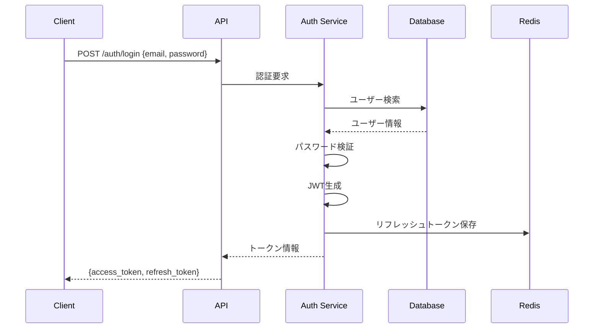

# 認証基盤詳細設計書

**文書番号**: ITDO-ERP-DD-AUTH-001  
**バージョン**: 1.0  
**作成日**: 2025年7月5日  
**作成者**: Claude Code AI  

---

## 1. 概要

### 1.1 目的
ITDO ERPシステムの認証・認可基盤を実装し、セキュアなアクセス制御を実現する。

### 1.2 対象機能
- AUTH-001: メールアドレス/パスワード認証
- AUTH-004: JWTトークンセッション管理
- USER-001: 管理者によるユーザー新規登録

---

## 2. アーキテクチャ

### 2.1 認証フロー



### 2.2 コンポーネント構成

```
backend/app/
├── api/
│   └── v1/
│       ├── auth.py          # 認証エンドポイント
│       └── users.py         # ユーザー管理エンドポイント
├── core/
│   ├── config.py           # 設定管理
│   ├── security.py         # セキュリティユーティリティ
│   └── dependencies.py     # 依存性注入
├── models/
│   └── user.py            # Userモデル
├── schemas/
│   ├── auth.py            # 認証スキーマ
│   └── user.py            # ユーザースキーマ
├── services/
│   └── auth.py            # 認証サービス
└── middleware/
    └── auth.py            # 認証ミドルウェア
```

---

## 3. データモデル

### 3.1 Userテーブル

```sql
CREATE TABLE users (
    id SERIAL PRIMARY KEY,
    email VARCHAR(255) UNIQUE NOT NULL,
    hashed_password VARCHAR(255) NOT NULL,
    full_name VARCHAR(100) NOT NULL,
    is_active BOOLEAN DEFAULT true,
    is_superuser BOOLEAN DEFAULT false,
    created_at TIMESTAMP WITH TIME ZONE DEFAULT CURRENT_TIMESTAMP,
    updated_at TIMESTAMP WITH TIME ZONE DEFAULT CURRENT_TIMESTAMP
);

CREATE INDEX idx_users_email ON users(email);
CREATE INDEX idx_users_is_active ON users(is_active);
```

### 3.2 Redisデータ構造

```
Key: refresh_token:{token_id}
Value: {
    "user_id": 123,
    "email": "user@example.com",
    "expires_at": "2025-07-06T12:00:00Z"
}
TTL: 7 days
```

---

## 4. セキュリティ設計

### 4.1 パスワードポリシー
- 最小長: 8文字
- 必須要素: 大文字、小文字、数字、特殊文字から3種類以上
- ハッシュアルゴリズム: bcrypt (cost factor: 12)

### 4.2 JWT設計
```json
{
  "sub": "user_id",
  "email": "user@example.com",
  "exp": 1719936000,
  "iat": 1719849600,
  "type": "access"
}
```

### 4.3 セキュリティヘッダー
```python
security_headers = {
    "X-Content-Type-Options": "nosniff",
    "X-Frame-Options": "DENY",
    "X-XSS-Protection": "1; mode=block",
    "Strict-Transport-Security": "max-age=31536000; includeSubDomains"
}
```

---

## 5. エラーハンドリング

### 5.1 エラーコード体系

| コード | 説明 | HTTPステータス |
|--------|------|----------------|
| AUTH001 | 認証失敗 | 401 |
| AUTH002 | トークン期限切れ | 401 |
| AUTH003 | トークン無効 | 401 |
| AUTH004 | 権限不足 | 403 |
| USER001 | ユーザー既存 | 409 |
| USER002 | ユーザー不存在 | 404 |

### 5.2 エラーレスポンス形式
```json
{
  "detail": "Invalid authentication credentials",
  "code": "AUTH001",
  "timestamp": "2025-07-05T10:30:00Z"
}
```

---

## 6. 実装詳細

### 6.1 依存ライブラリ
```python
# 認証関連
python-jose[cryptography]==3.3.0  # JWT処理
passlib[bcrypt]==1.7.4           # パスワードハッシュ
python-multipart==0.0.6          # フォームデータ処理

# バリデーション強化
email-validator==2.1.0           # メールアドレス検証
```

### 6.2 環境変数
```env
# JWT設定
SECRET_KEY=your-secret-key-here-minimum-32-chars
ALGORITHM=HS256
ACCESS_TOKEN_EXPIRE_MINUTES=1440  # 24時間
REFRESH_TOKEN_EXPIRE_DAYS=7

# セキュリティ設定
BCRYPT_ROUNDS=12
PASSWORD_MIN_LENGTH=8
```

### 6.3 主要関数

#### パスワードハッシュ化
```python
def hash_password(password: str) -> str:
    """パスワードをbcryptでハッシュ化"""
    return pwd_context.hash(password)

def verify_password(plain_password: str, hashed_password: str) -> bool:
    """パスワード検証"""
    return pwd_context.verify(plain_password, hashed_password)
```

#### JWT生成
```python
def create_access_token(data: dict, expires_delta: Optional[timedelta] = None) -> str:
    """アクセストークン生成"""
    to_encode = data.copy()
    expire = datetime.utcnow() + (expires_delta or timedelta(minutes=15))
    to_encode.update({"exp": expire, "type": "access"})
    return jwt.encode(to_encode, SECRET_KEY, algorithm=ALGORITHM)
```

---

## 7. テスト計画

### 7.1 単体テスト
- パスワードハッシュ化テスト
- JWT生成・検証テスト
- 認証サービステスト
- バリデーションテスト

### 7.2 結合テスト
- ログインフローテスト
- トークンリフレッシュテスト
- 権限チェックテスト
- エラーハンドリングテスト

### 7.3 セキュリティテスト
- SQLインジェクション対策
- パスワード強度チェック
- レート制限テスト
- セッション固定攻撃対策

---

## 8. パフォーマンス要件

### 8.1 応答時間目標
- ログインAPI: < 200ms
- トークン検証: < 50ms
- ユーザー作成: < 300ms

### 8.2 スケーラビリティ
- 同時認証リクエスト: 100req/s
- Redis接続プール: 最大50接続
- DB接続プール: 最大20接続

---

## 9. 監視・ログ

### 9.1 監視項目
- 認証成功/失敗率
- 平均応答時間
- トークン有効期限切れ数
- 異常ログイン試行

### 9.2 ログ出力
```json
{
  "timestamp": "2025-07-05T10:30:00Z",
  "level": "INFO",
  "event": "authentication_success",
  "user_id": 123,
  "ip_address": "192.168.1.1",
  "user_agent": "Mozilla/5.0..."
}
```

---

## 10. 将来拡張

### 10.1 計画済み機能
- [ ] 多要素認証（MFA）
- [ ] OAuth2/SAML連携
- [ ] パスワードレス認証
- [ ] セッション管理UI
- [ ] 監査ログ強化

### 10.2 Keycloak統合準備
- OpenID Connectクライアント設定
- レルム・ロール定義
- ユーザー属性マッピング
- トークン交換機能