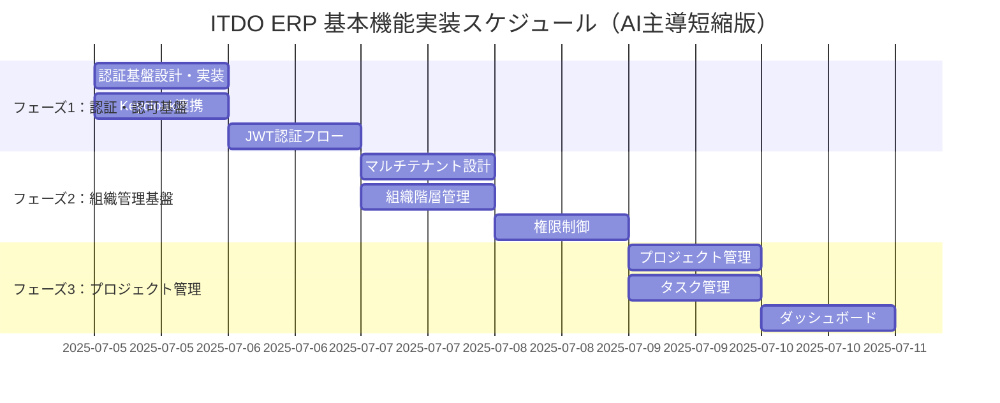

# ITDO ERP 開発環境確認のための実装計画書

**文書番号**: ITDO-ERP-IMPL-001  
**バージョン**: 1.0  
**作成日**: 2025年7月5日  
**作成者**: Claude Code AI  
**承認者**: ootakazuhiko  

---

## 1. 実装計画概要

### 1.1 目的
開発環境の動作確認を目的とした段階的な基本機能実装により、以下を検証する：
- Python 3.13 + FastAPI + uv環境の動作確認
- React 18 + TypeScript 5 + Vite環境の動作確認  
- PostgreSQL 15 + Redis 7 + Keycloak統合の動作確認
- TDD + 8フェーズ開発プロセスの実践
- GitHub Actions CI/CD パイプラインの動作確認

### 1.2 実装方針
- **AI主導開発**: 短期集中実装（通常3週間→1週間に短縮）
- **TDD絶対遵守**: テストファーストでの実装
- **8フェーズプロセス厳守**: 全ての機能開発にプロセス適用
- **段階的実装**: 各フェーズで技術検証を完了

---

## 2. 実装スケジュール

### 2.1 全体スケジュール（短縮版）



### 2.2 日別詳細計画

#### 【1日目】フェーズ1-A: 認証基盤設計・実装
**実装機能:**
- AUTH-001: メールアドレス/パスワード認証API
- AUTH-004: JWTトークンセッション管理
- USER-001: ユーザー登録API

**成果物:**
- 認証APIエンドポイント（/api/v1/auth/）
- ユーザー管理APIエンドポイント（/api/v1/users/）
- フロントエンド認証コンポーネント
- 認証関連テストスイート

**技術検証:**
- FastAPI OAuth2実装
- SQLAlchemy User モデル
- Pydantic バリデーション
- pytest テストスイート

#### 【2日目】フェーズ1-B: Keycloak連携・認証フロー
**実装機能:**
- Keycloak OAuth2/OpenID Connect連携
- JWT認証ミドルウェア
- フロントエンド認証状態管理
- ログイン/ログアウト画面

**成果物:**
- Keycloak設定ファイル
- OAuth2認証フロー
- React認証コンテキスト
- 保護されたルートコンポーネント

**技術検証:**
- Keycloak Docker設定
- React Router認証ガード
- Axios インターセプター
- Token refresh機能

#### 【3日目】フェーズ2-A: マルチテナント・組織管理
**実装機能:**
- ORG-001: 企業情報管理
- ORG-002: 部門階層管理（2階層）
- PERM-001: 基本ロール定義
- PERM-002: ユーザーロール付与

**成果物:**
- 企業・部門管理API
- マルチテナントDBスキーマ
- 組織管理画面
- 権限管理テスト

**技術検証:**
- マルチテナントデータ分離
- 階層データ構造（Adjacency List）
- RBAC実装パターン
- データアクセス制御

#### 【4日目】フェーズ2-B: 権限制御・データ分離
**実装機能:**
- PERM-003: 部門別データアクセス制御
- 監査ログ基盤
- 権限チェックミドルウェア
- 組織階層表示UI

**成果物:**
- 権限制御デコレーター
- 監査ログAPI
- 組織図コンポーネント
- 権限テストスイート

**技術検証:**
- Row Level Security（RLS）
- 監査ログパターン
- React権限制御フック
- 階層データ表示

#### 【5日目】フェーズ3-A: プロジェクト管理基本機能
**実装機能:**
- PROJ-001: プロジェクト作成
- PROJ-002: シンプルなタスク管理
- プロジェクト一覧・詳細画面

**成果物:**
- プロジェクト管理API
- タスク管理API
- プロジェクト管理画面
- CRUD操作テスト

**技術検証:**
- 複雑なビジネスロジック
- リレーショナルデータ設計
- フォームバリデーション
- 状態管理パターン

#### 【6日目】フェーズ3-B: 進捗管理・ダッシュボード
**実装機能:**
- PROJ-005: 基本的な進捗管理
- DASH-001: KPI表示
- リアルタイム更新機能

**成果物:**
- 進捗管理API
- ダッシュボードAPI
- KPI表示コンポーネント
- リアルタイム更新機能

**技術検証:**
- WebSocket実装
- チャート・グラフライブラリ
- レスポンシブレイアウト
- パフォーマンス最適化

---

## 3. 8フェーズ開発プロセス実践

### 3.1 各機能実装での8フェーズ適用

```yaml
フェーズ1: Issue確認
  - GitHub Issueの詳細確認
  - 要件・制約の理解
  - 受入条件の明確化

フェーズ2: Draft PR作成
  - 作業ブランチ作成（feature/機能名）
  - Draft PRでスコープ明確化
  - 実装方針コメント

フェーズ3: 仕様書作成
  - API仕様書（OpenAPI）
  - データモデル設計書
  - UI/UX仕様書

フェーズ4: テスト仕様作成
  - 単体テスト仕様
  - 結合テスト仕様
  - E2Eテスト仕様

フェーズ5: テストコード実装
  - 単体テスト実装（TDD Red）
  - モックアップ作成
  - テストデータ準備

フェーズ6: 実装
  - テスト駆動実装（TDD Green/Refactor）
  - ビジネスロジック実装
  - UI/UXコンポーネント実装

フェーズ7: ドキュメント更新
  - README更新
  - API仕様書更新
  - 運用手順書更新

フェーズ8: レビュー準備
  - セルフレビュー
  - PR説明文作成
  - レビューアサイン
```

---

## 4. 技術検証項目

### 4.1 開発環境検証

| 検証項目 | 期待結果 | 検証方法 |
|----------|----------|----------|
| Python 3.13環境 | エラーなし動作 | uv run python --version |
| FastAPI動作 | APIレスポンス正常 | curl localhost:8000/health |
| React 18環境 | ビルド成功 | npm run build |
| TypeScript strict | 型エラーゼロ | npm run typecheck |
| PostgreSQL接続 | 接続成功 | DB接続テスト |
| Redis接続 | 接続成功 | Redis接続テスト |
| Keycloak連携 | 認証成功 | OAuth2フロー |

### 4.2 非機能要件検証

| 検証項目 | 目標値 | 測定方法 |
|----------|--------|----------|
| API応答時間 | <200ms | パフォーマンステスト |
| コードカバレッジ | >80% | pytest --cov |
| 型安全性 | エラーゼロ | mypy --strict |
| セキュリティ | 脆弱性ゼロ | セキュリティスキャン |
| UI応答性 | スムーズ操作 | ユーザビリティテスト |

### 4.3 CI/CD検証

| 検証項目 | 期待結果 | 確認方法 |
|----------|----------|----------|
| GitHub Actions実行 | 全テスト成功 | CIステータス確認 |
| 自動デプロイ | 成功 | デプロイ結果確認 |
| 静的解析 | 警告なし | Linter結果確認 |
| セキュリティスキャン | 問題なし | スキャン結果確認 |

---

## 5. 実装規約

### 5.1 必須要件

```yaml
TDD絶対遵守:
  - テストファースト実装
  - Red-Green-Refactorサイクル
  - カバレッジ80%以上

型安全性:
  - Python: mypy --strict エラーゼロ
  - TypeScript: strict mode エラーゼロ
  - any型使用禁止

コーディング規約:
  - Python: ruff + black
  - TypeScript: ESLint + Prettier
  - API: OpenAPI 3.0準拠

セキュリティ:
  - 認証・認可実装必須
  - 入力バリデーション必須
  - SQLインジェクション対策
```

### 5.2 品質ゲート

| ゲート | 条件 | 確認方法 |
|--------|------|----------|
| コミット前 | テスト成功、Lint成功 | pre-commit hooks |
| PR作成時 | CI成功、レビュー承認 | GitHub Actions |
| マージ前 | 全テスト成功、カバレッジ80% | 自動チェック |
| リリース前 | E2Eテスト成功、性能確認 | 手動確認 |

---

## 6. 期待される成果

### 6.1 技術成果

- **動作確認済み開発環境**: Python 3.13完全対応環境
- **実証済みアーキテクチャ**: マイクロサービス + SPA構成
- **実装済み基盤機能**: 認証・認可・マルチテナント
- **検証済みCI/CD**: 自動テスト・デプロイパイプライン

### 6.2 プロセス成果

- **8フェーズ開発プロセス**: 実践による最適化
- **TDD実践ノウハウ**: AI主導での効率的TDD
- **チーム開発基盤**: GitHub Flow + Issue駆動開発
- **品質保証体制**: 自動化された品質ゲート

### 6.3 ビジネス成果

- **基本的なERP機能**: ユーザー管理・組織管理・プロジェクト管理
- **拡張可能な基盤**: 追加機能開発の土台
- **運用可能なシステム**: 本格運用に向けた基盤

---

## 7. リスクと対策

### 7.1 技術リスク

| リスク | 影響度 | 対策 |
|--------|--------|------|
| Python 3.13互換性問題 | 高 | 事前検証、代替案準備 |
| Keycloak連携困難 | 中 | シンプル認証での代替 |
| パフォーマンス問題 | 中 | プロファイリング、最適化 |
| セキュリティ脆弱性 | 高 | セキュリティレビュー強化 |

### 7.2 スケジュールリスク

| リスク | 影響度 | 対策 |
|--------|--------|------|
| 実装複雑度増大 | 中 | スコープ調整、単純化 |
| テスト時間不足 | 中 | TDD徹底、並行テスト |
| レビュー遅延 | 低 | AI主導、即座レビュー |

---

## 8. 成功基準

### 8.1 完了条件

- [ ] 全3フェーズの機能実装完了
- [ ] 全テストスイート成功（カバレッジ80%以上）
- [ ] CI/CDパイプライン正常動作
- [ ] 性能要件達成（API応答<200ms）
- [ ] セキュリティ要件達成（脆弱性ゼロ）
- [ ] 実装ドキュメント完成

### 8.2 検収基準

1. **機能検収**: 各フェーズ機能の動作確認
2. **性能検収**: 非機能要件の達成確認
3. **セキュリティ検収**: セキュリティ要件の達成確認
4. **プロセス検収**: 開発プロセスの実践確認

---

## 9. 改訂履歴

| バージョン | 改訂日 | 改訂内容 | 改訂者 |
|------------|--------|----------|--------|
| 1.0 | 2025/07/05 | 初版作成 | Claude Code AI |

---

**承認**

プロジェクトオーナー: ootakazuhiko _________________ 日付: 2025/07/05  
Claude Code AI: _________________ 日付: 2025/07/05