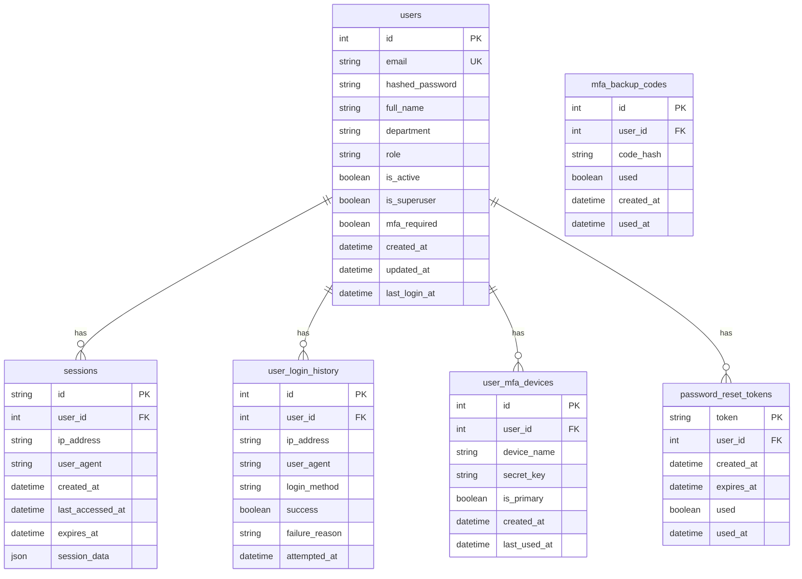

# 認証・認可システム データモデル設計書

## 1. 概要

本文書は、認証・認可システムのデータモデル設計を定義します。SQLAlchemy 2.0を使用したPythonのORMモデルとPostgreSQLデータベーススキーマを記載します。

## 2. Entity Relationship Diagram (ERD)



## 3. テーブル定義

### 3.1 users テーブル

| カラム名 | データ型 | 制約 | 説明 |
|---------|---------|------|------|
| id | SERIAL | PRIMARY KEY | ユーザーID |
| email | VARCHAR(255) | UNIQUE, NOT NULL | メールアドレス |
| hashed_password | VARCHAR(255) | NOT NULL | ハッシュ化されたパスワード |
| full_name | VARCHAR(100) | NOT NULL | 氏名 |
| department | VARCHAR(100) | | 部署名 |
| role | VARCHAR(50) | NOT NULL, DEFAULT 'user' | ロール（user, admin） |
| is_active | BOOLEAN | NOT NULL, DEFAULT true | アカウント有効フラグ |
| is_superuser | BOOLEAN | NOT NULL, DEFAULT false | スーパーユーザーフラグ |
| mfa_required | BOOLEAN | NOT NULL, DEFAULT false | MFA必須フラグ |
| session_timeout_hours | INTEGER | DEFAULT 8 | セッションタイムアウト（時間） |
| idle_timeout_minutes | INTEGER | DEFAULT 30 | アイドルタイムアウト（分） |
| failed_login_attempts | INTEGER | DEFAULT 0 | 連続ログイン失敗回数 |
| locked_until | TIMESTAMP | | アカウントロック解除時刻 |
| created_at | TIMESTAMP | NOT NULL | 作成日時 |
| updated_at | TIMESTAMP | NOT NULL | 更新日時 |
| last_login_at | TIMESTAMP | | 最終ログイン日時 |

**インデックス:**
- `idx_users_email` (email)
- `idx_users_is_active` (is_active)
- `idx_users_role` (role)

### 3.2 sessions テーブル

| カラム名 | データ型 | 制約 | 説明 |
|---------|---------|------|------|
| id | VARCHAR(255) | PRIMARY KEY | セッションID (UUID) |
| user_id | INTEGER | NOT NULL, FK(users.id) | ユーザーID |
| ip_address | VARCHAR(45) | NOT NULL | IPアドレス |
| user_agent | TEXT | | ユーザーエージェント |
| created_at | TIMESTAMP | NOT NULL | 作成日時 |
| last_accessed_at | TIMESTAMP | NOT NULL | 最終アクセス日時 |
| expires_at | TIMESTAMP | NOT NULL | 有効期限 |
| session_data | JSONB | | セッション追加データ |

**インデックス:**
- `idx_sessions_user_id` (user_id)
- `idx_sessions_expires_at` (expires_at)

### 3.3 user_mfa_devices テーブル

| カラム名 | データ型 | 制約 | 説明 |
|---------|---------|------|------|
| id | SERIAL | PRIMARY KEY | デバイスID |
| user_id | INTEGER | NOT NULL, FK(users.id) | ユーザーID |
| device_name | VARCHAR(100) | NOT NULL | デバイス名 |
| secret_key | VARCHAR(255) | NOT NULL | TOTPシークレットキー |
| is_primary | BOOLEAN | DEFAULT false | プライマリデバイスフラグ |
| created_at | TIMESTAMP | NOT NULL | 作成日時 |
| last_used_at | TIMESTAMP | | 最終使用日時 |

**インデックス:**
- `idx_mfa_devices_user_id` (user_id)

### 3.4 user_login_history テーブル

| カラム名 | データ型 | 制約 | 説明 |
|---------|---------|------|------|
| id | SERIAL | PRIMARY KEY | 履歴ID |
| user_id | INTEGER | FK(users.id) | ユーザーID（失敗時はNULL可） |
| email | VARCHAR(255) | | 試行されたメールアドレス |
| ip_address | VARCHAR(45) | NOT NULL | IPアドレス |
| user_agent | TEXT | | ユーザーエージェント |
| login_method | VARCHAR(50) | NOT NULL | ログイン方法（password, google） |
| success | BOOLEAN | NOT NULL | 成功フラグ |
| failure_reason | VARCHAR(100) | | 失敗理由 |
| attempted_at | TIMESTAMP | NOT NULL | 試行日時 |

**インデックス:**
- `idx_login_history_user_id` (user_id)
- `idx_login_history_attempted_at` (attempted_at)
- `idx_login_history_ip_address` (ip_address)

### 3.5 password_reset_tokens テーブル

| カラム名 | データ型 | 制約 | 説明 |
|---------|---------|------|------|
| token | VARCHAR(255) | PRIMARY KEY | リセットトークン |
| user_id | INTEGER | NOT NULL, FK(users.id) | ユーザーID |
| created_at | TIMESTAMP | NOT NULL | 作成日時 |
| expires_at | TIMESTAMP | NOT NULL | 有効期限 |
| used | BOOLEAN | DEFAULT false | 使用済みフラグ |
| used_at | TIMESTAMP | | 使用日時 |

**インデックス:**
- `idx_reset_tokens_user_id` (user_id)
- `idx_reset_tokens_expires_at` (expires_at)

### 3.6 mfa_backup_codes テーブル

| カラム名 | データ型 | 制約 | 説明 |
|---------|---------|------|------|
| id | SERIAL | PRIMARY KEY | コードID |
| user_id | INTEGER | NOT NULL, FK(users.id) | ユーザーID |
| code_hash | VARCHAR(255) | NOT NULL | ハッシュ化されたバックアップコード |
| used | BOOLEAN | DEFAULT false | 使用済みフラグ |
| created_at | TIMESTAMP | NOT NULL | 作成日時 |
| used_at | TIMESTAMP | | 使用日時 |

**インデックス:**
- `idx_backup_codes_user_id` (user_id)

## 4. SQLAlchemy モデル定義

```python
from datetime import datetime
from typing import Optional, List
from sqlalchemy import Boolean, Column, DateTime, ForeignKey, Integer, String, Text, JSON
from sqlalchemy.orm import Mapped, mapped_column, relationship
from sqlalchemy.ext.declarative import declarative_base

Base = declarative_base()

class User(Base):
    __tablename__ = "users"
    
    id: Mapped[int] = mapped_column(primary_key=True)
    email: Mapped[str] = mapped_column(String(255), unique=True, nullable=False, index=True)
    hashed_password: Mapped[str] = mapped_column(String(255), nullable=False)
    full_name: Mapped[str] = mapped_column(String(100), nullable=False)
    department: Mapped[Optional[str]] = mapped_column(String(100))
    role: Mapped[str] = mapped_column(String(50), nullable=False, default="user")
    is_active: Mapped[bool] = mapped_column(Boolean, nullable=False, default=True, index=True)
    is_superuser: Mapped[bool] = mapped_column(Boolean, nullable=False, default=False)
    mfa_required: Mapped[bool] = mapped_column(Boolean, nullable=False, default=False)
    session_timeout_hours: Mapped[int] = mapped_column(Integer, default=8)
    idle_timeout_minutes: Mapped[int] = mapped_column(Integer, default=30)
    failed_login_attempts: Mapped[int] = mapped_column(Integer, default=0)
    locked_until: Mapped[Optional[datetime]] = mapped_column(DateTime(timezone=True))
    created_at: Mapped[datetime] = mapped_column(DateTime(timezone=True), nullable=False, default=datetime.utcnow)
    updated_at: Mapped[datetime] = mapped_column(DateTime(timezone=True), nullable=False, default=datetime.utcnow, onupdate=datetime.utcnow)
    last_login_at: Mapped[Optional[datetime]] = mapped_column(DateTime(timezone=True))
    
    # Relationships
    sessions: Mapped[List["Session"]] = relationship("Session", back_populates="user", cascade="all, delete-orphan")
    mfa_devices: Mapped[List["UserMFADevice"]] = relationship("UserMFADevice", back_populates="user", cascade="all, delete-orphan")
    login_history: Mapped[List["UserLoginHistory"]] = relationship("UserLoginHistory", back_populates="user")
    password_reset_tokens: Mapped[List["PasswordResetToken"]] = relationship("PasswordResetToken", back_populates="user", cascade="all, delete-orphan")
    backup_codes: Mapped[List["MFABackupCode"]] = relationship("MFABackupCode", back_populates="user", cascade="all, delete-orphan")


class Session(Base):
    __tablename__ = "sessions"
    
    id: Mapped[str] = mapped_column(String(255), primary_key=True)
    user_id: Mapped[int] = mapped_column(ForeignKey("users.id"), nullable=False, index=True)
    ip_address: Mapped[str] = mapped_column(String(45), nullable=False)
    user_agent: Mapped[Optional[str]] = mapped_column(Text)
    created_at: Mapped[datetime] = mapped_column(DateTime(timezone=True), nullable=False, default=datetime.utcnow)
    last_accessed_at: Mapped[datetime] = mapped_column(DateTime(timezone=True), nullable=False, default=datetime.utcnow)
    expires_at: Mapped[datetime] = mapped_column(DateTime(timezone=True), nullable=False, index=True)
    session_data: Mapped[Optional[dict]] = mapped_column(JSON)
    
    # Relationships
    user: Mapped["User"] = relationship("User", back_populates="sessions")


class UserMFADevice(Base):
    __tablename__ = "user_mfa_devices"
    
    id: Mapped[int] = mapped_column(primary_key=True)
    user_id: Mapped[int] = mapped_column(ForeignKey("users.id"), nullable=False, index=True)
    device_name: Mapped[str] = mapped_column(String(100), nullable=False)
    secret_key: Mapped[str] = mapped_column(String(255), nullable=False)
    is_primary: Mapped[bool] = mapped_column(Boolean, default=False)
    created_at: Mapped[datetime] = mapped_column(DateTime(timezone=True), nullable=False, default=datetime.utcnow)
    last_used_at: Mapped[Optional[datetime]] = mapped_column(DateTime(timezone=True))
    
    # Relationships
    user: Mapped["User"] = relationship("User", back_populates="mfa_devices")


class UserLoginHistory(Base):
    __tablename__ = "user_login_history"
    
    id: Mapped[int] = mapped_column(primary_key=True)
    user_id: Mapped[Optional[int]] = mapped_column(ForeignKey("users.id"), index=True)
    email: Mapped[Optional[str]] = mapped_column(String(255))
    ip_address: Mapped[str] = mapped_column(String(45), nullable=False, index=True)
    user_agent: Mapped[Optional[str]] = mapped_column(Text)
    login_method: Mapped[str] = mapped_column(String(50), nullable=False)
    success: Mapped[bool] = mapped_column(Boolean, nullable=False)
    failure_reason: Mapped[Optional[str]] = mapped_column(String(100))
    attempted_at: Mapped[datetime] = mapped_column(DateTime(timezone=True), nullable=False, default=datetime.utcnow, index=True)
    
    # Relationships
    user: Mapped[Optional["User"]] = relationship("User", back_populates="login_history")


class PasswordResetToken(Base):
    __tablename__ = "password_reset_tokens"
    
    token: Mapped[str] = mapped_column(String(255), primary_key=True)
    user_id: Mapped[int] = mapped_column(ForeignKey("users.id"), nullable=False, index=True)
    created_at: Mapped[datetime] = mapped_column(DateTime(timezone=True), nullable=False, default=datetime.utcnow)
    expires_at: Mapped[datetime] = mapped_column(DateTime(timezone=True), nullable=False, index=True)
    used: Mapped[bool] = mapped_column(Boolean, default=False)
    used_at: Mapped[Optional[datetime]] = mapped_column(DateTime(timezone=True))
    
    # Relationships
    user: Mapped["User"] = relationship("User", back_populates="password_reset_tokens")


class MFABackupCode(Base):
    __tablename__ = "mfa_backup_codes"
    
    id: Mapped[int] = mapped_column(primary_key=True)
    user_id: Mapped[int] = mapped_column(ForeignKey("users.id"), nullable=False, index=True)
    code_hash: Mapped[str] = mapped_column(String(255), nullable=False)
    used: Mapped[bool] = mapped_column(Boolean, default=False)
    created_at: Mapped[datetime] = mapped_column(DateTime(timezone=True), nullable=False, default=datetime.utcnow)
    used_at: Mapped[Optional[datetime]] = mapped_column(DateTime(timezone=True))
    
    # Relationships
    user: Mapped["User"] = relationship("User", back_populates="backup_codes")
```

## 5. データ保持ポリシー

| テーブル | 保持期間 | 削除方法 |
|---------|---------|---------|
| users | 無期限（論理削除） | is_active = false |
| sessions | 有効期限後7日間 | 物理削除（バッチ処理） |
| user_login_history | 90日間 | 物理削除（バッチ処理） |
| password_reset_tokens | 使用後30日間 | 物理削除（バッチ処理） |
| mfa_backup_codes | 無期限 | ユーザー削除時に削除 |

## 6. パフォーマンス考慮事項

1. **インデックス戦略**
   - 頻繁に検索されるカラムにインデックスを設定
   - 複合インデックスは検索パターンに基づいて追加

2. **パーティショニング**
   - user_login_historyテーブルは月単位でパーティショニング検討
   - sessionsテーブルは日単位でパーティショニング検討

3. **キャッシュ戦略**
   - セッション情報はRedisでキャッシュ
   - ユーザー基本情報は5分間キャッシュ

## 7. セキュリティ考慮事項

1. **暗号化**
   - パスワードはbcryptでハッシュ化（cost factor: 12）
   - MFAシークレットキーは暗号化して保存
   - バックアップコードはハッシュ化して保存

2. **監査ログ**
   - すべての認証イベントをuser_login_historyに記録
   - 管理者操作は別途監査ログテーブルに記録（将来実装）

3. **データアクセス制限**
   - ユーザーは自分のデータのみアクセス可能
   - 管理者のみ他ユーザーのデータにアクセス可能