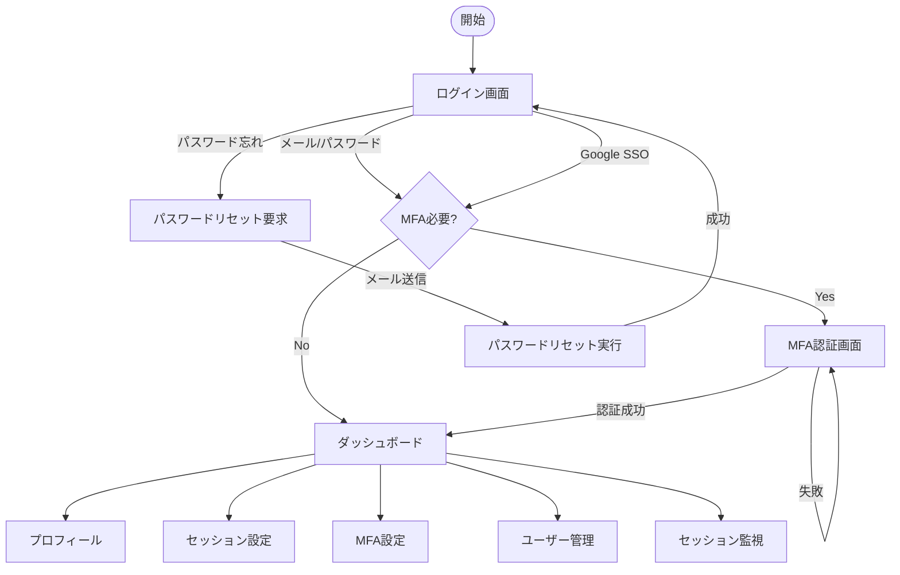

# 認証・認可システム UI/UX設計書

## 1. 概要

本文書は、認証・認可システムのユーザーインターフェース設計を定義します。React 18 + TypeScript 5を使用し、Tailwind CSSでスタイリングを行います。

## 2. 画面一覧

| 画面ID | 画面名 | URL | 説明 |
|--------|--------|-----|------|
| AUTH-01 | ログイン画面 | /login | メール/パスワードまたはGoogle SSOでログイン |
| AUTH-02 | MFA認証画面 | /login/mfa | 6桁のTOTPコード入力 |
| AUTH-03 | パスワードリセット要求 | /password/reset | メールアドレス入力 |
| AUTH-04 | パスワードリセット実行 | /password/reset/confirm | 新パスワード設定 |
| USER-01 | ユーザープロフィール | /profile | 自分の情報表示・編集 |
| USER-02 | セッション設定 | /profile/sessions | セッションタイムアウト設定 |
| USER-03 | MFA設定 | /profile/security | MFAデバイス管理 |
| ADMIN-01 | ユーザー管理 | /admin/users | ユーザー一覧・管理 |
| ADMIN-02 | セッション監視 | /admin/sessions | アクティブセッション一覧 |

## 3. 画面フロー



## 4. 画面詳細設計

### 4.1 ログイン画面（AUTH-01）

#### レイアウト
```
+----------------------------------+
|          ITDO ERP System         |
|          ログイン                |
+----------------------------------+
|                                  |
|  [メールアドレス_____________]  |
|                                  |
|  [パスワード_________________]  |
|                                  |
|  [✓] ログイン状態を保持する     |
|                                  |
|  [      ログイン      ]          |
|                                  |
|  ――――― または ―――――           |
|                                  |
|  [ Googleでログイン 🔍]          |
|                                  |
|  パスワードを忘れた方            |
+----------------------------------+
```

#### コンポーネント構成
```typescript
// components/auth/LoginForm.tsx
interface LoginFormProps {
  onSubmit: (email: string, password: string) => Promise<void>;
  onGoogleLogin: () => Promise<void>;
  isLoading: boolean;
}

// 主要な状態
- email: string
- password: string
- rememberMe: boolean
- error: string | null
- isLoading: boolean
```

#### バリデーション
- メールアドレス: RFC5322準拠
- パスワード: 8文字以上
- エラーメッセージ: 「メールアドレスまたはパスワードが正しくありません」（セキュリティのため詳細は非表示）

### 4.2 MFA認証画面（AUTH-02）

#### レイアウト
```
+----------------------------------+
|      2段階認証コードの入力       |
+----------------------------------+
|                                  |
|  Google Authenticatorアプリで    |
|  表示される6桁のコードを入力     |
|                                  |
|  [_] [_] [_] [_] [_] [_]        |
|                                  |
|  [       確認       ]            |
|                                  |
|  バックアップコードを使用        |
|                                  |
+----------------------------------+
```

#### UX考慮事項
- 数字入力時に自動的に次のフィールドへフォーカス移動
- ペースト対応（6桁の数字を一括入力可能）
- 残り時間インジケーター（オプション）

### 4.3 ユーザープロフィール（USER-01）

#### レイアウト
```
+----------------------------------+
|        ユーザープロフィール      |
+----------------------------------+
| 基本情報                         |
| -------------------------------- |
| メールアドレス: user@example.com |
| 氏名: [山田 太郎___________]     |
| 部署: [営業部______________]     |
|                                  |
| [  変更を保存  ]                 |
|                                  |
| セキュリティ設定                 |
| -------------------------------- |
| パスワード: ••••••••             |
| [パスワードを変更]               |
|                                  |
| 2段階認証: 有効 ✓               |
| [MFA設定を管理]                  |
+----------------------------------+
```

### 4.4 セッション設定（USER-02）

#### レイアウト
```
+----------------------------------+
|         セッション設定           |
+----------------------------------+
| セッションタイムアウト           |
| -------------------------------- |
| ログインセッションの有効時間     |
| [8  ] 時間 (1-24時間)           |
|                                  |
| アイドルタイムアウト             |
| [30 ] 分 (15-120分)             |
|                                  |
| [  設定を保存  ]                 |
|                                  |
| 現在のセッション                 |
| -------------------------------- |
| • Chrome - Windows (現在)        |
|   最終アクセス: 5分前            |
| • Safari - iPhone                |
|   最終アクセス: 2時間前          |
|   [終了]                         |
+----------------------------------+
```

### 4.5 ユーザー管理（ADMIN-01）

#### レイアウト
```
+----------------------------------+
|         ユーザー管理             |
+----------------------------------+
| [+ 新規ユーザー] [🔍 検索____]  |
|                                  |
| □ | 氏名 | メール | 部署 | 状態 |
| --|------|--------|------|------|
| □ | 山田 | y@ex.. | 営業 | 有効 |
| □ | 田中 | t@ex.. | 開発 | 有効 |
| □ | 鈴木 | s@ex.. | 総務 | 無効 |
|                                  |
| [◀] 1 2 3 ... 10 [▶]           |
+----------------------------------+
```

## 5. コンポーネント階層

```
src/
├── components/
│   ├── auth/
│   │   ├── LoginForm.tsx
│   │   ├── MFAForm.tsx
│   │   ├── PasswordResetForm.tsx
│   │   └── GoogleLoginButton.tsx
│   ├── user/
│   │   ├── ProfileForm.tsx
│   │   ├── SessionSettings.tsx
│   │   ├── SessionList.tsx
│   │   └── MFASettings.tsx
│   └── admin/
│       ├── UserList.tsx
│       ├── UserForm.tsx
│       ├── SessionMonitor.tsx
│       └── SessionItem.tsx
├── pages/
│   ├── auth/
│   │   ├── LoginPage.tsx
│   │   ├── MFAPage.tsx
│   │   └── PasswordResetPage.tsx
│   ├── user/
│   │   └── ProfilePage.tsx
│   └── admin/
│       ├── UsersPage.tsx
│       └── SessionsPage.tsx
└── layouts/
    ├── AuthLayout.tsx
    └── AppLayout.tsx
```

## 6. レスポンシブデザイン

### ブレークポイント
- Mobile: < 640px
- Tablet: 640px - 1024px
- Desktop: > 1024px

### モバイル対応
- ログインフォームは全画面表示
- テーブルはカード形式に変換
- ナビゲーションはハンバーガーメニュー

## 7. アクセシビリティ

- キーボードナビゲーション対応
- スクリーンリーダー対応（適切なARIAラベル）
- カラーコントラスト比 WCAG AA準拠
- フォーカスインジケーター明確化

## 8. エラーハンドリング

### エラー表示パターン
1. **フォームエラー**: フィールド下部に赤色テキスト
2. **システムエラー**: トースト通知（右上）
3. **認証エラー**: モーダルダイアログ

### エラーメッセージ例
- 「メールアドレスの形式が正しくありません」
- 「パスワードは8文字以上で入力してください」
- 「ネットワークエラーが発生しました。再度お試しください」

## 9. ローディング状態

- ボタン: スピナーアイコン表示 + disabled状態
- ページ遷移: プログレスバー（ページ上部）
- データ取得: スケルトンスクリーン

## 10. セキュリティ考慮事項

- パスワード入力フィールドは常にtype="password"
- オートコンプリートは適切に設定（autocomplete="current-password"等）
- セッションタイムアウト前の警告表示（5分前）
- 機密情報のマスキング表示