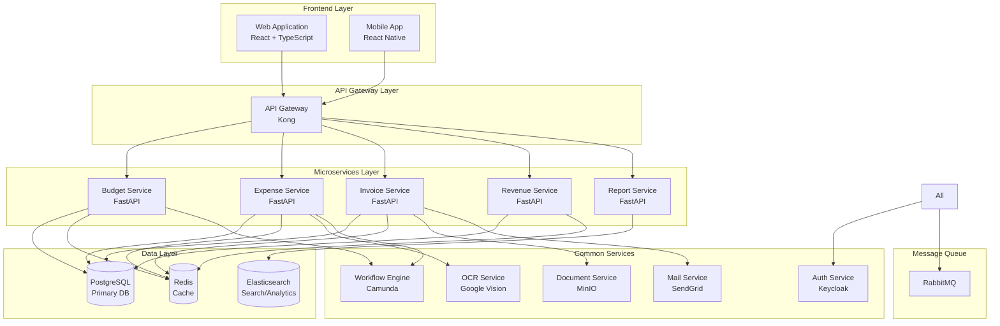
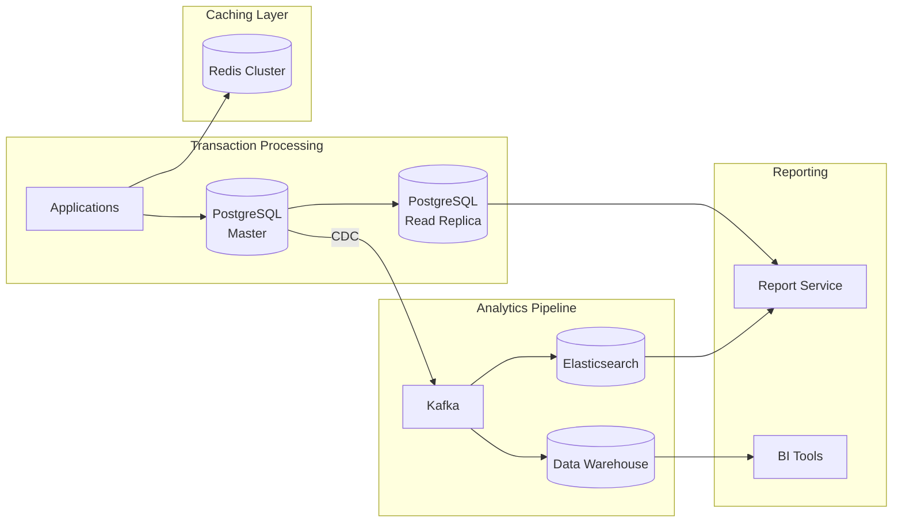
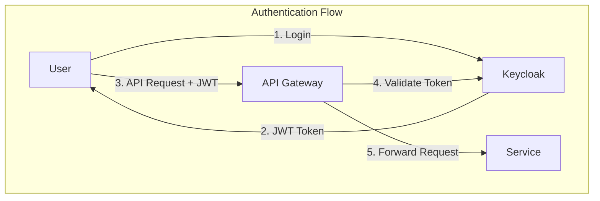
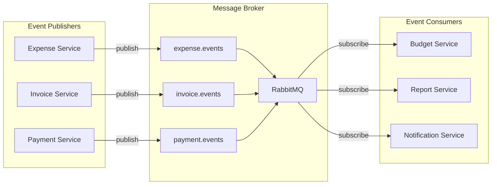
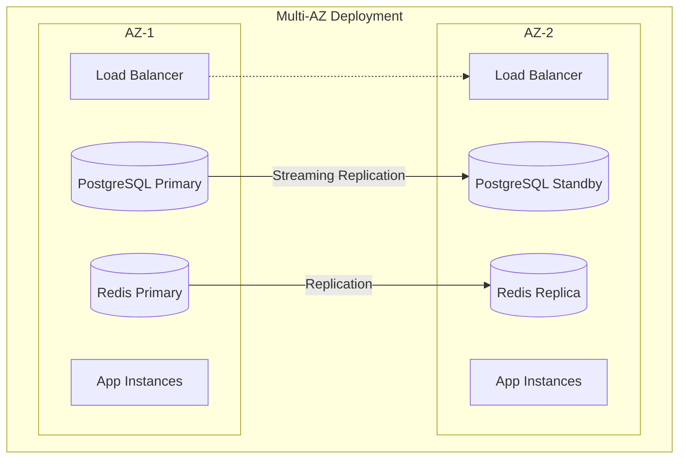
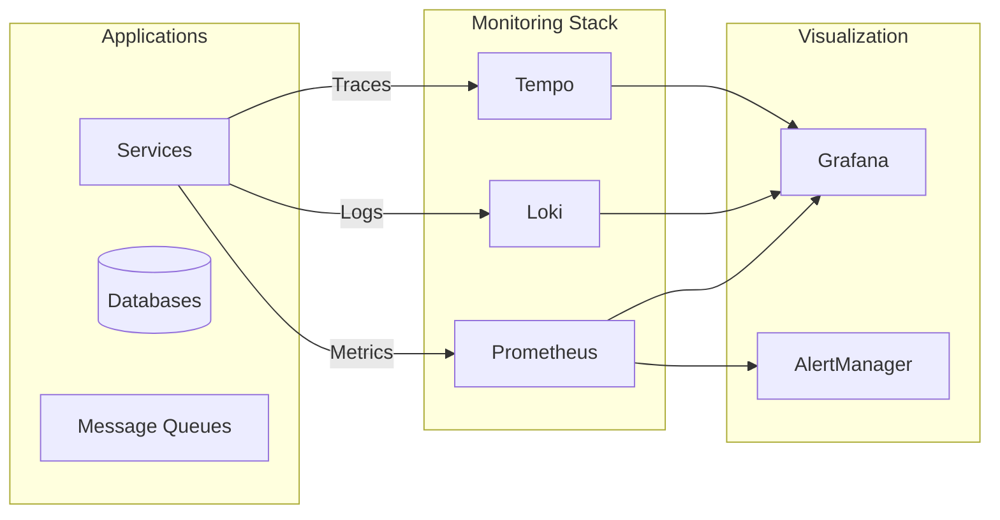
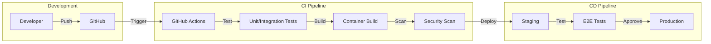
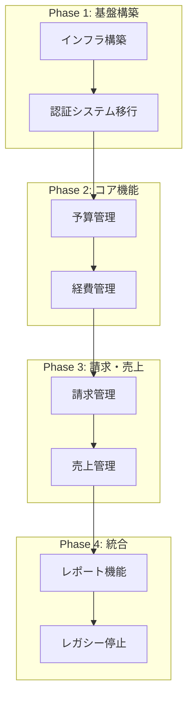

# 財務管理システム - システムアーキテクチャ設計書

## 1. 概要

本書では、財務管理システムのシステムアーキテクチャを定義します。
マイクロサービスアーキテクチャを採用し、スケーラビリティ、可用性、保守性を確保します。

## 2. アーキテクチャ概要

### 2.1 全体構成



### 2.2 技術スタック

| レイヤー | 技術 | 用途 |
|---------|------|------|
| Frontend | React 18 + TypeScript | Web UI |
| Mobile | React Native | モバイルアプリ |
| API Gateway | Kong | API管理、ルーティング |
| Backend | FastAPI (Python 3.13) | マイクロサービス |
| Database | PostgreSQL 15 | 主データストア |
| Cache | Redis 7 | キャッシュ、セッション |
| Search | Elasticsearch 8 | 全文検索、分析 |
| Message Queue | RabbitMQ | 非同期処理 |
| Auth | Keycloak | 認証・認可 |
| Workflow | Camunda | ワークフロー管理 |
| Storage | MinIO | オブジェクトストレージ |
| Container | Podman | コンテナ実行 |
| Orchestration | Kubernetes | コンテナオーケストレーション |

## 3. マイクロサービス設計

### 3.1 Budget Service（予算管理サービス）

```yaml
name: budget-service
description: 予算の作成、配分、消化管理
responsibilities:
  - 予算マスタ管理
  - 費目配分処理
  - 予算消化追跡
  - アラート生成
  
api_endpoints:
  - POST   /api/v1/budgets
  - GET    /api/v1/budgets
  - PUT    /api/v1/budgets/{id}
  - DELETE /api/v1/budgets/{id}
  - POST   /api/v1/budgets/{id}/allocations
  - GET    /api/v1/budgets/{id}/consumption
  - GET    /api/v1/budgets/{id}/alerts
  
dependencies:
  - postgresql: 予算データ永続化
  - redis: 消化状況キャッシュ
  - workflow-engine: 承認フロー
  - rabbitmq: アラート通知
  
events_published:
  - budget.created
  - budget.approved
  - budget.alert.threshold_exceeded
  
events_consumed:
  - expense.approved
  - invoice.created
```

### 3.2 Expense Service（経費管理サービス）

```yaml
name: expense-service
description: 経費申請、承認、精算処理
responsibilities:
  - 経費申請管理
  - 承認ワークフロー制御
  - 領収書管理
  - 月次精算バッチ
  
api_endpoints:
  - POST   /api/v1/expenses
  - GET    /api/v1/expenses
  - PUT    /api/v1/expenses/{id}
  - POST   /api/v1/expenses/{id}/approve
  - POST   /api/v1/expenses/{id}/reject
  - POST   /api/v1/expenses/ocr
  - POST   /api/v1/expenses/settlements
  
dependencies:
  - postgresql: 経費データ永続化
  - minio: 領収書画像保存
  - ocr-service: 領収書OCR処理
  - workflow-engine: 承認フロー
  - rabbitmq: 通知処理
  
events_published:
  - expense.submitted
  - expense.approved
  - expense.rejected
  - expense.settled
  
events_consumed:
  - None
```

### 3.3 Invoice Service（請求管理サービス）

```yaml
name: invoice-service
description: 見積、請求書の作成と管理
responsibilities:
  - 見積書管理
  - 請求書発行
  - インボイス対応
  - PDF生成
  
api_endpoints:
  - POST   /api/v1/quotes
  - GET    /api/v1/quotes
  - POST   /api/v1/quotes/{id}/convert-to-invoice
  - POST   /api/v1/invoices
  - GET    /api/v1/invoices
  - GET    /api/v1/invoices/{id}/pdf
  - POST   /api/v1/invoices/{id}/send
  
dependencies:
  - postgresql: 請求データ永続化
  - minio: PDF保存
  - mail-service: メール送信
  - rabbitmq: イベント処理
  
events_published:
  - quote.created
  - invoice.created
  - invoice.sent
  - invoice.overdue
  
events_consumed:
  - payment.received
```

### 3.4 Revenue Service（売上・入金管理サービス）

```yaml
name: revenue-service
description: 入金管理、売掛金管理、督促処理
responsibilities:
  - 入金登録・消込
  - 売掛金管理
  - エージング分析
  - 自動督促
  
api_endpoints:
  - POST   /api/v1/payments
  - GET    /api/v1/payments
  - POST   /api/v1/payments/import
  - POST   /api/v1/payments/reconcile
  - GET    /api/v1/receivables
  - GET    /api/v1/receivables/aging
  - POST   /api/v1/dunning/runs
  
dependencies:
  - postgresql: 入金データ永続化
  - elasticsearch: 売掛分析
  - mail-service: 督促メール
  - rabbitmq: イベント処理
  
events_published:
  - payment.received
  - payment.reconciled
  - dunning.letter.sent
  
events_consumed:
  - invoice.created
```

### 3.5 Report Service（レポートサービス）

```yaml
name: report-service
description: 財務レポート生成、分析
responsibilities:
  - 試算表生成
  - 財務諸表作成
  - 予実分析
  - ダッシュボードデータ提供
  
api_endpoints:
  - GET    /api/v1/reports/trial-balance
  - GET    /api/v1/reports/budget-actual
  - GET    /api/v1/reports/cash-flow
  - GET    /api/v1/reports/financial-statements
  - GET    /api/v1/reports/dashboard
  
dependencies:
  - postgresql: 読み取り専用接続
  - elasticsearch: 集計・分析
  - redis: レポートキャッシュ
  
events_published:
  - report.generated
  
events_consumed:
  - All financial events (read-only)
```

## 4. データアーキテクチャ

### 4.1 データフロー



### 4.2 データベース設計方針

#### トランザクションデータ（PostgreSQL）
- 正規化（第3正規形）
- パーティショニング（月次）
- インデックス最適化
- 論理削除

#### 分析データ（Elasticsearch）
- 非正規化
- 時系列インデックス
- 集計用事前計算

#### キャッシュ戦略（Redis）
- 予算消化状況: TTL 5分
- ユーザーセッション: TTL 30分
- レポートキャッシュ: TTL 1時間

## 5. セキュリティアーキテクチャ

### 5.1 認証・認可



### 5.2 セキュリティ対策

| 脅威 | 対策 |
|------|------|
| 不正アクセス | OAuth2.0/JWT認証、MFA |
| データ漏洩 | 暗号化（転送時/保存時）、アクセス制御 |
| SQLインジェクション | パラメータバインディング、入力検証 |
| XSS | CSP、出力エスケープ |
| CSRF | CSRFトークン、SameSite Cookie |
| DDoS | レート制限、WAF |

### 5.3 監査ログ

```yaml
audit_log_schema:
  - timestamp: ISO8601
  - user_id: string
  - action: string
  - resource: string
  - ip_address: string
  - user_agent: string
  - request_id: uuid
  - response_status: integer
  - response_time: float
```

## 6. 非同期処理アーキテクチャ

### 6.1 イベント駆動設計



### 6.2 バッチ処理

| バッチ名 | 実行タイミング | 処理内容 |
|---------|--------------|----------|
| 月次経費精算 | 月末最終営業日 22:00 | 承認済み経費の精算処理 |
| 定期請求生成 | 毎日 02:00 | 定期請求書の自動生成 |
| 督促処理 | 毎日 10:00 | 期限超過請求の督促状生成 |
| 予算アラート | 毎時 00分 | 予算消化状況チェック |
| レポート事前生成 | 毎日 06:00 | ダッシュボード用データ準備 |

## 7. 可用性・災害対策

### 7.1 高可用性構成



### 7.2 バックアップ戦略

| 対象 | 頻度 | 保持期間 | 方式 |
|------|------|---------|------|
| PostgreSQL | 日次（差分）、週次（フル） | 日次: 7日、週次: 4週、月次: 12ヶ月 | pgBackRest |
| ドキュメント | リアルタイム | 7年 | MinIO レプリケーション |
| 設定ファイル | 変更時 | 全バージョン | Git |

### 7.3 災害復旧計画

- **RTO（目標復旧時間）**: 4時間
- **RPO（目標復旧時点）**: 1時間
- **DR環境**: 別リージョンにスタンバイ環境を構築
- **切替手順**: 自動フェイルオーバー（データベース）、手動切替（アプリケーション）

## 8. パフォーマンス設計

### 8.1 パフォーマンス目標

| メトリクス | 目標値 |
|-----------|--------|
| API応答時間（95%ile） | < 200ms |
| API応答時間（99%ile） | < 500ms |
| 同時接続数 | 1,000+ |
| スループット | 100 req/sec |
| 可用性 | 99.9% |

### 8.2 パフォーマンス最適化

#### アプリケーション層
- 非同期処理（FastAPI async）
- コネクションプーリング
- バルクオペレーション
- ページネーション

#### データベース層
- クエリ最適化
- 適切なインデックス
- パーティショニング
- マテリアライズドビュー

#### キャッシュ戦略
- CDN（静的コンテンツ）
- Redis（セッション、頻繁アクセスデータ）
- アプリケーションキャッシュ（計算結果）

## 9. 監視・運用

### 9.1 監視アーキテクチャ



### 9.2 監視項目

| カテゴリ | メトリクス | アラート閾値 |
|---------|-----------|-------------|
| システム | CPU使用率 | > 80% |
| システム | メモリ使用率 | > 85% |
| システム | ディスク使用率 | > 90% |
| アプリケーション | エラー率 | > 1% |
| アプリケーション | 応答時間 | > 500ms |
| データベース | コネクション数 | > 80% |
| データベース | クエリ実行時間 | > 1s |

## 10. 開発・デプロイメント

### 10.1 CI/CDパイプライン



### 10.2 環境構成

| 環境 | 用途 | 構成 |
|------|------|------|
| Development | 開発 | ローカル、Docker Compose |
| Testing | 自動テスト | Kubernetes、縮小構成 |
| Staging | 受入テスト | Kubernetes、本番同等構成 |
| Production | 本番 | Kubernetes、高可用性構成 |

## 11. 移行計画

### 11.1 段階的移行



### 11.2 データ移行戦略

1. **マスタデータ移行**（Phase 1）
   - 勘定科目マスタ
   - 顧客マスタ
   - ユーザーマスタ

2. **残高移行**（Phase 2）
   - 期首残高として移行
   - 過去データは参照用に保持

3. **進行中取引**（Phase 3）
   - 未決済請求書
   - 承認待ち経費
   - 並行運用期間を設定

4. **履歴データ**（Phase 4）
   - 過去3年分を移行
   - それ以前はアーカイブ