# 財務管理システム - データモデル設計書

## 1. 概要

本書では、財務管理システムのデータモデル設計を定義します。
日本の会計基準および法規制に準拠し、拡張性と保守性を考慮した設計となっています。

## 2. ERダイアグラム

### 2.1 全体構成


### 2.2 予算管理ドメイン


### 2.3 経費管理ドメイン

```mermaid
erDiagram
    expenses {
        bigint id PK
        varchar(50) expense_number UK
        bigint employee_id FK
        date expense_date
        bigint department_id FK
        bigint project_id FK "NULL可"
        decimal total_amount
        enum status "draft/pending/approved/rejected/reimbursed"
        enum payment_method "cash/credit_card/bank_transfer"
        bigint advance_payment_id FK "NULL可・仮払精算"
        int current_approval_level
        timestamp submitted_at
        timestamp created_at
        timestamp updated_at
    }
    
    expense_items {
        bigint id PK
        bigint expense_id FK
        varchar(50) expense_type "transport/meeting/entertainment/supply/travel"
        varchar(20) account_code FK
        text description
        decimal amount
        decimal tax_rate
        decimal tax_amount
        varchar(200) vendor
        text attendees "会議費・交際費の場合"
        timestamp created_at
    }
    
    expense_receipts {
        bigint id PK
        bigint expense_id FK
        bigint expense_item_id FK "NULL可"
        varchar(255) file_name
        varchar(500) file_path
        varchar(50) file_type
        bigint file_size
        boolean ocr_processed
        json ocr_data "OCR結果JSON"
        timestamp uploaded_at
    }
    
    expense_approvals {
        bigint id PK
        bigint expense_id FK
        int approval_level
        bigint approver_id FK
        enum action "approved/rejected/returned"
        text comment
        timestamp action_date
        varchar(50) proxy_approver_id "NULL可・代理承認者"
    }
    
    expense_policies {
        bigint id PK
        bigint organization_id FK
        varchar(50) expense_type
        decimal max_amount "NULL可"
        boolean receipt_required
        boolean pre_approval_required
        int approval_levels
        json approval_rules "承認ルールJSON"
        time night_time_start "タクシー利用可能時間"
        timestamp effective_date
    }
    
    expense_settlements {
        bigint id PK
        varchar(50) settlement_number UK
        varchar(7) settlement_period "YYYY-MM"
        date settlement_date
        int employee_count
        decimal total_amount
        enum status "pending/processing/completed/failed"
        varchar(500) payment_file_path "NULL可"
        bigint created_by FK
        timestamp created_at
        timestamp completed_at "NULL可"
    }
    
    expense_settlement_details {
        bigint id PK
        bigint settlement_id FK
        bigint expense_id FK
        bigint employee_id FK
        decimal amount
        varchar(50) bank_account_number
        varchar(100) bank_account_name
    }
```



### 2.4 請求・売上管理ドメイン


### 2.5 会計共通ドメイン

```mermaid
erDiagram
    accounts {
        varchar(20) account_code PK
        varchar(200) account_name
        enum account_type "asset/liability/equity/revenue/expense"
        varchar(20) parent_account_code FK "NULL可・階層構造"
        int account_level
        boolean is_active
        boolean requires_subledger "補助元帳要否"
        timestamp created_at
        timestamp updated_at
    }
    
    fiscal_periods {
        bigint id PK
        bigint organization_id FK
        int fiscal_year
        date year_start
        date year_end
        enum status "open/closed/locked"
        timestamp created_at
        timestamp closed_at "NULL可"
    }
    
    monthly_closings {
        bigint id PK
        bigint fiscal_period_id FK
        int month_number
        date period_start
        date period_end
        enum status "open/closing/closed/locked"
        bigint closed_by FK "NULL可"
        timestamp started_at "NULL可"
        timestamp closed_at "NULL可"
    }
    
    journal_entries {
        bigint id PK
        varchar(50) entry_number UK
        date entry_date
        varchar(50) reference_type "manual/expense/invoice/payment"
        bigint reference_id "NULL可"
        text description
        enum status "draft/posted/cancelled"
        bigint created_by FK
        timestamp created_at
        timestamp posted_at "NULL可"
    }
    
    journal_lines {
        bigint id PK
        bigint journal_entry_id FK
        int line_number
        varchar(20) account_code FK
        decimal debit_amount
        decimal credit_amount
        text description
        bigint department_id FK "NULL可"
        bigint project_id FK "NULL可"
        timestamp created_at
    }
    
    account_balances {
        bigint id PK
        varchar(20) account_code FK
        date balance_date
        decimal opening_balance_debit
        decimal opening_balance_credit
        decimal period_debit
        decimal period_credit
        decimal closing_balance_debit
        decimal closing_balance_credit
        timestamp calculated_at
    }
```



## 3. テーブル詳細設計

### 3.1 予算管理テーブル

#### budgets（予算マスタ）

| カラム名 | データ型 | NULL | デフォルト | 説明 |
|----------|----------|------|------------|------|
| id | BIGINT | NO | AUTO_INCREMENT | 主キー |
| budget_code | VARCHAR(50) | NO | | 予算コード（一意） |
| budget_name | VARCHAR(200) | NO | | 予算名称 |
| fiscal_year | INT | NO | | 会計年度 |
| period_start | DATE | NO | | 期間開始日 |
| period_end | DATE | NO | | 期間終了日 |
| budget_type | ENUM | NO | | 予算タイプ |
| department_id | BIGINT | YES | NULL | 部門ID（FK） |
| project_id | BIGINT | YES | NULL | プロジェクトID（FK） |
| parent_budget_id | BIGINT | YES | NULL | 親予算ID（階層構造） |
| revenue_budget | DECIMAL(15,2) | NO | 0.00 | 売上予算 |
| cost_budget | DECIMAL(15,2) | NO | 0.00 | 原価予算 |
| expense_budget | DECIMAL(15,2) | NO | 0.00 | 経費予算 |
| total_budget | DECIMAL(15,2) | NO | 0.00 | 予算合計（計算値） |
| status | ENUM | NO | 'draft' | ステータス |
| created_by | BIGINT | NO | | 作成者ID（FK） |
| created_at | TIMESTAMP | NO | CURRENT_TIMESTAMP | 作成日時 |
| updated_at | TIMESTAMP | NO | CURRENT_TIMESTAMP ON UPDATE | 更新日時 |

**インデックス:**
- PRIMARY KEY (id)
- UNIQUE KEY (budget_code)
- INDEX (fiscal_year, department_id)
- INDEX (project_id)
- INDEX (parent_budget_id)
- INDEX (status)

**制約:**
- CHECK (period_end >= period_start)
- CHECK (total_budget = revenue_budget - cost_budget - expense_budget)
- 階層レベルは最大5まで（トリガーで実装）

#### budget_allocations（予算配分）

| カラム名 | データ型 | NULL | デフォルト | 説明 |
|----------|----------|------|------------|------|
| id | BIGINT | NO | AUTO_INCREMENT | 主キー |
| budget_id | BIGINT | NO | | 予算ID（FK） |
| account_code | VARCHAR(20) | NO | | 勘定科目コード（FK） |
| allocated_amount | DECIMAL(15,2) | NO | 0.00 | 配分額 |
| allocation_percentage | DECIMAL(5,2) | YES | NULL | 配分率 |
| allocation_method | ENUM | NO | 'fixed' | 配分方法 |
| created_at | TIMESTAMP | NO | CURRENT_TIMESTAMP | 作成日時 |

**インデックス:**
- PRIMARY KEY (id)
- UNIQUE KEY (budget_id, account_code)
- INDEX (account_code)

### 3.2 経費管理テーブル

#### expenses（経費申請）

| カラム名 | データ型 | NULL | デフォルト | 説明 |
|----------|----------|------|------------|------|
| id | BIGINT | NO | AUTO_INCREMENT | 主キー |
| expense_number | VARCHAR(50) | NO | | 経費番号（一意） |
| employee_id | BIGINT | NO | | 申請者ID（FK） |
| expense_date | DATE | NO | | 経費発生日 |
| department_id | BIGINT | NO | | 部門ID（FK） |
| project_id | BIGINT | YES | NULL | プロジェクトID（FK） |
| total_amount | DECIMAL(15,2) | NO | 0.00 | 合計金額 |
| status | ENUM | NO | 'draft' | ステータス |
| payment_method | ENUM | NO | | 支払方法 |
| advance_payment_id | BIGINT | YES | NULL | 仮払ID（FK） |
| current_approval_level | INT | NO | 0 | 現在の承認レベル |
| submitted_at | TIMESTAMP | YES | NULL | 申請日時 |
| created_at | TIMESTAMP | NO | CURRENT_TIMESTAMP | 作成日時 |
| updated_at | TIMESTAMP | NO | CURRENT_TIMESTAMP ON UPDATE | 更新日時 |

**インデックス:**
- PRIMARY KEY (id)
- UNIQUE KEY (expense_number)
- INDEX (employee_id, status)
- INDEX (expense_date)
- INDEX (department_id)
- INDEX (project_id)
- INDEX (advance_payment_id)

#### expense_items（経費明細）

| カラム名 | データ型 | NULL | デフォルト | 説明 |
|----------|----------|------|------------|------|
| id | BIGINT | NO | AUTO_INCREMENT | 主キー |
| expense_id | BIGINT | NO | | 経費申請ID（FK） |
| expense_type | VARCHAR(50) | NO | | 経費種別 |
| account_code | VARCHAR(20) | NO | | 勘定科目コード（FK） |
| description | TEXT | NO | | 説明 |
| amount | DECIMAL(15,2) | NO | | 金額（税抜） |
| tax_rate | DECIMAL(4,2) | NO | 10.00 | 税率 |
| tax_amount | DECIMAL(15,2) | NO | | 税額 |
| vendor | VARCHAR(200) | YES | NULL | 支払先 |
| attendees | TEXT | YES | NULL | 参加者（会議費等） |
| created_at | TIMESTAMP | NO | CURRENT_TIMESTAMP | 作成日時 |

**インデックス:**
- PRIMARY KEY (id)
- INDEX (expense_id)
- INDEX (expense_type)
- INDEX (account_code)

### 3.3 請求・売上管理テーブル

#### invoices（請求書）

| カラム名 | データ型 | NULL | デフォルト | 説明 |
|----------|----------|------|------------|------|
| id | BIGINT | NO | AUTO_INCREMENT | 主キー |
| invoice_number | VARCHAR(50) | NO | | 請求書番号（一意） |
| customer_id | BIGINT | NO | | 顧客ID（FK） |
| quote_id | BIGINT | YES | NULL | 見積ID（FK） |
| invoice_date | DATE | NO | | 請求日 |
| due_date | DATE | NO | | 支払期限 |
| subtotal_amount | DECIMAL(15,2) | NO | | 小計 |
| tax_amount_8 | DECIMAL(15,2) | NO | 0.00 | 消費税額（8%） |
| tax_amount_10 | DECIMAL(15,2) | NO | 0.00 | 消費税額（10%） |
| total_amount | DECIMAL(15,2) | NO | | 合計金額 |
| paid_amount | DECIMAL(15,2) | NO | 0.00 | 入金済額 |
| status | ENUM | NO | 'draft' | ステータス |
| payment_terms | VARCHAR(50) | YES | NULL | 支払条件 |
| is_qualified_invoice | BOOLEAN | NO | TRUE | 適格請求書フラグ |
| created_by | BIGINT | NO | | 作成者ID（FK） |
| created_at | TIMESTAMP | NO | CURRENT_TIMESTAMP | 作成日時 |
| updated_at | TIMESTAMP | NO | CURRENT_TIMESTAMP ON UPDATE | 更新日時 |

**インデックス:**
- PRIMARY KEY (id)
- UNIQUE KEY (invoice_number)
- INDEX (customer_id, status)
- INDEX (invoice_date)
- INDEX (due_date)
- INDEX (quote_id)

**制約:**
- CHECK (due_date >= invoice_date)
- CHECK (paid_amount <= total_amount)

#### payments（入金）

| カラム名 | データ型 | NULL | デフォルト | 説明 |
|----------|----------|------|------------|------|
| id | BIGINT | NO | AUTO_INCREMENT | 主キー |
| payment_number | VARCHAR(50) | NO | | 入金番号（一意） |
| customer_id | BIGINT | NO | | 顧客ID（FK） |
| payment_date | DATE | NO | | 入金日 |
| amount | DECIMAL(15,2) | NO | | 入金額 |
| payment_method | ENUM | NO | | 入金方法 |
| reference_number | VARCHAR(100) | YES | NULL | 参照番号 |
| status | ENUM | NO | 'pending' | ステータス |
| reconciled_by | BIGINT | YES | NULL | 消込実行者ID（FK） |
| received_at | TIMESTAMP | NO | CURRENT_TIMESTAMP | 受領日時 |
| reconciled_at | TIMESTAMP | YES | NULL | 消込日時 |

**インデックス:**
- PRIMARY KEY (id)
- UNIQUE KEY (payment_number)
- INDEX (customer_id)
- INDEX (payment_date)
- INDEX (status)

## 4. リレーションシップ

### 4.1 外部キー制約

```sql
-- 予算管理
ALTER TABLE budgets 
  ADD CONSTRAINT fk_budgets_department 
    FOREIGN KEY (department_id) REFERENCES departments(id),
  ADD CONSTRAINT fk_budgets_project 
    FOREIGN KEY (project_id) REFERENCES projects(id),
  ADD CONSTRAINT fk_budgets_parent 
    FOREIGN KEY (parent_budget_id) REFERENCES budgets(id),
  ADD CONSTRAINT fk_budgets_created_by 
    FOREIGN KEY (created_by) REFERENCES users(id);

ALTER TABLE budget_allocations
  ADD CONSTRAINT fk_budget_allocations_budget 
    FOREIGN KEY (budget_id) REFERENCES budgets(id) ON DELETE CASCADE,
  ADD CONSTRAINT fk_budget_allocations_account 
    FOREIGN KEY (account_code) REFERENCES accounts(account_code);

-- 経費管理
ALTER TABLE expenses
  ADD CONSTRAINT fk_expenses_employee 
    FOREIGN KEY (employee_id) REFERENCES users(id),
  ADD CONSTRAINT fk_expenses_department 
    FOREIGN KEY (department_id) REFERENCES departments(id),
  ADD CONSTRAINT fk_expenses_project 
    FOREIGN KEY (project_id) REFERENCES projects(id),
  ADD CONSTRAINT fk_expenses_advance 
    FOREIGN KEY (advance_payment_id) REFERENCES advance_payments(id);

ALTER TABLE expense_items
  ADD CONSTRAINT fk_expense_items_expense 
    FOREIGN KEY (expense_id) REFERENCES expenses(id) ON DELETE CASCADE,
  ADD CONSTRAINT fk_expense_items_account 
    FOREIGN KEY (account_code) REFERENCES accounts(account_code);

-- 請求・売上管理
ALTER TABLE invoices
  ADD CONSTRAINT fk_invoices_customer 
    FOREIGN KEY (customer_id) REFERENCES customers(id),
  ADD CONSTRAINT fk_invoices_quote 
    FOREIGN KEY (quote_id) REFERENCES quotes(id),
  ADD CONSTRAINT fk_invoices_created_by 
    FOREIGN KEY (created_by) REFERENCES users(id);

ALTER TABLE payments
  ADD CONSTRAINT fk_payments_customer 
    FOREIGN KEY (customer_id) REFERENCES customers(id),
  ADD CONSTRAINT fk_payments_reconciled_by 
    FOREIGN KEY (reconciled_by) REFERENCES users(id);
```

## 5. インデックス戦略

### 5.1 パフォーマンス最適化

#### 予算消化状況の高速化
```sql
CREATE INDEX idx_budget_consumption_lookup 
  ON budget_consumptions(budget_allocation_id, consumption_date);

CREATE INDEX idx_budget_alert_active 
  ON budget_alerts(budget_id, status) 
  WHERE status = 'active';
```

#### 経費承認フローの高速化
```sql
CREATE INDEX idx_expense_approval_pending 
  ON expenses(status, current_approval_level) 
  WHERE status = 'pending';

CREATE INDEX idx_expense_by_period 
  ON expenses(expense_date, employee_id, status);
```

#### 売掛金管理の高速化
```sql
CREATE INDEX idx_receivables_aging 
  ON receivables(customer_id, aging_bucket, balance_amount) 
  WHERE balance_amount > 0;

CREATE INDEX idx_dunning_candidates 
  ON receivables(days_overdue, last_dunning_date) 
  WHERE balance_amount > 0;
```

## 6. データ整合性

### 6.1 トリガー実装

#### 予算階層制限
```sql
DELIMITER //
CREATE TRIGGER check_budget_hierarchy_depth
BEFORE INSERT ON budgets
FOR EACH ROW
BEGIN
  DECLARE depth INT DEFAULT 0;
  DECLARE parent_id BIGINT;
  
  SET parent_id = NEW.parent_budget_id;
  
  WHILE parent_id IS NOT NULL AND depth < 5 DO
    SET depth = depth + 1;
    SELECT parent_budget_id INTO parent_id 
    FROM budgets WHERE id = parent_id;
  END WHILE;
  
  IF depth >= 5 THEN
    SIGNAL SQLSTATE '45000' 
    SET MESSAGE_TEXT = '予算階層は最大5レベルまでです';
  END IF;
END//
DELIMITER ;
```

#### 仕訳バランスチェック
```sql
DELIMITER //
CREATE TRIGGER check_journal_balance
BEFORE INSERT ON journal_entries
FOR EACH ROW
BEGIN
  DECLARE total_debit DECIMAL(15,2);
  DECLARE total_credit DECIMAL(15,2);
  
  SELECT 
    SUM(debit_amount), 
    SUM(credit_amount)
  INTO total_debit, total_credit
  FROM journal_lines 
  WHERE journal_entry_id = NEW.id;
  
  IF total_debit != total_credit THEN
    SIGNAL SQLSTATE '45000' 
    SET MESSAGE_TEXT = '借方と貸方が一致しません';
  END IF;
END//
DELIMITER ;
```

## 7. パーティショニング戦略

### 7.1 大量データ対応

#### journal_entriesテーブルのパーティショニング
```sql
ALTER TABLE journal_entries
PARTITION BY RANGE (YEAR(entry_date)) (
  PARTITION p2023 VALUES LESS THAN (2024),
  PARTITION p2024 VALUES LESS THAN (2025),
  PARTITION p2025 VALUES LESS THAN (2026),
  PARTITION p2026 VALUES LESS THAN (2027),
  PARTITION p_future VALUES LESS THAN MAXVALUE
);
```

#### expensesテーブルのパーティショニング
```sql
ALTER TABLE expenses
PARTITION BY RANGE (TO_DAYS(expense_date)) (
  PARTITION p202401 VALUES LESS THAN (TO_DAYS('2024-02-01')),
  PARTITION p202402 VALUES LESS THAN (TO_DAYS('2024-03-01')),
  -- 月次パーティション続く
);
```

## 8. セキュリティ考慮事項

### 8.1 個人情報保護
- 銀行口座情報は暗号化して保存
- 削除時は物理削除ではなく論理削除を使用
- アクセスログの記録

### 8.2 監査証跡
```sql
CREATE TABLE audit_logs (
  id BIGINT AUTO_INCREMENT PRIMARY KEY,
  table_name VARCHAR(50) NOT NULL,
  record_id BIGINT NOT NULL,
  action ENUM('INSERT', 'UPDATE', 'DELETE') NOT NULL,
  old_values JSON,
  new_values JSON,
  user_id BIGINT NOT NULL,
  ip_address VARCHAR(45),
  user_agent VARCHAR(255),
  created_at TIMESTAMP DEFAULT CURRENT_TIMESTAMP,
  INDEX idx_audit_table_record (table_name, record_id),
  INDEX idx_audit_user_date (user_id, created_at)
);
```

## 9. マイグレーション計画

### 9.1 既存データからの移行
1. マスタデータの移行（顧客、勘定科目など）
2. 残高データの移行（期首残高として）
3. 進行中取引の移行（未決済請求書など）
4. 履歴データの移行（過去3年分）

### 9.2 移行時の考慮事項
- 文字コードの統一（UTF-8mb4）
- NULL値の扱い
- 日付フォーマットの統一
- 金額の端数処理ルール