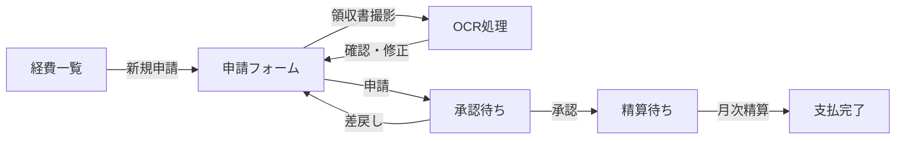
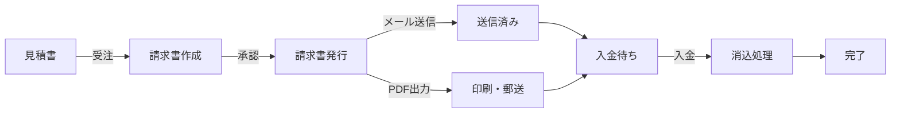

# 財務管理システム - UI/UXワイヤーフレーム設計書

## 1. 概要

本書では、財務管理システムのUI/UXデザインをワイヤーフレームで定義します。
ユーザビリティと業務効率を重視し、日本のビジネス慣習に適合したデザインを採用しています。

## 2. デザイン原則

### 2.1 基本原則
- **明確性**: 財務データの視認性を最優先
- **効率性**: 少ないクリックで目的達成
- **一貫性**: 操作パターンの統一
- **レスポンシブ**: デスクトップ/タブレット/モバイル対応
- **アクセシビリティ**: WCAG 2.1 AA準拠

### 2.2 カラーパレット
```
Primary: #1976D2 (Blue)
Secondary: #388E3C (Green) 
Accent: #F57C00 (Orange)
Error: #D32F2F (Red)
Warning: #FFA000 (Amber)
Success: #388E3C (Green)
Background: #F5F5F5
Surface: #FFFFFF
Text Primary: #212121
Text Secondary: #757575
```

## 3. 画面構成

### 3.1 共通レイアウト

```
┌─────────────────────────────────────────────────────────────┐
│ ┌─────────────────────────────────────────────────────────┐ │
│ │ [Logo] ITDO ERP  │ 財務管理 │ 山田太郎 ▼ │ 🔔 │ ⚙️     │ │ <- Header
│ └─────────────────────────────────────────────────────────┘ │
│ ┌─────────────┬───────────────────────────────────────────┐ │
│ │             │                                           │ │
│ │ ▼ 予算管理  │                                           │ │
│ │   予算一覧  │                                           │ │
│ │   予算作成  │           Main Content Area               │ │
│ │             │                                           │ │
│ │ ▼ 経費管理  │                                           │ │
│ │   経費申請  │                                           │ │
│ │   承認待ち  │                                           │ │
│ │   精算状況  │                                           │ │
│ │             │                                           │ │
│ │ ▼ 請求管理  │                                           │ │
│ │   見積作成  │                                           │ │
│ │   請求書   │                                           │ │
│ │   入金管理  │                                           │ │
│ │             │                                           │ │
│ │ ▼ レポート  │                                           │ │
│ │  ダッシュボード│                                          │ │
│ │   財務諸表  │                                           │ │
│ └─────────────┴───────────────────────────────────────────┘ │
└─────────────────────────────────────────────────────────────┘
  ^                ^
  Sidebar          Content Area
```

## 4. 主要画面デザイン

### 4.1 財務ダッシュボード

```
┌─────────────────────────────────────────────────────────────┐
│ 財務ダッシュボード                        期間: 2024年7月 ▼ │
├─────────────────────────────────────────────────────────────┤
│ ┌─────────────┬─────────────┬─────────────┬─────────────┐ │
│ │ 売上高      │ 営業利益率   │ 予算執行率  │ 売掛金残高  │ │
│ │ ¥15.5M      │ 12.5%       │ 78.5%      │ ¥6.38M     │ │
│ │ ▲+12.5%     │ ▲+2.3pt    │ ━━━━━━━━━  │ ▼-5.5%     │ │
│ └─────────────┴─────────────┴─────────────┴─────────────┘ │
│                                                             │
│ ┌─────────────────────────────┬─────────────────────────┐ │
│ │ 売上高推移                  │ キャッシュフロー        │ │
│ │ [折れ線グラフ]              │ [ウォーターフォール]    │ │
│ │                             │                         │ │
│ │                             │ 営業CF  +12.0M         │ │
│ │                             │ 投資CF   -6.0M         │ │
│ │                             │ 財務CF   -1.0M         │ │
│ │                             │ ─────────────          │ │
│ │                             │ 合計    +5.0M          │ │
│ └─────────────────────────────┴─────────────────────────┘ │
│                                                             │
│ ┌─────────────────────────────────────────────────────────┐ │
│ │ アラート                                          全て見る│ │
│ ├─────────────────────────────────────────────────────────┤ │
│ │ 🔴 営業部の交際費が月間予算の85%に到達            7/25 │ │
│ │ 🟡 XYZ工業の売掛金が60日超過                      7/20 │ │
│ │ 🔵 8月分定期請求の作成予定（5件）                 7/30 │ │
│ └─────────────────────────────────────────────────────────┘ │
└─────────────────────────────────────────────────────────────┘
```

### 4.2 予算管理画面

#### 4.2.1 予算一覧

```
┌─────────────────────────────────────────────────────────────┐
│ 予算管理                                                    │
├─────────────────────────────────────────────────────────────┤
│ [+ 新規予算] [⬇ エクスポート]     検索: [___________] [🔍] │
│                                                             │
│ 年度: [2024 ▼] 部門: [全て ▼] ステータス: [全て ▼]       │
│                                                             │
│ ┌─────────────────────────────────────────────────────────┐ │
│ │ □ 予算名              期間        総額      執行率  状態 │ │
│ ├─────────────────────────────────────────────────────────┤ │
│ │ □ 2024年度全社予算    2024/4-2025/3  ¥500M   45.2%  ✓  │ │
│ │   └ 営業部予算        2024/4-2025/3  ¥150M   48.5%  ✓  │ │
│ │   └ 開発部予算        2024/4-2025/3  ¥200M   42.1%  ✓  │ │
│ │   └ 管理部予算        2024/4-2025/3  ¥150M   46.0%  ✓  │ │
│ │ □ PRJ-001 開発予算    2024/4-2024/12  ¥60M   35.0%  ✓  │ │
│ │ □ Q2マーケ予算        2024/7-2024/9   ¥30M   65.0%  ⚠  │ │
│ └─────────────────────────────────────────────────────────┘ │
│                                              [1] 2 3 ... 10 > │
└─────────────────────────────────────────────────────────────┘
```

#### 4.2.2 予算詳細・消化状況

```
┌─────────────────────────────────────────────────────────────┐
│ 2024年度営業部予算                               [編集] [⋮] │
├─────────────────────────────────────────────────────────────┤
│ 基本情報 │ 費目配分 │ 消化状況 │ アラート │ 承認履歴       │
├─────────────────────────────────────────────────────────────┤
│ 予算期間: 2024/04/01 - 2025/03/31                          │
│ 承認日: 2024/03/25  承認者: 財務部長                       │
│                                                             │
│ ┌─────────────────────────────────────────────────────────┐ │
│ │ 費目別消化状況                             単位：千円    │ │
│ ├─────────────────────────────────────────────────────────┤ │
│ │ 費目        予算     実績    残額   執行率  前年同期     │ │
│ ├─────────────────────────────────────────────────────────┤ │
│ │ 人件費    80,000   32,000  48,000   40.0%  30,000      │ │
│ │ ■■■■■■■■■■■■■■■■□□□□□□□□□□□□□□□□□□□□□□□□         │ │
│ │                                                         │ │
│ │ 旅費交通費 20,000   11,500   8,500   57.5%   9,800      │ │
│ │ ■■■■■■■■■■■■■■■■■■■■■■■□□□□□□□□□□□□□□□□□         │ │
│ │                                                         │ │
│ │ 交際費    15,000   12,750   2,250   85.0%  11,200  ⚠   │ │
│ │ ■■■■■■■■■■■■■■■■■■■■■■■■■■■■■■■■■■□□□□□□         │ │
│ │                                                         │ │
│ │ 広告宣伝費 35,000   16,500  18,500   47.1%  15,000      │ │
│ │ ■■■■■■■■■■■■■■■■■■■□□□□□□□□□□□□□□□□□□□□□         │ │
│ └─────────────────────────────────────────────────────────┘ │
│                                                             │
│ [月次推移グラフ]  [予実対比表ダウンロード]                  │
└─────────────────────────────────────────────────────────────┘
```

### 4.3 経費管理画面

#### 4.3.1 経費申請（モバイル優先）

```
┌─────────────────────────────────┐
│ 📱 経費申請              [下書き]│
├─────────────────────────────────┤
│                                 │
│ 日付: [2024/07/15 ▼]           │
│                                 │
│ ┌─────────────────────────────┐ │
│ │ 📷 領収書を撮影              │ │
│ │    またはアップロード        │ │
│ │                             │ │
│ │    [カメラ] [ファイル]      │ │
│ └─────────────────────────────┘ │
│                                 │
│ 種別: [交通費 ▼]               │
│                                 │
│ 金額: ¥[___________]            │
│                                 │
│ 内容: [_____________________]   │
│                                 │
│ プロジェクト: [選択 ▼]         │
│                                 │
│ ┌─────────────────────────────┐ │
│ │ + 明細を追加                │ │
│ └─────────────────────────────┘ │
│                                 │
│ 合計: ¥2,340                    │
│                                 │
│ [キャンセル]  [下書き保存] [申請]│
└─────────────────────────────────┘
```

#### 4.3.2 承認待ち一覧（マネージャー用）

```
┌─────────────────────────────────────────────────────────────┐
│ 承認待ち経費                                   バッジ: 12    │
├─────────────────────────────────────────────────────────────┤
│ [一括承認] [フィルタ ▼]              表示: [カード ▼]      │
│                                                             │
│ ┌─────────────────────────────────────────────────────────┐ │
│ │ □ 山田太郎  EXP-2024-0715-001  2024/07/15  ¥45,500     │ │
│ │   交通費 ¥12,500 | 会議費 ¥33,000                      │ │
│ │   プロジェクト: PRJ-001 新規開発                        │ │
│ │   [詳細を見る]                      [承認] [差戻]       │ │
│ ├─────────────────────────────────────────────────────────┤ │
│ │ □ 鈴木花子  EXP-2024-0714-002  2024/07/14  ¥128,000 ⚠ │ │
│ │   接待交際費 ¥128,000                                   │ │
│ │   ⚠ 10万円超のため部長承認が必要                       │ │
│ │   [詳細を見る]                      [承認] [差戻]       │ │
│ ├─────────────────────────────────────────────────────────┤ │
│ │ □ 田中次郎  EXP-2024-0713-003  2024/07/13  ¥8,800     │ │
│ │   出張旅費 ¥8,800                                      │ │
│ │   出張先: 大阪                                          │ │
│ │   [詳細を見る]                      [承認] [差戻]       │ │
│ └─────────────────────────────────────────────────────────┘ │
└─────────────────────────────────────────────────────────────┘
```

### 4.4 請求・売上管理画面

#### 4.4.1 請求書作成

```
┌─────────────────────────────────────────────────────────────┐
│ 請求書作成                                      [プレビュー] │
├─────────────────────────────────────────────────────────────┤
│ 基本情報                                                    │
│ ┌─────────────────────────────────────────────────────────┐ │
│ │ 顧客: [ABC商事 ▼]           請求日: [2024/07/31]        │ │
│ │ 請求番号: INV-2024-0731-001  支払期限: [2024/08/31]     │ │
│ │ 件名: [7月分請求書________________________________]      │ │
│ └─────────────────────────────────────────────────────────┘ │
│                                                             │
│ 明細                                              [+ 行追加]│
│ ┌─────────────────────────────────────────────────────────┐ │
│ │ 品目              数量  単価      金額      税率  税額   │ │
│ ├─────────────────────────────────────────────────────────┤ │
│ │ コンサルティング   2.0  500,000  1,000,000  10%  100,000│ │
│ │ 月次レポート作成   1.0  200,000    200,000  10%   20,000│ │
│ │ [_______________] [__] [______] [________] [__] [______]│ │
│ └─────────────────────────────────────────────────────────┘ │
│                                                             │
│ ┌─────────────────────────────────────────────────────────┐ │
│ │                                    小計: ¥1,200,000     │ │
│ │                                消費税(10%): ¥120,000    │ │
│ │                                    ─────────────────    │ │
│ │                                    合計: ¥1,320,000     │ │
│ └─────────────────────────────────────────────────────────┘ │
│                                                             │
│ 適格請求書情報                                              │
│ ☑ 適格請求書として発行  登録番号: T1234567890123           │
│                                                             │
│ [キャンセル] [下書き保存] [承認申請] [発行]                 │
└─────────────────────────────────────────────────────────────┘
```

#### 4.4.2 入金消込画面

```
┌─────────────────────────────────────────────────────────────┐
│ 入金消込                                    取込日: 2024/07/31│
├─────────────────────────────────────────────────────────────┤
│ [銀行データ取込] [手動入力]           自動消込: ON [設定]    │
│                                                             │
│ 未消込入金                          │ 未消込請求書          │
│ ┌─────────────────────────────────┼─────────────────────┐ │
│ │ 2024/07/31 ｶﾌﾞ)ABCｼｮｳｼﾞ         │ INV-2024-0630-001   │ │
│ │ ¥1,100,000                       │ ABC商事             │ │
│ │ [自動マッチ ✓]                   │ ¥1,100,000         │ │
│ │                                  │ 期限: 2024/07/31    │ │
│ │────────────────────────────────  │─────────────────────│ │
│ │ 2024/07/31 XYZｺｳｷﾞｮｳ(ｶ          │ INV-2024-0630-002   │ │
│ │ ¥550,000                         │ XYZ工業             │ │
│ │ [自動マッチ ✓]                   │ ¥550,000           │ │
│ │                                  │ 期限: 2024/08/31    │ │
│ │────────────────────────────────  │─────────────────────│ │
│ │ 2024/07/31 ﾀﾅｶｼｮｳﾃﾝ             │ INV-2024-0715-001   │ │
│ │ ¥108,000                         │ 田中商店            │ │
│ │ [要確認 ⚠]                       │ ¥110,000           │ │
│ │ 差額: -¥2,000                    │ 期限: 2024/07/31    │ │
│ └─────────────────────────────────┴─────────────────────┘ │
│                                                             │
│ 消込処理オプション:                                         │
│ ○ 完全一致のみ自動消込  ● 差額を値引処理  ○ 手動確認     │
│                                                             │
│ [キャンセル]  [確認画面へ]  [消込実行]                     │
└─────────────────────────────────────────────────────────────┘
```

### 4.5 財務レポート画面

#### 4.5.1 試算表

```
┌─────────────────────────────────────────────────────────────┐
│ 試算表                              期間: 2024/07 単月 ▼     │
├─────────────────────────────────────────────────────────────┤
│ [印刷] [Excel出力] [PDF出力]        表示: [残高 ▼] [2 ▼]   │
│                                                             │
│ ┌─────────────────────────────────────────────────────────┐ │
│ │ 勘定科目              前月残高    借方     貸方   当月残高│ │
│ ├─────────────────────────────────────────────────────────┤ │
│ │ 【資産の部】                                            │ │
│ │ 流動資産                                                │ │
│ │  現金及び預金      25,000,000 45,000,000 38,000,000 32,000,000│ │
│ │  売掛金           18,000,000 16,000,000 14,800,000 19,200,000│ │
│ │  棚卸資産          8,000,000  2,500,000  2,000,000  8,500,000│ │
│ │  その他流動資産     2,000,000    500,000    200,000  2,300,000│ │
│ │  流動資産合計     53,000,000                       62,000,000│ │
│ │                                                         │ │
│ │ 固定資産                                                │ │
│ │  有形固定資産     25,000,000         0         0 25,000,000│ │
│ │  無形固定資産      5,000,000         0         0  5,000,000│ │
│ │  投資その他       8,000,000         0         0  8,000,000│ │
│ │  固定資産合計     38,000,000                       38,000,000│ │
│ │                                                         │ │
│ │ 資産合計         91,000,000                      100,000,000│ │
│ │                                                         │ │
│ │ 【負債の部】                                            │ │
│ │ 流動負債                                                │ │
│ │  買掛金           8,000,000  7,500,000  9,000,000  9,500,000│ │
│ │  ～ 以下省略 ～                                         │ │
│ └─────────────────────────────────────────────────────────┘ │
│                                                             │
│ 借方合計: ¥125,500,000  貸方合計: ¥125,500,000  差額: ¥0   │
└─────────────────────────────────────────────────────────────┘
```

#### 4.5.2 予実対比分析

```
┌─────────────────────────────────────────────────────────────┐
│ 予実対比分析                     2024年4月～7月 累計         │
├─────────────────────────────────────────────────────────────┤
│ 表示単位: [千円 ▼]  比較: [前年同期 ▼]  部門: [全社 ▼]   │
│                                                             │
│ ┌─────────────────────────────────────────────────────────┐ │
│ │ 損益計算書項目       予算      実績     差異   達成率 前年│ │
│ ├─────────────────────────────────────────────────────────┤ │
│ │ 売上高                                                  │ │
│ │  製品売上         60,000    58,500   -1,500  97.5%  52,000│ │
│ │  サービス売上     20,000    20,000        0 100.0%  18,000│ │
│ │  売上高合計       80,000    78,500   -1,500  98.1%  70,000│ │
│ │                                                         │ │
│ │ 売上原価                                                │ │
│ │  材料費          24,000    23,200     -800  96.7%  22,000│ │
│ │  労務費          16,000    16,500      500 103.1%  15,000│ │
│ │  製造経費         8,000     7,500     -500  93.8%   7,500│ │
│ │  売上原価合計     48,000    47,200     -800  98.3%  44,500│ │
│ │                                                         │ │
│ │ 売上総利益        32,000    31,300     -700  97.8%  25,500│ │
│ │ 売上総利益率       40.0%     39.9%   -0.1pt    -    36.4%│ │
│ │                                                         │ │
│ │ 販売費及び一般管理費                                     │ │
│ │  人件費          15,000    15,200      200 101.3%  14,000│ │
│ │  広告宣伝費       3,000     2,800     -200  93.3%   2,500│ │
│ │  その他経費       5,000     5,100      100 102.0%   4,500│ │
│ │  販管費合計      23,000    23,100      100 100.4%  21,000│ │
│ │                                                         │ │
│ │ 営業利益          9,000     8,200     -800  91.1%   4,500│ │
│ │ 営業利益率        11.3%     10.4%   -0.9pt    -     6.4%│ │
│ └─────────────────────────────────────────────────────────┘ │
│                                                             │
│ [グラフ表示] [詳細分析] [レポート出力]                      │
└─────────────────────────────────────────────────────────────┘
```

## 5. インタラクション設計

### 5.1 経費申請フロー



### 5.2 請求書発行フロー



## 6. レスポンシブデザイン

### 6.1 ブレークポイント
- Desktop: 1200px以上
- Tablet: 768px - 1199px  
- Mobile: 767px以下

### 6.2 モバイル最適化
- タッチターゲット: 最小44x44px
- スワイプ操作対応
- 縦向き/横向き対応
- オフライン時の下書き保存

## 7. アクセシビリティ

### 7.1 キーボード操作
- Tab順序の最適化
- ショートカットキー対応
- フォーカス表示の明確化

### 7.2 スクリーンリーダー対応
- 適切なARIAラベル
- セマンティックHTML
- 代替テキストの提供

## 8. パフォーマンス考慮

### 8.1 初期表示
- Above the fold優先
- 遅延ローディング
- スケルトンスクリーン

### 8.2 操作レスポンス
- 楽観的UI更新
- ローディング表示
- エラーハンドリング