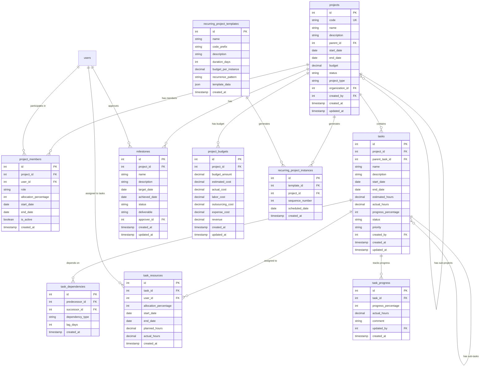

# プロジェクト管理システム - データモデル設計書

## 概要
プロジェクト管理システムのデータベース設計書です。SQLAlchemy 2.0のDeclarative Mappingを使用し、PostgreSQLに最適化された設計となっています。

## ERD（Entity Relationship Diagram）



## テーブル定義

### 1. projects（プロジェクト）

| カラム名 | データ型 | 制約 | 説明 |
|---------|---------|------|------|
| id | INTEGER | PK, AUTO_INCREMENT | プロジェクトID |
| code | VARCHAR(50) | UNIQUE, NOT NULL | プロジェクトコード |
| name | VARCHAR(100) | NOT NULL | プロジェクト名 |
| description | TEXT | | プロジェクト説明 |
| parent_id | INTEGER | FK(projects.id) | 親プロジェクトID |
| start_date | DATE | NOT NULL | 開始日 |
| end_date | DATE | NOT NULL | 終了日 |
| budget | DECIMAL(15,2) | DEFAULT 0 | 予算 |
| status | VARCHAR(20) | NOT NULL | ステータス |
| project_type | VARCHAR(20) | DEFAULT 'standard' | プロジェクトタイプ |
| organization_id | INTEGER | FK(organizations.id) | 組織ID |
| created_by | INTEGER | FK(users.id) | 作成者 |
| created_at | TIMESTAMP | NOT NULL | 作成日時 |
| updated_at | TIMESTAMP | NOT NULL | 更新日時 |
| deleted_at | TIMESTAMP | | 削除日時 |

**インデックス:**
- idx_projects_code (code)
- idx_projects_parent_id (parent_id)
- idx_projects_organization_id (organization_id)
- idx_projects_status (status)
- idx_projects_dates (start_date, end_date)

**制約:**
- ck_projects_dates: CHECK (end_date >= start_date)
- ck_projects_budget: CHECK (budget >= 0)
- ck_projects_status: CHECK (status IN ('planning', 'active', 'completed', 'suspended'))

### 2. project_members（プロジェクトメンバー）

| カラム名 | データ型 | 制約 | 説明 |
|---------|---------|------|------|
| id | INTEGER | PK, AUTO_INCREMENT | メンバーID |
| project_id | INTEGER | FK(projects.id), NOT NULL | プロジェクトID |
| user_id | INTEGER | FK(users.id), NOT NULL | ユーザーID |
| role | VARCHAR(50) | NOT NULL | 役割 |
| allocation_percentage | INTEGER | NOT NULL | 割当率 |
| start_date | DATE | NOT NULL | 参画開始日 |
| end_date | DATE | | 参画終了日 |
| is_active | BOOLEAN | DEFAULT TRUE | アクティブフラグ |
| created_at | TIMESTAMP | NOT NULL | 作成日時 |

**インデックス:**
- idx_project_members_project_user (project_id, user_id) UNIQUE
- idx_project_members_user_id (user_id)
- idx_project_members_dates (start_date, end_date)

**制約:**
- ck_project_members_allocation: CHECK (allocation_percentage BETWEEN 0 AND 100)
- ck_project_members_role: CHECK (role IN ('project_leader', 'architect', 'dev_leader', 'developer', 'tester', 'other'))

### 3. tasks（タスク）

| カラム名 | データ型 | 制約 | 説明 |
|---------|---------|------|------|
| id | INTEGER | PK, AUTO_INCREMENT | タスクID |
| project_id | INTEGER | FK(projects.id), NOT NULL | プロジェクトID |
| parent_task_id | INTEGER | FK(tasks.id) | 親タスクID |
| name | VARCHAR(200) | NOT NULL | タスク名 |
| description | TEXT | | タスク説明 |
| start_date | DATE | NOT NULL | 開始日 |
| end_date | DATE | NOT NULL | 終了日 |
| estimated_hours | DECIMAL(8,2) | | 見積工数 |
| actual_hours | DECIMAL(8,2) | DEFAULT 0 | 実績工数 |
| progress_percentage | INTEGER | DEFAULT 0 | 進捗率 |
| status | VARCHAR(20) | DEFAULT 'not_started' | ステータス |
| priority | VARCHAR(10) | DEFAULT 'medium' | 優先度 |
| created_by | INTEGER | FK(users.id) | 作成者 |
| created_at | TIMESTAMP | NOT NULL | 作成日時 |
| updated_at | TIMESTAMP | NOT NULL | 更新日時 |
| deleted_at | TIMESTAMP | | 削除日時 |

**インデックス:**
- idx_tasks_project_id (project_id)
- idx_tasks_parent_task_id (parent_task_id)
- idx_tasks_status (status)
- idx_tasks_dates (start_date, end_date)

**制約:**
- ck_tasks_dates: CHECK (end_date >= start_date)
- ck_tasks_progress: CHECK (progress_percentage BETWEEN 0 AND 100)
- ck_tasks_status: CHECK (status IN ('not_started', 'in_progress', 'completed', 'on_hold'))
- ck_tasks_priority: CHECK (priority IN ('high', 'medium', 'low'))

### 4. task_dependencies（タスク依存関係）

| カラム名 | データ型 | 制約 | 説明 |
|---------|---------|------|------|
| id | INTEGER | PK, AUTO_INCREMENT | 依存関係ID |
| predecessor_id | INTEGER | FK(tasks.id), NOT NULL | 先行タスクID |
| successor_id | INTEGER | FK(tasks.id), NOT NULL | 後続タスクID |
| dependency_type | VARCHAR(20) | DEFAULT 'finish_to_start' | 依存タイプ |
| lag_days | INTEGER | DEFAULT 0 | ラグ日数 |
| created_at | TIMESTAMP | NOT NULL | 作成日時 |

**インデックス:**
- idx_task_dependencies_unique (predecessor_id, successor_id) UNIQUE
- idx_task_dependencies_successor (successor_id)

**制約:**
- ck_task_dependencies_type: CHECK (dependency_type IN ('finish_to_start', 'start_to_start', 'finish_to_finish', 'start_to_finish'))
- ck_task_dependencies_not_self: CHECK (predecessor_id != successor_id)

### 5. task_resources（タスクリソース割当）

| カラム名 | データ型 | 制約 | 説明 |
|---------|---------|------|------|
| id | INTEGER | PK, AUTO_INCREMENT | 割当ID |
| task_id | INTEGER | FK(tasks.id), NOT NULL | タスクID |
| user_id | INTEGER | FK(users.id), NOT NULL | ユーザーID |
| allocation_percentage | INTEGER | NOT NULL | 割当率 |
| start_date | DATE | | 割当開始日 |
| end_date | DATE | | 割当終了日 |
| planned_hours | DECIMAL(8,2) | | 計画工数 |
| actual_hours | DECIMAL(8,2) | DEFAULT 0 | 実績工数 |
| created_at | TIMESTAMP | NOT NULL | 作成日時 |

**インデックス:**
- idx_task_resources_task_user (task_id, user_id)
- idx_task_resources_user_id (user_id)
- idx_task_resources_dates (start_date, end_date)

### 6. task_progress（タスク進捗履歴）

| カラム名 | データ型 | 制約 | 説明 |
|---------|---------|------|------|
| id | INTEGER | PK, AUTO_INCREMENT | 進捗ID |
| task_id | INTEGER | FK(tasks.id), NOT NULL | タスクID |
| progress_percentage | INTEGER | NOT NULL | 進捗率 |
| actual_hours | DECIMAL(8,2) | | 実績工数 |
| comment | TEXT | | コメント |
| updated_by | INTEGER | FK(users.id) | 更新者 |
| created_at | TIMESTAMP | NOT NULL | 記録日時 |

**インデックス:**
- idx_task_progress_task_id (task_id)
- idx_task_progress_created_at (created_at)

### 7. milestones（マイルストーン）

| カラム名 | データ型 | 制約 | 説明 |
|---------|---------|------|------|
| id | INTEGER | PK, AUTO_INCREMENT | マイルストーンID |
| project_id | INTEGER | FK(projects.id), NOT NULL | プロジェクトID |
| name | VARCHAR(100) | NOT NULL | マイルストーン名 |
| description | TEXT | | 説明 |
| target_date | DATE | NOT NULL | 目標日 |
| achieved_date | DATE | | 達成日 |
| status | VARCHAR(20) | DEFAULT 'pending' | ステータス |
| deliverable | VARCHAR(200) | | 成果物 |
| approver_id | INTEGER | FK(users.id) | 承認者 |
| created_at | TIMESTAMP | NOT NULL | 作成日時 |
| updated_at | TIMESTAMP | NOT NULL | 更新日時 |

**インデックス:**
- idx_milestones_project_id (project_id)
- idx_milestones_target_date (target_date)
- idx_milestones_status (status)

### 8. project_budgets（プロジェクト予算）

| カラム名 | データ型 | 制約 | 説明 |
|---------|---------|------|------|
| id | INTEGER | PK, AUTO_INCREMENT | 予算ID |
| project_id | INTEGER | FK(projects.id), UNIQUE, NOT NULL | プロジェクトID |
| budget_amount | DECIMAL(15,2) | DEFAULT 0 | 予算額 |
| estimated_cost | DECIMAL(15,2) | DEFAULT 0 | 見積原価 |
| actual_cost | DECIMAL(15,2) | DEFAULT 0 | 実績原価 |
| labor_cost | DECIMAL(15,2) | DEFAULT 0 | 人件費 |
| outsourcing_cost | DECIMAL(15,2) | DEFAULT 0 | 外注費 |
| expense_cost | DECIMAL(15,2) | DEFAULT 0 | 経費 |
| revenue | DECIMAL(15,2) | DEFAULT 0 | 収益 |
| created_at | TIMESTAMP | NOT NULL | 作成日時 |
| updated_at | TIMESTAMP | NOT NULL | 更新日時 |

**インデックス:**
- idx_project_budgets_project_id (project_id) UNIQUE

### 9. recurring_project_templates（繰り返しプロジェクトテンプレート）

| カラム名 | データ型 | 制約 | 説明 |
|---------|---------|------|------|
| id | INTEGER | PK, AUTO_INCREMENT | テンプレートID |
| name | VARCHAR(100) | NOT NULL | テンプレート名 |
| code_prefix | VARCHAR(30) | NOT NULL | コードプレフィックス |
| description | TEXT | | 説明 |
| duration_days | INTEGER | NOT NULL | 期間（日数） |
| budget_per_instance | DECIMAL(15,2) | DEFAULT 0 | 1回あたり予算 |
| recurrence_pattern | VARCHAR(20) | NOT NULL | 繰り返しパターン |
| template_data | JSONB | | テンプレートデータ |
| created_at | TIMESTAMP | NOT NULL | 作成日時 |

### 10. recurring_project_instances（繰り返しプロジェクトインスタンス）

| カラム名 | データ型 | 制約 | 説明 |
|---------|---------|------|------|
| id | INTEGER | PK, AUTO_INCREMENT | インスタンスID |
| template_id | INTEGER | FK(recurring_project_templates.id), NOT NULL | テンプレートID |
| project_id | INTEGER | FK(projects.id), NOT NULL | プロジェクトID |
| sequence_number | INTEGER | NOT NULL | シーケンス番号 |
| scheduled_date | DATE | NOT NULL | 予定日 |
| created_at | TIMESTAMP | NOT NULL | 作成日時 |

**インデックス:**
- idx_recurring_instances_template (template_id)
- idx_recurring_instances_project (project_id) UNIQUE

## SQLAlchemy 2.0 モデル定義

```python
from datetime import datetime
from decimal import Decimal
from typing import List, Optional

from sqlalchemy import (
    Boolean, CheckConstraint, Column, Date, DateTime, 
    Decimal as SQLDecimal, ForeignKey, Integer, String, Text,
    UniqueConstraint, Index
)
from sqlalchemy.dialects.postgresql import JSONB
from sqlalchemy.orm import Mapped, mapped_column, relationship

from app.models.base import Base


class Project(Base):
    """プロジェクトモデル"""
    __tablename__ = "projects"
    
    id: Mapped[int] = mapped_column(Integer, primary_key=True)
    code: Mapped[str] = mapped_column(String(50), unique=True, nullable=False)
    name: Mapped[str] = mapped_column(String(100), nullable=False)
    description: Mapped[Optional[str]] = mapped_column(Text)
    parent_id: Mapped[Optional[int]] = mapped_column(Integer, ForeignKey("projects.id"))
    start_date: Mapped[datetime] = mapped_column(Date, nullable=False)
    end_date: Mapped[datetime] = mapped_column(Date, nullable=False)
    budget: Mapped[Decimal] = mapped_column(SQLDecimal(15, 2), default=0)
    status: Mapped[str] = mapped_column(String(20), nullable=False)
    project_type: Mapped[str] = mapped_column(String(20), default="standard")
    organization_id: Mapped[int] = mapped_column(Integer, ForeignKey("organizations.id"))
    created_by: Mapped[int] = mapped_column(Integer, ForeignKey("users.id"))
    created_at: Mapped[datetime] = mapped_column(DateTime, default=datetime.utcnow)
    updated_at: Mapped[datetime] = mapped_column(DateTime, default=datetime.utcnow, onupdate=datetime.utcnow)
    deleted_at: Mapped[Optional[datetime]] = mapped_column(DateTime)
    
    # Relationships
    parent: Mapped[Optional["Project"]] = relationship(
        "Project", remote_side="Project.id", back_populates="sub_projects"
    )
    sub_projects: Mapped[List["Project"]] = relationship(
        "Project", back_populates="parent"
    )
    members: Mapped[List["ProjectMember"]] = relationship(
        "ProjectMember", back_populates="project"
    )
    tasks: Mapped[List["Task"]] = relationship(
        "Task", back_populates="project"
    )
    milestones: Mapped[List["Milestone"]] = relationship(
        "Milestone", back_populates="project"
    )
    budget_info: Mapped[Optional["ProjectBudget"]] = relationship(
        "ProjectBudget", back_populates="project", uselist=False
    )
    
    # Constraints
    __table_args__ = (
        CheckConstraint("end_date >= start_date", name="ck_projects_dates"),
        CheckConstraint("budget >= 0", name="ck_projects_budget"),
        CheckConstraint(
            "status IN ('planning', 'active', 'completed', 'suspended')",
            name="ck_projects_status"
        ),
        Index("idx_projects_code", "code"),
        Index("idx_projects_parent_id", "parent_id"),
        Index("idx_projects_organization_id", "organization_id"),
        Index("idx_projects_status", "status"),
        Index("idx_projects_dates", "start_date", "end_date"),
    )


class ProjectMember(Base):
    """プロジェクトメンバーモデル"""
    __tablename__ = "project_members"
    
    id: Mapped[int] = mapped_column(Integer, primary_key=True)
    project_id: Mapped[int] = mapped_column(Integer, ForeignKey("projects.id"), nullable=False)
    user_id: Mapped[int] = mapped_column(Integer, ForeignKey("users.id"), nullable=False)
    role: Mapped[str] = mapped_column(String(50), nullable=False)
    allocation_percentage: Mapped[int] = mapped_column(Integer, nullable=False)
    start_date: Mapped[datetime] = mapped_column(Date, nullable=False)
    end_date: Mapped[Optional[datetime]] = mapped_column(Date)
    is_active: Mapped[bool] = mapped_column(Boolean, default=True)
    created_at: Mapped[datetime] = mapped_column(DateTime, default=datetime.utcnow)
    
    # Relationships
    project: Mapped["Project"] = relationship("Project", back_populates="members")
    user: Mapped["User"] = relationship("User", back_populates="project_memberships")
    
    # Constraints
    __table_args__ = (
        UniqueConstraint("project_id", "user_id", name="uq_project_members_project_user"),
        CheckConstraint(
            "allocation_percentage BETWEEN 0 AND 100",
            name="ck_project_members_allocation"
        ),
        CheckConstraint(
            "role IN ('project_leader', 'architect', 'dev_leader', 'developer', 'tester', 'other')",
            name="ck_project_members_role"
        ),
        Index("idx_project_members_user_id", "user_id"),
        Index("idx_project_members_dates", "start_date", "end_date"),
    )


class Task(Base):
    """タスクモデル"""
    __tablename__ = "tasks"
    
    id: Mapped[int] = mapped_column(Integer, primary_key=True)
    project_id: Mapped[int] = mapped_column(Integer, ForeignKey("projects.id"), nullable=False)
    parent_task_id: Mapped[Optional[int]] = mapped_column(Integer, ForeignKey("tasks.id"))
    name: Mapped[str] = mapped_column(String(200), nullable=False)
    description: Mapped[Optional[str]] = mapped_column(Text)
    start_date: Mapped[datetime] = mapped_column(Date, nullable=False)
    end_date: Mapped[datetime] = mapped_column(Date, nullable=False)
    estimated_hours: Mapped[Optional[Decimal]] = mapped_column(SQLDecimal(8, 2))
    actual_hours: Mapped[Decimal] = mapped_column(SQLDecimal(8, 2), default=0)
    progress_percentage: Mapped[int] = mapped_column(Integer, default=0)
    status: Mapped[str] = mapped_column(String(20), default="not_started")
    priority: Mapped[str] = mapped_column(String(10), default="medium")
    created_by: Mapped[int] = mapped_column(Integer, ForeignKey("users.id"))
    created_at: Mapped[datetime] = mapped_column(DateTime, default=datetime.utcnow)
    updated_at: Mapped[datetime] = mapped_column(DateTime, default=datetime.utcnow, onupdate=datetime.utcnow)
    deleted_at: Mapped[Optional[datetime]] = mapped_column(DateTime)
    
    # Relationships
    project: Mapped["Project"] = relationship("Project", back_populates="tasks")
    parent_task: Mapped[Optional["Task"]] = relationship(
        "Task", remote_side="Task.id", back_populates="sub_tasks"
    )
    sub_tasks: Mapped[List["Task"]] = relationship(
        "Task", back_populates="parent_task"
    )
    dependencies_as_predecessor: Mapped[List["TaskDependency"]] = relationship(
        "TaskDependency", foreign_keys="TaskDependency.predecessor_id", back_populates="predecessor"
    )
    dependencies_as_successor: Mapped[List["TaskDependency"]] = relationship(
        "TaskDependency", foreign_keys="TaskDependency.successor_id", back_populates="successor"
    )
    resources: Mapped[List["TaskResource"]] = relationship(
        "TaskResource", back_populates="task"
    )
    progress_history: Mapped[List["TaskProgress"]] = relationship(
        "TaskProgress", back_populates="task"
    )
    
    # Constraints
    __table_args__ = (
        CheckConstraint("end_date >= start_date", name="ck_tasks_dates"),
        CheckConstraint("progress_percentage BETWEEN 0 AND 100", name="ck_tasks_progress"),
        CheckConstraint(
            "status IN ('not_started', 'in_progress', 'completed', 'on_hold')",
            name="ck_tasks_status"
        ),
        CheckConstraint("priority IN ('high', 'medium', 'low')", name="ck_tasks_priority"),
        Index("idx_tasks_project_id", "project_id"),
        Index("idx_tasks_parent_task_id", "parent_task_id"),
        Index("idx_tasks_status", "status"),
        Index("idx_tasks_dates", "start_date", "end_date"),
    )


class TaskDependency(Base):
    """タスク依存関係モデル"""
    __tablename__ = "task_dependencies"
    
    id: Mapped[int] = mapped_column(Integer, primary_key=True)
    predecessor_id: Mapped[int] = mapped_column(Integer, ForeignKey("tasks.id"), nullable=False)
    successor_id: Mapped[int] = mapped_column(Integer, ForeignKey("tasks.id"), nullable=False)
    dependency_type: Mapped[str] = mapped_column(String(20), default="finish_to_start")
    lag_days: Mapped[int] = mapped_column(Integer, default=0)
    created_at: Mapped[datetime] = mapped_column(DateTime, default=datetime.utcnow)
    
    # Relationships
    predecessor: Mapped["Task"] = relationship(
        "Task", foreign_keys=[predecessor_id], back_populates="dependencies_as_predecessor"
    )
    successor: Mapped["Task"] = relationship(
        "Task", foreign_keys=[successor_id], back_populates="dependencies_as_successor"
    )
    
    # Constraints
    __table_args__ = (
        UniqueConstraint("predecessor_id", "successor_id", name="uq_task_dependencies_unique"),
        CheckConstraint(
            "dependency_type IN ('finish_to_start', 'start_to_start', 'finish_to_finish', 'start_to_finish')",
            name="ck_task_dependencies_type"
        ),
        CheckConstraint("predecessor_id != successor_id", name="ck_task_dependencies_not_self"),
        Index("idx_task_dependencies_successor", "successor_id"),
    )


class TaskResource(Base):
    """タスクリソース割当モデル"""
    __tablename__ = "task_resources"
    
    id: Mapped[int] = mapped_column(Integer, primary_key=True)
    task_id: Mapped[int] = mapped_column(Integer, ForeignKey("tasks.id"), nullable=False)
    user_id: Mapped[int] = mapped_column(Integer, ForeignKey("users.id"), nullable=False)
    allocation_percentage: Mapped[int] = mapped_column(Integer, nullable=False)
    start_date: Mapped[Optional[datetime]] = mapped_column(Date)
    end_date: Mapped[Optional[datetime]] = mapped_column(Date)
    planned_hours: Mapped[Optional[Decimal]] = mapped_column(SQLDecimal(8, 2))
    actual_hours: Mapped[Decimal] = mapped_column(SQLDecimal(8, 2), default=0)
    created_at: Mapped[datetime] = mapped_column(DateTime, default=datetime.utcnow)
    
    # Relationships
    task: Mapped["Task"] = relationship("Task", back_populates="resources")
    user: Mapped["User"] = relationship("User", back_populates="task_assignments")
    
    # Constraints
    __table_args__ = (
        CheckConstraint(
            "allocation_percentage BETWEEN 0 AND 100",
            name="ck_task_resources_allocation"
        ),
        Index("idx_task_resources_task_user", "task_id", "user_id"),
        Index("idx_task_resources_user_id", "user_id"),
        Index("idx_task_resources_dates", "start_date", "end_date"),
    )


class TaskProgress(Base):
    """タスク進捗履歴モデル"""
    __tablename__ = "task_progress"
    
    id: Mapped[int] = mapped_column(Integer, primary_key=True)
    task_id: Mapped[int] = mapped_column(Integer, ForeignKey("tasks.id"), nullable=False)
    progress_percentage: Mapped[int] = mapped_column(Integer, nullable=False)
    actual_hours: Mapped[Optional[Decimal]] = mapped_column(SQLDecimal(8, 2))
    comment: Mapped[Optional[str]] = mapped_column(Text)
    updated_by: Mapped[int] = mapped_column(Integer, ForeignKey("users.id"))
    created_at: Mapped[datetime] = mapped_column(DateTime, default=datetime.utcnow)
    
    # Relationships
    task: Mapped["Task"] = relationship("Task", back_populates="progress_history")
    updater: Mapped["User"] = relationship("User")
    
    # Constraints
    __table_args__ = (
        CheckConstraint("progress_percentage BETWEEN 0 AND 100", name="ck_task_progress_percentage"),
        Index("idx_task_progress_task_id", "task_id"),
        Index("idx_task_progress_created_at", "created_at"),
    )


class Milestone(Base):
    """マイルストーンモデル"""
    __tablename__ = "milestones"
    
    id: Mapped[int] = mapped_column(Integer, primary_key=True)
    project_id: Mapped[int] = mapped_column(Integer, ForeignKey("projects.id"), nullable=False)
    name: Mapped[str] = mapped_column(String(100), nullable=False)
    description: Mapped[Optional[str]] = mapped_column(Text)
    target_date: Mapped[datetime] = mapped_column(Date, nullable=False)
    achieved_date: Mapped[Optional[datetime]] = mapped_column(Date)
    status: Mapped[str] = mapped_column(String(20), default="pending")
    deliverable: Mapped[Optional[str]] = mapped_column(String(200))
    approver_id: Mapped[Optional[int]] = mapped_column(Integer, ForeignKey("users.id"))
    created_at: Mapped[datetime] = mapped_column(DateTime, default=datetime.utcnow)
    updated_at: Mapped[datetime] = mapped_column(DateTime, default=datetime.utcnow, onupdate=datetime.utcnow)
    
    # Relationships
    project: Mapped["Project"] = relationship("Project", back_populates="milestones")
    approver: Mapped[Optional["User"]] = relationship("User")
    
    # Constraints
    __table_args__ = (
        CheckConstraint(
            "status IN ('pending', 'achieved', 'delayed', 'cancelled')",
            name="ck_milestones_status"
        ),
        Index("idx_milestones_project_id", "project_id"),
        Index("idx_milestones_target_date", "target_date"),
        Index("idx_milestones_status", "status"),
    )


class ProjectBudget(Base):
    """プロジェクト予算モデル"""
    __tablename__ = "project_budgets"
    
    id: Mapped[int] = mapped_column(Integer, primary_key=True)
    project_id: Mapped[int] = mapped_column(Integer, ForeignKey("projects.id"), unique=True, nullable=False)
    budget_amount: Mapped[Decimal] = mapped_column(SQLDecimal(15, 2), default=0)
    estimated_cost: Mapped[Decimal] = mapped_column(SQLDecimal(15, 2), default=0)
    actual_cost: Mapped[Decimal] = mapped_column(SQLDecimal(15, 2), default=0)
    labor_cost: Mapped[Decimal] = mapped_column(SQLDecimal(15, 2), default=0)
    outsourcing_cost: Mapped[Decimal] = mapped_column(SQLDecimal(15, 2), default=0)
    expense_cost: Mapped[Decimal] = mapped_column(SQLDecimal(15, 2), default=0)
    revenue: Mapped[Decimal] = mapped_column(SQLDecimal(15, 2), default=0)
    created_at: Mapped[datetime] = mapped_column(DateTime, default=datetime.utcnow)
    updated_at: Mapped[datetime] = mapped_column(DateTime, default=datetime.utcnow, onupdate=datetime.utcnow)
    
    # Relationships
    project: Mapped["Project"] = relationship("Project", back_populates="budget_info")
    
    # Constraints
    __table_args__ = (
        Index("idx_project_budgets_project_id", "project_id"),
    )


class RecurringProjectTemplate(Base):
    """繰り返しプロジェクトテンプレートモデル"""
    __tablename__ = "recurring_project_templates"
    
    id: Mapped[int] = mapped_column(Integer, primary_key=True)
    name: Mapped[str] = mapped_column(String(100), nullable=False)
    code_prefix: Mapped[str] = mapped_column(String(30), nullable=False)
    description: Mapped[Optional[str]] = mapped_column(Text)
    duration_days: Mapped[int] = mapped_column(Integer, nullable=False)
    budget_per_instance: Mapped[Decimal] = mapped_column(SQLDecimal(15, 2), default=0)
    recurrence_pattern: Mapped[str] = mapped_column(String(20), nullable=False)
    template_data: Mapped[Optional[dict]] = mapped_column(JSONB)
    created_at: Mapped[datetime] = mapped_column(DateTime, default=datetime.utcnow)
    
    # Relationships
    instances: Mapped[List["RecurringProjectInstance"]] = relationship(
        "RecurringProjectInstance", back_populates="template"
    )
    
    # Constraints
    __table_args__ = (
        CheckConstraint(
            "recurrence_pattern IN ('daily', 'weekly', 'monthly', 'yearly')",
            name="ck_recurring_templates_pattern"
        ),
        CheckConstraint("duration_days > 0", name="ck_recurring_templates_duration"),
    )


class RecurringProjectInstance(Base):
    """繰り返しプロジェクトインスタンスモデル"""
    __tablename__ = "recurring_project_instances"
    
    id: Mapped[int] = mapped_column(Integer, primary_key=True)
    template_id: Mapped[int] = mapped_column(Integer, ForeignKey("recurring_project_templates.id"), nullable=False)
    project_id: Mapped[int] = mapped_column(Integer, ForeignKey("projects.id"), unique=True, nullable=False)
    sequence_number: Mapped[int] = mapped_column(Integer, nullable=False)
    scheduled_date: Mapped[datetime] = mapped_column(Date, nullable=False)
    created_at: Mapped[datetime] = mapped_column(DateTime, default=datetime.utcnow)
    
    # Relationships
    template: Mapped["RecurringProjectTemplate"] = relationship(
        "RecurringProjectTemplate", back_populates="instances"
    )
    project: Mapped["Project"] = relationship("Project")
    
    # Constraints
    __table_args__ = (
        Index("idx_recurring_instances_template", "template_id"),
        Index("idx_recurring_instances_project", "project_id"),
    )
```

## インデックス戦略

### 1. パフォーマンス最適化
- 頻繁に検索されるカラムにインデックスを作成
- 外部キーには自動的にインデックスが作成される
- 複合インデックスは最も選択性の高いカラムを先頭に配置

### 2. 主要なインデックス
- プロジェクトコード検索用
- 日付範囲検索用（開始日、終了日）
- ステータス別フィルタリング用
- 階層構造のナビゲーション用（parent_id）

### 3. 集計用インデックス
- リソース稼働率計算用
- 進捗集計用
- 予実比較用

## セキュリティ考慮事項

1. **行レベルセキュリティ**
   - プロジェクトメンバーのみがアクセス可能
   - 組織単位でのデータ分離

2. **監査ログ**
   - 全ての更新操作をaudit_logsテーブルに記録
   - 進捗更新履歴の保持

3. **ソフトデリート**
   - deleted_atカラムによる論理削除
   - データの完全性を保持