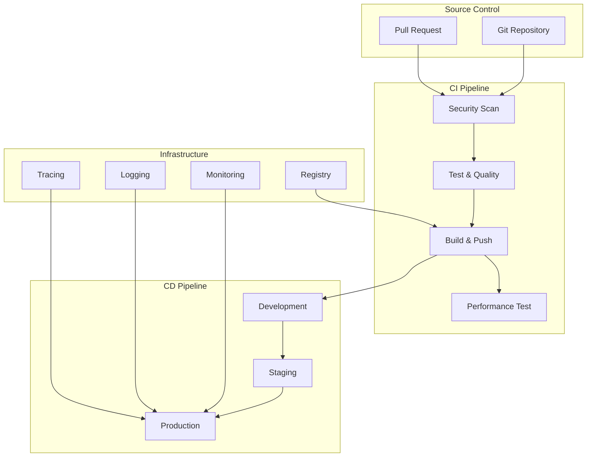
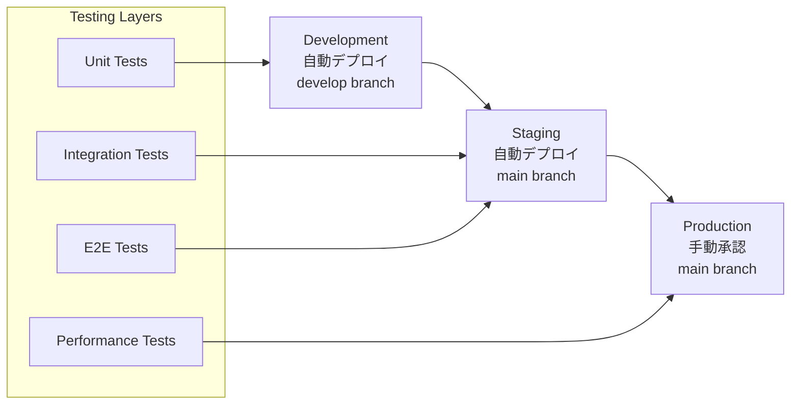

# ITDO ERP CI/CD パイプライン設計書

## 📋 概要

本設計書は、ITDO ERP v2のための包括的なCI/CDパイプラインの設計と実装計画を定義します。GitHub Actionsを活用し、コード品質・セキュリティ・パフォーマンスを重視した自動化デプロイメントを実現します。

## 🎯 設計目標

### 主要目標
- **品質保証**: 自動テスト・静的解析・セキュリティスキャン
- **高速デプロイ**: 最適化されたビルド・並列実行・効率的パイプライン
- **ゼロダウンタイム**: Blue-Green・Canary・Rolling Update戦略
- **セキュリティファースト**: 脆弱性スキャン・シークレット管理・コンプライアンス
- **可視性**: 包括的監視・アラート・レポート

### パフォーマンス指標
- ビルド時間: <10分 (Backend + Frontend)
- デプロイ時間: <5分 (本番環境)
- テスト実行時間: <8分
- 成功率: 95%+ 
- 平均復旧時間: <30分

## 🏗️ パイプライン・アーキテクチャ

### 全体フロー


## 📊 パイプライン仕様

### Backend Pipeline (Python FastAPI)

#### Stage 1: Security & Quality Checks
```yaml
security-scan:
  - Trivy filesystem scan
  - GitLeaks secret detection
  - CodeQL static analysis
  - npm audit (dependencies)
  
quality-checks:
  - Ruff linting & formatting
  - MyPy type checking
  - Pytest (unit + integration + security)
  - Coverage reporting (>80% required)
```

#### Stage 2: Performance Testing
```yaml
performance-test:
  - k6 smoke tests
  - k6 load tests (1000 RPS)
  - Database performance validation
  - API response time benchmarks (<200ms P95)
```

#### Stage 3: Build & Container Security
```yaml
build-and-push:
  - Multi-stage Docker build
  - Multi-architecture (amd64, arm64)
  - Harbor registry push
  - Trivy container scan
  - Image signing (optional)
```

### Frontend Pipeline (React TypeScript)

#### Stage 1: Security & Quality Checks
```yaml
security-scan:
  - npm audit
  - ESLint with security rules
  - CodeQL analysis
  - Trivy filesystem scan
  
quality-checks:
  - ESLint + TypeScript checking
  - Vitest unit tests
  - Component testing
  - Coverage reporting (>80% required)
```

#### Stage 2: Accessibility & Performance
```yaml
accessibility-performance:
  - Lighthouse CI (Performance, A11y, SEO scores)
  - Accessibility testing (axe-core)
  - Bundle size analysis
  - Core Web Vitals validation
```

#### Stage 3: End-to-End Testing
```yaml
e2e-testing:
  - Playwright browser automation
  - Cross-browser testing
  - Visual regression testing
  - Mobile responsiveness testing
```

### Infrastructure Pipeline

#### Stage 1: Infrastructure Validation
```yaml
validate:
  - Helm chart linting
  - Shell script validation (shellcheck)
  - YAML syntax validation
  - Terraform plan validation (if used)
```

#### Stage 2: Security & Compliance
```yaml
security-compliance:
  - Trivy config scan
  - Checkov policy validation
  - Kubernetes security benchmarks
  - Network policy validation
```

#### Stage 3: Deployment & Testing
```yaml
deployment:
  - Monitoring infrastructure
  - Logging pipeline
  - Tracing system
  - Container registry
  - Integration testing
```

## 🚀 デプロイメント戦略

### Environment Strategy


### Deployment Patterns

#### Backend Deployment (Blue-Green)
```yaml
deployment-strategy:
  type: blue-green
  steps:
    1: Deploy new version (Green)
    2: Health checks & smoke tests
    3: Switch traffic to Green
    4: Monitor metrics (5 minutes)
    5: Decommission Blue (if successful)
  rollback:
    - Automatic on health check failure
    - Manual rollback capability
    - Database migration rollback
```

#### Frontend Deployment (Canary)
```yaml
deployment-strategy:
  type: canary
  steps:
    1: Deploy 10% traffic to new version
    2: Monitor metrics (5 minutes)
    3: Increase to 50% traffic
    4: Monitor metrics (10 minutes)
    5: Full deployment (100% traffic)
    6: CDN cache invalidation
  rollback:
    - Automatic on error rate >1%
    - Manual rollback via GitHub Actions
    - Instant CDN cache rollback
```

## 🔒 セキュリティ統合

### Security Scanning Matrix
| Component | Tool | Frequency | Action on Fail |
|-----------|------|-----------|----------------|
| Source Code | CodeQL | Every PR | Block merge |
| Dependencies | npm audit, Safety | Every PR | Block merge |
| Secrets | GitLeaks | Every commit | Block merge |
| Container Images | Trivy | Every build | Block deployment |
| Infrastructure | Checkov | Config changes | Block deployment |
| Runtime | Falco | Continuous | Alert + investigate |

### Secret Management
```yaml
secrets-strategy:
  github-secrets:
    - HARBOR_USERNAME / HARBOR_PASSWORD
    - KUBECONFIG_* (per environment)
    - SLACK_WEBHOOK_URL
    - CLOUDFLARE_API_TOKEN
    
  kubernetes-secrets:
    - TLS certificates (cert-manager)
    - Database credentials
    - API keys and tokens
    - Registry pull secrets
    
  best-practices:
    - Rotation every 90 days
    - Principle of least privilege
    - Environment separation
    - Audit logging enabled
```

## 📈 品質ゲート

### Code Quality Gates
```yaml
backend-gates:
  code-coverage: >80%
  type-coverage: >95%
  security-vulnerabilities: 0 (Critical/High)
  performance: <200ms P95 API response
  
frontend-gates:
  code-coverage: >80%
  lighthouse-performance: >90
  lighthouse-accessibility: >95
  bundle-size: <2MB gzipped
  
infrastructure-gates:
  security-policies: 100% compliant
  resource-limits: All containers have limits
  health-checks: All services have probes
  backup-strategy: All data has backup plan
```

### Performance Baselines
```yaml
api-performance:
  response-time-p95: <200ms
  response-time-p99: <500ms
  throughput: >1000 RPS
  error-rate: <0.1%
  
frontend-performance:
  first-contentful-paint: <1.5s
  largest-contentful-paint: <2.5s
  cumulative-layout-shift: <0.1
  time-to-interactive: <3s
  
infrastructure-performance:
  prometheus-query: <500ms
  log-ingestion-lag: <30s
  trace-ingestion-lag: <10s
  registry-push-pull: >50MB/s
```

## 🔧 監視・アラート統合

### Pipeline Monitoring
```yaml
metrics-collection:
  build-times: Grafana dashboard
  test-results: GitHub Actions metrics
  deployment-frequency: DORA metrics
  failure-rate: Error rate tracking
  
alerting-rules:
  - Pipeline failure (immediate)
  - Performance regression (15min delay)
  - Security vulnerability (immediate)
  - Deployment rollback (immediate)
  
notification-channels:
  - Slack #deployments (all events)
  - Slack #alerts (failures only)
  - GitHub Issues (critical failures)
  - PagerDuty (production issues)
```

### DORA Metrics Tracking
```yaml
dora-metrics:
  deployment-frequency:
    target: Daily
    measurement: GitHub Actions deployments
    
  lead-time:
    target: <2 hours (PR to production)
    measurement: GitHub Actions + Jira integration
    
  change-failure-rate:
    target: <5%
    measurement: Rollback rate tracking
    
  time-to-recovery:
    target: <30 minutes
    measurement: Alert to resolution time
```

## 💰 コスト最適化

### GitHub Actions Optimization
```yaml
cost-optimization:
  caching-strategy:
    - Docker layer caching
    - Dependency caching (npm, pip)
    - Build artifact caching
    - Test result caching
    
  parallel-execution:
    - Independent job parallelization
    - Matrix builds for multi-platform
    - Conditional job execution
    
  resource-efficiency:
    - Smaller runner sizes where possible
    - Self-hosted runners for heavy workloads
    - Spot instances for non-critical tasks
```

### 推定コスト (月額)
```yaml
github-actions-cost:
  public-repo: $0 (unlimited minutes)
  private-repo: ~$50/month (2000 minutes estimate)
  
additional-costs:
  self-hosted-runners: $200/month (optional)
  external-services:
    - CodeCov: $10/month
    - Lighthouse CI: $0 (free tier)
    - Trivy: $0 (open source)
    
total-estimated: $60-260/month (configuration dependent)
```

## 🔄 障害復旧・ロールバック

### Rollback Strategies
```yaml
automated-rollback:
  triggers:
    - Health check failures
    - Error rate >1% (5 minutes)
    - Performance degradation >50%
    - Security alert (critical)
    
  execution:
    - Database migration rollback
    - Kubernetes deployment rollback
    - CDN cache invalidation
    - Alert notification
    
manual-rollback:
  github-actions:
    - Re-run previous successful deployment
    - Environment-specific rollback workflow
    - Database point-in-time recovery
    
  documentation:
    - Rollback runbook
    - Emergency contact procedures
    - Post-incident review template
```

## 📋 実装チェックリスト

### Phase 1: 基礎パイプライン ✅
- [x] GitHub Actions workflow作成
- [x] Basic security scanning
- [x] Test automation設定
- [x] Container build & push

### Phase 2: 高度機能実装
- [ ] Performance testing統合
- [ ] Multi-environment deployment
- [ ] Blue-green / Canary deployment
- [ ] 包括的monitoring統合

### Phase 3: 最適化・運用
- [ ] Cost optimization実装
- [ ] Advanced security policies
- [ ] DORA metrics tracking
- [ ] Incident response automation

## 🎯 将来計画

### 短期 (3ヶ月)
1. **GitOps統合**: ArgoCD導入によるKubernetes宣言的デプロイ
2. **Progressive Delivery**: Flagger統合によるカナリア分析
3. **Chaos Engineering**: Chaos Monkeyによる耐障害性テスト

### 中期 (6ヶ月)
1. **ML/AI統合**: テスト失敗予測・性能異常検知
2. **Multi-Cloud**: AWS + GCP + Azureマルチクラウド対応
3. **Compliance**: SOC2・ISO27001準拠自動化

### 長期 (12ヶ月)
1. **Self-Healing**: 自動障害復旧・スケーリング
2. **Predictive Scaling**: 機械学習ベーストラフィック予測
3. **Zero-Touch Deployment**: 完全自動化デプロイメント

---

**作成日**: 2025年1月21日  
**バージョン**: v2.0  
**作成者**: Claude (CC03最大自走モード)  
**レビュー**: 要スケジュール