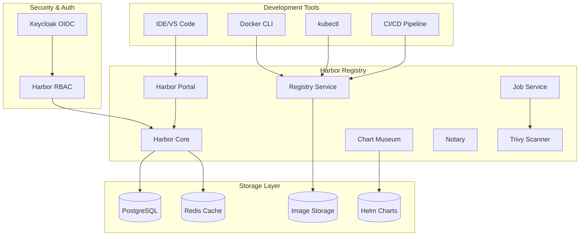
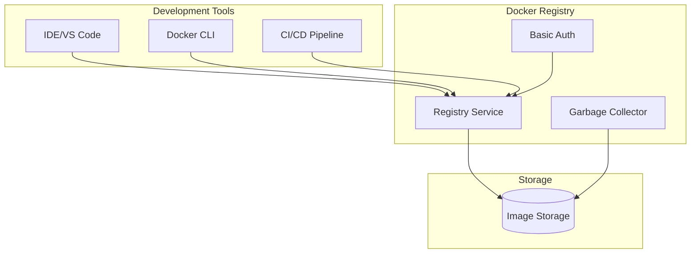

# ITDO ERP コンテナレジストリ設計書

## 📋 概要

本設計書は、ITDO ERP v2の開発環境における包括的なコンテナレジストリソリューションの設計と実装計画を定義します。セキュアで効率的なコンテナイメージ管理を実現します。

## 🎯 設計目標

### 主要目標
- **開発効率化**: CI/CDパイプラインとのシームレス統合
- **セキュリティ**: 脆弱性スキャン・イメージ署名・アクセス制御
- **ガバナンス**: プロジェクトベースアクセス制御・監査ログ
- **パフォーマンス**: 高速プッシュ/プル・並列処理対応
- **運用性**: 自動ガベージコレクション・監視・バックアップ

### パフォーマンス指標
- イメージプッシュ速度: 100MB/秒
- 同時接続数: 100+ (並列CI/CDジョブ)
- ストレージ効率: 30-40%圧縮
- 可用性: 99.9%
- レスポンス時間: <200ms (API呼び出し)

## 🏗️ システムアーキテクチャ

### 2つのデプロイオプション

#### Option 1: Harbor (フル機能版)


#### Option 2: Docker Registry (軽量版)


## 📊 技術選択マトリックス

| 機能 | Harbor | Docker Registry | 推奨用途 |
|------|--------|-----------------|----------|
| **基本機能** | | |
| イメージ保存/取得 | ✅ | ✅ | 両方 |
| RESTful API | ✅ | ✅ | 両方 |
| Web UI | ✅ | ❌ | GUI必要時はHarbor |
| **セキュリティ** | | |
| 脆弱性スキャン | ✅ (Trivy) | ❌ | 本番環境はHarbor |
| イメージ署名 | ✅ (Notary) | ❌ | セキュリティ重視時 |
| RBAC | ✅ | ❌ | チーム開発時 |
| OIDC統合 | ✅ | ❌ | 統合認証が必要時 |
| **管理機能** | | |
| プロジェクト管理 | ✅ | ❌ | マルチプロジェクト |
| レプリケーション | ✅ | ❌ | 地理分散 |
| 監査ログ | ✅ | ❌ | コンプライアンス要件 |
| **拡張性** | | |
| Helm Charts | ✅ | ❌ | Kubernetes中心 |
| Webhook | ✅ | ✅ | CI/CD統合 |
| **リソース使用量** | 高 | 低 | リソース制約による |

## 🔧 詳細設計

### Harbor設定 (推奨)

#### コア・コンポーネント
- **Harbor Portal**: Web UI (2レプリカ)
- **Harbor Core**: 認証・API・プロジェクト管理 (2レプリカ)  
- **Registry**: イメージストレージ (2レプリカ)
- **Job Service**: バックグラウンドタスク (2レプリカ)

#### セキュリティ・コンポーネント
- **Trivy**: 脆弱性スキャナー (1レプリカ)
- **Notary**: イメージ署名 (Server + Signer)
- **ChartMuseum**: Helmチャートリポジトリ (1レプリカ)

#### データストア
- **PostgreSQL**: メタデータ (内蔵、本番では外部推奨)
- **Redis**: キャッシュ・セッション (内蔵)
- **ストレージ**: イメージレイヤー (100Gi PV)

### Docker Registry設定 (軽量)

#### シンプル構成
- **Registry Service**: コンテナレジストリ (1レプリカ)
- **Basic Authentication**: htpasswdベース認証
- **Garbage Collector**: CronJobによる自動クリーンアップ
- **ストレージ**: イメージレイヤー (50Gi PV)

## 🔒 セキュリティ設計

### 認証・認可

#### Harbor認証
```yaml
# OIDC (Keycloak) 統合
oidc:
  enabled: true
  endpoint: "https://auth.itdo-erp.com/auth/realms/itdo-erp"
  clientId: "harbor"
  scope: "openid,email,profile,groups"
  autoOnboard: true  # 自動ユーザー登録
```

#### プロジェクトベースアクセス制御
```yaml
# プロジェクト例
projects:
  - name: "itdo-erp-backend"
    members:
      - user: "backend-team"
        role: "developer"
      - user: "devops-team" 
        role: "maintainer"
        
  - name: "itdo-erp-frontend"
    members:
      - user: "frontend-team"
        role: "developer"
```

### 脆弱性管理

#### Trivy統合
- **スキャン頻度**: プッシュ時 + 日次自動スキャン
- **ポリシー**: Critical/High脆弱性でブロック (設定可能)
- **レポート**: WebUI + API経由でアクセス可能

#### イメージ署名 (Notary)
```bash
# イメージ署名例
export DOCKER_CONTENT_TRUST=1
docker push registry.itdo-erp.com/itdo-erp/backend:latest

# 署名検証
docker pull registry.itdo-erp.com/itdo-erp/backend:latest
```

## 📈 CI/CD統合

### Docker CLI統合
```bash
# レジストリログイン
docker login registry.itdo-erp.com
Username: admin
Password: Harbor12345!

# イメージビルド・プッシュ
docker build -t registry.itdo-erp.com/itdo-erp/backend:v1.0.0 .
docker push registry.itdo-erp.com/itdo-erp/backend:v1.0.0
```

### Kubernetes統合
```yaml
# ImagePullSecret作成
apiVersion: v1
kind: Secret
metadata:
  name: harbor-secret
type: kubernetes.io/dockerconfigjson
data:
  .dockerconfigjson: <base64-encoded-docker-config>

---
# Deployment例
apiVersion: apps/v1
kind: Deployment
metadata:
  name: backend-api
spec:
  template:
    spec:
      imagePullSecrets:
        - name: harbor-secret
      containers:
        - name: api
          image: registry.itdo-erp.com/itdo-erp/backend:v1.0.0
```

### GitHub Actions統合
```yaml
# .github/workflows/ci.yml
name: CI/CD Pipeline
on: [push, pull_request]

jobs:
  build:
    runs-on: ubuntu-latest
    steps:
      - uses: actions/checkout@v4
      
      - name: Login to Harbor
        uses: docker/login-action@v3
        with:
          registry: registry.itdo-erp.com
          username: ${{ secrets.HARBOR_USERNAME }}
          password: ${{ secrets.HARBOR_PASSWORD }}
          
      - name: Build and push
        uses: docker/build-push-action@v5
        with:
          context: .
          push: true
          tags: |
            registry.itdo-erp.com/itdo-erp/app:latest
            registry.itdo-erp.com/itdo-erp/app:${{ github.sha }}
```

## 🗑️ ガベージコレクション戦略

### Harbor GC設定
```yaml
gc:
  schedule: "0 2 * * *"  # 毎日午前2時
  retainHistoryLimit: 10
  deleteUntagged: true
  workers: 3
```

### 保持ポリシー例
```yaml
retention:
  rules:
    - scope: "repository"
      tag: "latest"
      template: "latestPushedK"
      params: 
        latestPushedK: 5  # 最新5つ保持
        
    - scope: "repository" 
      tag: "v*"
      template: "nDaysFromPush"
      params:
        nDaysFromPush: 30  # 30日保持
```

## 📊 監視・アラート

### 重要メトリクス
1. **ストレージ使用量**: 使用可能容量の85%でアラート
2. **API応答時間**: P95 > 1秒でアラート
3. **プッシュ/プル成功率**: 99%未満でアラート
4. **脆弱性検出**: Critical/High脆弱性検出時

### Prometheus統合
```yaml
# ServiceMonitor例
apiVersion: monitoring.coreos.com/v1
kind: ServiceMonitor
metadata:
  name: harbor-registry
spec:
  selector:
    matchLabels:
      app: harbor
  endpoints:
    - port: http
      path: /metrics
      interval: 30s
```

## 💰 コスト最適化

### ストレージ最適化
- **レイヤーキャッシュ**: 共通ベースイメージの効率利用
- **圧縮**: 30-40%容量削減
- **保持ポリシー**: 古いイメージの自動削除

### リソース最適化
- **Harbor**: フル機能但し高リソース消費
- **Docker Registry**: 軽量但し基本機能のみ

### 推定コスト (月額)
#### Harbor構成
- **コンピュート**: $400/月 (Harbor全コンポーネント)
- **ストレージ**: $10/月 (100Gi gp3)
- **データベース**: $100/月 (PostgreSQL/Redis)
- **総計**: $510/月

#### Docker Registry構成  
- **コンピュート**: $100/月 (Registry単体)
- **ストレージ**: $5/月 (50Gi gp3)
- **総計**: $105/月

## 🚀 デプロイメント戦略

### Phase 1: 基盤構築 ✅
1. Namespace作成・RBAC設定
2. 認証秘匿情報作成
3. ストレージ・ネットワーク設定

### Phase 2: レジストリデプロイ
1. Harbor または Docker Registry デプロイ
2. Ingress・SSL証明書設定
3. 基本動作確認・テスト

### Phase 3: 統合・設定
1. CI/CDパイプライン統合
2. 脆弱性スキャン設定
3. ガベージコレクション設定
4. 監視・アラート設定

### Phase 4: 運用最適化
1. パフォーマンス調整
2. セキュリティポリシー微調整
3. バックアップ・DR手順確立

## 🔧 運用ガイド

### 日次タスク
- [ ] ストレージ使用量確認
- [ ] 脆弱性スキャン結果確認
- [ ] API健全性チェック

### 週次タスク
- [ ] ガベージコレクション結果確認
- [ ] アクセス・監査ログ確認
- [ ] パフォーマンス・メトリクス分析

### 月次タスク
- [ ] バックアップ・テスト実行
- [ ] セキュリティポリシー見直し
- [ ] コスト分析・最適化

## 🔍 トラブルシューティング

### よくある問題

#### プッシュ/プル失敗
```bash
# 認証確認
docker login registry.itdo-erp.com

# ネットワーク確認
curl -I https://registry.itdo-erp.com/v2/

# Harbor ログ確認
kubectl logs -n registry deployment/harbor-core
kubectl logs -n registry deployment/harbor-registry
```

#### ストレージ不足
```bash
# ガベージコレクション手動実行
kubectl exec -n registry harbor-jobservice-0 -- \
  curl -X POST "http://harbor-core/api/v2.0/system/gc/schedule" \
  -H "Authorization: Bearer $HARBOR_TOKEN"

# 古いイメージ削除
# Harbor UI または API経由で実行
```

#### 脆弱性スキャン問題
```bash
# Trivy DB更新
kubectl exec -n registry harbor-trivy-0 -- \
  trivy image --download-db-only

# スキャンジョブ確認
kubectl get jobs -n registry | grep scan
```

## 📋 チェックリスト

### デプロイ前確認
- [ ] Kubernetesクラスター準備完了
- [ ] StorageClass設定済み
- [ ] Ingress Controller動作確認
- [ ] DNS設定完了
- [ ] SSL証明書準備完了

### デプロイ後検証
- [ ] 全Pod正常起動確認
- [ ] Web UI アクセス確認
- [ ] Docker CLI push/pull テスト
- [ ] 脆弱性スキャン動作確認
- [ ] 監視メトリクス取得確認

## 🎯 将来計画

### 機能拡張
1. **Multi-registry replication**: 地理分散・災害対応
2. **Advanced RBAC**: より細かい権限制御
3. **AI-powered vulnerability analysis**: 誤検知削減

### クラウド統合
1. **Object Storage統合**: S3/GCS/Azureとの統合
2. **CDN統合**: グローバル配信最適化
3. **Managed Service移行**: クラウドマネージドサービス検討

---

**作成日**: 2025年1月21日  
**バージョン**: v2.0  
**作成者**: Claude (CC03最大自走モード)  
**レビュー**: 要スケジュール