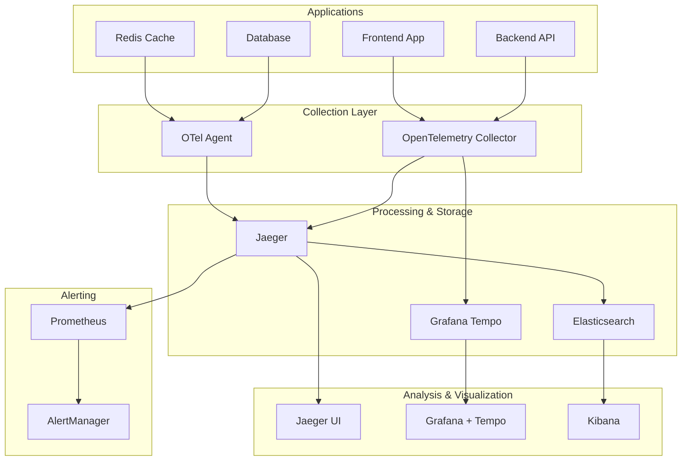

# ITDO ERP 分散トレーシング設計書

## 📋 概要

本設計書は、ITDO ERP v2のための包括的な分散トレーシング・システムの設計と実装計画を定義します。マイクロサービス間のリクエストフローを完全に可視化し、パフォーマンス問題の迅速な特定・解決を実現します。

## 🎯 設計目標

### 主要目標
- **エンドツーエンド可視化**: マイクロサービス間の完全なリクエストフロー追跡
- **パフォーマンス監視**: レスポンス時間・ボトルネック・エラー率の監視
- **根本原因分析**: 問題の迅速な特定と診断
- **低オーバーヘッド**: アプリケーションパフォーマンスへの最小限の影響
- **スケーラビリティ**: 1000+ spans/秒の処理能力

### パフォーマンス指標
- トレース収集能力: 1000 spans/秒/コレクター
- クエリ応答時間: <2秒 (トレース検索)
- ストレージ効率: 5MB/1000 spans
- サンプリング率: 10% (本番環境)
- 可用性: 99.9%

## 🏗️ システムアーキテクチャ

### コンポーネント構成



## 📊 技術スタック

### コア技術
- **OpenTelemetry Collector 0.89.0**: 統合テレメトリー収集・処理
- **Jaeger 1.51.0**: 分散トレーシング・プラットフォーム
- **Grafana Tempo 2.3.0**: クラウドネイティブ・トレーシング・ストレージ
- **Elasticsearch 8.11.0**: トレースデータ永続化
- **Prometheus**: メトリクス・アラート統合

### 計装SDK
- **Python**: OpenTelemetry SDK + FastAPI auto-instrumentation
- **JavaScript/React**: OpenTelemetry Web SDK + auto-instrumentations
- **Database**: PostgreSQL/Redis exporters

## 🔧 詳細設計

### 1. データ収集層 (Collection Layer)

#### OpenTelemetry Collector設定
- **デプロイ方式**: DaemonSet (全ノード配置)
- **リソース**: CPU 1000m, Memory 2Gi (limit)
- **プロトコル対応**:
  - OTLP (gRPC: 4317, HTTP: 4318)
  - Jaeger (gRPC: 14250, Thrift: 6831, HTTP: 14268)
  - Zipkin (HTTP: 9411)

#### サンプリング戦略
```yaml
# インテリジェント・サンプリング
probabilistic_sampler:
  sampling_percentage: 10  # 基本10%サンプリング
  
tail_sampling:
  policies:
    - name: error-sampling
      type: status_code
      status_code: [ERROR]  # エラーは100%サンプリング
    - name: latency-sampling  
      type: latency
      latency: {threshold_ms: 1000}  # 1秒超は100%サンプリング
    - name: probabilistic-sampling
      type: probabilistic
      probabilistic: {sampling_percentage: 10}
```

### 2. ストレージ層 (Storage Layer)

#### Jaeger設定
- **アーキテクチャ**: マイクロサービス構成
- **コンポーネント**:
  - Collector: 2レプリカ (トレース取り込み)
  - Query: 2レプリカ (クエリ処理・UI)
  - ES Index Cleaner: 30日保持ポリシー
- **ストレージ**: Elasticsearch統合 (共有インフラ)

#### Grafana Tempo設定  
- **アーキテクチャ**: マイクロサービス構成
- **コンポーネント**:
  - Gateway: 2レプリカ (nginx負荷分散)
  - Distributor: 2レプリカ (トレース受信)
  - Ingester: 2レプリカ (ストレージ書き込み)
  - Query Frontend: 1レプリカ (クエリ調整)
  - Querier: 2レプリカ (クエリ実行)
  - Compactor: 1レプリカ (ブロック圧縮)
- **ストレージ**: 100Gi (10日保持)

### 3. 可視化層 (Visualization Layer)

#### Jaeger UI
- **アクセス**: https://jaeger.itdo-erp.com
- **機能**:
  - トレース検索・表示
  - サービスマップ
  - 依存関係グラフ
  - パフォーマンス分析

#### Grafana + Tempo統合
- **アクセス**: 既存Grafanaインスタンス
- **機能**:
  - Tempo datasource統合
  - ログ・メトリクス相関
  - カスタムダッシュボード
  - アラート統合

## 🔍 計装ガイド

### Backend (Python FastAPI)
```python
# requirements.txt
opentelemetry-api
opentelemetry-sdk  
opentelemetry-instrumentation-fastapi
opentelemetry-instrumentation-sqlalchemy
opentelemetry-instrumentation-redis
opentelemetry-exporter-otlp

# main.py
from opentelemetry import trace
from opentelemetry.exporter.otlp.proto.grpc.trace_exporter import OTLPSpanExporter
from opentelemetry.sdk.trace import TracerProvider
from opentelemetry.sdk.trace.export import BatchSpanProcessor
from opentelemetry.sdk.resources import Resource
from opentelemetry.instrumentation.fastapi import FastAPIInstrumentor

# Configure tracing
resource = Resource.create({
    "service.name": "itdo-erp-backend",
    "service.version": "2.0.0",
    "deployment.environment": "production",
})

trace.set_tracer_provider(TracerProvider(resource=resource))
tracer = trace.get_tracer(__name__)

# OTLP Exporter
otlp_exporter = OTLPSpanExporter(
    endpoint="http://otel-collector.tracing.svc.cluster.local:4317",
    insecure=True
)

span_processor = BatchSpanProcessor(otlp_exporter)
trace.get_tracer_provider().add_span_processor(span_processor)

# Auto-instrument FastAPI
app = FastAPI()
FastAPIInstrumentor.instrument_app(app)

# Custom span example
@app.get("/api/users")
async def get_users():
    with tracer.start_as_current_span("get_users") as span:
        span.set_attribute("operation", "database_query")
        # Your business logic here
        return {"users": []}
```

### Frontend (React)
```typescript
// package.json
{
  "dependencies": {
    "@opentelemetry/api": "^1.7.0",
    "@opentelemetry/sdk-web": "^1.17.0", 
    "@opentelemetry/auto-instrumentations-web": "^0.34.0",
    "@opentelemetry/exporter-otlp-http": "^0.44.0"
  }
}

// tracing.ts
import { WebSDK } from '@opentelemetry/sdk-web';
import { getWebAutoInstrumentations } from '@opentelemetry/auto-instrumentations-web';
import { OTLPTraceExporter } from '@opentelemetry/exporter-otlp-http';
import { Resource } from '@opentelemetry/resources';
import { SemanticResourceAttributes } from '@opentelemetry/semantic-conventions';

const sdk = new WebSDK({
  resource: new Resource({
    [SemanticResourceAttributes.SERVICE_NAME]: 'itdo-erp-frontend',
    [SemanticResourceAttributes.SERVICE_VERSION]: '2.0.0',
    [SemanticResourceAttributes.DEPLOYMENT_ENVIRONMENT]: 'production',
  }),
  traceExporter: new OTLPTraceExporter({
    url: 'https://otel-collector.itdo-erp.com/v1/traces',
  }),
  instrumentations: [
    getWebAutoInstrumentations({
      '@opentelemetry/instrumentation-document-load': {},
      '@opentelemetry/instrumentation-user-interaction': {},
      '@opentelemetry/instrumentation-fetch': {},
      '@opentelemetry/instrumentation-xml-http-request': {},
    }),
  ],
});

sdk.start();

// Manual span example  
import { trace } from '@opentelemetry/api';

const tracer = trace.getTracer('itdo-erp-frontend');

async function handleUserAction() {
  const span = tracer.startSpan('user-action');
  span.setAttributes({
    'user.action': 'submit-form',
    'form.type': 'user-registration'
  });
  
  try {
    // Your business logic
    await submitForm();
    span.setStatus({ code: SpanStatusCode.OK });
  } catch (error) {
    span.setStatus({ 
      code: SpanStatusCode.ERROR, 
      message: error.message 
    });
    throw error;
  } finally {
    span.end();
  }
}
```

## 📈 モニタリング・アラート

### 重要メトリクス
1. **トレース収集率**: spans/秒
2. **エラー率**: エラーspan/全span
3. **レスポンス時間**: P95, P99レイテンシ
4. **サービス間依存**: 依存関係グラフ

### アラート定義
```yaml
# Prometheus Rules
groups:
  - name: tracing.rules
    rules:
    - alert: HighErrorRate
      expr: |
        (
          sum(rate(traces_spanmetrics_calls_total{status_code="STATUS_CODE_ERROR"}[5m])) /
          sum(rate(traces_spanmetrics_calls_total[5m]))
        ) > 0.05
      for: 5m
      labels:
        severity: critical
      annotations:
        summary: "High error rate detected in traces"
        description: "Error rate is {{ $value | humanizePercentage }}"
        
    - alert: HighLatency  
      expr: |
        histogram_quantile(0.95,
          sum(rate(traces_spanmetrics_latency_bucket[5m])) by (le)
        ) > 2000
      for: 10m
      labels:
        severity: warning
      annotations:
        summary: "High latency detected"  
        description: "95th percentile latency is {{ $value }}ms"
```

## 💰 コスト最適化

### ストレージ最適化
- **サンプリング**: インテリジェント・サンプリング (10%基本 + 100%エラー/高レイテンシ)
- **保持期間**: Jaeger 30日, Tempo 10日
- **圧縮**: best_compression codec

### リソース最適化
- **コレクター**: DaemonSet による効率的リソース利用
- **ストレージ**: 既存Elasticsearch共有によるコスト削減

### 推定コスト (月額)
- **コンピュート**: $300/月 (OTel Collector, Jaeger, Tempo)
- **ストレージ**: $50/月 (追加ストレージ)
- **ネットワーク**: $25/月 (データ転送)
- **総計**: $375/月

## 🚀 デプロイメント計画

### Phase 1: 基盤構築 ✅
1. OpenTelemetry Collector デプロイ
2. Jaeger クラスター構築  
3. Tempo インスタンス構築
4. 基本認証・SSL設定

### Phase 2: アプリケーション統合
1. Backend API 計装
2. Frontend 計装  
3. データベース・キャッシュ統合
4. カスタムspan追加

### Phase 3: 運用最適化
1. サンプリング調整
2. ダッシュボード構築
3. アラート設定
4. 運用手順書作成

## 🔧 運用ガイド

### 日次タスク
- [ ] トレース収集量確認
- [ ] エラー率分析  
- [ ] パフォーマンス異常確認

### 週次タスク
- [ ] サンプリング率調整
- [ ] ストレージ使用量確認
- [ ] ダッシュボード更新

### 月次タスク
- [ ] コスト分析・最適化
- [ ] 保持期間ポリシー見直し
- [ ] パフォーマンス・レビュー

## 🔍 トラブルシューティング

### よくある問題

#### トレースが表示されない
```bash
# OTel Collector ログ確認
kubectl logs -n tracing daemonset/otel-collector

# Jaeger Collector ログ確認  
kubectl logs -n tracing deployment/jaeger-collector

# アプリケーション計装確認
curl -H "traceparent: 00-4bf92f3577b34da6a3ce929d0e0e4736-00f067aa0ba902b7-01" \
     http://your-service/health
```

#### 高レイテンシ問題
```bash
# Jaeger UI でトレース分析
# https://jaeger.itdo-erp.com

# Elasticsearch インデックス確認
kubectl exec -n logging elasticsearch-master-0 -- \
  curl "localhost:9200/_cat/indices/jaeger-*?v"

# サンプリング率確認・調整
kubectl edit configmap otel-collector-config -n tracing
```

#### ストレージ容量問題
```bash
# インデックス削除 (古いトレース)
kubectl exec -n logging elasticsearch-master-0 -- \
  curl -X DELETE "localhost:9200/jaeger-span-$(date -d '31 days ago' +%Y-%m-%d)*"

# Tempo compaction 強制実行  
kubectl exec -n tracing tempo-compactor-0 -- \
  curl -X POST http://localhost:3100/flush
```

## 📋 チェックリスト

### デプロイ前確認
- [ ] OpenTelemetry Collector 設定完了
- [ ] Jaeger クラスター準備完了
- [ ] Elasticsearch 統合設定完了
- [ ] ネットワーク・ファイアウォール設定
- [ ] SSL証明書準備完了

### デプロイ後検証  
- [ ] 全コンポーネント正常起動
- [ ] トレース収集動作確認
- [ ] Jaeger UI アクセス確認
- [ ] Grafana統合確認
- [ ] アラート動作確認

## 🎯 将来計画

### 機能拡張
1. **Service Mesh統合**: Istio連携による自動計装
2. **AI分析**: 異常パターン自動検知
3. **根本原因分析**: 機械学習ベース分析

### スケール対応  
1. **マルチクラスター**: 地域分散トレーシング
2. **長期分析**: データレイク統合
3. **リアルタイム分析**: ストリーミング処理

---

**作成日**: 2025年1月21日  
**バージョン**: v2.0  
**作成者**: Claude (CC03最大自走モード)  
**レビュー**: 要スケジュール