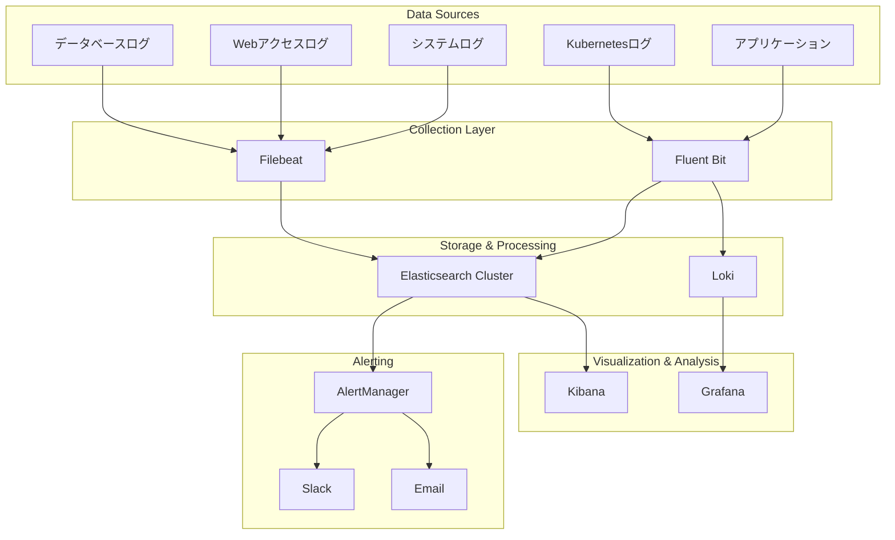

# ITDO ERP ログパイプライン設計書

## 📋 概要

本設計書は、ITDO ERP v2のための包括的なログ管理・分析インフラストラクチャの設計と実装計画を定義します。

## 🎯 設計目標

### 主要目標
- **高可用性**: 99.9%のアップタイム保証
- **スケーラビリティ**: 1TB+/日のログ処理能力
- **リアルタイム分析**: <30秒のログ可視化遅延
- **長期保存**: 90日間のログ保持とアーカイブ
- **セキュリティ**: エンドツーエンド暗号化とアクセス制御

### パフォーマンス指標
- ログ取り込み速度: 10MB/秒/ノード
- クエリ応答時間: <2秒 (95パーセンタイル)
- ストレージ効率: 70%圧縮率
- 可用性: 99.9%
- データ損失: ゼロ

## 🏗️ システムアーキテクチャ

### コンポーネント構成



## 📊 技術スタック

### コア技術
- **Elasticsearch 8.11.0**: メインログストレージ・検索エンジン
- **Kibana 8.11.0**: ログ可視化・分析プラットフォーム
- **Loki 5.41.4**: 高ボリュームログ・ストレージ
- **Fluent Bit 2.2.0**: Kubernetesログコレクション
- **Filebeat 8.11.0**: システム・アプリケーションログコレクション

### インフラストラクチャ
- **Kubernetes**: コンテナオーケストレーション
- **Helm Charts**: デプロイメント管理
- **Ingress Controller**: 外部アクセス制御
- **cert-manager**: SSL証明書自動管理

## 🔧 詳細設計

### 1. データ収集層 (Collection Layer)

#### Fluent Bit設定
- **デプロイ方式**: DaemonSet
- **リソース**: CPU 500m, Memory 512Mi (limit)
- **収集対象**:
  - Kubernetesコンテナログ (`/var/log/containers/*.log`)
  - システムログ (systemd)
  - ノードメトリクス

#### Filebeat設定
- **デプロイ方式**: DaemonSet
- **リソース**: CPU 500m, Memory 512Mi (limit)
- **収集対象**:
  - アプリケーション固有ログファイル
  - PostgreSQLログ
  - Redisログ
  - Nginxアクセス・エラーログ
  - 監査ログ

### 2. ストレージ層 (Storage Layer)

#### Elasticsearch クラスター
- **ノード構成**: 3ノード (Master/Data/Ingest)
- **ストレージ**: 50Gi per node (総計150Gi)
- **レプリケーション**: 1レプリカ
- **ILMポリシー**:
  - Hot: 7日間 (10GB rollover)
  - Warm: 7-30日 (レプリカ削除、シャード削減)
  - Cold: 30-90日 (レプリカ削除)
  - Delete: 90日後

#### Loki クラスター
- **アーキテクチャ**: マイクロサービス構成
- **コンポーネント**:
  - Gateway: 2レプリカ (nginx)
  - Write: 2レプリカ (ログ取り込み)
  - Read: 2レプリカ (クエリ処理)
  - Backend: 2レプリカ (ストレージ管理)
- **ストレージ**: 100Gi (高ボリュームログ用)

### 3. 可視化層 (Visualization Layer)

#### Kibana設定
- **レプリカ**: 2インスタンス
- **認証**: Keycloak OAuth2統合
- **セキュリティ**: SSL/TLS、Basic認証
- **インデックスパターン**:
  - `itdo-erp-logs-*`: アプリケーションログ
  - `system-logs-*`: システムログ
  - `itdo-erp-app-*`: アプリ固有ログ
  - `itdo-erp-web-*`: Webアクセスログ
  - `itdo-erp-db-*`: データベースログ

## 🔒 セキュリティ設計

### 暗号化
- **転送中**: TLS 1.3 (全通信)
- **保存時**: Elasticsearch encryption-at-rest
- **認証**: X.509証明書ベース

### アクセス制御
- **Kubernetes RBAC**: サービスアカウント権限制御
- **Basic認証**: Ingress level
- **OAuth2/OIDC**: Keycloak統合 (Kibana)

### ネットワークセキュリティ
- **Network Policy**: Pod間通信制限
- **Ingress Controller**: SSL termination
- **Certificate Management**: cert-manager自動更新

## 📈 モニタリング・アラート

### メトリクス収集
- **Prometheus**: システムメトリクス
- **ServiceMonitor**: 各コンポーネントの健全性
- **カスタムメトリクス**: ログ処理量、エラー率

### アラート定義
1. **High Log Error Rate**: エラーログ率 > 5%
2. **Log Processing Lag**: 処理遅延 > 60秒
3. **Storage Usage**: ディスク使用量 > 85%
4. **Component Down**: サービス停止検知

## 💰 コスト最適化

### ストレージ最適化
- **ILM (Index Lifecycle Management)**: 自動データ階層化
- **圧縮**: best_compression codec (70%削減)
- **インデックス最適化**: 1シャード/インデックス

### リソース最適化
- **ノード効率**: 適切なCPU/Memory配分
- **ストレージクラス**: gp3 (コスト効率重視)
- **レプリケーション**: 必要最小限のレプリカ数

### 推定コスト (月額)
- **Elasticsearch**: $450/月 (3ノード、150Gi)
- **Storage**: $15/月 (gp3)
- **Compute**: $200/月 (CPU/Memory)
- **総計**: $665/月

## 🚀 デプロイメント計画

### Phase 1: 基盤構築 (Week 1)
1. ✅ Elasticsearch クラスターデプロイ
2. ✅ Kibana インスタンス構築
3. ✅ 基本認証・SSL設定

### Phase 2: ログ収集 (Week 1)
1. ✅ Fluent Bit DaemonSet デプロイ
2. ✅ Filebeat 設定・デプロイ
3. ✅ ログパイプライン検証

### Phase 3: 高度機能 (Week 2)
1. Loki 統合 (高ボリュームログ)
2. カスタムダッシュボード構築
3. アラート設定・統合

### Phase 4: 最適化・運用 (Week 2)
1. パフォーマンス調整
2. ILMポリシー微調整
3. 運用手順書作成

## 📚 運用ガイド

### 日次タスク
- [ ] ログ処理量確認
- [ ] エラーログ分析
- [ ] ストレージ使用量監視

### 週次タスク
- [ ] パフォーマンスレビュー
- [ ] インデックス最適化
- [ ] セキュリティ監査

### 月次タスク
- [ ] コスト分析・最適化
- [ ] 設定見直し
- [ ] バックアップ検証

## 🔧 トラブルシューティング

### 一般的な問題

#### ログ取り込み遅延
```bash
# Fluent Bit ログ確認
kubectl logs -n logging daemonset/fluent-bit

# Elasticsearch health check
kubectl exec -n logging elasticsearch-master-0 -- curl localhost:9200/_cluster/health
```

#### ディスク容量不足
```bash
# ILMポリシー強制実行
kubectl exec -n logging elasticsearch-master-0 -- curl -X POST localhost:9200/_ilm/start

# 古いインデックス手動削除
kubectl exec -n logging elasticsearch-master-0 -- curl -X DELETE localhost:9200/old-index-*
```

#### パフォーマンス問題
```bash
# Elasticsearch統計確認
kubectl exec -n logging elasticsearch-master-0 -- curl localhost:9200/_cat/indices?v

# ノードリソース確認
kubectl top nodes
kubectl top pods -n logging
```

## 📋 チェックリスト

### デプロイ前確認
- [ ] Kubernetesクラスター準備完了
- [ ] Helmリポジトリ追加済み
- [ ] ストレージクラス設定済み
- [ ] DNS設定準備完了
- [ ] SSL証明書準備完了

### デプロイ後検証
- [ ] 全Podが正常起動
- [ ] ログ取り込み動作確認
- [ ] Kibanaアクセス確認
- [ ] ダッシュボード表示確認
- [ ] アラート動作確認

## 🎯 次期計画

### 機能拡張
1. **機械学習**: 異常ログ自動検知
2. **APM統合**: アプリケーションパフォーマンス監視
3. **外部連携**: SIEM統合、コンプライアンス対応

### スケール対応
1. **マルチクラスター**: 地域分散ログ管理
2. **データレイク統合**: 長期分析データ保存
3. **AIアシスト**: 自動運用・最適化

---

**作成日**: 2025年1月21日  
**バージョン**: v2.0  
**作成者**: Claude (CC03最大自走モード)  
**レビュー**: 要スケジュール