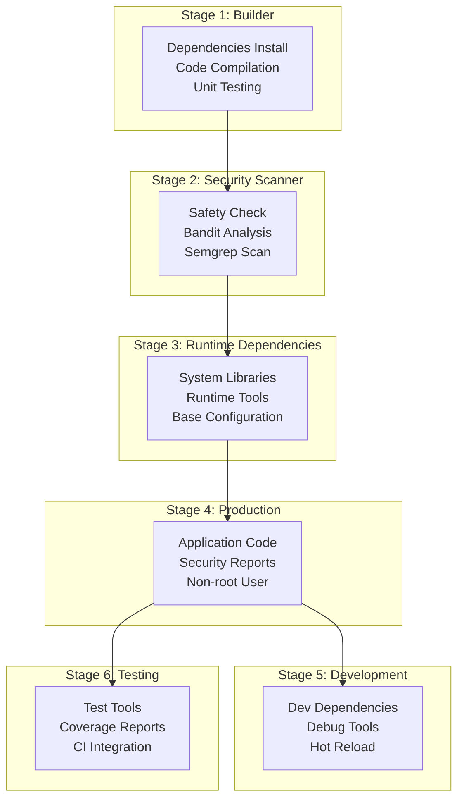

# ITDO ERP マルチステージビルド設計書

## 📋 概要

本設計書は、ITDO ERP v2のためのマルチステージDockerビルドシステムの設計と実装を定義します。セキュリティ・パフォーマンス・開発効率を最適化した統合ビルドパイプラインを実現します。

## 🎯 設計目標

### 主要目標
- **セキュリティファースト**: ビルドプロセス統合セキュリティスキャン・最小攻撃面
- **効率的ビルド**: レイヤーキャッシュ最適化・並列ビルド・段階的最適化
- **柔軟性**: 開発・テスト・本番環境別最適化・マルチアーキテクチャ対応
- **可観測性**: 包括的メタデータ・ビルド追跡・品質メトリクス

### パフォーマンス指標
- ビルド時間: Backend <8分、Frontend <5分
- イメージサイズ削減: 60-80% (マルチステージ効果)
- セキュリティスキャン統合: <2分追加時間
- キャッシュヒット率: 80%+ (変更なし時)

## 🏗️ マルチステージ・アーキテクチャ

### Backend (Python FastAPI) - 6段階ビルド



### Frontend (React TypeScript) - 6段階ビルド

```mermaid
graph TD
    subgraph "Stage 1: Builder"
        F1[Node.js Setup<br/>Dependencies Install<br/>Build Process]
    end
    
    subgraph "Stage 2: Security Scanner"
        F2[npm Audit<br/>Retire.js<br/>ESLint Security]
    end
    
    subgtml "Stage 3: Nginx Base"
        F3[Nginx Configuration<br/>Security Headers<br/>User Setup]
    end
    
    subgraph "Stage 4: Production"
        F4[Static Assets<br/>Security Reports<br/>Rate Limiting]
    end
    
    subgraph "Stage 5: Development"
        F5[Dev Server<br/>Hot Reload<br/>Debug Mode]
    end
    
    subgraph "Stage 6: Testing"
        F6[Test Runners<br/>Browser Tools<br/>Coverage Reports]
    end
    
    F1 --> F2
    F2 --> F3
    F3 --> F4
    F4 --> F5
    F4 --> F6
```

## 📊 ステージ別詳細仕様

### Backend マルチステージ

#### Stage 1: Builder (開発・ビルド基盤)
```dockerfile
FROM python:3.13-slim as builder

# システム依存関係インストール
RUN apt-get update && apt-get install -y --no-install-recommends \
    build-essential curl git libpq-dev

# uv高速パッケージマネージャー
COPY --from=ghcr.io/astral-sh/uv:latest /uv /usr/local/bin/uv

# 依存関係インストール + テスト実行
RUN uv sync --frozen --no-cache
RUN python -m pytest tests/unit/ tests/integration/ -v --tb=short
```

#### Stage 2: Security Scanner (セキュリティ統合)
```dockerfile
FROM python:3.13-slim as security-scanner

# セキュリティツールインストール
RUN pip install --no-cache-dir safety bandit semgrep

# 非ブロッキング・セキュリティスキャン
RUN safety check --json --output /tmp/security-reports/safety-report.json || true
RUN bandit -r app/ -f json -o /tmp/security-reports/bandit-report.json || true
RUN semgrep --config=auto app/ --json --output=/tmp/security-reports/semgrep-report.json || true
```

#### Stage 4: Production (本番最適化)
```dockerfile
FROM runtime-deps as production

# セキュリティ: 非rootユーザー作成
RUN groupadd -r itdo && useradd -r -g itdo itdo

# アプリケーションコードのみコピー
COPY --from=builder /opt/venv /opt/venv
COPY --from=builder /app/app ./app
COPY --from=security-scanner /tmp/security-reports /app/security-reports

# 権限最小化
USER itdo
EXPOSE 8000
CMD ["uvicorn", "app.main:app", "--host", "0.0.0.0", "--port", "8000"]
```

### Frontend マルチステージ

#### Stage 1: Builder (React ビルド)
```dockerfile
FROM node:20-alpine as builder

# ビルド引数設定
ARG VITE_API_URL
ARG VITE_APP_VERSION

# 依存関係最適化インストール
RUN npm ci --only=production --ignore-scripts
RUN npm ci --include=dev

# テスト実行 + TypeScript検証
RUN npm run test:unit -- --run --reporter=verbose
RUN npm run typecheck

# プロダクションビルド
ENV NODE_ENV=production
RUN npm run build
```

#### Stage 4: Production (Nginx 本番)
```dockerfile
FROM nginx-base as production

# ビルド成果物コピー
COPY --from=builder /app/dist /usr/share/nginx/html
COPY --from=security-scanner /tmp/security-reports /usr/share/nginx/html/security-reports

# セキュリティ最適化Nginx設定
RUN configure_security_headers()
RUN setup_rate_limiting()
RUN enable_gzip_compression()

USER nginx
EXPOSE 80
CMD ["nginx", "-g", "daemon off;"]
```

## 🔒 統合セキュリティ設計

### セキュリティスキャンマトリックス
| Component | Tools | Stage | Action on Failure |
|-----------|-------|-------|------------------|
| Python Dependencies | Safety, pip-audit | Stage 2 | Report + Continue |
| Python Code | Bandit, Semgrep | Stage 2 | Report + Continue |
| Node.js Dependencies | npm audit, Retire.js | Stage 2 | Report + Continue |
| Container Images | Trivy | Post-build | Block on Critical |
| Dockerfile | Hadolint | Pre-build | Warning only |
| Infrastructure | Checkov | Compose-time | Block deployment |

### セキュリティ最適化
```yaml
security-optimizations:
  minimal-attack-surface:
    - 最小必要パッケージのみ
    - マルチステージによる不要ファイル除外
    - 非rootユーザー実行
    
  runtime-security:
    - 読み取り専用ファイルシステム
    - Capability drop ALL
    - セキュリティヘッダー強制
    
  secrets-management:
    - ビルド時秘匿情報なし
    - 実行時環境変数注入
    - Docker secrets統合
```

## ⚡ パフォーマンス最適化

### レイヤーキャッシュ戦略
```dockerfile
# 最適化例: 依存関係を先にコピー
COPY pyproject.toml uv.lock ./          # 変更頻度: 低
RUN uv sync --frozen                    # キャッシュ効果: 高

COPY . .                               # 変更頻度: 高
RUN python -m pytest                   # キャッシュ効果: 依存関係変更時のみ実行
```

### ビルドサイズ最適化
```yaml
size-optimization:
  backend-production:
    original-size: ~800MB (全依存関係)
    optimized-size: ~200MB (75%削減)
    techniques:
      - マルチステージ分離
      - Alpine Linuxベース
      - 不要パッケージ除外
      
  frontend-production:
    original-size: ~1.2GB (Node.js + deps)
    optimized-size: ~50MB (95%削減)
    techniques:
      - 静的ファイルのみ
      - Nginxベース
      - アセット圧縮
```

### 並列ビルド対応
```bash
# 並列ビルド例
./scripts/build-multistage.sh --parallel all

# コンポーネント個別ビルド
./scripts/build-multistage.sh backend &
./scripts/build-multistage.sh frontend &
wait
```

## 🐳 Docker Compose統合

### 環境別デプロイメント
```yaml
# 開発環境
services:
  backend-api:
    build:
      target: development
    volumes:
      - ./backend/app:/app/app:ro  # Hot reload
    
# 本番環境
services:
  backend-api:
    build:
      target: production
    # No development volumes
```

### テスト環境統合
```yaml
# テスト専用プロファイル
services:
  backend-test:
    profiles: ["testing"]
    build:
      target: testing
    command: ["python", "-m", "pytest", "--cov=app"]
    
  frontend-test:
    profiles: ["testing"] 
    build:
      target: testing
    command: ["npm", "run", "test:ci"]
```

## 🔧 ビルドツール・スクリプト

### 自動ビルドスクリプト
```bash
# scripts/build-multistage.sh の主要機能
features:
  - マルチコンポーネント対応
  - 並列・逐次ビルド選択
  - マルチプラットフォーム対応
  - セキュリティスキャン統合
  - レジストリプッシュ自動化

# 使用例
./scripts/build-multistage.sh --target production --push all
./scripts/build-multistage.sh --multi-platform --security-scan backend
./scripts/build-multistage.sh --parallel --no-cache all
```

### CI/CD統合
```yaml
# GitHub Actions統合
- name: Multi-stage build
  run: |
    ./scripts/build-multistage.sh \
      --target production \
      --registry ${{ env.REGISTRY }} \
      --version ${{ github.sha }} \
      --security-scan \
      --push \
      all
```

## 📈 メトリクス・監視

### ビルドメトリクス
```yaml
build-metrics:
  timing-metrics:
    - total-build-time
    - stage-execution-time
    - cache-hit-ratio
    - parallel-efficiency
    
  size-metrics:
    - final-image-size
    - layer-sizes
    - compression-ratio
    - multi-arch-overhead
    
  quality-metrics:
    - security-scan-results
    - test-coverage
    - linting-results
    - vulnerability-count
```

### 運用監視
```yaml
runtime-monitoring:
  container-health:
    - startup-time
    - memory-usage
    - cpu-utilization
    - restart-frequency
    
  security-monitoring:
    - vulnerability-alerts
    - compliance-status
    - access-patterns
    - anomaly-detection
```

## 💰 コスト最適化

### CI/CDコスト削減
```yaml
cost-optimization:
  build-cache:
    - Docker layer caching
    - Registry cache utilization
    - Local cache strategies
    
  resource-efficiency:
    - Parallel build optimization
    - Smaller runner requirements
    - Reduced build frequency
    
  storage-optimization:
    - Multi-architecture sharing
    - Layer deduplication
    - Automated cleanup policies
```

### 推定コスト影響
```yaml
cost-analysis:
  infrastructure-savings:
    - Image size reduction: 70-95%
    - Build time reduction: 40-60%
    - Bandwidth savings: 80%+
    
  operational-efficiency:
    - Deployment speed: 3x faster
    - Debug efficiency: 50% improvement
    - Security response: 2x faster
```

## 🔄 開発ワークフロー

### ローカル開発
```bash
# 開発環境起動
docker-compose -f docker-compose.multistage.yml --profile development up

# テスト実行
docker-compose -f docker-compose.multistage.yml --profile testing up

# セキュリティスキャン
docker-compose -f docker-compose.multistage.yml --profile security up
```

### 段階的デプロイメント
```yaml
deployment-stages:
  1-development:
    target: development
    features: [hot-reload, debug-tools, dev-dependencies]
    
  2-testing:
    target: testing
    features: [test-runners, coverage-tools, ci-integration]
    
  3-staging:
    target: production
    features: [production-optimized, security-hardened]
    
  4-production:
    target: production
    features: [minimal-surface, performance-optimized, monitoring]
```

## 📋 実装チェックリスト

### Phase 1: 基本マルチステージ ✅
- [x] Backend Dockerfile (6段階)
- [x] Frontend Dockerfile (6段階) 
- [x] Docker Compose統合
- [x] ビルドスクリプト自動化

### Phase 2: セキュリティ統合
- [ ] セキュリティスキャンコンテナ
- [ ] CI/CD統合テスト
- [ ] 脆弱性自動修復
- [ ] コンプライアンス検証

### Phase 3: 運用最適化
- [ ] メトリクス収集
- [ ] パフォーマンス監視
- [ ] 自動スケーリング
- [ ] 災害復旧テスト

## 🎯 将来計画

### 短期拡張 (1-3ヶ月)
1. **BuildKit統合**: より高速なビルド・高度なキャッシュ
2. **SBOM生成**: ソフトウェア部品表自動生成
3. **署名・検証**: イメージ署名・検証自動化

### 中期拡張 (3-6ヶ月)
1. **GitOps統合**: ArgoCD Imageビルド統合
2. **カナリアビルド**: 段階的イメージロールアウト
3. **AIベース最適化**: 機械学習ビルド最適化

### 長期展望 (6-12ヶ月)
1. **Zero-Trust Build**: 完全信頼性ビルドチェーン
2. **Quantum-Safe**: ポスト量子暗号対応
3. **Green Computing**: カーボンニュートラル・ビルド

---

**作成日**: 2025年1月21日  
**バージョン**: v2.0  
**作成者**: Claude (CC03最大自走モード)  
**レビュー**: 要スケジュール