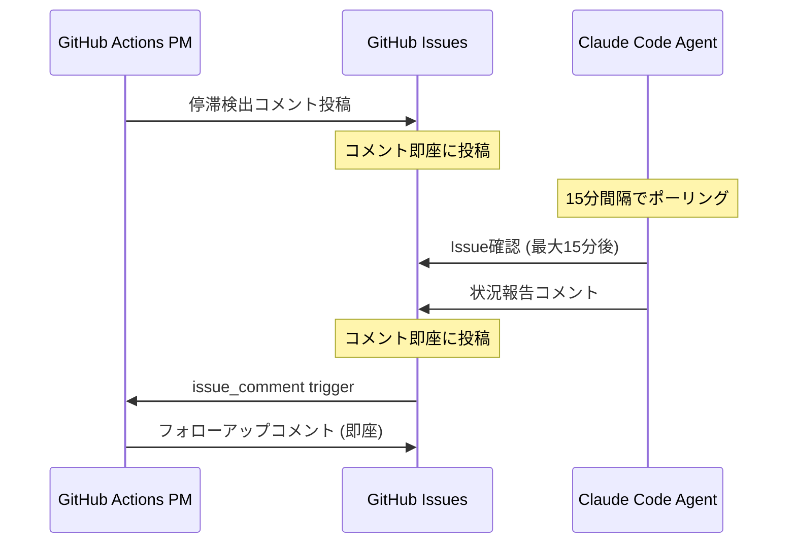

# 🔄 エージェント双方向コミュニケーション分析

## 🤔 GitHub Actions ↔ Claude Code エージェント通信の実態

### 現在の通信方式

#### 📝 PM → エージェント (一方向)
```
GitHub Actions → GitHub Issue コメント → エージェント確認
```
- ✅ **可能**: コメント投稿で指示送信
- ⏱️ **遅延**: ポーリング間隔に依存 (15分)
- 🔄 **頻度**: 1時間ごと (schedule trigger)

#### 💬 エージェント → PM (一方向)
```
エージェント → GitHub Issue コメント → GitHub Actions検知
```
- ✅ **可能**: `issue_comment` トリガーで即座反応
- ⚡ **遅延**: ほぼ即座 (1-3秒)
- 🔄 **頻度**: コメント投稿時に即座

### 🚨 双方向通信の現実的制約

## 1️⃣ **エージェント側の制約**
```yaml
Claude Codeエージェント:
  GitHub確認: ポーリング (15分間隔)
  応答遅延: 最大15分
  自動応答: 可能だが遅延あり
  
現実的なやり取り:
  PM投稿 → エージェント確認 (最大15分)
  エージェント応答 → PM確認 (即座)
```

## 2️⃣ **実際の通信サイクル**


## 3️⃣ **通信パターン別遅延時間**

### パターンA: 緊急対応が必要
```
停滞検出 → コメント投稿 → エージェント確認 (最大15分)
実用性: ❌ 緊急対応には遅すぎる
```

### パターンB: 定期的な状況確認
```
定期チェック → 状況確認 → 応答確認 (15分-1時間)
実用性: ✅ 十分実用的
```

### パターンC: プロアクティブサポート
```
継続的監視 → 早期発見 → サポート提案 (数時間サイクル)
実用性: ✅ 効果的
```

## 🎯 実用的な対応戦略

### 短時間設定の実際的意味

#### ❌ 誤解: リアルタイム対応
```
1時間設定 → 1時間で即座対応
実際: 1時間 + 15分遅延 = 1時間15分
```

#### ✅ 現実: 早期発見システム
```
1時間設定 → 問題の早期発見
実際: 短い間隔での状況把握とトレンド分析
```

## 📊 最適化された設定提案

### 遅延考慮済み推奨時間

```yaml
# ポーリング遅延(15分)を考慮した設定

緊急タスク:
  検出時間: 30分 (実際の応答: 45分以内)
  理由: 緊急度高、早期発見重要

通常タスク:
  検出時間: 2時間 (実際の応答: 2時間15分以内)  
  理由: 適度な監視、作業妨害回避

大規模タスク:
  検出時間: 6時間 (実際の応答: 6時間15分以内)
  理由: 長期作業の進捗確認

計画・設計:
  検出時間: 12時間 (実際の応答: 12時間15分以内)
  理由: 思考時間を確保
```

## 🔧 効果的な活用方法

### 1️⃣ **トレンド分析中心**
```
短時間 = リアルタイム対応 ❌
短時間 = 早期パターン発見 ✅
```

### 2️⃣ **プロアクティブサポート**
```javascript
// 停滞の兆候を早期発見
if (noUpdateFor(30min) && isUrgentTask()) {
  sendSupportComment("🤝 何かサポートできることはありますか？");
}
```

### 3️⃣ **状況可視化**
```javascript
// 全体の進捗状況を可視化
generateProgressDashboard({
  stallDetections: recent30min,
  activeAgents: currentlyWorking,
  supportNeeded: awaitingResponse
});
```

## 💡 実装アップデート提案

### Phase 1: 早期発見システム (推奨)
```yaml
目的: 問題の早期発見とトレンド把握
設定: 
  - 緊急: 30分
  - 通常: 2時間
  - 大規模: 6時間
メッセージ: "🔍 進捗確認 - 順調に進んでいますか？"
```

### Phase 2: サポート提案システム
```yaml
目的: プロアクティブなサポート提供
トリガー: Level 1から追加で30分経過
メッセージ: "🤝 サポート可能です - 何かお手伝いできることはありますか？"
```

### Phase 3: 統合ダッシュボード
```yaml
目的: 全エージェントの状況可視化
更新: リアルタイム
表示: 進捗、停滞、サポート状況
```

## 🎯 結論

**双方向コミュニケーションは技術的に可能だが、15分の遅延を前提とした設計が現実的**

1. **短時間設定** = 早期発見 + トレンド分析
2. **リアルタイム対応** = 期待せず、サポート提供に集中
3. **効果的活用** = 状況把握 + プロアクティブサポート

この認識で設定を調整しますか？