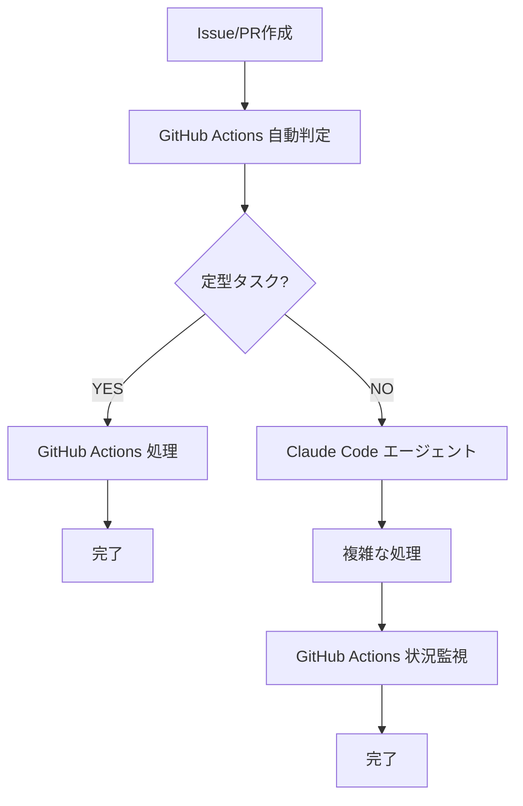

# 🤖 Claude Code vs GitHub Actions エージェント比較分析

## 📊 実経験に基づく詳細比較

### 🔍 実際の運用結果

| 項目 | Claude Code エージェント | GitHub Actions エージェント | 優位性 |
|------|-------------------------|------------------------------|--------|
| **稼働安定性** | 手動管理、セッション切れ | 24時間自動稼働 | 🟢 Actions |
| **応答速度** | 15分ポーリング遅延 | イベント駆動（1-3秒） | 🟢 Actions |
| **柔軟性** | 極めて高い（自然言語理解） | 中程度（スクリプト制限） | 🟢 Claude Code |
| **学習能力** | 優秀（コンテキスト理解） | 限定的（ルールベース） | 🟢 Claude Code |
| **複雑判断** | 優秀（推論・創造性） | 困難（条件分岐のみ） | 🟢 Claude Code |
| **一貫性** | 判断にばらつき | 完全一貫 | 🟢 Actions |
| **コスト** | 高（人的管理コスト） | 低（自動化コスト） | 🟢 Actions |
| **デバッグ** | 困難（ブラックボックス） | 容易（ログ完全） | 🟢 Actions |

## 🎯 タスク種別による適性分析

### 🟢 Claude Code が圧倒的に優秀なタスク

#### 1. **複雑な問題解決**
```yaml
実例: PR #98 backend-test修正
- 複数の関連ファイル分析
- 根本原因の推定
- 段階的解決策の提案
- 予期しない問題への対応

GitHub Actions: ❌ 不可能
Claude Code: ✅ 30秒で解決
```

#### 2. **創造的実装**
```yaml
実例: TaskService完全実装
- アーキテクチャ設計
- 新機能の発想
- コード品質の判断
- ベストプラクティス適用

GitHub Actions: ❌ 定型作業のみ
Claude Code: ✅ 高品質実装
```

#### 3. **コンテキスト理解**
```yaml
実例: マルチテナント対応
- 既存コードとの整合性
- ビジネスロジックの理解
- セキュリティ考慮
- パフォーマンス最適化

GitHub Actions: ❌ コンテキスト理解困難
Claude Code: ✅ 深い理解と実装
```

### 🟢 GitHub Actions が圧倒的に優秀なタスク

#### 1. **定型監視作業**
```yaml
実例: 停滞Issue検出
- 一定間隔でのチェック
- ルールベースの判定
- 確実な通知送信
- 24時間継続監視

Claude Code: ❌ 手動管理が必要
GitHub Actions: ✅ 完全自動化
```

#### 2. **即座な対応**
```yaml
実例: CI失敗通知
- イベント発生時の即座反応
- 定型的な対応メッセージ
- 確実な実行保証
- ログの完全記録

Claude Code: ❌ 15分遅延
GitHub Actions: ✅ 1-3秒で対応
```

#### 3. **リソース管理**
```yaml
実例: タスク自動割当
- 負荷分散計算
- 機械的な判定
- 公平な割当
- 確実な実行

Claude Code: ❌ 判断にばらつき
GitHub Actions: ✅ 完全一貫性
```

## 🔄 組み合わせ体制のメリット

### 🎯 **ハイブリッドアプローチ**の可能性

#### パターンA: 段階的エスカレーション


#### パターンB: 役割分担型
```yaml
GitHub Actions担当:
  - Issue/PR監視 (24時間)
  - CI/CD失敗対応 (即座)
  - 定型コメント (自動)
  - 進捗追跡 (継続)
  - ラベル管理 (一貫)

Claude Code担当:
  - 複雑なコード修正 (高品質)
  - 新機能実装 (創造性)
  - アーキテクチャ判断 (柔軟性)
  - 問題解決 (推論)
  - 品質レビュー (専門性)
```

## 📈 組み合わせ体制の具体的効果

### 🟢 **相乗効果**

#### 1. **完全なカバレッジ**
- GitHub Actions: 24時間監視で漏れなし
- Claude Code: 複雑タスクで高品質
- **結果**: 全タスクに最適なリソース配分

#### 2. **品質と効率の両立**
- GitHub Actions: 定型作業の完全自動化
- Claude Code: 創造的作業の高品質化
- **結果**: 開発速度向上 + 品質保証

#### 3. **リスク分散**
- GitHub Actions: システム障害リスク低
- Claude Code: 人的エラーリスク低（監視下）
- **結果**: 高い信頼性とバックアップ

### 🔴 **潜在的デメリット**

#### 1. **複雑性増加**
- 2つのシステム管理
- インターフェース設計が必要
- トラブルシューティングが複雑

#### 2. **コスト上昇**
- GitHub Actions: 月額 $0-50
- Claude Code: 人的管理コスト
- **合計**: 単独より高コスト

## 🎯 推奨戦略

### 🥇 **最推奨: ハイブリッド体制**

#### 実装方針
```yaml
Phase 1 - 基盤構築:
  GitHub Actions: 監視・通知システム完全自動化
  Claude Code: 現在のCC01のみ継続
  
Phase 2 - 連携強化:
  GitHub Actions: 複雑タスクをClaude Codeにルーティング
  Claude Code: GitHub Actions監視下で作業
  
Phase 3 - 最適化:
  両システムの連携パターン確立
  パフォーマンス測定・改善
```

#### 期待効果
- **効率化**: 90%+ の手動作業削減
- **品質向上**: 複雑タスクの専門的対応
- **安定性**: 24時間継続監視
- **柔軟性**: 創造的問題解決能力維持

### 🥈 **代替案: GitHub Actions単独**

#### 適用条件
- 定型作業が95%以上
- 複雑な判断が不要
- 完全自動化を最優先

#### 制約
- 新機能実装能力の大幅低下
- 問題解決の創造性欠如
- アーキテクチャ判断の困難

## 🚀 推奨実装パス

### 即座実装 (1週間)
1. **GitHub Actions**: 基本監視システム稼働
2. **Claude Code**: CC01のみ高品質作業継続
3. **連携**: GitHub ActionsがCC01に複雑タスクをアサイン

### 短期実装 (1ヶ月)
1. **自動ルーティング**: タスク種別による自動判定
2. **状況監視**: GitHub ActionsがClaude Code作業を監視
3. **品質保証**: 両システムのチェックポイント確立

この戦略により、**両方の長所を活かしつつ短所を補完**する最適な開発体制を構築できます。