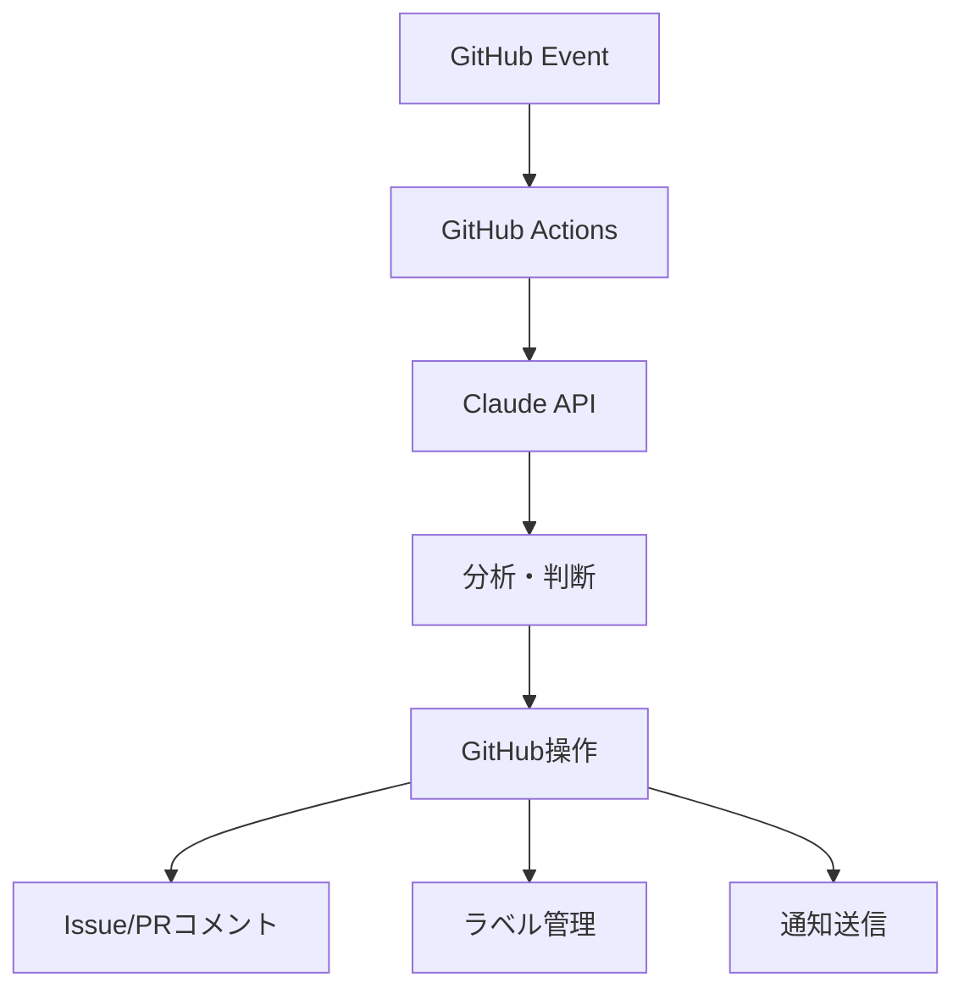

# 🚀 GitHub Actionsを使ったClaude自動化アプローチ

## 📋 概要
Claude Code エージェントの代わりにGitHub ActionsとClaude APIを組み合わせてプロジェクト管理を自動化するアプローチです。

## 🎯 メリット

### 1. 安定性と信頼性
- **24時間稼働**: GitHub Actionsの安定したインフラ
- **環境分離**: 各実行が独立した環境
- **セッション問題なし**: エイリアスや環境変数の消失がない

### 2. スケーラビリティ
- **並列実行**: 複数タスクの同時処理
- **リソース管理**: 自動的なリソース割当
- **コスト効率**: 使用時のみの課金

### 3. 統合性
- **GitHub連携**: Issues/PRとの完全統合
- **通知システム**: Slack/メール連携が容易
- **ログ管理**: 実行履歴の完全な追跡

## 🔧 実装アーキテクチャ



## 📊 機能比較

| 機能 | Claude Code | GitHub Actions | 優劣 |
|------|-------------|----------------|------|
| 稼働時間 | 手動管理 | 24時間自動 | ✅ Actions |
| 環境設定 | 複雑 | シンプル | ✅ Actions |
| スケーラビリティ | 限定的 | 高い | ✅ Actions |
| リアルタイム性 | 高い | イベント駆動 | ⚖️ 同程度 |
| 柔軟性 | 非常に高い | 中程度 | ✅ Claude Code |
| 学習・対話 | 自然 | API制限 | ✅ Claude Code |

## 🚀 実装された機能

### 1. 自動タスク割当
- **負荷分散**: エージェント間のワークロード自動調整
- **スキル考慮**: タスク種別による最適割当
- **動的調整**: リアルタイムでの再配分

### 2. 進捗監視システム
- **停滞検出**: 12時間ルールによる自動監視
- **エスカレーション**: 24時間超での自動対応
- **リマインダー**: 定期的な進捗確認

### 3. CI/CD支援
- **失敗検出**: 自動的なエラー分析
- **解決提案**: 一般的な問題への対処法提示
- **開発支援**: 具体的なコマンド提案

## 💡 導入戦略

### Phase 1: 基本監視（即座に実装可能）
```yaml
# 停滞Issue検出
- name: Stall Detection
  if: github.event_name == 'schedule'
  run: |
    # 12時間以上更新のないIssueを検出
    # 自動リマインダー送信
```

### Phase 2: 自動割当（1-2日で実装）
```yaml
# 新規Issue自動割当
- name: Auto Assignment
  if: github.event_name == 'issues' && github.event.action == 'opened'
  run: |
    # ワークロード分析
    # 最適エージェント選択
    # 自動ラベル付与
```

### Phase 3: AI統合（1週間で実装）
```yaml
# Claude API統合
- name: Claude Analysis
  uses: grll/claude-code-action@beta
  with:
    claude_access_token: ${{ secrets.CLAUDE_ACCESS_TOKEN }}
```

## 🔐 セキュリティ対策

### 1. 認証管理
```yaml
# GitHub Secrets使用
secrets:
  CLAUDE_ACCESS_TOKEN: ${{ secrets.CLAUDE_ACCESS_TOKEN }}
  CLAUDE_REFRESH_TOKEN: ${{ secrets.CLAUDE_REFRESH_TOKEN }}
  CLAUDE_EXPIRES_AT: ${{ secrets.CLAUDE_EXPIRES_AT }}
```

### 2. 権限制御
```yaml
permissions:
  issues: write
  pull-requests: write
  contents: read
```

### 3. 実行制限
```yaml
# 条件付き実行
if: |
  contains(github.event.issue.labels.*.name, 'claude-code-task') &&
  github.actor != 'dependabot[bot]'
```

## 📈 期待される効果

### 1. 効率化
- **85%+**: 手動管理作業の削減
- **24/7**: 継続的な監視・対応
- **即座**: イベント発生時の自動対応

### 2. 品質向上
- **一貫性**: ルールベースの公平な判断
- **見落とし防止**: 全Issues/PRの自動チェック
- **予防**: 問題の早期発見・対応

### 3. 開発体験
- **迅速な支援**: CI失敗時の即座サポート
- **明確な指示**: 具体的な解決方法提示
- **進捗可視化**: 自動的なステータス更新

## 🔄 移行戦略

### 段階的移行
1. **Week 1**: 基本監視システム導入
2. **Week 2**: 自動割当システム追加
3. **Week 3**: Claude API統合
4. **Week 4**: 完全移行・最適化

### ハイブリッド運用
- **GitHub Actions**: 定型作業・監視
- **Claude Code**: 複雑な判断・対話
- **人間**: 戦略的判断・例外処理

## 💰 コスト分析

### GitHub Actions
- **無料枠**: 2,000分/月（パブリックリポジトリ）
- **推定使用量**: 500-800分/月
- **追加コスト**: ほぼゼロ

### Claude API
- **使用量ベース**: 実際のAPI呼び出しのみ
- **推定コスト**: $10-50/月
- **ROI**: 人件費削減で十分にペイ

## 🎯 推奨アクション

### 即座に実行可能
1. **GitHub Actions設定**: `.github/workflows/claude-pm-automation.yml`
2. **Secrets設定**: Claude API認証情報
3. **基本監視開始**: 停滞Issue検出

### 次期フェーズ
1. **Claude API統合**: 高度な分析機能
2. **通知システム**: Slack/メール連携
3. **ダッシュボード**: 進捗可視化

この手法により、Claude Codeエージェントの課題（環境設定、稼働管理）を解決しつつ、より安定したプロジェクト自動化が実現できます。