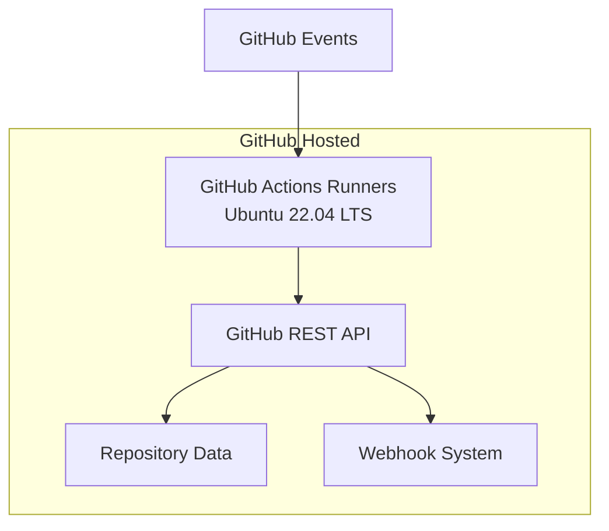
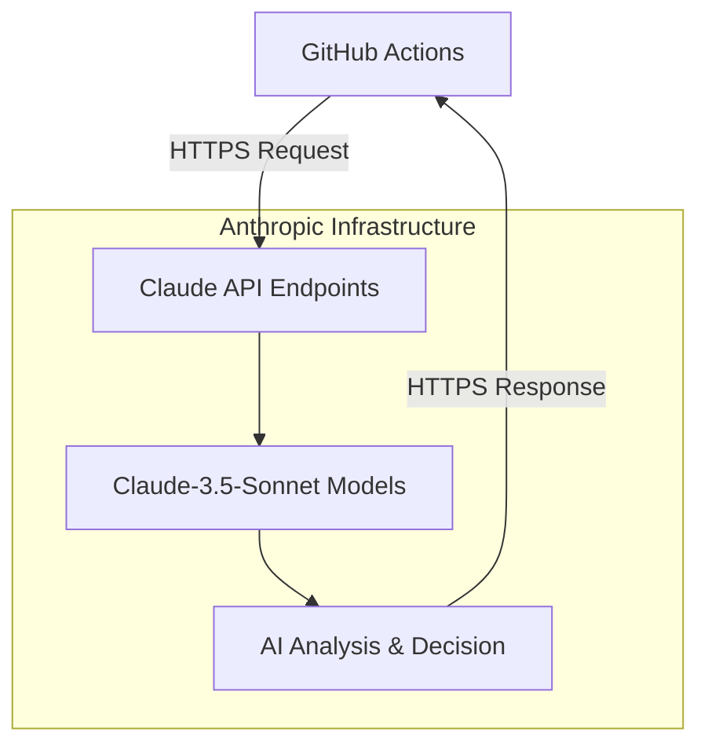
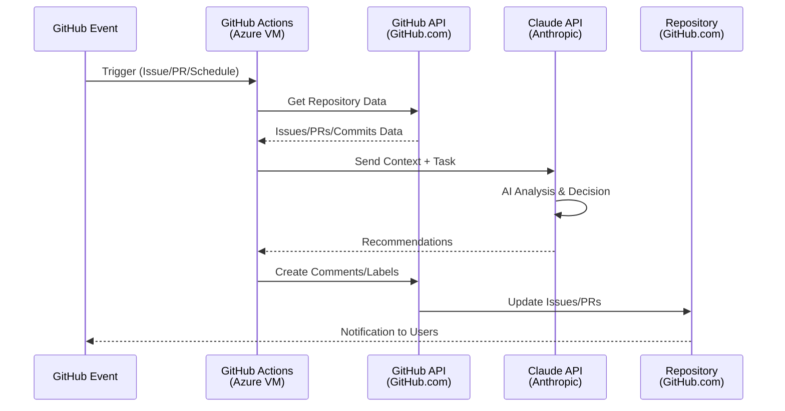

# 🏗️ GitHub Actions PM自動化アーキテクチャ詳細

## 📍 コンポーネント実行場所

### 🌐 GitHub Infrastructure (GitHub側)


**実行場所**: GitHub's Infrastructure (Microsoft Azure)
- **Actions Runners**: Microsoft Azure上の仮想マシン
- **API**: GitHub.com のREST/GraphQL API
- **Storage**: GitHub's database and file storage

### 🤖 Claude AI Infrastructure (Anthropic側)


**実行場所**: Anthropic's Infrastructure
- **API Endpoints**: Anthropic's servers
- **AI Models**: Anthropic's model inference infrastructure
- **Processing**: Real-time AI analysis and decision making

### 🔄 データフロー詳細



## 🔧 具体的な実行環境

### GitHub Actions Runner仕様
```yaml
Runner Environment:
  OS: Ubuntu 22.04 LTS
  CPU: 2 cores
  RAM: 7 GB
  Storage: 14 GB SSD
  Network: High-speed internet
  Location: Microsoft Azure datacenters
  
実行時間制限:
  Job timeout: 6時間 (最大)
  Workflow timeout: 35日 (最大)
  並列実行: 20ジョブ (Free tier)
```

### Claude API制限
```yaml
API Specifications:
  Rate Limits: 5000 requests/hour
  Token Limits: 200K tokens/request  
  Response Time: 1-5秒 (平均)
  Availability: 99.9% SLA
  
使用モデル:
  Primary: Claude-3.5-Sonnet
  Fallback: Claude-3-Haiku (高速処理用)
```

## 🌍 地理的分散とレスポンス

### GitHub Actions実行地域
```
Primary Regions:
├── East US (Virginia)
├── West US 2 (Washington)  
├── West Europe (Netherlands)
├── Southeast Asia (Singapore)
└── Australia East (Sydney)

選択基準:
- Repository location
- User proximity  
- Resource availability
- Load balancing
```

### Claude API エンドポイント
```
Anthropic Infrastructure:
├── Primary: US-East (近接性最適化)
├── Backup: US-West (冗長化)
└── Global CDN: CloudFlare経由

レスポンス時間:
- Japan → US-East: ~150ms
- GitHub Actions → Claude API: ~50-100ms
```

## 📊 パフォーマンス特性

### 実行時間分析
```yaml
Components Timing:
  GitHub Event Detection: ~1-3秒
  Actions Runner Startup: ~10-30秒
  Repository Data Fetch: ~2-5秒
  Claude API Processing: ~3-10秒
  GitHub API Updates: ~1-3秒
  
Total End-to-End: ~20-60秒
```

### スケーラビリティ
```yaml
Concurrent Processing:
  GitHub Actions: 20並列ジョブ (Free)
  Claude API: 5000リクエスト/時間
  GitHub API: 5000リクエスト/時間/user
  
スケーリング対策:
  - Queue management
  - Priority-based processing  
  - Rate limiting with backoff
  - Error handling & retry
```

## 🔐 セキュリティ実行環境

### Secrets管理
```yaml
GitHub Secrets (暗号化保存):
  Storage: GitHub's encrypted storage
  Access: Actions runtime only
  Encryption: AES-256
  
Secrets in Actions:
  CLAUDE_ACCESS_TOKEN: 一時メモリのみ
  GITHUB_TOKEN: 自動生成・自動削除
  Runtime: プロセス終了時に自動クリア
```

### ネットワークセキュリティ
```yaml
Communication:
  GitHub ↔ Claude: HTTPS/TLS 1.3
  Data Transit: End-to-end encryption
  Authentication: OAuth 2.0 + JWT
  
Access Control:
  Repository: Fine-grained permissions
  Actions: Minimal required permissions
  API: Scoped access tokens
```

## 💰 実行コスト分析

### GitHub Actions使用量
```yaml
Monthly Estimates (Free Tier):
  Limit: 2000分/月
  Expected Usage: 500-800分/月
  Cost: $0 (Free tier内)
  
Per Execution:
  Startup: ~30秒
  Processing: ~30-60秒  
  Total: ~60-90秒/実行
```

### Claude API使用量
```yaml
Monthly Estimates:
  Requests: ~5000-8000/月
  Tokens: ~100K-200K/月
  Cost: $15-40/月
  
Per Request:
  Input Tokens: ~1000-2000
  Output Tokens: ~500-1000
  Processing: ~3-8秒
```

## 🚀 デプロイメント戦略

### 段階的ロールアウト
```yaml
Phase 1 - 基本監視:
  実行場所: GitHub Actions (Azure)
  機能: Issue停滞検出のみ
  実行頻度: 1時間ごと
  
Phase 2 - 自動割当:
  実行場所: GitHub Actions (Azure)  
  機能: + 自動タスク割当
  実行頻度: 即座 (Event-driven)
  
Phase 3 - AI統合:
  実行場所: GitHub Actions + Claude API
  機能: + AI分析・判断
  実行頻度: リアルタイム
```

### 監視・ログ
```yaml
Monitoring Locations:
  GitHub Actions Logs: GitHub UI
  Performance Metrics: GitHub Insights
  Error Tracking: Actions workflow logs
  
Log Retention:
  Actions Logs: 90日間
  Audit Logs: 7日間
  Performance Data: リアルタイム
```

## 🎯 推奨実装パス

**即座実装可能 (1日)**:
- GitHub Actions basic setup
- Simple stall detection
- Comment automation

**短期実装 (1週間)**:
- Claude API integration  
- Advanced task analysis
- Priority-based processing

**中期実装 (1ヶ月)**:
- Performance optimization
- Error handling enhancement
- Analytics dashboard