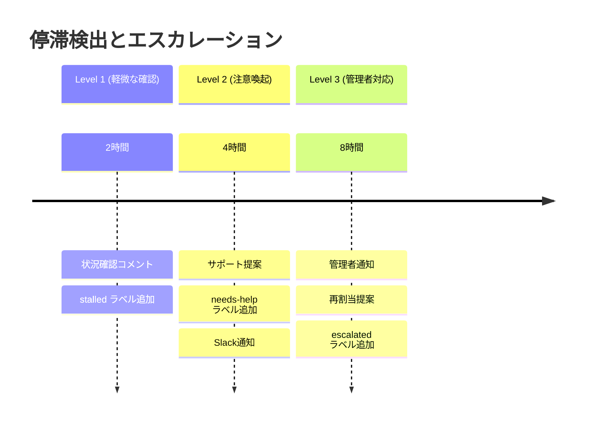

# ⏱️ 停滞時間と対応戦略の設計

## 🎯 時間経過時の対応パターン

### 現在の実装
```
時間経過 → コメント投稿 (状況確認のみ)
```

### 📋 対応オプション別の設定推奨

## 1️⃣ **非侵入型アプローチ** (推奨)
### 対応内容
- ✅ 状況確認コメント投稿
- ✅ ラベル追加 (`stalled`, `needs-attention`)
- ✅ 通知送信 (Slack/メール)
- ❌ 作業中断なし
- ❌ 強制再割当なし

### 推奨時間設定 (短め)
```yaml
緊急タスク: 2時間
通常タスク: 4時間  
大規模作業: 12時間
計画・設計: 24時間
```

### メリット
- **開発者フレンドリー**: 作業を中断しない
- **早期発見**: 問題を素早くキャッチ
- **コミュニケーション促進**: 状況共有のきっかけ

---

## 2️⃣ **段階的エスカレーション**
### 対応内容
- **Level 1**: 状況確認 (時間A)
- **Level 2**: 注意喚起 + サポート提案 (時間A × 2)
- **Level 3**: 管理者通知 + 再割当提案 (時間A × 3)

### 推奨時間設定 (中程度)
```yaml
緊急タスク: 4時間 → 8時間 → 12時間
通常タスク: 8時間 → 16時間 → 24時間
大規模作業: 24時間 → 48時間 → 72時間  
```

### メリット
- **バランス型**: 柔軟性と管理のバランス
- **段階的対応**: 状況に応じてエスカレート

---

## 3️⃣ **自動再配分型**
### 対応内容
- ✅ 自動的に他のエージェントに再割当
- ✅ 元担当者への通知
- ⚠️ 作業継続可能 (並行作業)

### 推奨時間設定 (長め)
```yaml
緊急タスク: 8時間
通常タスク: 24時間
大規模作業: 48時間
```

### メリット
- **継続性確保**: 作業が止まらない
- **リソース効率**: 自動的な負荷分散

---

## 🎨 実装アプローチ選択

### 推奨: **非侵入型 + 段階的エスカレーション**

#### 理由
1. **開発体験重視**: Claude Code作業を中断しない
2. **早期発見**: 短い間隔で問題をキャッチ
3. **柔軟な対応**: 状況に応じて人間が判断
4. **コミュニケーション**: チーム連携の促進

#### 具体的な動作


## 🔧 実装更新

### Level 1: 状況確認 (現在実装済み)
```javascript
// 軽微な確認 - 非侵入的
await github.rest.issues.createComment({
  body: `⚠️ 停滞検出 - 状況をお聞かせください`
});
```

### Level 2: サポート提案 (追加実装)
```javascript
// 積極的サポート
await github.rest.issues.createComment({
  body: `🤝 サポート提案 - 一緒に解決しましょう`
});
```

### Level 3: エスカレーション (追加実装)
```javascript
// 管理者による判断
await github.rest.issues.createComment({
  body: `📢 エスカレーション - 管理者による再検討が必要です`
});
```

## 📊 推奨設定値

### 最終推奨 (非侵入型)
```yaml
緊急タスク (urgent/critical):
  Level 1: 1時間
  Level 2: 2時間  
  Level 3: 4時間

通常タスク:
  Level 1: 3時間
  Level 2: 6時間
  Level 3: 12時間

大規模タスク (feature/large-task):
  Level 1: 8時間
  Level 2: 16時間
  Level 3: 32時間

計画・設計 (planning/design):
  Level 1: 12時間
  Level 2: 24時間
  Level 3: 48時間
```

## 💡 実装方針

1. **Phase 1**: Level 1のみ (短い間隔で状況確認)
2. **Phase 2**: Level 2追加 (サポート提案機能)
3. **Phase 3**: Level 3追加 (管理者エスカレーション)

これにより開発者の作業を尊重しつつ、適切なサポートを提供できます。